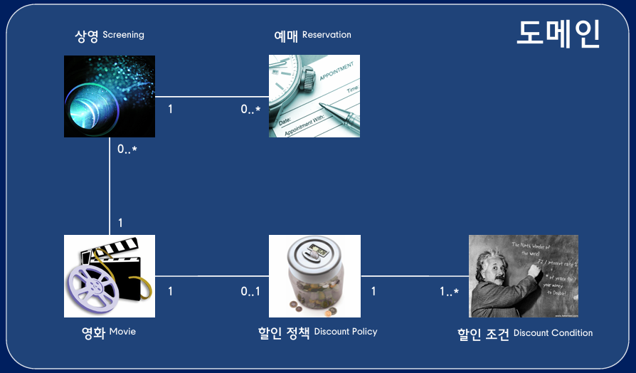

# 1. 영화 예매 도메인

강의를 진행하는 동안 예제로 사용하게될 요구사항을 분석하기 위해서는 영화 예매 시스템과 관련된 도메인을 분석하는 작업이 선행되어야 한다.

#### 도메인이란

-   사용자가 프로그램을 사용하는 주제 영역
-   사용자가 프로그램을 사용해서 해결하고 싶은 문제들의 집합
-   소프트웨어로 구현해야 하는 요구사항의 범위

예시: 음식 배달 도메인

-   배달앱을 만들기 결정
-   요구사항 중에서 소프트웨어로 구현해야 하는 범위 결정
-   `음식조리, 음식배달, 식사는 제외 / 메뉴 표시, 메뉴 주문, 메뉴 결제는 포함`
-   즉 메뉴 표시, 메뉴 주문, 메뉴 결제가 음식배달의 도메인

## 영화 예매 도메인

-   사용자들이 예매하는 대상은 영화가 아니라 상영
-   상영에는 상영날짜와 시간, 상영회차가 포함
-   사영 예매시 요금을 계산 후 청구
-   특정 조건 만족시 할인
-   할인

    -   할인정책 (할인 금액 계산 방법)
        -   금액 할인 정책
        -   비율 할인 정책
    -   할인조건
        -   순서 조건
        -   기간 조건

-   예매할때마다 할인정책과 할인조건을 조합 (도메인 개념들 사이에서 연결 가능한 숫자의 범위를 다중성이라 함.)

#### |예매| 0..\* - 1 |상영| 0..\* - 1 |영화| 1 - 0..1 |할인 정책| 1 - 1..\* |할인 조건|

