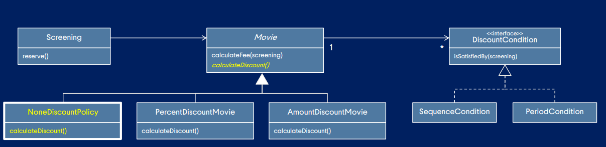
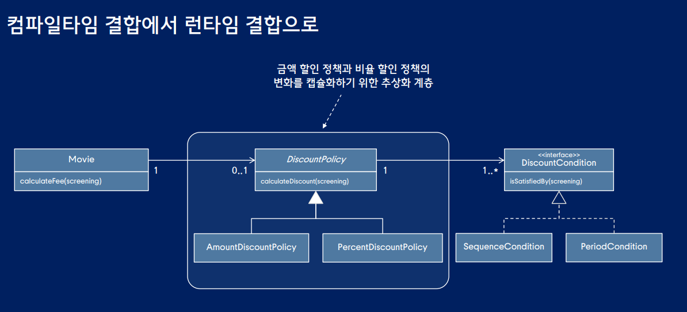

# 설계 평가하기

## 트레이드 오프 기준

-   응집도
-   결합도
-   캡슐화

지속해서 새로운 요구사항과 관련된 코드를 기존 클래스에 추가하다 보면 코드가 복잡해진다고 느껴지는 시점이 있다. 이럴때 응집도 결합도 캡슐화 관점에서 코드 검토

## 응집도 관점에서의 설계 평가

클래스 안에 서로 다른 이유로 변경되는 코드가 섞여 있으면 응집도가 낮다.

### 응집도를 높이기 위한 분리 기준

-   클래스가 하나 이상의 이유로 변경된다면 응집도가 낮은 것이다. 변경의 이유를 기준으로 클래스를 분리하라.

-   메서드 그룹이 속성 그룹을 사용하는지 여부로 나뉜다면 응집도가 낮은 것이다. 함께 `사용되는 메서드와 속성 그룹을 기준으로 클래스를 분리하라.`

-   클래스의 인스턴스를 초기화할 때 경우에 따라 서로 다른 속성들을 초기화한다면 응집도가 낮은 것이다. 초기화하는 속성의 그룹을 기준으로 클래스를 분리하라.

상속을 사용하는 이유 : 자주 변하는 것과 변하지 않는 것을 분리하라.

상속을 적용한 설계는 응집도, 결합도, 캡슐화 측면에서 만족할 만한 결과물을 제공한다.

하지만 상속이 가지는 근본적인 한계로 인해 결합도가 높아지고 캡슐화 원칙이 위반되는 경우도 있다.(구체 클래스에 따라 상위클래스의 데이터필드가 증가할 수 도 자식에서 필요할 수 있으니까) -> `컴파일 타임에 자식 클래스가 부모 클래스에 구현에 강하게 결합된다.`

`상속을 위임으로 변경하자`

`변경은 변경이 발생할 때만 변경이다.`
