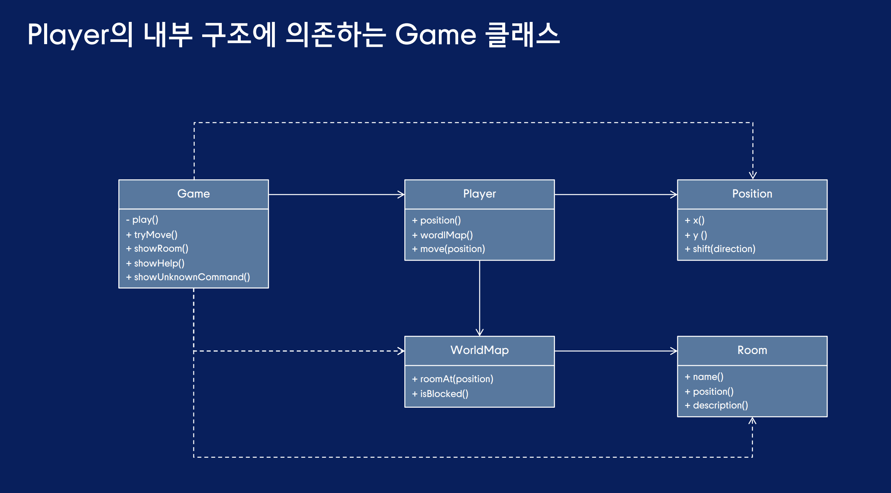
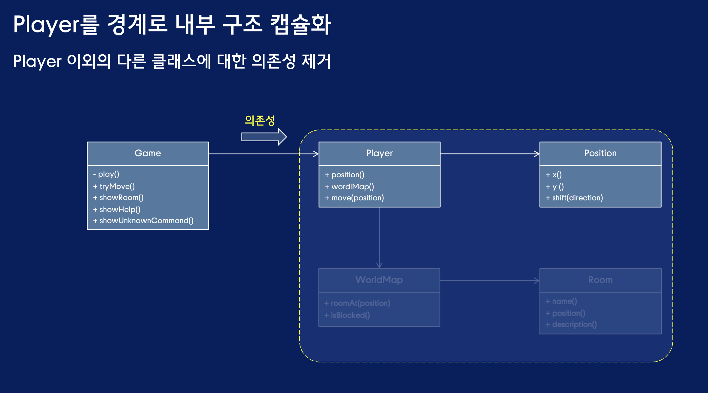

# 의존성을 기준으로 분리하기
## 테스트 하기 어려운 플레이어 이동 로직
tryMove 메서드를 Player의 public 메서드로 이동
```java
public class Player {
    //tryMove에서 참조하는 인스턴스 변수도 이동
    private WorldMap worldMap;
    private Position position;

    public void tryMove(Direction direction){
        if(worldMap.isBlocked(position.shift(direction))){
            showBlocked();
        }else{
            position = position.shift(direction);
            showRoom();
        }
    }

    // tryMove 메서드에서 참조하는 메서드들
    private void showBlocked(){
        System.out.println("이동할 수 없습니다.");
    }

    private void showRoom(){
        System.out.println("당신은 [" + 
            worldMap.rootAt(position).name() + "]에 있습니다.");
        System.out.println(worldMap.roomAt(position).description());
    }
}

// Player를 참조하도록 Game 클래스 수정
public class Game{
    private Player player;
    ...
    public Game(){
        this.player = new Player(
                    new WorldMap(...),
                    Position.of(0,2));
        ...
    }

    private void welcome(){
        showGreetings();
        player.showRoom();
        showHelp();
    }

    private void executeCommand(Command command){
        switch(command){
            case Command.Move move -> player.tryMove(move.direction());
            case Command.Lock() -> player.showRoom();
            ...
        }
    }
}
```

## Player 클래스의 설계는 적절한가?
설계 품질의 척도는 단위 테스트 - player에 대한 테스트를 작성해서 클래스 품질 측정
```java
public class PlayerTest{
    @Test
    public void move_east(){
        WorldMap worldMap = new WorldMap(...);
        Player player = new Player(worldMap, Position.of(0,0));

        player.tryMove(Direction.EAST); // 테스트 대상인 이동로직

        assertThat(output.toString().split("\n")).containsSequence(
            "당신은 ...에 있습니다."
        ) // 부수 효과에 해당하는 콘솔 출력 검증
    }
}
```
픽스처의 상태를 기반으로 테스트 결과를 예측하기 어려움 -> 테스트는 Player의 상태를 변경시키지만 변경의 결과는 콘솔에 문자열로 출력

## 문제의 원인
제어하기 어려운 외부 콘솔에 결과 출력 -> 숨겨진 의존성 문제 메서드 내부에 숨겨져있는 콘솔에 대한 의존성 -> 여러가지 변경 이유를 가지는 Player(외부 의존성은 또 다른 변경의 이유)


## 외부 의존성 관리를 위한 조언
외부 의존성과 관련된 책임을 하나의 클래스 내부로 캡슐화 하라.
- 콘솔에 의존하는 Game과 Player 클래스
- Player가 이동만 책임지도록 콘솔 의존성을 다시 Game으로 이동
- Game은 Player의 WorldMap과 position에 접근
- Plyer에 필드를 반환하는 public 메서드 추가 

```java
public class Game {
    private Player player;
    private CommandParser commandParser;
    private boolean running;
    private void executeCommand(Command command) {
        switch(command) {
        case Command.Move move -> player.tryMove(move.direction());
        case Command.Look() -> showRoom();
        case Command.Help() -> showHelp();
        case Command.Quit() -> stop();
        case Command.Unknown() -> showUnknownCommand();
        }
    }
 
    public void showBlocked() {
       System.out.println("이동할 수 없습니다.");
    }
 
    public void showRoom() {
        System.out.println("당신은 [" +
        player.worldMap().roomAt(player.position()).name() +
        "]에 있습니다.");
        System.out.println(
        player.worldMap().roomAt(player.position()).description());
    }
}

public class Player {
    private Game game;
    private WorldMap worldMap;
    private Position position;
    public Player(WorldMap worldMap, Position position, Game game) {
        this.worldMap = worldMap;
        this.position = position;
        this.game = game;
    }
    public void tryMove(Direction direction) {
        if (worldMap.isBlocked(position.shift(direction))) {
            game.showBlocked();
        } else {
            position = position.shift(direction);
            game.showRoom();
        }
    }
    public WorldMap worldMap() {
      return worldMap;
    }
    public Position position() {
      return position;
    }
}
```

- 하지만 양방향 참조가 발생함
- 양방향 참조를 제거하기 위해 Game으로 tryMove메서드 이동
- 하지만 이렇게 되면 상호작용이 또 복잡해진다.



## Player에 강하게 결합된 Game -> 높은 결합도
- 해결방법은 캡슐화
    - 변경되는 부분을 내부로 숨기는 추상화 기법
    - 변경될 수 이쓴ㄴ 어떤 것이라도 감추는 것
    - 설계에서 변하는 부분이 무엇인지 고민하고 변하는 개념을 캡슐화

    

- 프로세스와 데이터의 분리로 인한 캡슐화 위반

## 캡슐화를 유지하기 위한 두 가지 설계 원칙
- 묻지 말고 시켜라 
- 디미터의 법칙