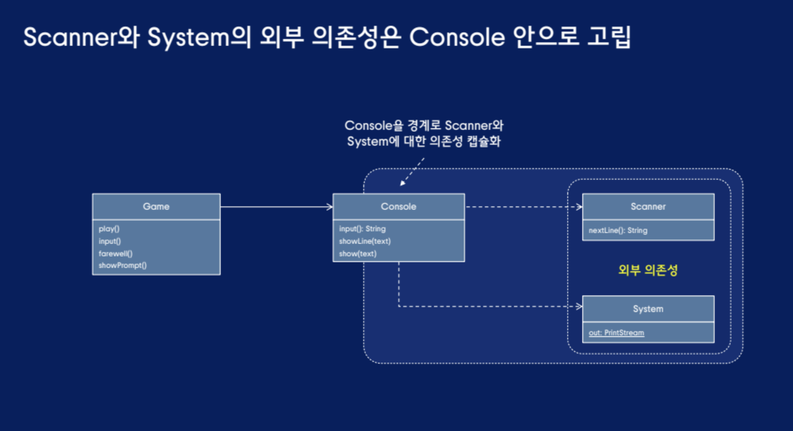
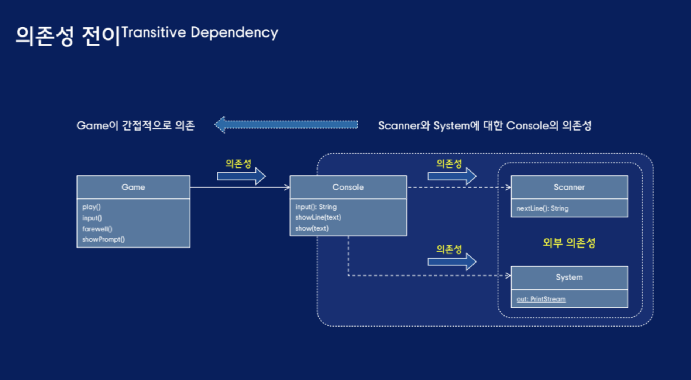

# 외부 의존성과 테스트

```java
// 이해하기 어려운 테스트
public class GameTest{
    @Test
    public void move_north_passed(){
        // output과 go north 문자열과 game사이의 관계는?
        OutputStream output = new ByteArrayOutputStream();
        System.setOut(new PrintStream(output));
        // 할당된 문자열은 어떻게 사용되는가?
        System.setIn(new ByteArrayInputStream("go north\nquit\n".getBytes()));

        Game game = new Game();
        game.run();
        // 실행 후 플레이어가 다리에 있는 이유는?
        assertThat(output.toString().split("\n")).containsSequence(
            "> 당신은 [다리]에 있습니다.",
            "큰 강 위에 돌로 만든 커다란 다리가 있습니다.",
            "> ",
            "게임을 종료합니다.");
    }
}
```

키보드와 콘솔 화면에 의존하는 Game 클래스 -> 외부에 드러나지 않는 콘솔 입출력에 대한 의존성

## 불안정과 외부 의존성을 캡슐화
입력과 출력을 담당하는 Scanner와 System.out -> Console 클래스를 추가하여 Scanner와 System에 대한 의존성 캡슐화
```java
public class Console{
    private Scanner scanner;
    
    public Console(){
        this.scanner = new Scanner(System.in);
    }

    public String input(){
        return scanner.nextLine().toLowerCase().trim();
    }

    public void showLine(String text){
        System.out.println(text);
    }

    public void show(String text){
        System.out.print(text);
    }
}

public class Game{
    // 이제 Game 클래스는 Scanner와 System에 대해 알지 못함
    private Console console;

    public Game(){this.console = new Console();}

    private void play(){
        start();
        while(isRunning()){
            String input = inputCommand();
            parseCommand(input);
        }
    }

    private String input(){
        return console.input();
    }

    private void farewell(){
        console.showLine("\n게임을 종료합니다.");
    }

    private void showPrompt(){
        console.show("> ");
    }
}
```


하지만 여전히 외부 의존성 이슈로 테스트 하기 어려운 Game 클래스
```java
public class GameTest{
    @Test
    public void move_north_passed(){
        OutputStream output = new ByteArrayOutputStream();
        System.setOut(new PrintStream(output));
        System.setIn(new ByteArrayInputStream("go north\nquit\n".getBytes()));

        Game game = new Game();
        game.run();

        assertThat(output.toString().split("\n")).containsSequence(
            "> 당신은 [다리]에 있습니다.",
            "큰 강 위에 돌로 만든 커다란 다리가 있습니다.",
            "> ",
            "게임을 종료합니다.");
    }
}
```

## 여전히 테스트가 어려운 이유는?
### 의존성 전이


- 고수준 정책이 저수준 메커니즘에 의존
    - Game : 게임의 전체적인 흐름을 조율하는 고수준 정책
    - Console : 키보드 입력과 화면 출력을 처리하는 저수준 메커니즘
        - Scanner
        - System
- 외부 의존성의 변경에 취약한 설계
    - 만약 게임 출력을 화면에서 파일로 변경한다면?

- 의존성 역전 원칙을 사용하여 문제 해결