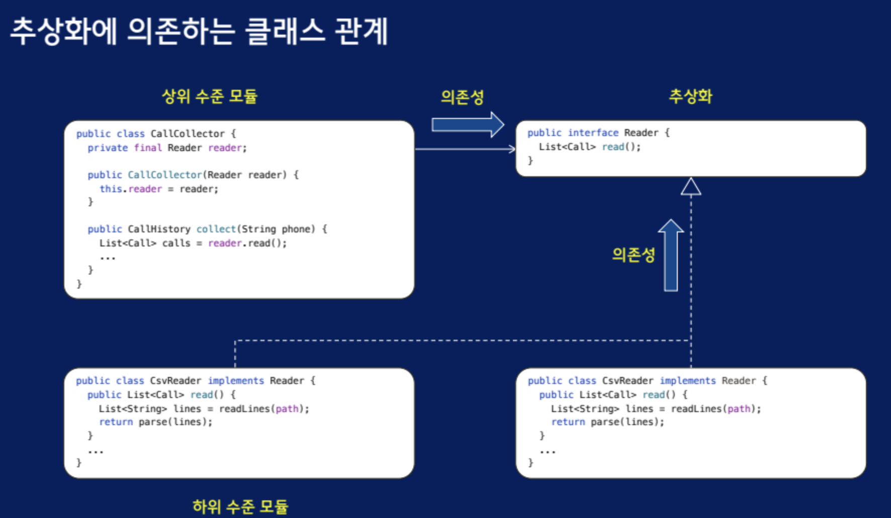

# 의존성 역전 원칙 - 상위 수준과 하위 수준
## 의존성 역전 원칙
- 상위 수준 모듈은 하위 수준 모듈에 의존해서는 안된다. 둘 모두 추상화에 의존해야 한다.
- 추상화는 세부 사항에 의존해서는 안된다. 세부 사항이 추상화에 의존해야 한다.

상위 수준 모듈이 하위 수준의 모듈 객체를 직접 생성하면 상쉬 수준 모듈이 하위 수준 모듈에 의존하게 된다.
```java
public class CallCollector{
    private Reader reader; // 추상화 된 객체

    public CallCollector(){
        this.reader = new CsvReader("calls.scv"); // 상위 수준 모듈이 하위 수준 모듈을 직접 생성중
    }
}
```

`상위 수준 모듈 대신 제 3자의 객체가 하위 수준 모듈 생성` -> 상위 수준 모듈에서 하위 수준 모듈에 대한 의존성 제거

## 상위 수준 모듈에 객체를 주입해서 의존성 해결
상위 수준 모둘은 외부에서 주입한 객체를 이용해서 인터페이스에 대한 런타임 의존성 해결 -> 의존성 주입

의존성 주입의 종류
- 생성자 주입 : 필요한 모든 상태를 다 가진 상태로 객체 생성
- 셋터 주입
- 메서드 주입

### 추상화에 의존하는 클래스 관계


- 상위 수준 모듈은 추상화인 인터페이스에만 의존하고 하위 수준 모듈에는 의존하지 않음
- 하위 수준 모듈은 인터페이스 구현

### 두가지 책임의 분리
- 의존성 주입할 객체 생성은 외부의 제3의 객체가 담당
- 의존성 주입된 객체를 사용하는 책임은 상위 수준 모듈이 담당

### 생성 사용 분리
결합도를 낮추기 위해 생성과 사용 분리 -> 객체는 다른 객체를 생성하기만 하거나 사용하기만 해야 한다.

구현이 아닌 인터페이스에 대해 프로그래밍하라. 하위 수준 모듈때문에 불안정한 상위 수준 모듈이 있을 때 하위 수준 모듈을 추상화와 구현으로 분리

상위 수준 모듈이 추상화에 의존하도록 수정 -> 상위 수준 모듈을 수정하지 않고도 하위 수준 모듈 교체 가능