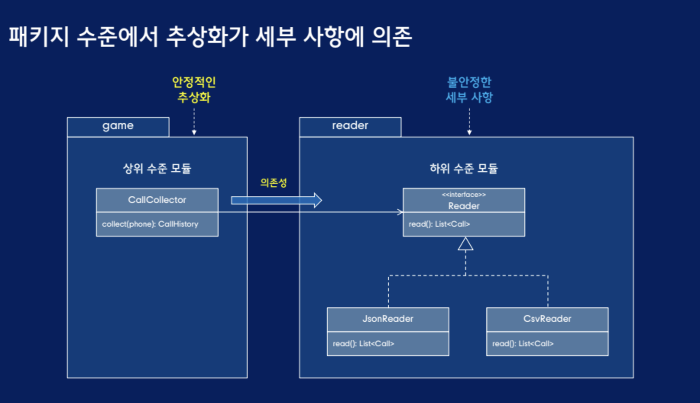
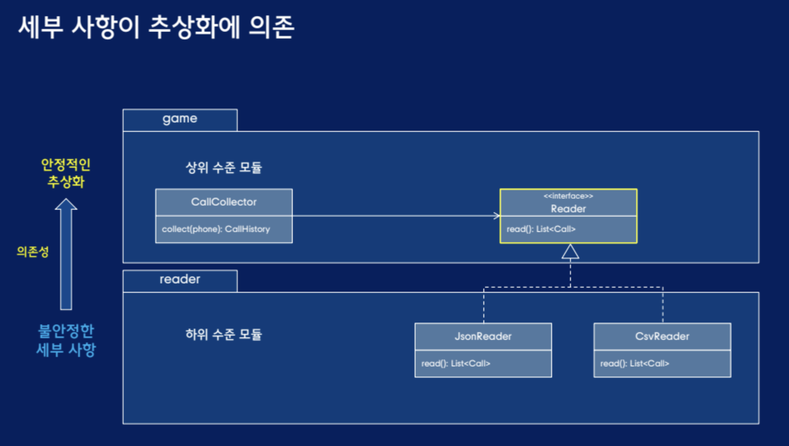

# 의존성 역전 원칙 -  추상화와 세부사항

- 추상화 : 자주 변하지 않는 안정적인 부분
- 세부사항 : 자주 변하는 불안정한 부분



클래스 수준에서는 의존성 역전 원칙을 만족하지만 패키지 수준에서 추상화가 세부 사항에 의존 -> 하위 수준 모듈이 소유하고 있는 인터페이스를 상위 수준 모듈로 이동



- 컴파일 타임 의존성 : 하위 수준 모듈이 상위 수준 모듈에 의존
- 런타임 의존성 : 상위 수준 모듈 객체가 하쉬 수준 모듈 객체에 의존

## 의존성 역전 원칙과 의존성 주입은 테스트 가능성 개선

교체 가능해진 Reader 대체 가능한 인터페이스에 의존하고 생성자 주입을 통해 의존성 교체 가능
```java
public class CallCollector{
    private final Reader reader;

    public CallCollector(Reader reader){
        this.reader = reader;
    }
    // CallCollector 에서 사용할 Call 리스트를 생성자 주입한 후 read 메서드에서 반환
    public CallHistory collector(String phone){
        List<Call> calls = reader.read();
        ...
    }
    
}

public interface Reader{
    List<Call> read();
}
// 테스트를 위한 테스트 전용 객체
public class FakeReader implements Reader{
    private List<Call> calls;

    public FakeReader(Call ... calls){
        this.calls = List.of(calls);
    }

    @Override // CallCollector 에서 사용할 Call 리스트를 생성자 주입한 후 read 메서드에서 반환
    public List<Call> read(){
        return calls;
    }
}
```

가짜 객체를 이용해서 테스트 입력을 명확하게 정의
```java
public class CallCollectorTest{
    @Test
    public void collect(){
        CallCollector callCollector = new CallCollector(
            new FakeReader(
                new Call("010-1111-2222", "010-3333-4444",
                    TimeInterval.of(LocalTateTime.of(2024,1,1,11, 31, 5), LocalDateTime.of(2024, 1,1,11,31,25))),
             new Call("010-1111-2222", "010-3333-4444",
                    TimeInterval.of(LocalTateTime.of(2024,1,2,9, 10, 1), LocalDateTime.of(2024, 1,2,9,11,10)))
            )
        )
    
        CallHistory history = callCollector.collect("010-1111-2222");

        assertThat(history.callDuration()).isEqualTo(Duration.ofSeconds(159));
    }
}
```

추후 공통적으로 사용된는 중복이 있다면 추상클래스나 뭐 기본 메소드나 뭐 그런식으로 중복 제거