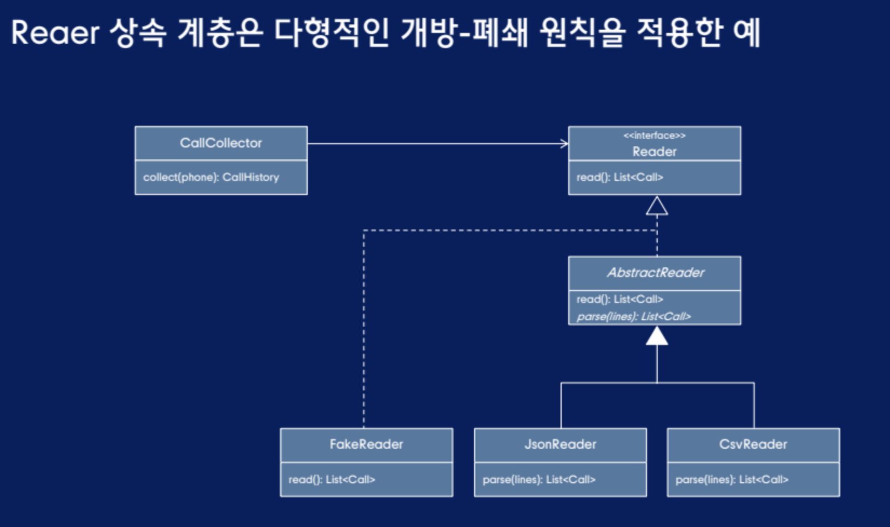
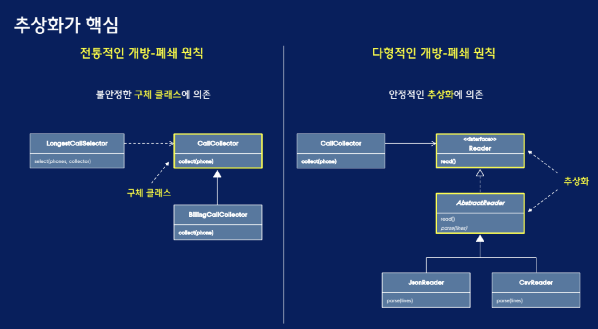

# 다형적인 개방-폐쇄 원칙
## 다형적인 개방-폐쇄 원칙의 등장
개방-폐쇄 원칙 : 소프트웨어 개체(클래스, 모듈, 함수 등등)는 `확장에 대해 열려있어야 하고, 수정에 대해서는 닫혀 있어야 한다.` OCP가 잘 적용된다면, 이미 제대로 동작하고 있던 `원래 코드를 변경하는 것이 아니라 새로운 코드를 덧붙임으로써 변경`할 수 있게 된다.

- 확장에 대해 열려있다.
    - 이것은 모듈의 동작을 확장할 수 있다는 것을 의미한다. 애플리케이션의 요구사항이 변경될 때, 이 변경에 맞게 새로운 동작을 추가해 모듈을 확장할 수 있다.

- 수정에 대해 닫혀있다.
    - 어떤 모듈의 동작을 확장하는 것이 그 모듈의 소스 코드나 바이너리 코드의 변경으로 이어지는 것은 아니다. 그 모듈의 실행 가능한 바이너리 형태는 링크 가능한 라이브러리, DDL이나 자바의.jar에서도 건드리지 않은 채로 남는다.

### 모순적인 원칙?
확장에 대해 열려 있어야 하고, 수정에 대해서는 닫혀 있어야 한다.

## 다형적인 개방-폐쇄 원칙의 핵심 - 안정적인 추상화

- 기능을 확장하기 위해 추상화를 확장하는 새로운 클래스 추가
- 추상화에 의존하는 다른 클래스는 수정하지 않고 기능 확장

다형적인 개방-폐쇄 원칙은 확장 가능한 코드를 위한 컴파일 타임 원칙 -> 런타임에도 정상적으로 동작하도록 만들기 위한 원칙 필요

추상화를 올바르게 확장하기 위한 런타임 관점에서의 원칙 -> 리스코프 치환원칙