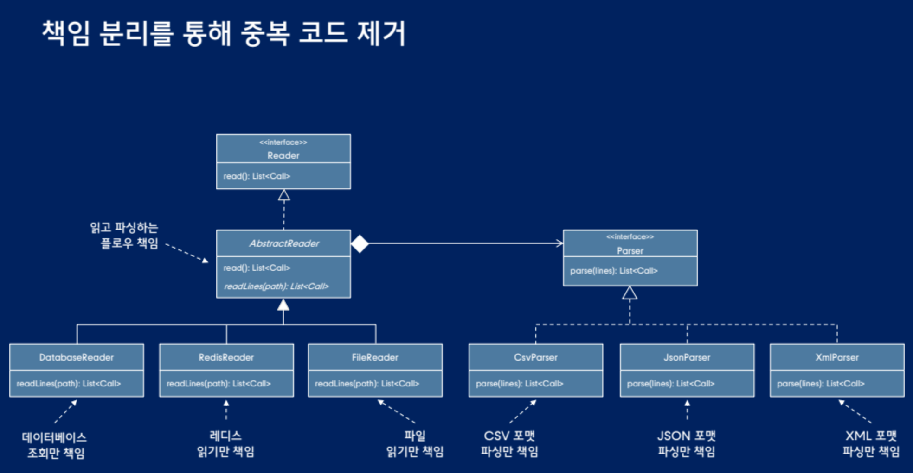
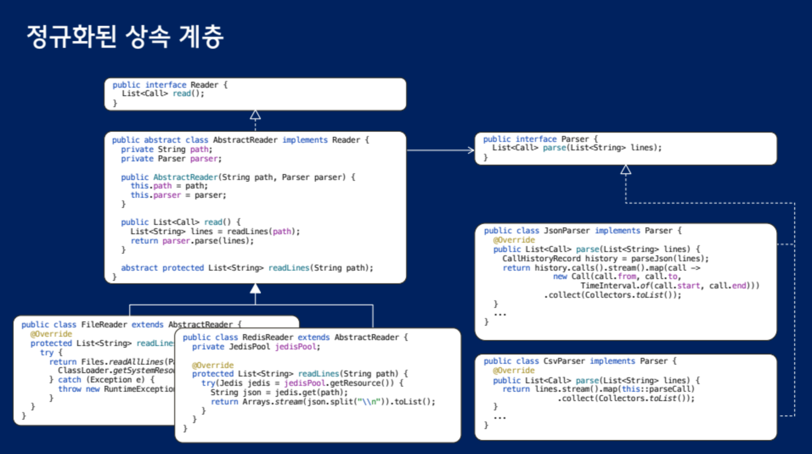

# 리스코프 치환 원칙
## 리스코프 치환 원칙을 위한 가이드
### 구체 메서드를 오버라이딩 하지 마라 (super 콜을 피하라)
```java
public class BillingCallCollector extends CallCollector{
    public BillingCallCollector(Reader reader){
        super(reader);
    }

    @Override
    public CallHistory collect(String phone){
        CallHistory history = super.collect(phone); // <- 구체 메서드를 오버라이딩해서 클라이언트가 기대한 핻옹을 변경하지 말것

        CallHistory result = new CallHistory(phone);
        for(Call call : history.calls()){
            if(call.duration().compareTo(Duration.ofSeconds(10)) >= 0){
                result.append(call);
            }
        }

        return result;
    }
}
```

### 빈 구현으로 오버라이딩 하지마라

```java
public class BillingCallCollector extends CallCollector{
    public BillingCallCollector(Reader reader){
        super(reader);
    }

    @Override
    public CallHistory collect(String phone){
        return null; // <- 구체 메서드 내부를 빈 구현으로 채우면 클라이언트가 기대하는 행동이 무효화됨
    }
}
```

### 예외를 던지는 메서드로 오버라이딩하지 마라
```java
public class BillingCallCollector extends CallCollector{
    public BillingCallCollector(Reader reader){
        super(reader);
    }

    @Override
    public CallHistory collect(String phone){
        throw new UnsupportedOperation();
    }
}
```

## 정규화된 계층
계층 안의 어떤 클래스도 오직 하나의 메서드 구현만 포함 

정규화된 계층을 유지하기 위해 리팩터링하라.

### 조합의 폭발적 증가 문제
기능을 추가할 때마다 클래스 개수가 폭발적으로 증가하는 문제 -> 코드 재사용을 위한 더 좋은 방법은 클래스 상속보다 객체 합성을 선호하라.



각 클래스가 하나의 변경이유를 가짐 (읽기는 읽기 파서는 파서) -> 단일 책임 원칙을 준수하는 상속 계층

```java
// RedisReader와 CsvParser를 합성헤 레디스에서 CSV포맷 읽기
public class CallHistoryWithRedisTest{
    @Test
    public void collect_with_json() throws Exception{
        RedisServer server = new RedisServer(6379);
        server.start();

        JedisPool jedisPool = new JedisPool("localhost", 6379);
        jedisPool.getResource().set("phone:calls:csv",
            """
            010-1111-2222,010-3333-4444,2024-01-01T11:31:05,2024-01-01t11:31:25
            010-1111-2222,010-3333-4444,2024-01-01T11:31:05,2024-01-01t11:31:25
            010-1111-2222,010-3333-4444,2024-01-01T11:31:05,2024-01-01t11:31:25
            """
        );

        CallCollector callCollector = new CallCollector(
            new RedisReader("phone:calls:csv", new CsvParser(), jedisPool));
        // new RedisReader("phone:calls:json", new JsonParser(), jedisPool) 
        CallHistory history = callCollector.collect("010-1111-2222");

        assertThat(history.callDuration()).isEqualTo(Duration.ofSeconds(159));
        server.stop();
    }
}
```

