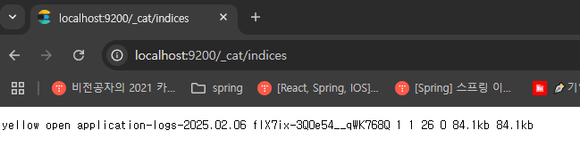

# 로그 수집

## 로그 수집이 필요한 이유

여러가지 각각의 서버에서 발생하는 로그를 한곳에 모아 편하게 확인하기 위해서

또 로그로 얻은 정보를 가지고 다른 부가적인 정보를 얻을 수도 있고

## Elasticsearch, Logstash 준비하기

Logstash로 로그를 수집하여 Elasticsearch 에 저장

-   도커에 Elasticsearch 설치

```sh
docker run -d --name elasticsearch -p 9200:9200 -e "discovery.type=single-node" -e "xpack.security.enabled=false" -e "xpack.security.http.ssl.enabled=false" docker.elastic.co/elasticsearch/elasticsearch:8.10.0
```

-   logstash 의존성 추가

```xml
<dependency>
    <groupId>net.logstash.logback</groupId>
    <artifactId>logstash-logback-encoder</artifactId>
    <version>7.4</version>
</dependency>
```

-   logback.xml에 Logstash로 전송할 appender 추가
    -   LogstashEncoder 사용시 json으로 입력이 바꿔서 들어감

```xml
<!-- Logstash로 전송할 Appender -->
<appender name="LOGSTASH" class="net.logstash.logback.appender.LogstashTcpSocketAppender">
    <destination>localhost:5044</destination>
    <encoder class="net.logstash.logback.encoder.LogstashEncoder" />
</appender>
...
<root level="info">
    <appender-ref ref="CONSOLE" />
    <appender-ref ref="FILE" />
    <appender-ref ref="LOGSTASH" />
</root>
...
```

-   logstash.conf 실행 설정 파일
    -   입력에 json이니 codec 도 json
-   index를 이용해서 년월일 단위로 저장

```conf
input {
    tcp {
        port => 5044
        codec => json
    }
}

output {
    elasticsearch {
        hosts => ["http://elasticsearch:9200"]
        index => "application-logs-%{+YYYY.MM.dd}"
    }
}
```

```sh
docker run -d --name logstash -p 5044:5044 -p 9600:9600 -v .\logstash.conf:/usr/share/logstash/pipeline/logstash.conf docker.elastic.co/logstash/logstash:8.10.0
```

```sh
docker network create elastic-network
docker network connect elastic-network elasticsearch
docker network connect elastic-network logstash
```

-   설정 성공시 출력 화면
    

## Elasticsearch에 수집된 로그 확인하기

[엘라스틱서치 공식문서](https://www.elastic.co/guide/en/elasticsearch/reference/current/getting-started.html)

http://localhost:9200/\_cat/indices?v

```
health status index                       uuid                   pri rep docs.count docs.deleted store.size pri.store.size
yellow open   application-logs-2025.02.06 fIX7ix-3Q0e54__qWK768Q   1   1         26            0     84.9kb         84.9kb
```

이 데이터는 Elasticsearch 클러스터 내의 한 인덱스에 대한 상태 및 통계 정보를 나타냅니다. 각 필드의 의미는 다음과 같습니다.

| 필드 이름          | 값                          | 설명                                                                                                                                       |
| ------------------ | --------------------------- | ------------------------------------------------------------------------------------------------------------------------------------------ |
| **health**         | yellow                      | 인덱스의 전반적인 건강 상태. `yellow`는 기본(primary) 샤드는 모두 할당되었으나, 복제(replica) 샤드 중 일부가 할당되지 않았음을 의미합니다. |
| **status**         | open                        | 인덱스의 상태. `open`은 인덱스가 현재 활성 상태임을 나타냅니다.                                                                            |
| **index**          | application-logs-2025.02.06 | 인덱스의 이름. 날짜 형식을 통해 2025년 2월 6일의 애플리케이션 로그임을 알 수 있습니다.                                                     |
| **uuid**           | fIX7ix-3Q0e54\_\_qWK768Q    | 인덱스의 고유 식별자(UUID)로, 클러스터 내에서 인덱스를 유일하게 식별합니다.                                                                |
| **pri**            | 1                           | 할당된 `Primary Shard(기본 샤드)`의 수입니다.                                                                                              |
| **rep**            | 1                           | 각 기본 샤드에 대해 할당된 `Replica Shard(복제 샤드)`의 수입니다.                                                                          |
| **docs.count**     | 26                          | 인덱스에 현재 저장된 문서의 총 개수입니다.                                                                                                 |
| **docs.deleted**   | 0                           | 삭제된 문서의 수 (아직 실제 스토리지에서 제거되지 않은 경우)입니다.                                                                        |
| **store.size**     | 84.9kb                      | 인덱스 전체(기본+복제)의 데이터가 사용하는 스토리지 크기입니다.                                                                            |
| **pri.store.size** | 84.9kb                      | 기본 샤드에 해당하는 데이터가 사용하는 스토리지 크기입니다.                                                                                |

### 추가 설명

-   **Health 상태:**

    -   `green`: 모든 샤드(기본 및 복제)가 정상적으로 할당된 상태입니다.
    -   `yellow`: 기본 샤드는 할당되었으나, 복제 샤드 중 일부가 할당되지 않은 상태입니다.
    -   `red`: 하나 이상의 기본 샤드가 할당되지 않은 상태입니다.

-   **샤드(Shard) 구성:**

    -   **Primary Shard(기본 샤드):** 실제 데이터를 저장하는 주 샤드입니다.
    -   **Replica Shard(복제 샤드):** 기본 샤드를 복제하여 장애 대비 및 검색 성능 향상에 기여합니다.

-   **문서(document):**

    -   `docs.count`는 인덱스에 실제 저장된 문서의 개수를 나타내며, 로그의 경우 각 로그 항목이 하나의 문서로 저장됩니다.
    -   `docs.deleted`는 삭제 요청이 있었으나, 아직 내부적으로 정리(merge)되지 않은 문서의 수를 나타냅니다.

-   **스토리지 크기:**
    -   `store.size`는 인덱스 전체가 차지하는 디스크 공간을,
    -   `pri.store.size`는 기본 샤드가 차지하는 디스크 공간을 나타냅니다.

## 참고

로그백 로그레벨 설정보다 스프링 설정파일 로그레벨이 우선순위가 더 높다.
