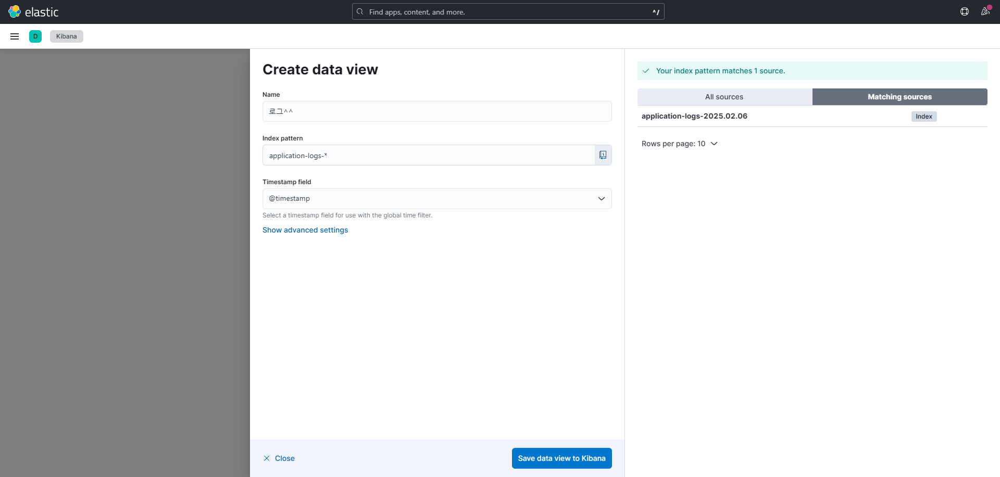
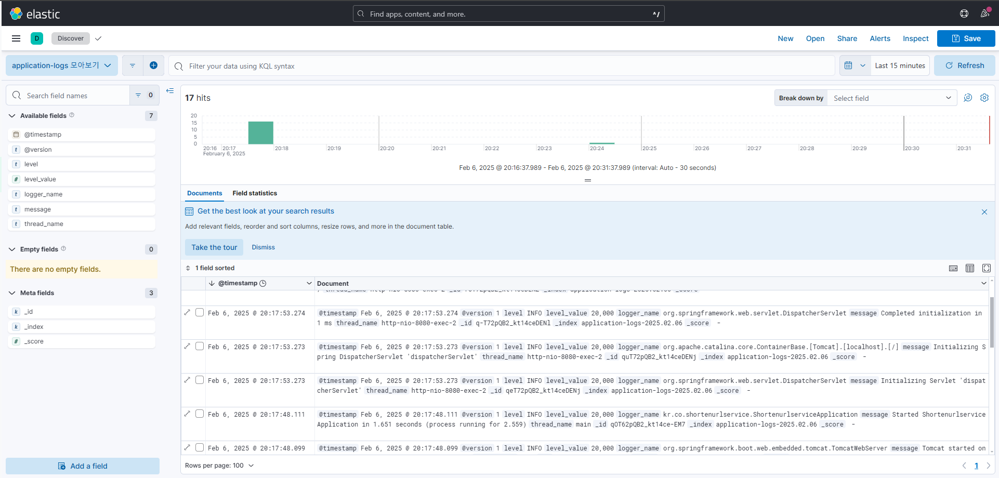
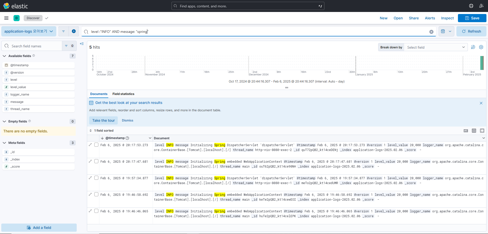

# 로그 시각화와 활용

## Kibana

Elasticsearch에 있는 데이터를 기반으로 시각화 (Elasticsearch 와 Kibana 버전 맞추기)

```sh
docker run -d --name kibana --network elastic-network -p 5601:5601 -e "ELASTICSEARCH_HOSTS=http://elasticsearch:9200" kibana:8.10.1
```

localhost:5601 접속시 키바나 화면

-   햄거버메뉴
-   Discover
-   Create Data View
    

    -   \*은 와일드카드

-   결과
    

-   키바나에서 로그 검색
    

## 대시보드로 로그 데이터 시각화하기

-   햄거버메뉴
-   Dashboards
-   Create Dashboard
-   Create visualization

## 로그 레벨을 기준으로 알람 설정하기

이거는 엘라스틱 서치를 배우는게 더 효과적일 것 같다. 엘라스틱 서치에 HTTP 요청 보내서 확인하는 방식

스케줄링된 테스크를 주기적으로 엘라스틱 서치에 요청 보내서 확인하는 방식
