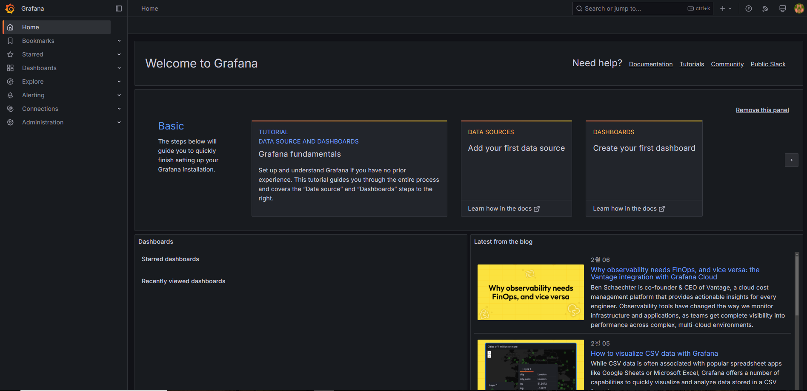
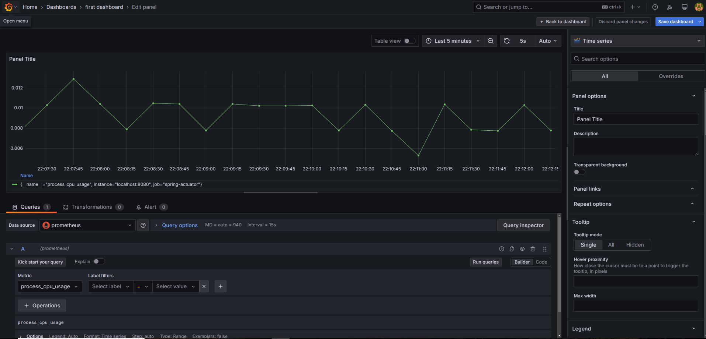
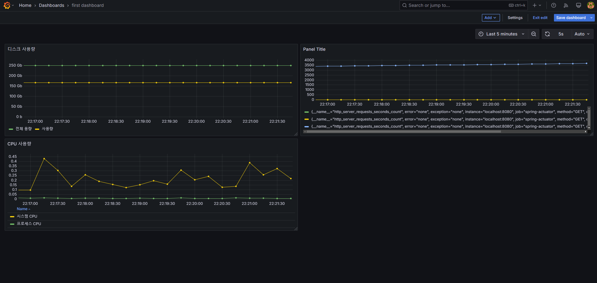
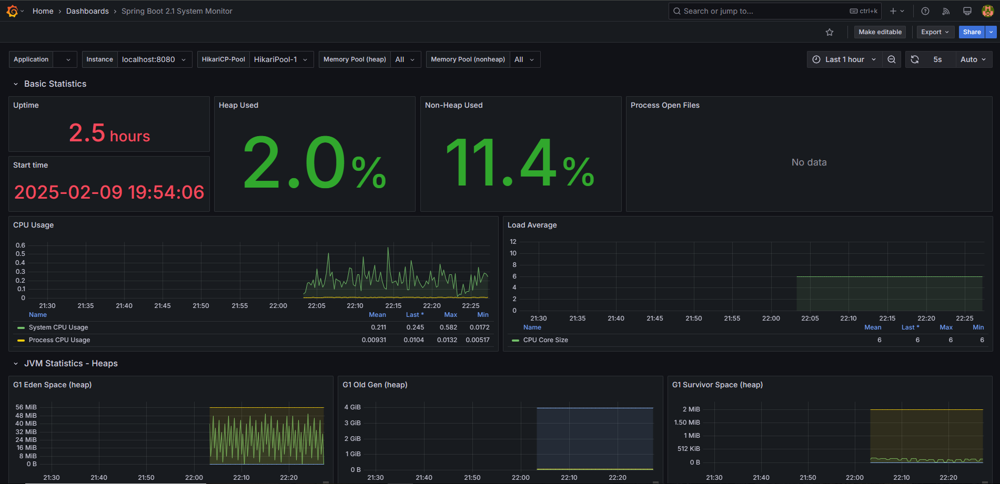

# 그라파나

프로메테우스 같은 매트릭 수집 db를 대시보드로 지원

## 설치

-   https://grafana.com/grafana/download
-   실행
    -   윈도우 설치폴더 -> bin -> grafana-server.exe
    -   MAC 설치폴더 -> bin -> ./grafana-server
-   http://localhost:3000/ 접속
    -   email or username : admin
    -   password : admin

## 연동

그라파나 메인화면 -> 햄버거 메뉴 -> connections -> 프로메테우스

-   url에 프로메테우스 설정 url : http://localhost:9090/
-   save & test 클릭

-   그후 대시보드 만들기
-   그후 panel에서 메트릭에 원하는 값 입력 Run queries
-   code or builder
    -   code의 경우 disk_total_bytes - disk_free_bytes 식 사용 가능

## 그라파타 공유 대시보드 활용

다른사람들이 만들어 놓은 대시보드들 사용하기

https://grafana.com/grafana/dashboards/

### 스프링 부트 시스템 모니터 대시보드 불러오기

예시

https://grafana.com/grafana/dashboards/11378-justai-system-monitor/

-   Copy Id to clipboard
-   내 그라파나 접속
-   Dashboards -> new -> import -> 복붙 -> load -> 프로메테우스 선택

#### 대시보드 수정하기

수정모드로 변경하기 위해 Make editable 클릭

## 그라파나 메트릭을 통한 문제 확인

실무에서 주로 발생하는 대표적인 예시

-   CPU 사용량 초과
-   JVM 메모리 사용량 초과
-   커넥션 풀 고갈
-   에러 로그 급증

## 결론

메트릭을 보는 것은 정확한 값을 보는 것이 목적이 아니다. 대략적인 값과 추세를 확인하는 것이 주 목적
