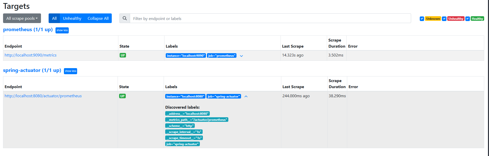

# 프로메테우스

메트릭을 보관하는 DB

-   스프링 부트 액츄에이터와 마이크로미터로 메트릭 자동 생성
-   마이크로미터 프로메테우스 구현체는 프로메테우스가 읽을 수 있는 포맷으로 메트릭 생성
-   프로메티우스가 메트릭 수집 및 내부 DB에 저장

## 프로메테우스 아키텍처


## 설치 및 실행

-   https://prometheus.io/download/
    -   윈도우 사용자 - windows-amd64 를 선택
    -   MAC 사용자 - darwin-amd64 를 선택
-   prometheus.exe 실행

## 어플리케이션 설정

1. 어플리케이션 설정 : 프로메테우스가 어플리케이션의 메트릭을 가져갈 수 있도록 애플리케이션에서 프로메테우스 포맷에 맞춰 메트릭 만들기

2. 프로메테우스 설정 : 애플리케이션의 메트릭을 주기적으로 수직하도록 설정

### 애플리케이션 설정

프로테메우스는 Json포맷(../actuator/metrics)을 인식하지 못하기 때문에 마이크로미터를 이용해서 포맷을 만들어야 한다.

```gradle
implementation 'io.micrometer:micrometer-registry-prometheus' //추가
```

-   스프링 부트와 액츄에이터가 자동으로 마이크로미터 프로메테우스 구현체를 등록해서 동작하도록 설정해준다.
-   액츄에이터에 프로메테우스 메트릭 수집 엔드포인트가 자동으로 추가된다.
    -   /actuator/prometheus

```
프로메테우스 포맷
# HELP application_ready_time_seconds Time taken for the application to be ready to service requests
# TYPE application_ready_time_seconds gauge
application_ready_time_seconds{main_application_class="rocket.jobrocketbackend.JobRocketBackendApplication"} 8.031
# HELP application_started_time_seconds Time taken to start the application
# TYPE application_started_time_seconds gauge
... 생략
```

#### 포맷 차이

-   jvm.info -> jvm*info (. 대신 *사용)
-   logback.events -> logback_events_total (프로메테우스는 카운터 메트릭은 관례상 \_total을 붙인다)
-   http.server.requests (요청수, 시간 합, 최대 시간 정보를 가지고 있었다.)
    -   http_server_requests_seconds_count : 요청 수
    -   http_server_requests_seconds_sum : 시간 합(요청수의 시간을 합함)
    -   http_server_requests_seconds_max : 최대 시간(가장 오래걸린 요청 수)

## 프로메테우스 수집 설정

프로메테우스가 애플리케이션의 /actuator/prometheus 를 호출해서 메트릭을 주기적으로 수집하도록 설정

-   프로메테우스 폴더에 있는 prometheus.yml 파일 수정

#### prometheus.yml

```yml
global:
    scrape_interval: 15s
    evaluation_interval: 15s
alerting:
    alertmanagers:
        - static_configs:
              - targets:
rule_files:
scrape_configs:
    - job_name: "prometheus"
      static_configs:
          - targets: ["localhost:9090"]
    # 해당 부분 추가
    - job_name: "spring-actuator"
      metrics_path: "/actuator/prometheus"
      scrape_interval: 1s
      static_configs:
          - targets: ["localhost:8080"]
```

`앞의 띄어쓰기 2칸에 유의`

-   job_name : 수집하는 이름. 임의의 이름을 사용
-   metrics_path : 수집할 경로를 지정
-   scrape_interval : 수집할 주기를 설정
-   targets : 수집할 서버의 IP, PORT를 지정

`수집 주기가 너무 짧으면 애플리케이션 성능에 영향을 줄 수 있으므로 운영에서는 10s ~ 1m`

### 프로메테우스 연동 확인

프로메테우스 메뉴 -> Status -> Configuration (prometheus.yml 변경 확인)

-   http://localhost:9090/config

프로메테우스 메뉴 -> Status -> Targets 연동 확인

-   http://localhost:9090/targets



-   prometheus : 프로메테우스 자체에서 제공하는 메트릭 정보. (프로메테우스가 프로메테우스 자신의 메트릭을 확인)
-   spring-actuator : 우리가 연동한 애플리케이션의 메트릭 정보
-   State 가 UP 으로 되어 있으면 정상, DOWN 으로 되어 있으면 연동이 안됨

### 프로메테우스를 통한 데이터 조회


## 프로메테우스 기본기능


-   태그, 레이블: `error` , `exception` , `instance` , `job` , `method` , `outcome` , `status` , `uri`
    -   메트릭 정보를 구분해서 사용하기 위한 태그이다. 마이크로미터에서는 이것을 태그(Tag)라 하고, 프로메테우 스에서는 레이블(Label)이라 한다
-   숫자: 끝에 마지막에 보면 132 , 4 와 같은 숫자가 보인다. 이 숫자가 바로 해당 메트릭의 값

### 기본 기능

-   Table Evaluation time 을 수정해서 과거 시간 조회 가능
-   Graph 메트릭을 그래프로 조회 가능

### 필터

레이블(태그)를 기준으로 핉터를 사용할 수 있다.

-   = 제공된 문자열과 정확히 동일한 레이블 선택
-   != 제공된 문자열과 같지 않은 레이블 선택
-   =~ 제공된 문자열과 `정규식` 일치하는 레이블 선택
-   !~ 제공된 문자열과 `정규식` 일치하지 않는 레이블 선택


### 연산자 쿼리와 함수

다음과 같은 연산자를 지원

-   -   (덧셈)
-   -   (빼기)
-   -   (곱셈)
-   / (분할)
-   % (모듈로)
-   ^ (승수/지수)
-   sum (값의 합계를 구한다.)
    -   sum(http_server_requests_seconds_count)
-   sum by( SQL의 group by 기능과 유사하다.)
    -   sum by(method, status)(http_server_requests_seconds_count)
-   count (매트릭 자체의 수 카운트)
    -   count(http_server_requests_seconds_count)
-   topk (상위 N개 메트릭 조회)
    -   topk(3, http_server_requests_seconds_count)
-   범위 벡터 선택기
    -   http_server_requests_seconds_count[1m] (1분간의 모든 기록값선택 (60s랑 같음))
    -   차트에 바로 표현 불가. 데이터로는 확인 가능
    -   차트에 표현하기 위해선 가공 필요

### 카운터와 게이지

HTTP 요청 메트릭을 그래프로 표현시. 카운터이기에 계속 누적해서 증가 특정 시간에 대한 트래픽 확인이 어렵게 때문에 특정 함수 지원

-   increase() 지정한 시간 단위별로 증가를 확인할 수 있다. [시간]범위벡터 필요

    -   increase(http_server_requests_seconds_count{uri="/log"}[1m])

-   rate() 범위 백터에서 초당 평균 증가율 계산

    -   increase()가 숫자를 직접 카운트 한다면 rate는 초당 평균을 나눠서 계산
    -   rate(data[1m]) 에서 [1m] 이라고 하면 60초가 기준이 되므로 60을 나눈 수.
    -   초당 얼마나 증가하는지 나타내는 지표로 보면 된다

-   irate() rate와 유사 범위벡터에서 초당 순간 증가율 계산
    -   급격하게 증가한 내용을 확인 하기 좋다.

#### 결론

-   게이지: 값이 계속 변하는 게이지는 현재 값을 그대로 그래프로 표현
-   카운터: 값이 단조롭게 증가하는 카운터는 increase() , rate() 등을 사용해서 표현
