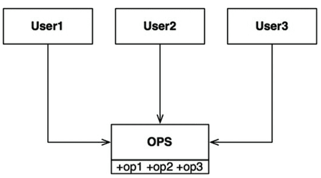
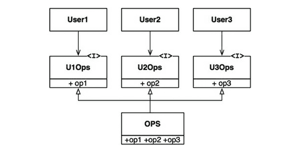
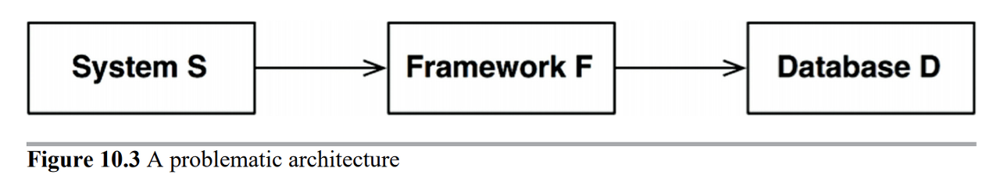
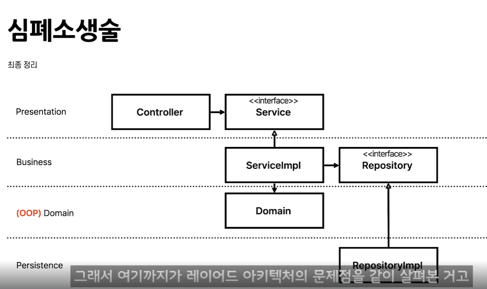

## ISP 인터페이스 분리 원칙

일반적으로 필요 이상으로 많은 걸 포함하는 모듈에 의존하는 것은 해로운 일이다.

User1에서는 op2와 op3를 전혀 사용하지 않음에도 User1의 소스 코드는 이 두 메서드에 의존하게 된다.

User1의 소스 코드는 U1Ops에 의존하지만 OPS에는 전혀 의존하지 않게 된다.

따라서 OPS에서 발생한 변경이 User1과는 전혀 관계없는 변경이라면, User1은 다시 컴파일하고 새로 배포하지 않아도 된다

기존 Controller Service Repository 구조 아닌가?

예를 들어 S 시스템 구축에 참여하고 있는 아키텍트가 있다고 해보자.

아키텍트는 F라는 프레임워크를 시스템에 도입하기를 원한다. 그리고 F 프레임 워크 개발자는 특정한 D 데이터베이스를 반드시 사용하도록 만들었다고 가정해 보자. 따라서 S는 F에 의존하며, F는 D에 의존하게 된다.

인프런 인강에서는

