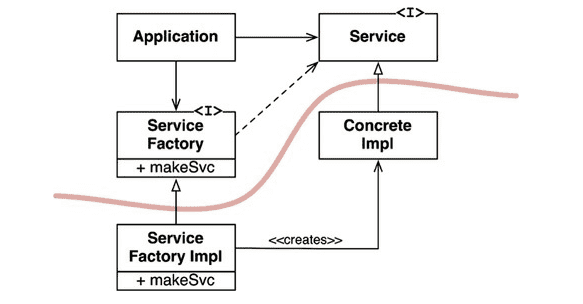

## DIP 의존성 역전 원칙

의존성 역전 원칙에서 말하는 '유연성이 극대화된 시스템'이란 소스코드 의존성이 추상에 의존하며 구체에는 의존하지 않는 시스템이다.

DIP를 논할 때 운영체제나 플랫폼 같이 안정성이 보장된 환경에 대해서는 무시하는 편이다. ex) 자바의 String 클래스는 구현클래스지만 굳이 추상클래스로 만들 필요는 없음

우리가 의존하지 말아야 할 것은 변동성이 큰 구체적인 요소(개발하는 중이라 자주 변경될 수 밖에 없는 모듈들)

추상 인터페이스에 변경이 생기면 이를 구체화한 구현체들도 따라서 수정해야 한다.

반대로 구현체에 변경이 생기더라도 그 구현체가 구현하는 인터페이스는 대다수의 경우 변경될 필요가 없다. 인터페이스를 변경하지 않고도 구현체에 기능을 추가할 수 있는 방법을 찾기 위해 노력해야 한다.

안정된 소프트웨어 아키텍처란 변동성이 큰 구현체에 의존하는 일은 지양하고 안정된 추상 인터페이스를 선호하는 아키텍처

-   변동성이 큰 구체 클래스를 참조하지 말라.(추상 인터페이스를 참조하라.)
-   변동성이 큰 구체 클래스로부터 파생하지 말라. 상속은 모든 관계 중에서 가장 강력한 동시에 뻣뻣해서 변경하기 어렵다. 상속은 아주 신중하게 사용해야 한다.
-   구체 함수를 오버라이드 하지 말라. 대체로 구체 함수는 소스코드 의존성을 필요로 한다. 의존성을 상속하게 됨 차라리 추상 함수로 선언하고 필요에 따라 구현
-   구체적이며 변동성이 크다면 절대로 그 이름을 언급하지 말라.

Application은 Service 인터페이스를 통해 ConcreteImpl을 사용하지만, Application에서는 어떤 식으로든 ConcreteImpl의 인스턴스를 생성해야 한다.

ConcreteImpl에 대해 소스 코드 의존성을 만들지 않으면서 이 목적을 이루기 위해 Application은 ServiceFactory 인터페이스의 makeSvc 메서드를 호출한다.

이 메서드는 ServiceFactory로 부터 파생된 ServiceFactoryImpl에서 구현된다.

그리고 ServiceFactoryImpl 구현체가 ConcreteImpl의 인스턴스를 생성한 후 Service 타입으로 반환한다.

곡선은 아키텍처 경계를 뜻한다. 이 곡선은 구체적인 것들로부터 추상적인 것들을 분리한다. 소스 코드 의존성은 해당 곡선과 교차할 때 모두 한 방향, 즉 추상적인 쪽으로 향한다.

곡선은 시스템을 다음 두 가지 컴포넌트로 분리한다.

-   추상 컴포넌트 - 애플리케이션의 모든 고수준 업무 규칙을 포함한다.
-   구체 컴포넌트 - 업무 규칙을 다루기 위해 필요한 모든 세부사항을 포함한다.

소스 코드 의존성은 제어흐름과는 반대 방향으로 역전된다. 이러한 이유로 이 원칙을 의존성 역전이라고 부른다.

추상 팩토리 그림에는 구체적인 의존성이 하나 있다.
(ServiceFactoryImpl 구체 클래스가 ConcreteImpl 구체 클래스에 의존한다.)

이는 일반적인 일이다. DIP 위배를 모두 없앨 수는 없다. 하지만 DIP를 위배하는 클래스들은 적은 수의 구체 컴포넌트 내부로 모을 수 있고, 이를 통해 시스템의 나머지 부분과는 분리할 수 있다.

대다수의 시스템은 이러한 구체 컴포넌트를 최소한 하나는 포함할 것이다.

의존성은 이 곡선을 경계로, 더 추상적인 엔티티가 있는 쪽으로만 향한다. 추후 이 규칙은 의존성 규칙이라 부를 것이다.
