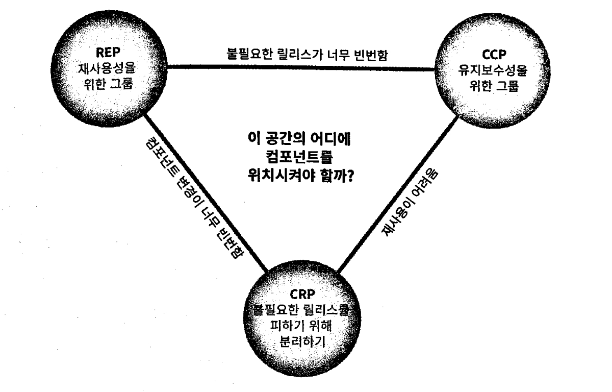

## 컴포넌트 응집도

컴포넌트 응집도와 관련된 세 가지 원칙

-   REP: 재사용/릴리스 등가 원칙
-   CCP: 공통 폐쇄 원칙
-   CRP: 공통 재사용 원칙

### REP(Reuse/Release Equivalence Principle) 재사용/릴리스 등가 원칙

재사용 단위는 릴리스 단위와 같다.

릴리스 절차에는 적절한 공지와 함께 릴리스 문서 작성도 포함되어야 한다. 그래야 개발자가 충분한 정보를 바탕으로 새 릴리스를 통합하지, 한다면 언제 할지를 결정할 수 있다.

이 원칙을 소프트웨어 설계와 아키텍처 관점에서 보면 단일 컴포넌트는 응집성 높은 클래스와 모듈들로 구성되야 함을 뜻한다.

컴포넌트를 구성하는 모든 모듈은 서로 공유하는 중요한 테마나 목적이 있어야 한다.

### CCP(Common Closure Principle) 공통 폐쇄 원칙

동일한 이유로 동일한 시점에 변경되는 클래스를 같은 컴포넌트로 묶어라. 서로 다른 시점에 다른 이유로 변경되는 클래스는 다른 컴포넌트로 분리하라.

이 원칙은 단일책임원칙을 컴포넌트 관점에서 쓴 것. 단일 컴포넌트 역시 변경의 이유가 여러 개 있어서는 안된다.

대다수의 애플리케이션에서 유지보수성은 재사용성보다 훨씬 중요하다. 애플리케이션에서 코드가 반드시 변경되어야 한다면, 이러한 변경이 여러 컴포넌트 도처에 분산되어 발생하기 보다는, 차라리 변경 모두가 단일 컴포넌트에서 발생하는 편이 낫다. 배포 편리

CCP는 같은 이유로 변경될 가능성이 있는 클래스는 모두 한곳으로 묶을 것을 권한다. 릴리스, 재검증, 배포 작업량 최소화 가능

### CRP(Common Reuse Principle) 공통 재사용 원칙

컴포넌트 사용자들을 필요하지 않는 것에 의존하게 강요하지 말라.
CRP 에서는 같이 재사용되는 경향이 있는 클래스와 모듈들을 같은 컴포넌트에 포함해야 한다고 말한다.

개별 클래스가 단독으로 재사용되는 경우는 거의 없다. 대체로 재사용가능한 클래스는 재사용 모듈의 일부로써 해당 모듈의 다른 클래스와 상호 작용하는 경우가 많다. CRP에서는 이런 클래스들은 동일한 컴포넌트에 포함되어 있어야 한다고 말한다.

어떤 컴포넌트가 다른 컴포넌트를 사용하면 의존성이 생겨난다. 사용하는 컴포넌트가 사용되는 컴포넌트의 단 하나의 클래스만 사용할 수도 있다. 이같은 의존성으로 인해 사용되는 컴포넌트가 변경될 때마다 사용하는 컴포넌트도 변경해야 할 가능성이 높다.

따라서 의존하는 컴포넌트가 있다면 해당 컴포넌트의 모든 클래스에 대해 의존함을 확실히 인지해야 한다. 일부 클래스에만 의존하고 다른 클래스와는 독립적일 수 없음을 확실히 인지 해야한다. 그렇지 않으면 필요이상으로 컴포넌트를 재배포 해야 한다.

CRP는 어떤 클래스를 한곳으로 묶어야 한다 보다는 어떤 클래스를 한데 묶어서는 안되는지에 대해 훨씬 더 많은 것을 이야기 한다.

CRP는 인터페이스 분리 원칙의 포괄적인 버전이다. ISP는 사용하지 않은 메서드가 있는 클래스에 의존하지 말라고 조언한다. CRP는 사용하지 않는 클래스를 가진 컴포넌트에 의존하지 말라고 조언한다.

필요하지 않은 것에 의존하지 말라.

### 컴포넌트 응집도에 대한 균형 다이어그램

REP와 CCP는 포함 원칙이다 두 원칙은 컴포넌트를 더욱 크게 만든다.

CRP는 배체 원칙이다 컴포넌트를 작게 만든다.

일반적인 프로젝트는 삼각형의 오른쪽에서 시작하는 편이며, 이때는 오직 재사용성만 희상하면 된다. 프로젝트가 성숙하고, 그 프로젝트로부터 파생된 또 다른 프로젝트가 시작되면, 프로젝트는 삼각형에서 점차 왼쪽으로 이동해 간다.

---

어느 클래스들을 묶어 컴포넌트로 만들때 재사용성과 개발가능성이라는 상추앟는 힘을 고려해야 한다.
