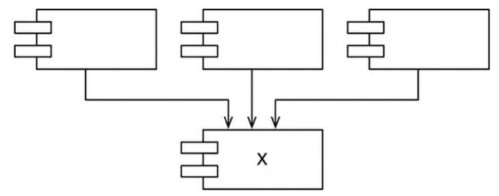
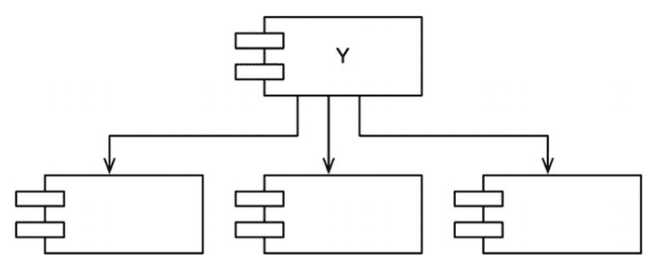
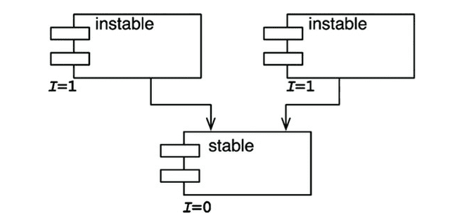
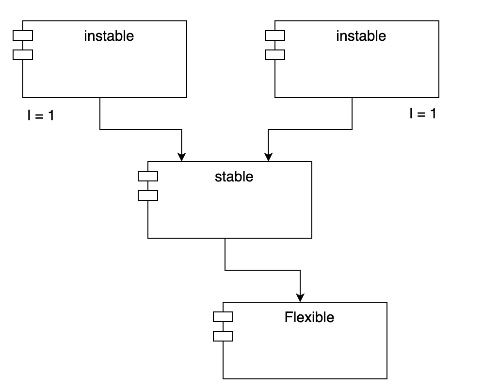
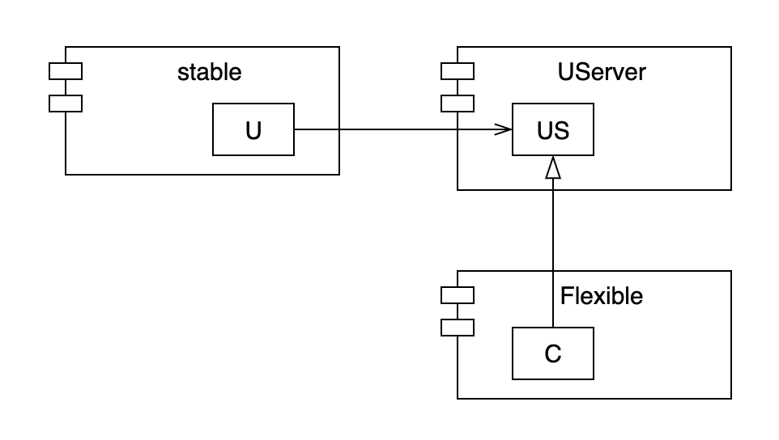

## 컴포넌트 결합

컴포넌트 사이의 세가지 원칙

### ADP : 의존성 비순환 원칙

컴포넌트 의존성 그래프에 순환이 있어서는 안된다.

주단위 빌드는 중간 규모의 프로젝트에서는 흔하게 사용된다. 모든 개발자는 일주일의 첫 4일은 서로를 신경쓰지 않는다.(어떻게 통합할지 생각x)

그런후 금요일이 되면 변경된 코드를 모두 통합하여 시스템을 빌드한다.

프로젝트가 커지면 통합은 하루만에 끝내는게 불가능해진다. 개발보다 통합에 드는 시간이 늘어나면서 팀의 효율성도 나빠진다.

이문제의 해결책은 개발 환경을 릴리스 가능한 컴포넌트 단위로 분리하는 것이다. 컴포넌트는 개별 개발자 또는 단일 개발팀이 책임질 수 있는 작업 단위가 된다.

해당 컴포넌트를 릴리스 하여 다른 개발자가 사용할 수 있도록 한다. 릴리스에 번호를 부여하고 다른팀에서 사용할 수 있는 디렉터리로 이동시킨다. 개발자는 자신만의 공간에서 컴포넌트를 지속적으로 수정하고 다른팀에서는 릴리스된 버전을 사용한다.

특정 컴포넌트가 새롭게 릴리스 되면 자신의 컴포넌트를 해당 컴포넌트에 맞게 수정할 시기를 스스로 결정할 수 있다. 뿐만 아니라 통합은 작고 점진적으로 이뤄진다.

이절차가 성공적으로 동작하려면 컴포넌트 사이의 의존성 구조를 반드시 관리해야 한다 순환의존이 있어서는 안된다.

시스템 전체를 릴리스 할 떄가 오면 릴리스 절차는 상향식으로 진행된다.
구성요소간의 의존성을 파악하고 있으면 시스템을 빌드하는 방법을 알 수 있다.

### 순환 끊기

-   의존성 역전 원칙을 사용한다.
-   순환의존된 컴포넌트가 모두 의존하는 새로운 컴포넌트를 만든다.(두 컴포넌트가 의존하는 클래스를 새로운 컴포넌트로 이동시킨다.) : 컴포넌트 구조가 변경됨

컴포넌트는 하향식으로 설계될 수 없다.

### SDP : 안정된 의존성 원칙

안정성의 방향으로(더 안정된 쪽에)의존하라.

당연히 변동성이 적은쪽에 의존해야

모듈을 만들 때는 변경하기 쉽게 설계했지만 누군가가 이 모듈에 의존을 한다면 해당 모듈역시 변경하기 어려워진다.

안전된 의존성 원칙(SDP)를 준수하면 변경하기 어려운 모듈이 변경하기 쉽게 만들어진 모듈에 의존하지 않도록 만들 수 있다.

컴포넌트 안쪽으로 들어오는 의존성이 많아지만 상당히 안정적이라 볼 수 있다. 사소한 변경이라도 의존하는 모든 컴포넌트를 만족시키면서 변경하려면 상당한 노력이 들기 때문이다.

-   x는 안정적인 컴포넌트
-   세 컴포넌트가 X에 의존하며, 따라서 X컴포넌트는 변경하지 말아야 할 이유가 세가지나 된다.
-   이 경우 'X는 세 컴포넌트를 책임진다' 라고 말한다.
-   반대로 X는 어디에도 의존하지 않으므로 X가 변경되도록 만들 수 있는 외적인 형향이 없다. 이 경우 'X는 독립적이라' 라고 말한다.

-   Y는 상당히 불안정한 컴포넌트다
-   어떤 컴포넌트도 Y에 의존하지 않으므로 Y는 책임성이 없다고 말할 수 있다.
-   또한 Y는 세 개의 컴포넌트에 의존하므로 변경이 발생할 수 있는 외부 요인이 세 가지이다.
-   이 경우 Y는 의존적이라고 말한다.
    정처기에서 봤던거네 
    fan in: 안으로 들어오는 의존성

fan out: 밖으로 나가는 의존성 이게 많을 수록 불안정

불안정성 계산 fan-out/(fan-in + fan-out) 0이면 최고로 안정된 컴포넌트 1이면 최고로 불안정한 컴포넌트

### 모든 컴포넌트가 안정적이어야 하는 것은 아니다.

모든 컴포넌트가 최고로 안정적이라면 변경이 불가능하다. 이는 바람직하지 않다.

세 컴포넌트로 구성된 이상적인 구성

-   위쪽에 변경 가능한 컴포넌트가 있고, 아래의 안정된 컴포넌트에 의존한다.
-   다이어그램에서 불안정한 컴포넌트를 관례적으로 위쪽에 둔다.(따르면 유용)
-   위로 향하는 화살표가 있으면 SDP를 위배하는(ADP도 위반하는) 상태가 되기 때문이다.

SDP를 위반한 구성
Flexible은 변경하기 쉽도록 설계한 컴포넌트다. 우리는 Flexible이 불안정한 상태이기를 바란다. 하지만 stable컴포넌트가 Flexible에 의존성을 가지고 있음
stable의 i지표는 flexible의 i지표보다 작이에 SDP를 위반함

따라서 flexible을 변경하기 어려워진다.

의존성 역전 원칙을 이용해 이 의존성을 끊어 내야만 함

추상 컴포넌트는 상당히 안정적이며, 따라서 덜 안정적인 컴포넌트가 의존할 수 있는 이상적인 대상이다.

### SAP : 안정된 추상화 원칙

컴포넌트는 안정된 정도 만큼만 추상화 되어야 한다.

시스템이는 자주 변경해서는 절대로 안되는 소프트웨어도 있다 고수준 아키텍처나 정책 결정과 관련된 소프트웨어가 예다.

따라서 시스템에서 고수준 정책을 캡슐화하는 소프트웨어는 반드시 안정된 컴포넌트에 위치해야 한다. 불안정한 컴포넌트는 반드시 변동성이 큰 소프트웨어, 즉 쉽고 빠르게 변경할 수 있는 소프트웨어만을 포함해야 한다.

하지만 고수준 정책을 안정된 곳에 위치시키면 그 정책을 포함하는 소스 코드는 수정하기가 어려워진다.

컴포넌트가 최고로 안정된 상태이면서도 동시에 변경에 충분히 대응할 수 있을 정도로 유연하게 만들려면 OCP를 참고

따라서 안정적인 컴포넌트라면 반드시 인터페이스와 추상 클래스로 구성되어 쉽게 확장할 수 있어야 한다.

다음은 컴포넌트의 클래스 총 수 대비 인터페이스와 추상 클래스의 개수를 단순히 계산한 값이다.

-   NC: 컴포넌트의 클래스 개수
-   Na: 컴포넌트의 추상 클래스와 인터페이스의 개수
-   A: 추상화 정도
-   A = Na / Nc
-   A가 0이면 추상 클래스가 한개도 없고, 1이면 오로지 추상 클래스만 있음

A(추상화 정도) / I(안정성) 그래프

x(i)축 y(a)축

최고로 안정적이며 추상화된 컴포넌트는 좌측상단 (0,1)에 해당

최고로 불안정적이며 구체화된 컴포넌트는 우측하단 (1,0)에 해당

(0,0) 주변 구역에 위치한 컴포넌트는 매우 안정적이며 구체적이다. 추상적이지 않으므로 확장할 수 없고, 안정적이므로 변경하기도 상당히 어렵다. (0,0) 주변 영역은 배제해야 할 구역이며, 고통의 구역이라고 부른다.

(0,0) 근처에 위치한 또 다른 소프트웨어로는 구체적인 유틸리티 라이브러리중 String컴포넌트를 예로 들 수 있다.

변동성이 없는 컴포넌트는 (0,0) 구역에 위치했더라도 해롭지 않다. 변동될 가능성이 없기 때문에 변동성이 있는 컴포넌트만 고통의 구역에서 문제가 된다고 정의할 수 있다.

(1,1) 주변의 컴포넌트는 최고로 추상적이지만, 누구도 이 컴포넌트에 의존하지 않기 때문에 쓸모없는 구역이라고 불린다.

두 배제 구역으로부터 가능한 멀리 떨어진 궤적은 (1,0)과 (0,1)을 잇는 선분인 주계열이다.

주계열에 위치한 컴포넌트는 자신의 안정성에 비해 '너무 추상적'이지도 않고, 추상화 정도에 비해 '너무 불안정'하지도 않다.

컴포넌트가 위치할 수 있는 가장 바람직한 지점은 주계열의 두 종점이지만 저자는 경험을 통해 대규모 시스템에서 소수의 일부 컴포넌트는 완벽히 추상적이거나 완전하게 안정적일 수 없다고 말한다.

1,0 0,1을 잇는 대각선 중심으로 위치

---

의존성 관리 지표는 설계의 의존성과 추상화 정도가 내가 휼룡한 패턴이라고 생각하는 수준에 얼마나 잘 부합하는지를 측정한다.

하지면 지표는 신이 아니다. 참고만 하자
