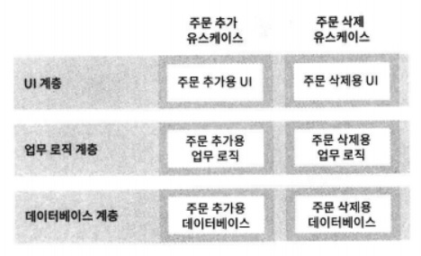

## 독립성

좋은 아키텍처는 다음을 지원해야 한다.

-   시스템의 유스케이스
-   시스템의 운영
-   시스템의 개발
-   시스템의 배포

### 유스케이스

시스템 아키텍처는 시스템의 의도를 지원해야 한다. 만약 시스템이 장바구니 애플리케이션이라면 이 아키텍처는 장바구니와 관련된 유스케이스를 지원해야 한다. 실제로 아키텍트의 최우선 관심사는 유스케이스이며, 아키텍처에서도 유스케이스가 최우선이다.

하지만 아키텍처는 시스템의 행위에 그다지 큰 영향을 주지 않는다. 좋은 아키텍처가 행위를 지원하기 위해 할 수 있는 일 중에서 가장 중요한 사항은 행위를 명확히 하고 외부로 드러내며, 이를 통해 시스템이 지닌 의도를 아키텍처 수준에서 알아볼 수 있게 만드는 것.(누가봐도 장바구니 애플리케이션)

### 운영

시스템의 운영 지원 관점에서 볼 때 아키텍터는 더 실질적이며 덜 피상적인 역할을 맡는다.

시스템이 요구하는 처리량에 알맞은 형태로 아키텍처를 구조화 해야 한다.
모놀리식은 다중 프로세스,스레드 또는 MSA형태가 필요해질 때 개선하기가 어렵다 하지만 각 아키텍처에서 각 컴포넌트를 적절히 격리하여 유지하고 컴포넌트 간 통신 방식을 특정 형태로 제한하지 않는다면 시간이 지나 운영에 필요한 요구사항이 바뀌더라도 스레드, 프로세스, 서비스로 구성된 기술 스펙트럼 사이를 전환하는 일이 훨씬 쉬워질 것이다.

### 개발

아키텍처는 개발 환경을 지원하는데 있어 핵심적인 역할을 수행한다. 콘웨이의 법칙이 작용하는 지점이 바로 여기

콘웨이 법칙 : 시스템을 설계하는 조직이라면 어디든지 그 조직의 의사소통 구조와 동일한 구조의 설계를 만들어 낼 것이다.

많은 팀이 존재 한다면 각 팀이 독립적으로 행동하기 편한 아키텍처를 반드시 확보하여 개발하는 동안 팀들이 서로를 방해하지 않도록 해야 한다. 즉 잘 격리되어 독립적으로 개발 가능한 컴포넌트 단위로 시스템을 분할 할 수 있어야 한다.

### 배포

아키텍처는 배포 용이성을 결정하는 데 중요한 역할을 한다. 이때 목표는 즉각적인 배포다. 좋은 아키텍처는 수십개의 작은 설정 스크립트나 속성 파일을 약간씩 수정하는 방식을 사용하지 않는다. 좋은 아키텍처는 꼭 필요한 디렉터리나 파일을 수작으로 생성하게 내버려 두지 않는다.

좋은 아키텍처라면 시스템이 빌드된 후 즉각 배포할 수 있도록 지원해야 한다.

시스템을 컴포넌트 단위로 적절하게 분할하고 격리 시켜야 한다. 여기에는 마스터 컴포넌트도 포함되는데 마스터 컴포넌트는 시스템 전체를 하나로 묶고 각 컴포넌트를 올바르게 구동하고 통합하고 관리해야 한다.

### 선택사항 열어 놓기

좋은 아키텍처는 컴포넌트 구조와 관련된 이 관심사들 사이에서 균형을 맞추고, 각 관심사 모두를 만족시킨다.

하지만 현실에서는이 균형을 잡기가 매우 어렵다.

몇몇 아키텍처 원칙은 구현하는 비용이 비교적 비싸지 않으며, 관심사들 사이에서 균형을 잡는데 도움이 된다. 심지어 균형을 맞추려는 목표점을 명확히 그릴 수 없는 경우에도 도움이 된다.

이들 원칙은 시스템을 제대로 격리된 컴포넌트 단위로 분할할 때 도움이 된다. 좋은 아키텍처는 선택사항을 열어 둠으로써, 향수 시스템에 변경이 필요할 때 어떤 방향으로든 쉽게 변경할 수 있도록 한다.

### 계층 결합 분리

아키텍트는 필요한 모든 유스케이스를 지원할 수 있는 시스템 구조를 원하지만, 유스케이스 전부를 알지는 못한다. 하지만 아키텍튼느 시스템의 기본적인 의도는 분명히 알고 있다. ex) 장바구니 시스템인지 주문처리시스템인지

아키텍트는 단일책임원칙과 공통폐쇄원칙을 적용하여, 그의도의 맥락에 따라서 다른 이유로 변경되는 것들은 분리하고, 동일한 이유로 변경되는 것들은 묶는다.

서로 다른 이유로 변경되는 것의 예: 사용자 인터페이스가 변경되는 이유는 업무 규칙과는 아무런 관련이 없다. 만약 유스케이스가 두 가지 요소를 모두 포함한다면, 뛰어난 아키텍트는 유스케이스에서 UI부분과 업무 규칙 부분을 서로 분리하고자 할 것이다.

업무 규칙은 그 자체가 애플리케이션과 밀접한 관련이 있거나, 혹은 더 범용적일 수도 있다. 예: 입력필드 유효성 검사는 애플리케이션 자체와 밀접하게 관련된 업무 규칙이다. 반대로 계좌의 이자 계산이나 재고품 집게는 업무 도메인과 관련된 업무 규칙이다.

이들 규칙은 각자 다른 속도로, 다른 이유로 변경될 것이다. 따라서 이들 규칙은 서로 분리하고, 독립적으로 변경할 수 있도록 만들어야 한다.

db, 쿼리언어, 스키마 조차도 기술적인 세부사항이며, 업무 규칙이나 UI와는 아무런 관련이 없다. 이들은 시스템의 다른 측면과는 다른 속도로, 그리고 다른 이류로 변경된다.

아키텍트는 이들은 시스템의 나머지 부분으로부터 분리하여 독립적으로 변경할 수 있도록 해야만 한다.

시스템을 서로 결합되지 않은 수평적인 계층으로 분리하는 방법을 배웠으며 이러한 계층의 예로는 UI,애플리케이션에 특화된 업무 규칙, 애플리케이션과는 독립된 업무 규칙, 데이터베이스등을 들 수 있다.

### 유스케이스 결합 분리

주문 입력 시스템에서 주문을 추가하는 유스케이스는 주문을 삭제하는 유스케이스와는 다른 속도로, 그리고 다른 이유로 변경된다. 유스케이스는 시스템을 분할하는 매우 자연스러운 방법이다.

동시에 유스케이스는 시스템의 수평적인 계층을 가로지르도록 자른, 수직으로 좁다란 조각이기도 하다.

이와같이 결합을 분리하려면 추문 추가 유스케이스와 UI, 주문 삭제 유스케이스의 UI를 분리해야 한다. 유스케이스의 업무 규칙과 데이터베이스 부분도 마찬가지.

시스템의 맨 아래 게층까지 수직으로 내려가며 유스케이스들이 각 계층에서 서로 겹치치 않게 한다.

시스템에서 서로 다른 이유로 변경되는 요소들의 결합을 분리하면 기존 요소에 지장을 주지 않고도 새로운 유스케이스를 추가할 수 있게 된다.

또한 유스케이스를 뒷받침하는 UI와 데이터베이스를 서로 묶어서 각 유스케이스가 UI와 데이터베이스의 서로 다른 관점(AOP횡단관심사)을 사용하게 되면, 새로운 유스케이스를 추가하더라도 기존 유스케이스에 영향을 주는 일은 거의 없을 것이다.

### 결합 분리 모드

유스케이스에서 서로 다른 관점(aspect)이 분리되었다면, 높은 처리량을 보장해야 하는 유스케이스와 낮은 처리량으로도 충분한 유스케이스는 이미 분리되어 있을 가능성이 높다.

UI와 데이터베시으가 업무 규칙과 분리되어 있다면 UI와 데이터베이스는 업무 규칙과는 다른 서버에서 실행될 수 있다. 높은 대역폭을 요구하는 유스케이스는 여러서버로 복제하여 실행할 수 있다.

분리된 컴포넌트를 서로 다른 서버에서 실행해야 하는 상황이라면 컴포넌트가 단일 프로세서의 동일한 주소 공간에 함께 상주하는 형태로 있어서는 안된다. 반드시 독립된 서비스가 되어야 하고 일종의 네트워크를 통해 서로 통신한다 서비스 or 마이크로서비스 라고 함 서비스 지향 아키텍처

결합 분리 모드는 선택지 중 하나이다.

### 개발 독립성

컴포넌트가 완전히 분리되면 팀 사이의 간섭은 줄어든다. 업무 규칙이 UI를 알지 못하면 UI에 중점을 둔 팀은 업무 규칙에 중점을 둔 팀에 영향을 줄 수 없다. 유스케이스도 결합이 분리되면 addOrder유스케이스에 중점을 둔 팀이 deleteOrder 유스케이스에 중점을 둔 팀에 개입할 가능성은 거의 없다.

계층과 유스케이스의 결합이 분리되는 한 시스템의 아키텍처는 그 팀 구조를 뒷받침 해줄것이다.

### 배포 독립성

결합을 제대로 분리했다면 운영중인 시스템에서도 계층과 유스케이스를 교체할 수 있다. 새로운 유스케이스를 추가하는일은 시스템의 나머지는 그대로 둔 채 새로운 jar 파일이나 서비스 몇 개를 추가하는 정도로 단순한 일이 된다.

### 중복

소프트웨어에서 중복은 일반적으로 나쁜 것이다. 중복에는 여러 종류가 있다.

-   진짜 중복 : 이 경우 한 인스턴스가 변경되면, 동일한 변경을 그 인스턴스의 모든 복사본에 반드시 적용해야 한다.

-   거짓 중복(or 우발적 중복) : 중복으로 보이는 두 코드 영역이 각자의 경로로 발전한다면, 즉 서로 다른 속도와 다른 이유로 변경된다면 이 두 코드는 진짜 중복이 아니다.

예: 두 유스케이스의 화면 구조가 매우 비슷하다고 가정. 아키텍트는 이 구조에 사용할 코드를 통합하고 싶은 유혹을 강하게 느낀다 하지만 이는 우발적 중복일 가능성이 크다. 지금은 비슷하지만 시간이 지나면서 두 화면은 서로 다른 방향으로 분기하며 다른모습을 가지게 될 가능성이 큼

자동 반사적으로 중복을 제거해버리는 잘못을 저지르는 유혹을 떨쳐내라. 중복이 진짜 중복인지 확인해라

계층간 결합을 절적하게 분리

### 결합 분리 모드2

게층과 유스케이스의 결합을 분리하는 방법은 다양하다.

-   소스 수준 분리 모드 : 소스 코드 모듈 사이의 의존성을 제어할 수 있다. 이를 통해 하나의 모듈이 변하더라도 다른 모듈을 변경하거나 재컴파일하지 않도록 만들 수 있다.

    이 모드에서는 모든 컴포넌트가 같은 주소 공간에서 실행되고, 서로 통신할 때는 간단한 함수 호출을 사용한다. 컴퓨터 메모리에는 하나의 실행파일만이 로드된다. 이러한 구조를 모놀리식 구조라고 부른다.

-   배포 수준 분리 모드 : jar파일, DLL, 공유 라이브러리와 같이 배포 가능한 단위들 사이의 의존성을 제어할 수 있다. 한 모듈의 소스코드가 변하더라도 다른 모듈을 재빌드하거나 재배포하지 않도록 만들 수 있다.

    이모드의 중요한 특징은 결합이 분리된 컴포넌트가 jar파일, Gem파일, DDL과 같이 독립적으로 배포할 수 있는 단위로 분할되어 있다는 점이다.

-   서비스 수준 분리 모드 : 의존하는 수준을 데이터 구조 단위까지낮출 수 있고 순전히 네트워크 패킷을 통해서만 통신하도록 만들 수 있다. 이를 통해 모든 실행 가능한 단위는 소스와 바이너리 변경에 대해 서로 완전히 독립적이게 된다 (MSA)

프로젝트 초기 단계는 어떤 모드가 최선인지 알기 어렵다. 프로젝트가 성숙해갈수록 최적인 모드가 달라질 수도 있다.

현시점(요즘시대)에서 인기있는 해결책은 서비스 수준 분리

서비스 수준에서의 분리를 기본 정책으로 사는다면 비용이 많이들고(서버,메모리) 결합이 큰 단위에서 분리됨 아무리 작다 하더라도 충분히 작은 단위에서 분리될 가능성은 거의 없다.

작가는 컴포넌트가 서비스화 될 가능성이 있다면 컴포넌트 결합을 분리하되 서비스가 되기 직전에 멈추는 방식을 선호 이를 통해 서비스에 대한 선택권을 열어 둘 수 있다.

이방식을 사용하면 초기에는 컴포넌트가 소스 코드 수준에서 분리된다. 배포나 결합에서 문제가 생기면 일부 결합을 배포수준까지 올린다.

개발, 배포, 운영적인 문제가 증가하면 서비스 수준으로 전환할 배포 단위들을 신중하게 선택한 후, 점차적으로 서비스 수준 분리로 시스템을 변경해 나간다.

좋은 아키텍처는 시스템이 모놀릭식 구조로 태어나서 단일 파일로 배포되더라도, 이후에는 독립적으로 배포 가능한 단위들의 집합으로 성장하고, 또 독립적인 서비스나 마이크로서비스 수준까지 성장할 수 있도록 만들어 져야 한다.

또한 반대도 가능해야 한다 서비스 -> 모놀리식 구조로 좋은 아키텍쳐는 이러한 변경으로부터 소스 코드 대부분을 보호한다. 좋은 아키텍처는 결합 분리 모드를 선택사항으로 남겨두어 배포 규모에 따라 적합한 모드를 선택해 사용한다.
