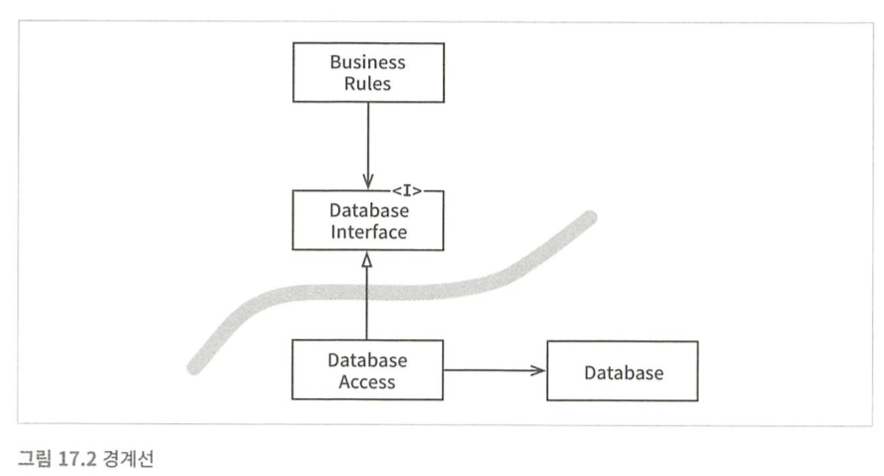
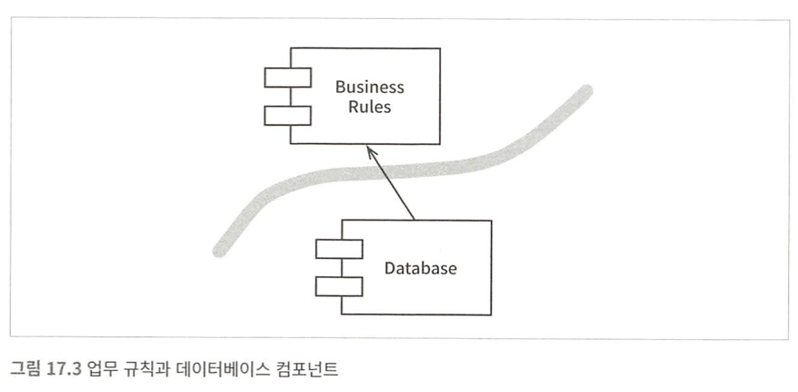
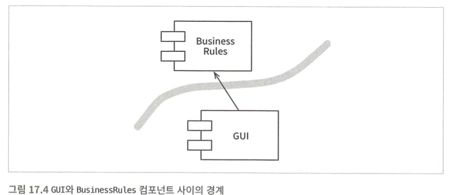

## 경계: 선긋기

소프트웨어 아키텍처는 선을 긋는 기술이며, 나는 이러한 선을 경계라고 부른다.

경계는 요소를 서로 분리하고 경계 너머의 요소를 알지 못하도록 막는다.

아키텍트의 목표는 필요한 시스템을 만들고 유지하는 데 드는 인적 자원을 최소화하는 것이라는 사실을 상기하자. 인적 자원의 효율을 떨어뜨리는 요인은 결합이다. 특히 너무 일찍 내려진 결정에 따른 결합이다.

이른 결정의 종류는 시스템의 업무 요구사항 즉 유스케이스와 아무런 관련이 없는 결정이다. 프레임워크, 데이터베이스, 웹 서버, 유틸리티 라이브러리, 의존성 주입에 대한 결정 등이 여기 포함된다. 좋은 시스템 아키텍처란 이러한 결정이 부수적이며, 결정을 연기할 수 있는 아키텍처다.

좋은 시스템 아키텍처는 이런 결정에 의존하지 않는다. 좋은 시스템 아키텍처는 이러한 결정을 가능한 최후의 순간에 내릴 수 있게 해주며, 결정에 따른 영향이 크지 않게 만든다.

### 사례.

Fitnesse 의 위키 페이지 만들 기

잘한점: 어떤 Database를 사용할 것인지를 미뤄둠.

어떤 DB를 사용하더라도 상관없는 형태로 설계함으로써 의도적으로 DB에 대한 결정을 미루었다.

어떻게: 모든 데이터 접근 영역과 데이터저장소 영역 사이에 인터페이스 추가. (다형성, DIP)
개발도중: DB가 없으므로 인터페이스의 구현체는 Stub 으로 만들었다.

구현체 1: DB가 아닌 메모리에 저장하도록 함.

구현체 2: 영속성을 위해 MySql을 사용함. 하루만에 MySql 구현체를 추가했음.
Fitnesse 는 어떤 경계를 그었는가? => 업무 규칙과 데이터베이스 사이에 경계선(Boundary Line)을 그었다.

경계선을 긋는 행위는 결정을 늦추고 연기하는 데 도움이 되었고, 궁극적으로는 시간을 엄청나게 절약해주었다

### 어떻게 언제 선을 그을까

GUI는 업무 규칙과는 관련 없기 때문에, 이 둘 사이에는 반드시 선이 있어야 한다. 데이터베이스는 GUI와는 관련이 없으므로 이 둘 사이에도 반드시 선이 있어야 한다.데이터베이스는 업무 규칙과 관련이 없으므로, 이 둘 사이에도 선이 있어야 한다.

데이터베이스는 엄무 규칙이 간접적으로 사용할 수 있는 도구다. 업무 규칙은 스키마, 쿼리 언어, 또는 데이터베이스와 관련된 나머지 세부사항에 대해 어떤 것도 알아서는 안된다. 업무 규칙이 알아야 할 것은 데이터를 가져오고 세부사항에 대해 어떤 것도 알아서는 안된다.

업무 규칙이 알아야 할 것은 데이터를 자겨오고 저장할 때 사용할 수 있는 함수 집합이 있다는 사실이 전부다. 이러한 함수 집합을 통해서 우리는 데이터베이스를 인터페이스 뒤로 숨길 수 있다.

Database Access 가 존재한다는 사실을 알고있는 클래스는 없다.

많은 업무 규칙이 포함된 컴포넌트, 데이터베이스와 데이터베이스 접근 클래스를 포함하고 있는 컴포넌트

화살표를 보면 DB는 Business Rules에 대해 알고 있다. 반대는 알지 못한다. 이는 DatabaseInterface는 BusinessRules컴포넌트에 속한다는뜻이다. 결국 사진1의 선에 따라 컴포넌트가 구분

업무규칙 컴포넌트에서 DB는 문제가 되지 않지만 DB는 BusinessRules 없이는 존재할 수 없다.

DB컴포넌트는 BusinessRules가 만들어낸 호출을 쿼리언어로 변환하는 코드를 담고 있다. BusinessRules에 대해 알고 있는 코드는 바로 이 변환 코드다. (DatabaseAccess)구현체를 갈아끼우면서 어떤 종류의 DB도 상관 x

즉 DB에 대한 결정은 연기할 수 있으며, 업무규칙을 먼저 작성하고 테스트하는데 집줄할 수 있음을 의미

### 입력과 출력은?

인터페이스(ex. GUI)는 모델에게 있어 중요하지 않다 중요한것은 업무 규칙이다 DB와 마찬가지로

### 플러그인 아키텍처

DB와 GUI에 대해 내린 결정을 하나로 합치면 컴포넌트 추가와 관련한 일종의 패턴이 만들어진다.

소프트웨어 개발 기술의 역사는 플러그인을 손쉽게 생성하여, 확장 가능하며 유지보수가 쉬운 시스템 아키텍처를 확립할 수 있게 만드는 방법에 대한 이야기다.

핵심적인 업무규칙은 분리되어있고, 또한 독립적이다.
인터페이스와 DB는 플러그인 형태로 고려되었기에 많은 종류를 고려할 수 있음
(인프런 java/spring 주니어 개발자 참고)

시스템을 플러그인 아키텍처로 배치함으로써 변경이 전파될 수 없는 방화벽을 생성할 수 있다.

경계는 변경의 축이 있는 지점에 그어진다. 경계의 한쪽에 위치한 컴포넌트는 경계 반대편의 컴포넌와는 다른 속도로, 그리고 다른 이유로 변경된다.

GUI는 업무 규칙과는 다른 시점에 다른 속도로 변경되므로, 둘 사이에는 반드시 경계가 필요하다.

단일책임원칙은 어디에 경계를 그어야 할지를 알려준다. (바뀌는 이유는 단 한가지여야 한다)

---

소프트웨어 아키텍처에서 경계선을 그리려면 먼저 시스템을 컴포넌트 단위로 분리해야 한다. 나머지 컴포넌트는 플러그인으로, 핵심 업무와는 직접적인 고나련이 없지만 필수 기능을 포함한다.(ex. db) 그런 다음 컴포넌트 사이의 화살표가 특정 방향, 핵심 업무를 향하도록 이들 컴포넌트의 소스를 패치한다.

이는 의존성역전원칙과 안정된 추상화 원칙을 응용 의존성 화살표는 저수준 세부사항에서 고수준 추상화를 향하도록 배치된다. 밑에서 위로
