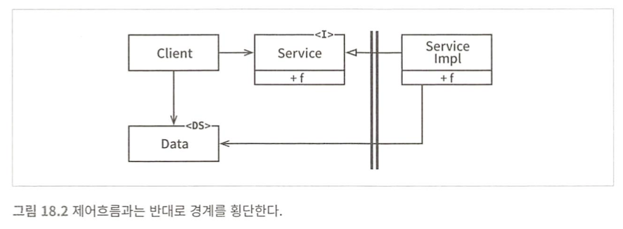

## 경계 해부학

시스템 아키텍처는 소프트웨어 컴포넌트와 분리하는 경계에 의해 정의된다.

### 경계 횡단하기

런타임에 경계를 횡단한다 함은 그저 경계 한쪽에 있는 기능에서 반대편 기능을 호출하여 데이터를 전달하는 일에 불과하다.

적저한 위치에서 경계를 횡단하게 하는 비결은 소스 코드 의존성 관리에 있다.

소스 코드 모듈 하나가 변경되면, 이에 의존하는 다른 소스 코드 모듈도 변경하거나, 다시 컴파일 해서 새로 배포해야 할지도 모르기 때문이다. 경계는 이러한 변경이 전파되는 것을 막는 방화벽을 구축하고 관리하는 수단으로써 존재한다.

### 두려운 단일체

(단일체는 컴포넌트 수준으로 분리되지 않으므로, 배포할 때 개별 컴포넌트를 배포하는 대신 커다란 하나의 파일을 배포한다 따라서 경계가 드러나지 않는다.)
-> jar (모놀리식)

아키텍처 경계 중에서 가장 단순하며 가장 흔한 형태는 물리적으로 엄격하게 구분되지 않는 형태다. 이형태에서는 함수와 데이터가 단일 프로세서에서 같은 주소 공간을 공유하며 그저 나름의 규칙에 따라 분리되어 있을 뿐이다. (소스
수준 분리 모드)

이러한 아키텍처는 거의 모든 경우에 특정한 동적 다형성에 의존하여 내부 의존성을 관리한다.

가장 단순한 형태의 경계 횡단은 저수준 클라이언트에서 고수준 서비스로 향하는 함수 호출이다.

ds는 데이터구조를 뜻함

고수준 클라이언트가 저수준 서비스를 호출해야 한다면 동적 다형성을 이용하여 제어흐름과는 반대로 의존성을 역전시킬 수 있다.

제어흐름은 이전과 마찬가지로 왼쪽에서 오른쪽으로 경계를 횡단한다. 하지만 의존성은 모두 오른쪽에서 왼쪽으로 즉 고수준 컴포넌트를 향한다.

정적 링크된 모놀리식 구조의 실행 파일이라도 규칙적인 방식으로 구조를 분리하면 프로젝트를 개발, 데스트, 배포하는 작업에 큰 도움이 된다.

단일체에서 컴포넌트 간 통신은 매우 빠르고 값싸다. 통신은 전형적인 함수 호출에 지나지 않기 때문이다.

### 배포형 컴포넌트

아키텍처의 경계가 물리적으로 드러날 수도 있는데 그중 단순한 형태는 동적 링크 라이브러리이다. ex. 자바-jar

컴포넌트를 이 형태로 배포하면 따로 컴파일 하지 않고 곧바로 사용할 수 있다.이는 배포 수준 결합 분리 모드에 해당한다.

배포 수준의 컴포넌트는 단일체와 동일하다. 일반적으로 모든 함수가 동일한 프로세서와 주소 공간에 위치하며 컴포넌트를 분리하거나 컴포넌트간 의존성을 관리하는 전략도 단일체와 동일하다.

### 로컬 프로세스

강한 물리적 형태를 띠는 아키텍처 경계로는 로컬 프로세스가있다. 로컬 프로세스는 주로 명령행이나 그와 유사한 시스템 호출을 통해 생성된다. 각각이 독립된 주소공간에서 실행되며 종종 공유 메모리 파티션을 사용하기도 하지만, 일반적으로 메모리 보호를 통해 프로세스들이 메모리를 공유하지 못하게 한다.

로컬프로세스에서는 고수준 프로세서의 소스코드가 저수준 프로세스의 이름, 물리주소, 레지스트리 조회 키를 절대로 포함해서는 안된다.

저수준 프로세스가 고수준 프로세스의 플러그인이 되도록 만드는 것이 아키텍처의 고나점의 목표라는 사실을 기억하자.

로컬프로세스의 경계를 지나는 통신은 비싼 작업에 속하므로 빈번하게 일어나지 않도록 신중하게 제한하자.

### 서비스

물리적인 형태를 띠는 가장 강력한 경계는 바로 서비스다.

서비스는 프로세스로 일반적으로 명령행 또는 그와 동등한 시스템 호출을 통해 구동된다. 서비스는 자신의 물리적 위치에 구애받지 않는다.

서비스들은 모든 통신이 네트워크를 통해 이뤄진다고 가정한다. 함수호출에 비하면 매우 느리다. 가능하다면 빈번하게 통신하는 일을 피해야 한다.

저수준 서비스는 반드시 고수준 서비스에 플러그인되어야 한다.
고수준 서비스의 소스 코드에는 저수준 서비스를 특정 짓는 어떤 물리적인 정보도 절대 포함해서는 안된다.
