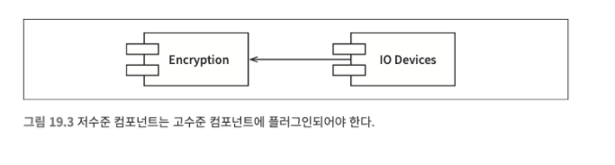

## 정책과 수준

소프트웨어 시스템이란 정책을 기술한 것이다. 대다수의 주요 시스템에서 하나의 정책은 이 정책을 서술하는 여러 개의 조그만 정책들로 쪼갤 수 있다.

소프트웨어 아키텍처를 개발하는기술에는 이러한 정책을 신중하게 분리하고, 정책이 변경되는 양상에 따라 정책을 재편성하는 일도 포함된다.

동일한 이유로 동일한 시점에 변경되는 정책은 동일한 수준에 위치하며, 동일한 컴포넌트에 속해야 한다.

아키텍처 개발은 재편성된 컴포넌트들을 비순향 방향 그래프로 구성하는 기술을 포함된다. 그래프에서 정점은 동일한 수준의 정책을 포함하는 컴포넌트에 해당

방향이 있는 간선은 컴포넌트 사이의 의존성을 나타낸다. 간선은 다른 수준에 위치한 컴포넌트를 서로 연결한다.

좋은 아키텍처라면 각 컴포넌트를 연결할 때 의존성의 방향이 컴포넌트의 수준을 기반으로 연결되도록 만들어야 한다. 즉 저수준 컴포넌트가 고수준 컴포넌트에 의존하도록 만들어야 한다.

### 수준

수준을 엄밀하게 정의하자면 입력과 출력까지의 거리다. 시스템의 입력과 출력으로부터 멀리 위치할수록 정책의 수준은 높아진다. 입력과 출력을 다루는 정책이라면 시스템에서 최하위 수준에 위치한다.

```c
//잘못된 아키텍처
function encrypt(){
  while(true){
    writeChar(translate(readChar()));
  }
}
```

고수준인 encrypt함수가 저수준이 readChar와 writeChar함수에 의존하기에 잘못된 아키텍처


잘못된 아키텍처를 개선한 이미지(인터페이스는 Encrypt컴포넌트에 속함 17장 참고) Encyrpt는 console을 알지 못하니까..?

경계로 묶인 영역이 이 시스템에서 최고 수준의 구성요소다.

고수준의 암호화 정책을 저수준의 입력/출력 정책으로부터 분리시킨 방식 덕분에 암호화 정책을 더 넓은 맥락에서 사용할 수 있다. 입력과 출력에 변화가 생기더라도 암호화 정책은 거의 영향을 받지 않게 됨

정책을 컴포넌트로 묶는 기준은 정책이 변경되는 방식에 달려있다는 사실을 상기하자.
단일책임원칙과 공통폐쇄원칙에 따르면 동일한 이유로 동일한 시점에 변경되는 정책은 함께 묶인다.

고수준 정책, 즉 입력과 출력에서부터 멀리 떨어진 정책은 저수준 정책에 비해 덜 빈번하게 변경되고, 보다 중요한 이유로 변경되는 경향이 있다.(저수준정책 즉 입출력장치는 더 빈번하게 변경되고 중요하지 않은 이유료 변경될 가능성이 높다.)

소스코드 의존성의 방향이 고수준 정책을 향할 수 있도록 정책을 분리했다면 변경의 영향도를 줄일 수 있다.

이논의는 저수준 컴포넌트가 고수준 컴포넌트의 플러그인되어야 한다는 관점으로 바라볼 수 있다.


