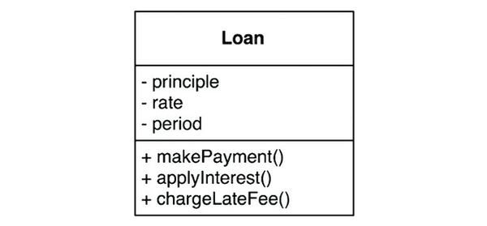

## 업무 규칙

업무규과 플러그인으로 구분하려면 업무 규칙이 실제로 무엇인지를 잘 이해해야만 한다.

업무규칙은 사업적으로 수익을 얻거나 비용을 줄일 수 있는 규칙 또는 절차다.
예로 대출에 n%이자를 부과한다는 사실은 은행이 돈을 버는 업무규칙이고 이러한 규칙을 핵심 업무 규칙이라고 부를 것이다.

이들 규칙은 사업 자체에 핵심적이며, 규칙을 자동화하는 시스템에 없더라도 업무 규칙은 그대로 존재한다.

핵심 업무 규칙은 데이터를 요구하며 이러한 데이터를 핵심 업무 데이터라고 부르겠다.(ex. 이자율, 지급일정)

핵심 규칙과 핵심 데이터는 본질적으로 결합되어 있기 때문에 객체로 만들 좋은 후보가 된다. 이러한 유형의 객체를 엔티티라고하겠다.

### 엔티티

엔티티는 핵심 업무 데이터를 기반으로 동작하는 일련의 조그만 핵심 업무 규칙을 구체화한다. 엔티티 객체는 핵심 업무 데이터를 직접 포함하거나 핵심 업무 데이터에 매우 쉽게 접근할 수 있다.

엔티티의 인터페이스는 핵심 업무 데이터를 기반으로 동작하는 핵심 업무 규칙을 구현한 함수들로 구성된다.

Loan 엔티티는 세 가지의 핵심 업무 데이터를 포함하며, 데이터와 관련된 세 가지 핵심 업무 규칙을 인터페이스로 제공한다(도메인의 일종이?)

이 클래스(엔티티, 도메인)는 데이터베이스, 사용자 인터페이스, 서드파티 프레임워크에 대한 고려사항들로 인해 오염되어서는 절대 안 된다. 이 클래스는 어떤 시스템에서도 업무를 수행할 수 있으며, 시스템의 표현 방식과도 무관하다.

### 유스케이스

모든 업무 규칙이 엔티티처럼 순수한 것은 아니다. 자동화된 시스템이 동작하는 방법을 정의하고 제약함으로써 수익을 얻거나 비용을 줄이는 업무 규칙도 존재한다.

이러한 규칙은 자동화된 시스템의 요소로 존재해야만 의미가 있으므로 수동 환경에서는 사용될 수 없다.

유스케이스는 자동화된 시스템이 사용되는 방법을 설명한다. 유스케이스는 사용자가 제공해야 하는 입력, 사용자에게 보여줄 출력, 그리고 해당 출력을 생성하기 위한 처리 단계를 기술한다.

엔티티 내의 핵심 업무 규칙과는 반대로 유스케이스는 애플리케이션에 특화된 업무 규칙을 설명한다.

유스케이스 예제

언급된 Customer 엔티티에 대한참조이며, 은행과 고객의 관계를 결정짓는 핵심 업무 규칙은 Customer엔티티에 포함된다.

유스케이스는 엔티티 내부의 핵심 업무 규칙을 어떻게, 그리고 언제 호출할지를 명시하는 규칙을 담는다.

유스케이스는 사용자 인터페이스를 기술하지 않는다. 애플리케이션에 특화된 규칙을 설명하며, 이를 통해 사용자와 엔티티 사이의 상호작용을 규정한다. 시스템에서 데이터가 들어오고 나가는 방식은 유스케이스와 무관하다.

유스케이스는 객체다. 유스케이스는 애플리케이션에 특화된 업무 규칙을 구현하는하나 이상의 함수를 제공한다. 또한 유스케이스는 입력 데이터, 출력 데이터, 유스케이스가 상호작용하는 엔티티에 대한 참조 데이터 등의 데이터 요소를 포함한다.

엔티티는 자신을 제어하는 유스케이스에 대해 아무것도 알지 못한다. 엔티티와 같은 고수준 개념은 유스케이스(입출력에 더 가까움)와 같은 저수준 개념에 대해 아무것도 알지 못한다.

유스케이스는 엔티티에 의존하지만 엔티티는 유스케이스에 의존하지 않는다.

### 요청 및 응답 모델

유스케이스는 입력데이터를 받아서 출력 데이터를 생성한다. 그런데 재대로 구성된 유스케이스 객체라면 데이터를 사용자나 또 다른 컴포넌트와 주고 받는 방식에 대해서는 전혀 눈치챌 수 없어야 한다.

유스케이스는 단순한 요청 데이터 구조를 입력으로 받아들이고, 단순한 응답 데이터 구조를 출력으로 반환한다.

요청 및 응답 모델이 독립적이지 않다면 그 모델에 의존하는 유스케이스도 결국 해당 모델이 수반하는 의존성에 간접적으로 결합되어 버린다.

---

업무 규칙은 사용자 인터페이스나 데이터베이스와 같은 저수준의 관심사로 인해 오염되어서는 안 되며, 원래 그대로의 모습으로 남아 있어야 한다.

이상적으로는 업무 규칙을 표현하는 코드는 반드시 시스템의 심장부에 위치해야 하며, 덜 중요한 코드는 이 심장부에 플러그인 되어야 한다. 업무 규칙은 시스템에서 가장 독립적이며 가장 많이 재사용할 수 있는 코드여야 한다.
