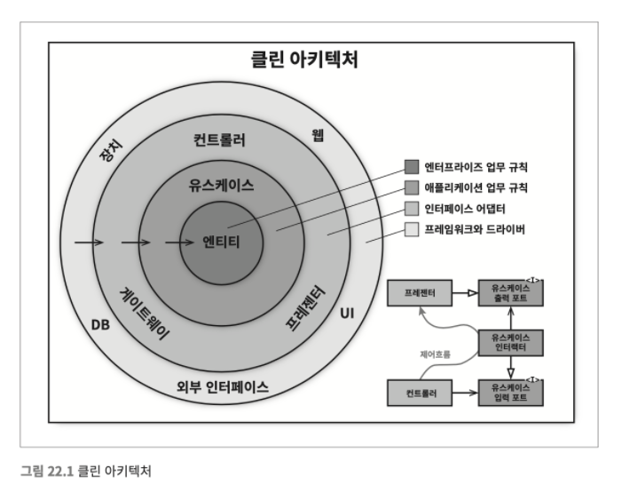
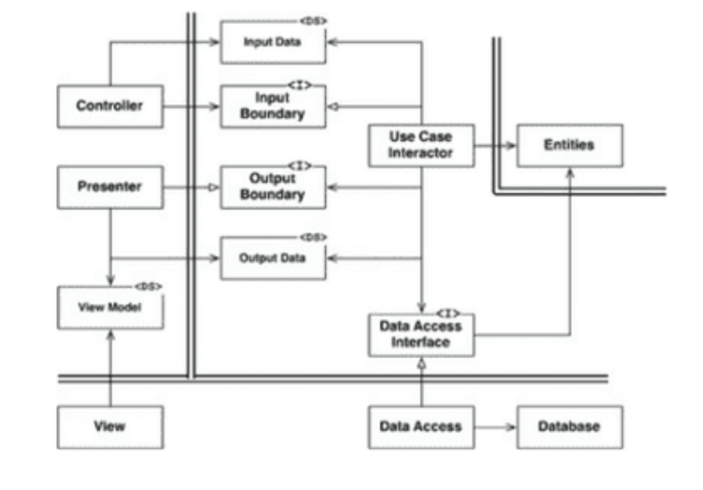

## 클린 아키텍처

여러 시스템 아키텍처 아이디어

-   육각형(헥사고날) 아키텍처 : 포트와 어댑터 라고도 알려졌으며, 앨리스터 코오번이 개발했다. 그리고 스티브 프리먼과 냇 프라이스가 그들의 훌룡한 저서인 테스트 주도 개발로 배우는 객체 지향 설계와 실천에서 차용했다.

-   DCL(Data, Context and Interaction): 제임스 코플리언과 트리그베 린스크주가 만들었다.

-   BCE(Boundary-Conrtol-Entity) : 이바 야콥슨이 자신의 저서인 (Object Oriented Software Engineering)에서 소개했다.

이들 아키텍처는 모두 세부적인 면에서는 다소 차이가 있더라도 그 내용은 상당히 비슷하다. 이들의 목표는 바로 관심사의 분리다.

모두 소프트웨어를 계층으로 분리함으로써 관심사의 분리라는 목표를 달성할 수 있었다.

각 아키텍처는 최소한 업무 규칙을 위한 계층하나와, 사용자와 시스템 인터페이스를 위한 또 다른 계층 하나를 반드시 포함한다.

아키텍처는 다음과 같은 특징을 지니도록 만든다.

-   프레임워크 독립성 : 아키텍처는 프레임워크의 존재 여부에 의존하지 않는다. 이를통해 여러 프레임워크를 도구로 사용할 수 있다.

-   테스트 용이성 : 업무 규칙은 UI, 데이터베이스, 웹서버, 또는 여타 외부 요소가 없이도 테스트 할 수 있다.

-   UI독립성 : 시스템의 나머지 부분을 변경하지 않고도 UI를 쉽게 변경할 수 있다. 예를 들어 업무 규칙을 변경하지 않은 채 웹 UI를 콘솔 UI로 대체할 수 있다.

-   DB독립성 : 업무 규칙은 db에 결합되지 않는다 다른db로 교체 가능

-   모든 외부 에이전시에 대한 독립성 : 실제로 업무 규칙은 외부 세계와의 인터페이스에 대해 전혀 알지 못한다.

### 의존성 규칙

위 이미지에서 각각의 동심원은 소프트웨어에서 서도 다른 영역을 표현한다. 보통 안으로 들어갈수록 고수준의 소프트웨어가 된다.

바깥쪽 원은 매커니즘이고 안쪽원은 정책이다.

이러한 아키텍처가 동작하도록 하는 가장 중요한 규칙은 의존성 규칙이다.

소스 코드 의존성은 반드시 안쪽으로, 고수준의 정책을 향해야 한다.

내부의 원에 속한 요소는 외부의 원에 속한 어떤 것도 알지 못한다. 특히 배우의 원에 속한 코드는 외부의 원에 선언된 어떤 것에 대해서도 그 이름을 언급해서는 절대 안된다. 여기에는 함수, 클래스, 변수, 그리고 소프트웨어 엔티티로 명명되는 모든 것이 포함된다.

같은 이유로 외부의 원에 선언된 데이터 형식도 내부의 원에서 절대로 사용해서는 안된다. 특히 그 데이터 형식이 위부의 원에 있는 프레임워크가 생성한 것이라면 더더욱 사용해서는 안된다. 외부 원에 위치한 어떤 것도 내부의 원에 영향을 주지 않기를 바란다.
(DTO도 사용해서는 안되는가)

### 엔티티

엔티티는 전사적인 핵심 업무 규칙을 캡슐화한다. 엔티티는 메서드를 가지는 객체이거나일련의 데이터 구조와 함수의 집합일 수도 있다. 엔티티를 재사용할 수만 있다면, 그 형태는 그다지 중요하지 않다.

운영 관점에서 특정 애플리케이션에 무언가 변경이 필요하더라도
엔티티 계층에는 절대로 영향을 주어서는 안 된다.

### 유스케이스

유스케이스 계층의 소프트웨어는 애플리케이션에 특화된 업무 규칙을 포함한다.

유스케이스는 엔티티로 들어오고 나가는 데이터흐름을 조정하며,(서비스 계층인가.?) 엔티티가 자신의 핵심 업무 규칙을 사용해서 유스케이스의 목적을 달성하도록 이끈다.

이 계층에서 발생한 변경이 엔티티에 영향을 줘서는 안된다. 또한 DB, UI 또는 프레임워크와 같은 외부 요소에서 발생한 변경이 이 계층에 영향을 줘서도 안 된다. 유스케이스 계층은 이러한 관심사로부터 격리되어있다.

하지만 운영관점에서 애플리케이션이 변경된다면 유스케이스가 영향을 받으며 이 계층의 소프트웨어에도 영향을 줄 것이다.

### 인터페이스 어댑터

인터페이스 어댑처 계층은 일련의 어탭터들로 구성된다. 어댑터는 데이터를 유스케이스와 엔티티에게 가장 편리한 형식에서 데이터베이스나 웹같은 외부 에이전시에게 가장 편리한 형식으로 변환한다.

이계층은 예로 GUI의 mvc아키텍처를 모두 포괄한다. 프레젠터, 뷰, 컨트롤러는 모두 인터페이스 어댑터 계층에 속한다.

모델은 그저 데이터 구조에 지나지 않으며 컨트롤러에서 유스케이스로 전달되고, 다시 유스케이스에서 프레젠터와 뷰로 되돌아 간다.

이계층은 데이터를 엔티티와 유스케이스에게 가장 편리한 형식에서 영속성용으로 사용중인 임의의 프레임워크(DB)가 가장 이용하기에 편리한 형식으로 변환한다.

이 원 안에 속한 어떤 코드도 데이터베이스에 대해 조금도 알아서는 안 된다. 예컨데 SQL 기반의 데이터베이스를 사용한다면 모든 SQL은 이 계층을 벗어나서는 안 된다. 이 계층에서도 데이터 베이스를 담당하는 부분으로 제한되어야 한다.

이계층에는 데이터를 외부 서비스와 같은 외부형식에서 유스케이스나 엔티티에서 사용되는 내부적인 형식으로 변환하는 또 다른 어댑가 필요하다.

### 프레임워크와 드라이버

가장 바깥쪽 계층은 일반적으로 데이터베이스나 웹 프레임워크같은 프레임워크나 도구들로 구성된다.

이계층에는 안쪽원과 통신하기 위한 접합 코드 외에는 특별히 더 작성해야 할 코드가 그다지 많지 않다.

프레임워크와 드라이버 계층은 모든 세부사항이 위치하는 곳이다. 웹과 DB는 세부사항이다. 모두 외부에 위치시켜 피해를 최소화 하자.

### 원은 4개여야만 하나

사진은 예시일뿐 더 많은 원이 필요할 수도 있다.
하지만 의존성 규칙을 적용된다. 소스코드 의존성은 항상 안쪽을 향한다. 안쪽으로 이동할수록 추상화와 정책의 수준은 높아진다. 가장 바깥쪽 원은 저수준의 구체적인 세부사항으로 구성된다.

### 경계 횡단하기, 경계를 횡단하는 데이터

제어흐름과 의존성의 방향이 명백히 반대여야 하는 경우는 의존성 역전 원칙을 사용하여 해결한다. 제어흐름이 경계를 가로지르는 바로 그 지점에서 소스 코드 의존성을 제어흐름과는 반대가 되게 만들 수 있다.(별다른 조치가 없으면 안쪽 원의 코드가 바깥쪽 원의 코드를 호출하게됨 -> 의존성 역전 원칙 사용)

유스케이스에서 프레젠터를 호출해야 할때 직접 호출하면 의존성 규칙 위배하기 때문에 유스케이스가 내부 원의 인터페이스를 호출하도록 하고 외부 원의 프레젠터가 그 인터페이스를 구현하도록 만든다.

경계를 가로지르는 데이터는 흔히 간단한 데이터 구조로 이루어져 있다. 기본적인 구조체 or DTO or HashMap or Object로 구성할 수 있다.

엔티티 객체나 DB의 행을 전달하는 일은 원치 않는다.

-   웹은 컨트롤러로 입력데이터를 보낸다

-   컨트롤러는 데이터를 POJO로 묶은 후 InputBoundary 인터페이스를 통해 UseCaseInteractor로 전달한다.

-   UseCaseInteractor는 이 데이터를 해석해서 엔티티가 어떻게 춤출지 제어하는데 사용한다.(엔티티가 사용할 데이터도 DB에서 불러옴)

-   UseCaseInteractor는 엔티티로부터 데이터를 모아서 또 다른 POJO인 OutPutData를 구성한다

-   Presenter가 하는일은 OutputData를 viewModel과 같이 화면에 출력할 수 있는 형태로 재구성하는 일이다.(viewModel 도 POJO)

-   Presenter는 ViewModel을 로드할 때 사용하가 보기에 적절한 형식으로 변환한다.

-   ViewModel 에서 HTML페이지로 데이터를 옮기는 일을 빼면, view에서 해야 할 일은 거의 남아 있지 않다.

모든 의존성은 경계선을 안쪽으로 가로지른다.

---

소프트웨어를 계층으로 분리하고 의존성 규칙을 준수한다면 본직절으로 테스트 하기 쉬운 시스템을 만들게 된다.
