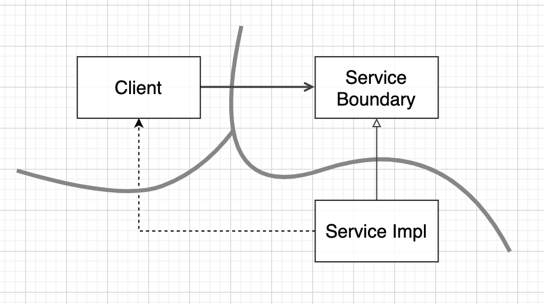
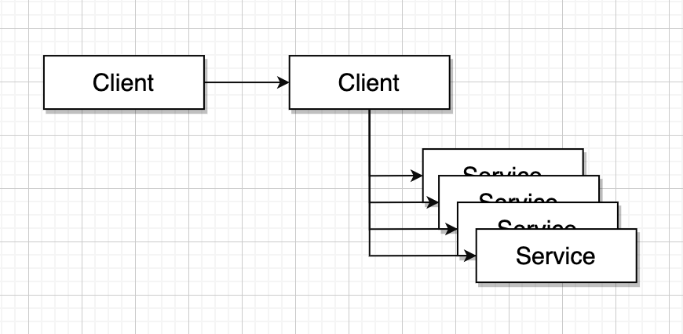

## 부분적 경계

아키텍처 경계를 완벽하게 완벽하게 만드는 데는 비용이 많이 든다. 쌍방향의 다형적 Boundary 인터페이스, Input과 Output을 위한 데이터 구조를 만들어야 할 뿐만 아니라, 두 영역을 독립적으로 컴파일하고 배포할 수 있는 컴포넌트로 격리하는 데 필요한 모든 의존성을 관리해야 한다.

뛰어난 아키텍트 라면 이러한 경계를 만드는 비용이 크지만 나중에 필요할 수도 있으므로 경계에 필요한 공간을 확보하기 원할 수도 있다. 그렇다면 부분적 경계를 구현해볼 수 있다.

### 마지막 단계를 건너뛰기

부분적 경계를 생성하는 방법 하나는 독립적으로 컴파일하고 배포할 수 있는 컴포넌트를 만들기 위한 작업은 모두 수행한 후, 단일 컴포넌트에 그래도 모아만 두는 것이다.

쌍방향 인터페이스도 그 컴포넌트에 있고, 입력 출력 데이터 구조도 거기에 있다. 이 모두를 단일 컴포넌트로 컴파일해서 배포한다.

부분적 경계를 만들려면 완벽한 경계르르 만들 때 만큼의 코드량과 사전 설계가 필요하다. 하지만 다수의 컴포넌트를 관리하는 작업은 하지 않아도 된다. (버전, 배포관리 이런거)

### 일차원 경계

완벽한 형태의 아키텍처 경계는 양방향으로 격리된 상태를 유지해야 하므로 쌍방향 Boundary 인터페이스를 사용한다. 양방향으로 격리된 상태를 유지하려면 초기 설정할 떄나 지속적으로 유지할 때도 비용이 많이 든다.

추후 완벽한 형태의 경계로 확장할 수 있는 공간을 확보하기 위한 구조 전략 패턴 사용

ServiceBoundary 인터페이슨느 클라이언트가 사용하며 Impl클래스가 구현한다.

Clinet를 Impl로부터 격리시키는데 필요한 의존성 역전이 이미 적용

쌍방향 인터페이스가 없고 개발자와 아키텍트가 훈련되어 있지 않다면 이 점선과 같은 비밀통로가 생기는 일을 막을 방법이 없다.

### 퍼사드

이보다 훨씬 더 단순한 경계는 퍼사드 패턴

이경우는 의존성 역전 원칙까지도 희생한다. 경계는 퍼사드 클래스로만 간단히 정의된다.

퍼스다 클래스는 모든 서비스 클래스를 메서드 형태로 정의하고, 서비스 호출이 발생하면 해당 서비스 클래스로 호출을 전잘한다.

하지만 클라이언트가 이 모든 서비스에 추이 종속을 가지게 된다.

이러한 구조라면 비밀 통로 또한 쉽게 만들 수 있다.
