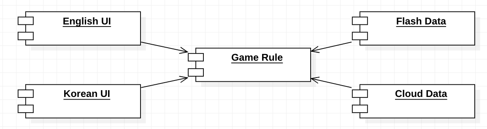
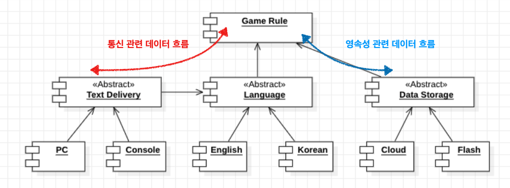
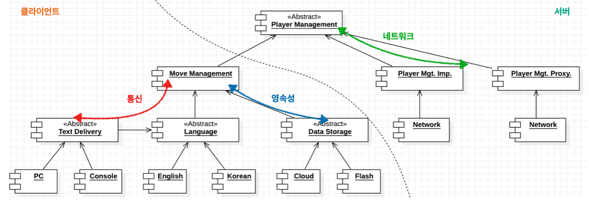

## 계층과 경계

시스템이 세가지(UI, 업무 규첵, DB)로만 구성된다고 생각하기 쉽지만 대다수의 시스템에서 컴포넌트의 개수는 이보다 훨씬 많다.

### 움퍼스 사냥 게임

소스코드 의존성을 적절히 관리하여 게임 규칙을 UI와 Data와 상관없이 재사용 가능

의존성 규칙을 준수하여 적절한 방향을 가리키게 만들어야 한다.

### 클린 아키텍처

사용자로부터 텍스트를 입력받는 매커니즘이 변경될 수 있다면, 위와 같이 Text Delivery라는 API역할을 하는 추상 컴포넌트를 생성할 수 있다. 이 때, API는 구현하는 쪽이 아닌 사용하는 쪽에서 정의한다.

위의 추상 컴포넌트의 경우 다형적 Boudary 인터페이스이며, 인터페이스가 정의하는 API는 의존성 흐름의 상위에 위치한 컴포넌트에 속한다. 실제 구체 컴포넌트의 서비스는 추상 API 컴포넌트가 정의하는 다형적 인터페이스를 통해 제공된다.

또한, 위 구성은 데이터 흐름을 통신과 영속성으로 효과적으로 분리하고 최종 처리는 두 흐름이 모두 거치게 되는 Game Rule 컴포넌트가 된다. (java 주니어 인강 참고)

### 흐름 횡단하고 분리하기

데이터 흐름은 하나 이상일 수 있다.

예제의 간단한 게임을 네트워크에서 실행할 수 있다고 했을 때, 이전의 설계 방식으로는 Game Rule에서 모든 데이터 흐름을 처리하게 되고, 데이터의 흐름이 많아질수록 Game Rule이 처리해야하는 역할을 많아지게 된다.

위의 구성처럼 업무 규칙을 저수준(Move Management), 고수준(Player Management)으로 세분화하면 하나의 컴포넌트에서 처리해야할 데이터 흐름을 줄일 수 있다.

또한, 업무 규칙을 저수준, 고수준으로 분리하는 API를 둠으로써, 저수준 정책은 PC와 같은 클라이언트에서 처리하고 고수준 정책은 서버에서 처리해 마이크로서비스 API 형태로 제공해 완벽한 형태의 아키텍처 경계를 만들 수 있다.

---

경계를 제대로 구현하려면 비용이 많이 든다는 사실을 인지 하지만 경계가 무시되었다면 자우에 다시 추가하는 비용이 크다는 사실도 인지.

하지만 미리 예측해서는 안됨 오버엔지니어링이 언더 엔지니어링보다 나쁠 때가 훨씬 많다.

조짐이 보이면 경께 구현의 비용과 무시했을때의 비용을 가늠해서 잘 구현
