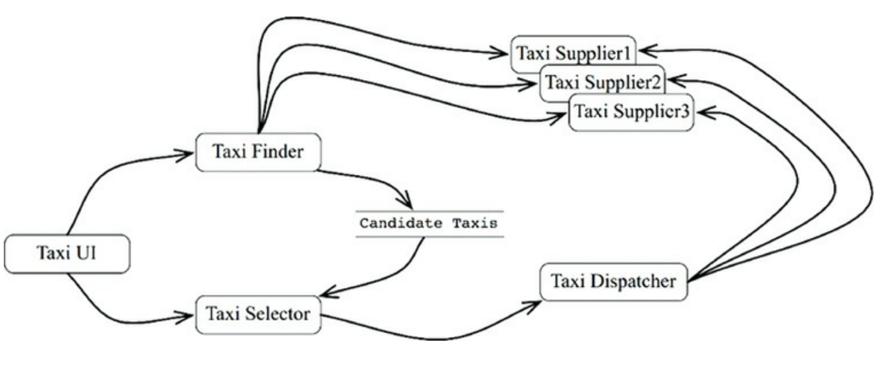
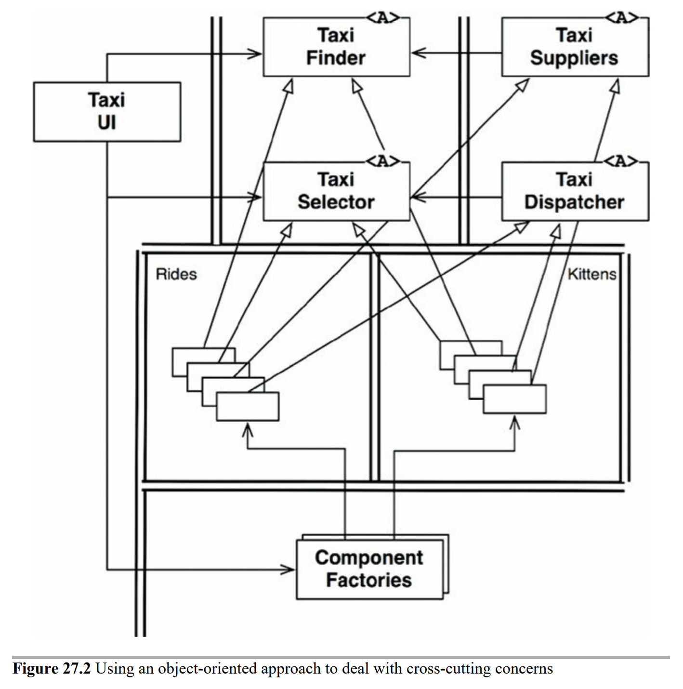
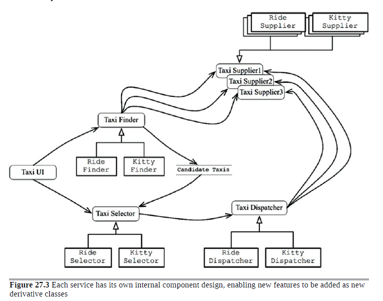
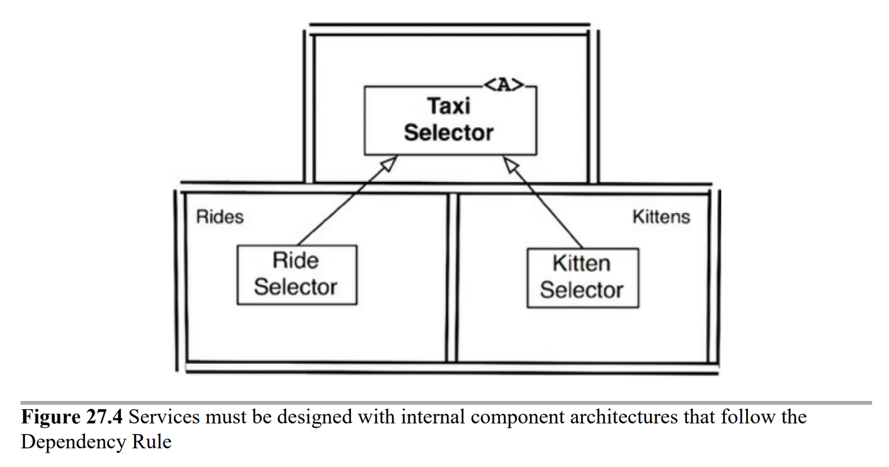

## 크고 작은 모든 서비스들

서비스는 프로세스나 플랫폼 경계를 가로지르는 함수 호출에 지나지 않는다.

서비스 지향 아키텍처와 마이크로서비스 아키텍처가 인기있는 이유

-   서비스를 사용하면 상호 결합이 철저하게 분리되는 것처럼 보인다.

-   서비스를 사용하면 개발과 배포 독립성을 지원하는 것 처럼 보인다.

위 두 이유는 일부만 맞는말

### 서비스 아키텍처

서비스를 사용한다는 것은 본질적으로 아키텍처에 해당하지 않는다.

시스템 아키텍처는 의존성규칙을 준수하며 고수준의 정책을 저수준의 세부사항으로부터 분리하는 경계에 의해 정의된다.

기능을 프로세스나 플랫폼에 독립적이 되게끔 서비스들을 생성하면 의존성 규칙 준수 여부와 상관없이 큰 도움이 된다.

### 서비스 이점?

-   결합 분리의 오류 : 시스템을 서비스들로 분리하면 서비스사 사이의 결합이 확실히 분리된다.

    -   하지만 프로세스 or 네트워크상의 공유 자원 때문에 결합될 가능성이 여전히 존재한다.(서비스 사이를 오가는 데이터 레코드에 새로운 필드를 추가해야 한다면? 둘 서비스 다 수정해야함) 아마 API수정하면 API사용하는 서비스들도 다 수정해야 하니까.

-   개발 및 배포 독립성의 오류 : 데브옵스의 이점이 있다.
    -   대규모 엔터프라이즈 시스템은 서비스 기반 시스템 외에도 모놀리식 시스템이나 컴포넌트 기반 시스템으로도 구축할 수 있다 유일한 방식이 아님
    -   결합 분리의 오류에 따르면 서비스라고 항상 독립적인 게 아님 데이터나 행위에서 어느정도 결합되어 있다면 결합된 정보에 맞게 개발, 배포, 운영을 조정해야 한다.

### 야옹이 문제

두가지 오류의 예
택시 토합 시스템 : 해당 도시에서 운영되는 많은 택시 업체를 알고 있고, 고객은 승차 요청을 할 수 있다.

고객은 여러 기준으로 택시를 선택할 수 있다.

-   여기서 야옹이를 배달하는 서비스를 제공하겠다는 계획을 세운다.
-   사용자는 집이나 사무실로 야옹이를 배달해 달라고 주문할 수 있다.
-   회사는 도시 전역에 야옹이를 태울 다수의 승차 지점을 설정해야 한다.
-   야옹이 배달 주문이 오면, 근처에 택시가 선택되고 승차 지점 중 한곳에서 야옹이를 태운 후 올바른 주소로 배달한다.
-   참여하는 택시업체도 있고 거부하는 업체도 있다
-   어떤 운전자는 고양이 알러지가 있을 수 있기에 제외되어야 한다.
-   택시 승객역시 알러지가 있다면 3일 사이 야옹이를 배달했단 차량은 배차되지 않아야 한다.

이기능을 구현하려면 이들 서비스 전부를 수정해야한다. 이 서비스들은 모두 결합되어 있어서 독립적으로 개발하고 유지될 수 없다. 횡단 관심사가 가지는 문제들

-   횡단 관심사 : 관심사가 여러 객체에 흩어져있는 기능, 관심들

### 객체가 구출하다.

SOLID 설계 원칙을 잘 들여다 보면 다형적으로 확장할 수 있는 클래스 집합을 생성해 새로운 기능을 처리하도록 함을 알 수 있다.

객체 지향 방식으로 횡단 관심사를 처리하기
이 다이어그램의 클래스들은 앞의 서비스와 거의 일치한다 하지만 경계와 의존성 규칙 준수 여부가 다르다.

원래 서비스의 로직 중 대다수가 이 객체 모델의 기반 클래스들 내부로 녹아들었다. 배차에 특화된 로직은 Rides 컴포넌트로 야옹이 로직은 Kittens 컴포넌트로 들어갔다.

이 두 컴포넌트는 기존 컴포넌트들에 있는 추상 기반 클래스를 템플리메서드전략 패턴 등을 이용해서 오버라이드 한다.

두가지 컴포넌트는 의존성 규칙을 준수한다.

이 기능들을 구현하는 클래스들은 UI의 제어하에 팩토리가 생성한다.

이전략을 따르더라도 UI는 어쩔 수 없이 변경해야한다. 하지만 그 외의 것들은 변경할 필요가 없다 대신 야옹이 기능을 구현한 새로운 파일들을 시스템에 추가하고 런타임에 동적으로 로드하면 된다.

최종적으로 야옹이 기능은 결합이 분리되며, 독립적으로 개발하여 배포할 수 있다.

### 컴포넌트 기반 서비스

서비스는 SOLID 원칙대로 설계할 수 있으며 컴포넌트 구조를 갖출 수도 있다. 이를 통해 서비스 내의 기존 컴포넌트들을 변경하지 않고도 새로운 컴포넌트를 추가할 수 있다.

각 서비스의 내부는 각자의 방식대로 컴포넌트를 설계할 수 있으며, 파생 클래스를만들어서 신규 기능을 추가할 수 있다.

서비스의 존재는 이전과 달라진게 없지만. 각 서비스의 내부는 자신만의 컴포넌트 설계로 되어 있어 파생 클래스를 만드는 방식으로 신규 기능을 추가할 수 있다. 파생 클래스들은 각자의 컴포넌트 내부에 놓인다.

### 횡단 관심사

아키텍처 경계는 서비스 사이에 있지 않다. 오히려 서비스를 관통하며 서비스를 컴포넌트 단위로 분할한다.

모든 주요 시스템이 직면하는 횡단 관심사를 처리하려면 서비스 내부는 의존성 규칙도 준수하는 컴포넌트 아키텍처로 설계해야 한다.

이서비스들은 시스템의 아키텍처 경계를 정의하지 않는다. 경계를 정의하는것은 서비스 내에 위치한 컴포넌트다.

---

서비스는 시스템의 확장성과 개발 가능성 측면에서 유용하지만. 그자체로 아키텍처적으로 중요한 요소는 아니다.

시스템의 아키텍처는 시스템 내부에 그어진 경계와 경계를 넘나드는 의존성에 의해 정의된다. 시스템의 구성 요소가 통신하고 실행되는 물리적인 메커니즘에 의해 아키텍처가 정의되는 것이 아니다.
