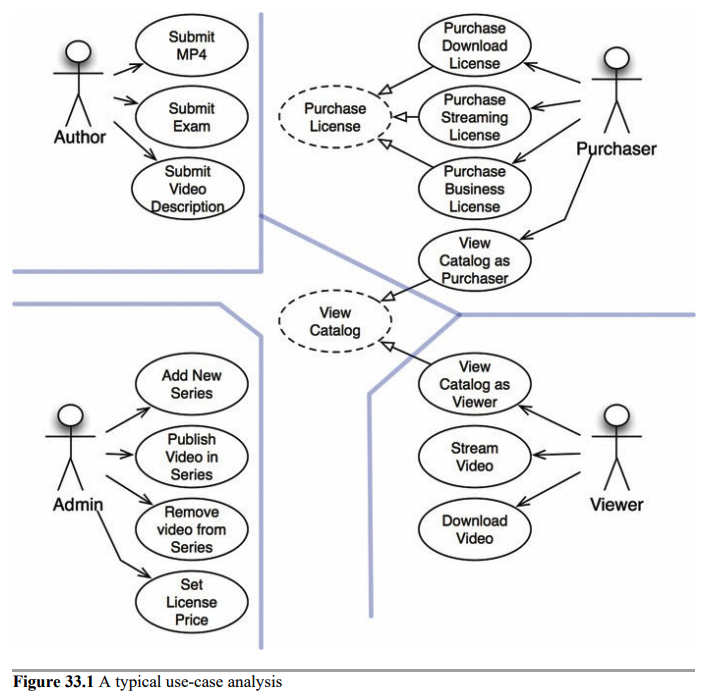
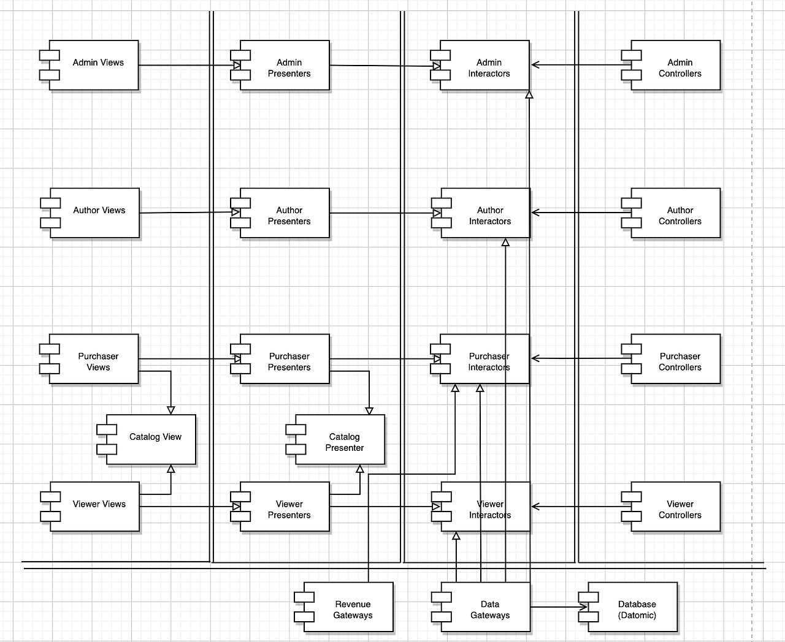

## 사례 연구 : 비디오 판매

### 제품

웹사이트에서 비디오를 판매하는 소프트웨어다.

-   판매하길 원하는 비디오들이 있다.
-   그걸 개인과 기업에게 웹을통해 판매한다.
-   개인은 단품 가격을 지불해 스트리밍으로 보거나, 높은 가격을 지불해 다운로드해서 영구소장한다.
-   기업용 라이선스는 스트리밍 전용이며 대량 구매를 하면 할인을 할 수 있다.

-   일반적으로 개인은 시청자인 동시에 구매자다, 반면 기업은 다른 사람들이 시청할 비디오를 구매하는 사람이 따로 있다.
-   비디오 제작자는 비디오 파일과 비디오에 대한 설명서, 부속 파일을 제공해야한다. 부속 파일에는 시험, 문제, 해법, 소스코드 등이 포함된다.
-   관리자는 신규 비디오 시리즈 물을 추가하거나 기존 시리물에 비디오를 추가 또는 삭제하며, 다양한 라이선스에 맞춰 가격을 책정한다.

#### 시스템의 초기 아키틱처를 결정하는 첫 단계는 액터와 유스케이스를 식별하는 일이다.

#### 유스케이스 분석

전형적인 유스케이스 분석

네 개의 주요 액터는 분명하다. 단일 책인 원칙에 따르면 이들 네 액터가 시스템이 변경되어야할 네 가지 주요 근원이 된다.

신규 기능을 추가하거나 기존 기능을 변경해야 한다면 액터 중 하나에게 해당 기능을 제공하기 위해서다.

따라서 우리는 시스템을 분할하여, 특정 액터를 위한 변경이 나머지 액터에게는 전혀 영향을 미치지 않게 만들고자 한다.

위이미지의 유스케이스는 완벽하지 않다. ex. 로그인이나 로그아웃 관련 유스케이스가 없음 없는 이유는 책에 단순하게 표시하기 위해서

점선으로된 유스케이스는 추상유스케이스로 범용적인 정책을 담고 있으며, 다른 유스케이스에서 이를 더 구체화 한다.

시청자 입장에서의 카탈로그 조회와 구매자 입장에서의 카탈로그 조회하기는 추상 카탈로그 조회를 상속받는다.

### 컴포넌트 아키텍처

액터와 유스케이스를 식별했으므로 예비 단계의 컴포넌트 아키텍처를 만들어 본다.

-   이중선 - 아키텍처 경계
-   뷰, 프레젠터, 인터랙터, 컨트롤러로 분리된 전형적 분할 방법
    대응하는 액터에 따라 카테고리 분리
-   각 컴포넌트는 단일 .jar 또는 단일 .dll 에 해당
-   Catalog View, Catalog Presenter : 카탈로그 조회라는 추상 유스케이스를 처리. 추상 클래스로 코드화
-   각 컴포넌트를 독립적으로 컴파일하고 빌드 할 수 있는 환경 구성 시 추후 시스템 변경 양상에 따라 배포 방식 조정 가능

### 의존성 관리

제어흐름은 오른쪽에서 왼쪽으로 이동한다 입력이 컨트롤러에서 발생하면 인터랙터에 의해 처리되어 결과가 만들어진다. 그런 후 프레젠터가 결과의 포맷을 변경하고 뷰가 화면에 표시한다.

단 모든 화살표가 오른쪽에서 왼쪽을 가르키진 않는다. 대다수는 왼쪽에서 오른쪽을 향한다 의존성 규칙을 준수하기 때문에.

모든 의존성은 경계선을 한 방향으로만 가로지르는데 항상 더 높은 수준의 정책을 포함하는 컴포넌트를 향한다.

사용관계(열린화살표)는 제어흐름과는 같은방향을 가르킨다.
상속관계(닫힌 화살표)는 제어흐름과는 반대방향을 가르킨다. 이는 개방 폐쇄 원칙을 적용했음을 보여준다.

---

2번째 이미지의 다이어그램은 단일책임원칙에 의한 액터의 분리, 의존성 규칙을 이용해 분리함.

이런 방식으로 코드를 구조화 하게 되면, 추후 시스템 배포 방식을 다양하게 선택할 수 있고, 변경이 쉬워진다.
