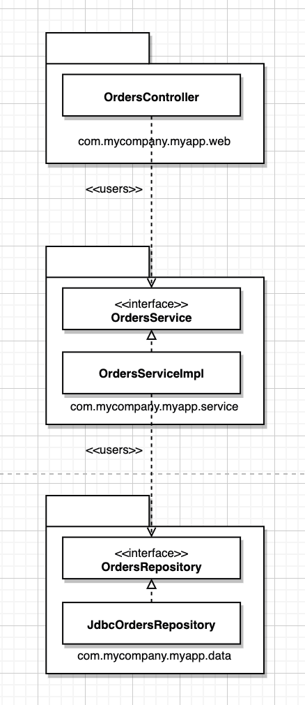
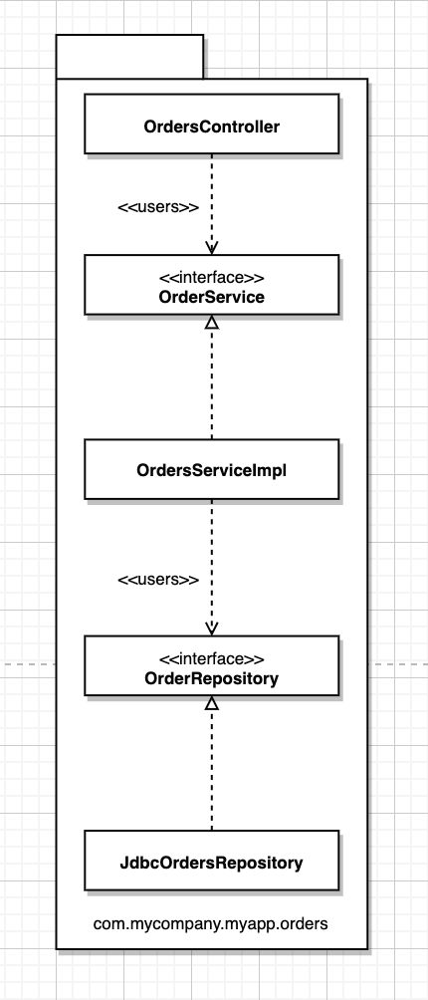
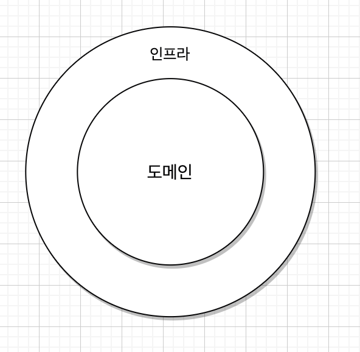
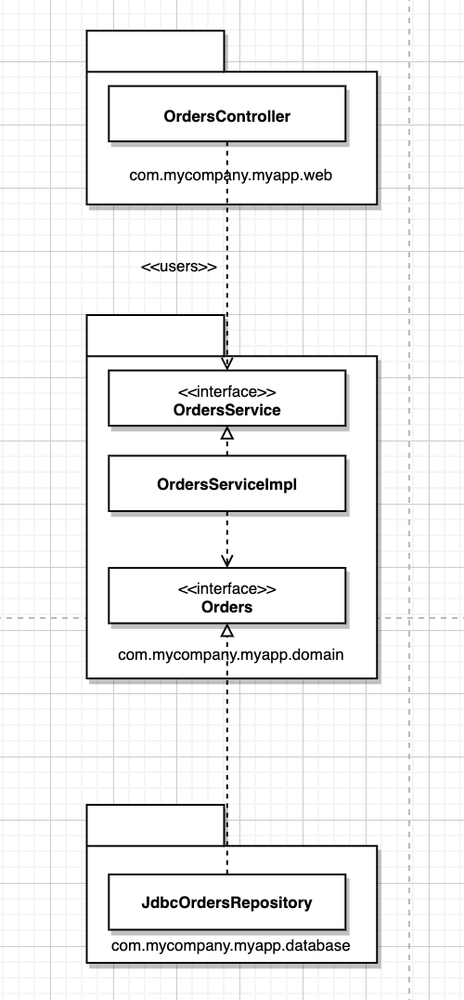
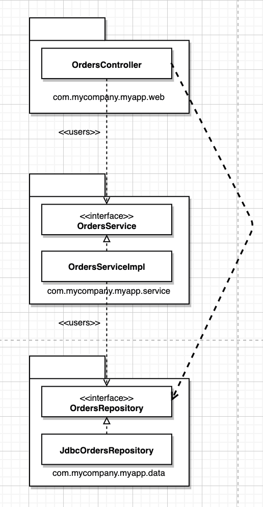
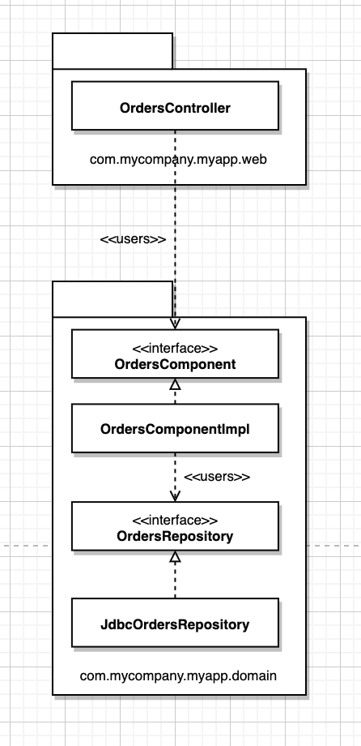
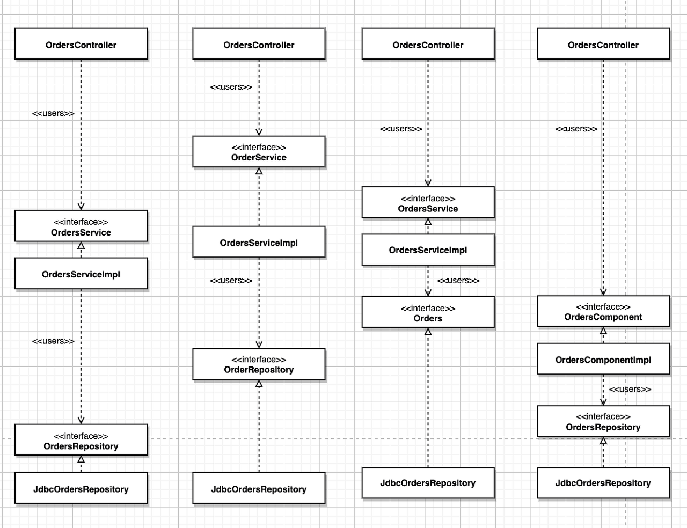
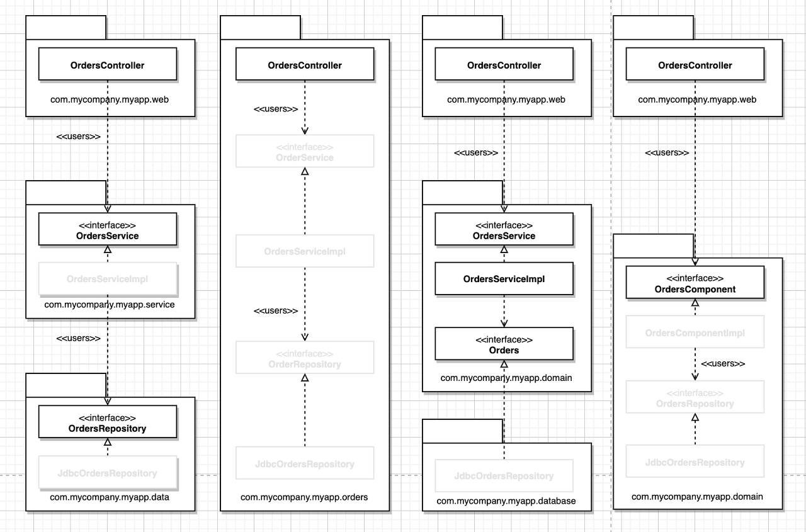

## 빠져 있는 장

온라인 서점을 구축하고 있으며 고객이 주문상태를 조회할 수 있어야한다는 유스케이스를 구현할 때 클린아키텍처를 제쳐 놓고, 설계나 코드 조직화와 관련된 몇가지 접근법

패키지명 주목

### 계층 기반 패키지

전형적인 3계층 아키텍처

웹, 업무 규칙, 영속성 코드를 위한 계층이 하나씩 존재한다.
엄격한 계층형 아키텍처의 경우 계층은 반드시 바로 아래 계층에만 의존해야 한다. 계층 사이의 의존성은 항상 아래로 향한다.

초반에 접하기 쉬움 단 소프트웨어가 커지고 복잡해지기 시작하면, 큰 그릇 세 개만으로는 모든 코드를 담기엔 부족하다는 사실을 깨닫고, 더 잘게 모듈화 해야할지를 고민해야함

단점으로는 업무 도메인에 대해 아무것도 말해주지 않는다는 문제 전혀 다른 업무 도메인이라도 코드를 계층형 아키텍처로 만들어서 나란히 놓고 보면, 웹, 서비스, 레포지토리로 구성된 모습이 비슷하게 보인다.

### 기능 기반 패키지

서로 연관된 기능, 도메인 개념, 또는 애그리거트루트(DDD 개념)에 기반하여 수직의 얇은 조각으로 코드를 나누는 방식

등장하는 인터페이스와 클래스는 계층형과 같지만 모두가 단 하나의 패키지에 속함 계층 기반 패키지를 아주 간단히 리팩터링한 형태지만

-   코드의 상위수준 구조가 업무 도메인에 대해 무언가를 알려주게 된다.
-   유스케이스가 변경될 경우 변경해야할 코드를 모두 찾는 작업이 더 쉬워질 수 있다.

수평적 계층화의 문제를 깨닫고 수직적 계층화로 전환하는 경우가 많지만 둘다 차선책

### 포트와 어댑터

포트와 어댑터 or 육각형 아키텍처, 경계, 컨트롤러, 엔티티 등의 방식으로 접근하는 이유는 업무/도메인에 초점을 둔 코드가 프레임워크나 데이터베이스와 같은 세부사항에서 독립적이며 분리된 아키텍처를 만들기 위해서다.

내부 영역은 도메인 개념을 모두 포함하는 반면 외부 영역은 외부 세계(UI,DB..)와의 상호작용을 포함한다 여기서 중요한 점은 외부가 내무에 의존하며, 절대 그 반대로는 안 된다는 점이다.

앞의 유스케이스를 이 방식으로 구현한 모습
도메인 패키지가 내부이며 나머지 패키지는 모두 외부이다.

의존성애 내부를 향햐고 있음

OrderRepository가 Orders라는 간단한 이름으로 바뀐 이유는 도메인 주도 설계라는 세계관에서 비롯된 명명법으로 도메인 주도 설계에서는 내부에 존재하는 모든 것의 이름은 반드시 유비쿼트스 도메인 언어관점에서 기술하라고 조언한다.

즉 도메인에 대해 논의할때 우리는 주문에 대해 말하는 것이지 주문 레포지터리에 대해 말하는 것이 아니다.

이 다이어그램은 인터랙터가 빠졌고, 의존성 경계를 가로질러 데이터를 마샬링하는 객체 등이 누락되었다.

### 컴포넌트 기반 패키지

SOLID, REP, CCP, CRP 그리고 이책의 조언에 대해 전적으로 공감하지만 또 다른 결론에 이르렀다. 또 다른 선택지로 컴포넌트 기반 패키지 라고 부른다.

계층형 아키텍처의 목적은 기능이 같은 코드끼리 서로 분리하는 것,  
코드의 접근성관점에서 controller와 service,Repository인터페이스는 public으로 선언되어야 한다.(다른패키지니까)

엄격한 계층형 아키텍처에서 화살표는 반드시 아래로 향해야 하며, 각 게층은 바로 밑 계층에만 의존해야 한다.

여기서 문제는 속임수를 써서 몇몇 의존성을 의도치 않은 방식으로 추가하더라도 보기에는 여전히 좋은 비순환 의존성 그래프가 생성된다는 사실이다.

Contorller에서 바로 Repository를 사용하는 것

보통 완화된 계층형 아키텍처라고함

경우에 따라는 의도된 방식이기도 함 CQRS(Command Query Responsibility Segregation 변경과 조회를 분리)패턴을 지키려고 시도하는 경우(이경우를 제외한 경우는 바람직하지못함)

이러한 경우를 방지하기 위해서는 원칙이 필요함 컨트롤러는 절대로 레포지토리에 직접 접근해서는 안된다 와 같은 원칙

개인적으로는 컴파일러를 사용해서 아키텍처를 강제하는 방식을 선호하는데 컴포넌트 기반 패키지를 도입해야 하는 이유

컴포넌트 기반 패키지는 큰 단위의 단일 컴포넌트와 관련된 모든 책임을 하나의 패키지로 묶는데 주안점을 둔다.

서비스 중심적인 시각으로 시스템을 바라보며 MSA가 가진 시각과 동일

이접근법에서는 업무 로직과 영속성 관련 코드를 하나로 묶는다.
이 묶음을 컴포넌트라고 부른다.

(컴포넌트는 배포 단위 시스템의 구성요소로 배포할 수 있는 가장 작은 단위 MSA랑 비슷하긴 하네)

작가의 컴포넌트에 대한 생각은 컴포넌트는 멋지고 깔끔한 인터페이스로 감싸진 연관된 기능들의 묶음으로 애플리케이션과 같은 실행환경 내부에 존재한다. -> 소프트웨어 시스템의 정적 구조를 컨테이너, 컴포넌트, 클래스(코드)의 측면에서 계층적으로 생각하는 간단한 방법

이 방법론에서 소프트웨어 시스템은 하나 이상의 컨테이너로 구성되며, 각 컨테이너는 하나 이상의 컴포넌를 포함한다. 각 컴포넌트가 개별 jar파일로 분리될지 여부는 직교적인 관심사다.(변경이 다른 변경에 영향을 미치지 않을때.)

이방법의 이점은 주문과 관련된 무언가를 코딩해야 할때 오직 한 곳, OrdersComponen만 둘러보면 된다는 점이다. 이이점은 MSA나 서비스 지향 아키텍처의 이점과 유사하며 모놀리식에서 잘 정의하면 MSA로 마이그레이션 하기 위한 발판으로 삼을 수 이다.

### 구현 세부사항엔 항상 문제가 있다.

표면상으로는 이 네 가지 접근법이 코드를 조직화하는 완전히 서로 다른 방식처럼 보이며, 따라서 서로 다른 아키텍처 스타일로 여길 수 있다. 하지만 세부사항을 잘못 구현하면 이러한 견해도 아주 빠르게 흐트러진다.

public 작작써라 캡슐화 관련 이점이 없어진다. 아키텍처 스타일이 무너진다.

### 조직화 vs 캡슐화

만약 public으로 모든 타입을 지정한다면 패키지는 단순히 조직화를 위한 매커니즘으로 캡슐화를 위한 매커니즘이 될 수 없다.이러면 아키텍처도 무너짐 경계를 아무나 넘으니까

4개의 아키텍처 접근법이 동일

접근제어자를 사용하여 접근을 제한
진한것만 외부 에서 접근 할 수 있게 연한건 protected로 선언

### 다른 결합 분리 모드

-   자바 OSGI같은 모듈프레임워크 or 자바9의 모듈 등을 사용해서 결합 분리
-   소스코드 수준에서 의존성을 분리 ex. 포트와 어댑터
    -   업무와 도메인용 소스코드(즉, 선택된 기술이나 프레임워크와는 독립적) : OrderService, OrderServiceImpl, Orders
    -   웹용 소스코드 : OrdersController
    -   데이터 영속성용 소스코드 : JdbcOrdersRepository

마지막 두 소스 코드 트리는 업무와 도메인 코드에 대해 컴파일 시점에 의존성을 가지며, 업무와 도메인 코드 자체는 웹이나 데이터 영속성 코드에 대해서는 아무것도 알지 못한다.

구현 관점에서 이렇게 분리하려면 빌드 도구(gradle maven)를 사용해서 모듈이나 프로젝트가 서로 분리되도록 구성해야 한다.

위내용은 너무 이상적이고 현실에서는 저처럼 나누면 성능, 복잡성, 유지보수 문제가 생기기에 간단한 방법 사용

소스 코드 트리를 두개만 만드는 것

-   도메인코드
-   인프라코드

인프라 코드를 단일 코드에 둔다는 것은 예로 외부에서 외부코드는 도메인을 통하지 않아도 됨 웹 -> DB를 직접 호출할 수 있다는 뜻

---

최적의 설계를 했더라도 구현전략의 복잡함을 고려하지 않으면 아키텍처가 무너진다. 가능하다면 선택사항을 열어두되 실용주의적으로 행해라
