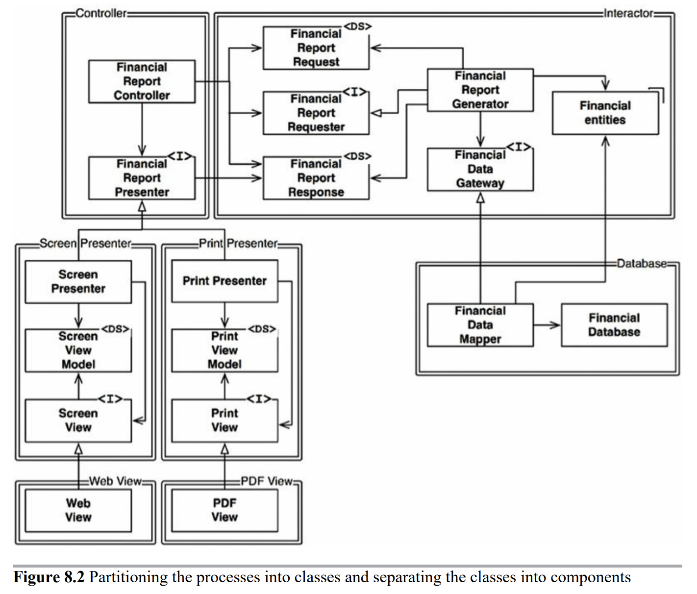

## OCP 개방-폐쇄원칙

소프트웨어 개체는 확장에는 열려 있어야 하고 변경에는 닫혀 있어야 한다.

소프트웨어 개체의 행위는 확장할 수 있어야 하지만, 이때 개체를 변경해서는 안된다. 요구사항을 살짝 확장하는데 소프트웨어를 엄청나게 수정해야 한다면, 그 소프트웨어 시스템을 설계한 아키텍트는 엄청난 실패에 맞닥뜨린다.

화살표는 변경으로부터 보호하려는 컴포넌트를 향하도록 그려진다.

A 컴포넌트에 발생한 변경으로부터 B컴포넌트를 보호하려면 반드시 A컴포넌트가 B컴포넌트에 의존해야 한다.

Interacotr는 다른 모든 것에서 발생한 변경으로부터 보호한다.(가장 높은 수준의 정책을 포함(업무 규칙))

아키텍트는 기능이 어떻게(how), 왜(why), 언제(when)발생하는지에 따라서 기능을 분리하고 분리한 기능을 계층 구조로 조직화 한다.
조직화 하면 저수준 컴포넌트에서 발생한 변경으로부터 고수준 컴포넌트를 보호할 수 있다.

Interacotr > Controller > Presenter > web

FinancialReportRequester 인터페이스는 방향성 제어와는 다른 목적을 가진다. FinancialReportController가 Interacotr 내부 정보를 알지 못하도록 하기 위해 존재한다 만약 없다면 Controller는 FinancialEnitities에 추이종속성을 가지게 된다 A->B B->C A->C

추이 종속성을 가지면 소프트웨어 엔티티는 자신이 직접 사용하지 않는 요소에는 절대로 의존해서는 안된다는 소프트웨어 원칙을 위반하게 된다.

Controller에서 발생한 변경으로부터 Interactor를 보호하는 일의 우선순위가 가장 높지만 Interactor에서 발생한 변경으로부터 Controller도 보호되기를 바란다.

---

OCP는 시스템의 아키텍처를 떠받치는 원동력중 하나다. OCP의 목표는 시스템으 확장하기 쉬운 동시에 변경으로 인해 시스템이 너무 많은 영향을 받지 않도록 하는데 있다. 이러한 목표를 달성하려면 시스템을 컴포넌트 단위로 분리하고, 저수준 컴포넌트에서 발생한 변경으로부터 고수준 컴포넌트를 보호할 수 있는 형태의 의존성 계층 구조가 만들어 지도록 해야한다.
