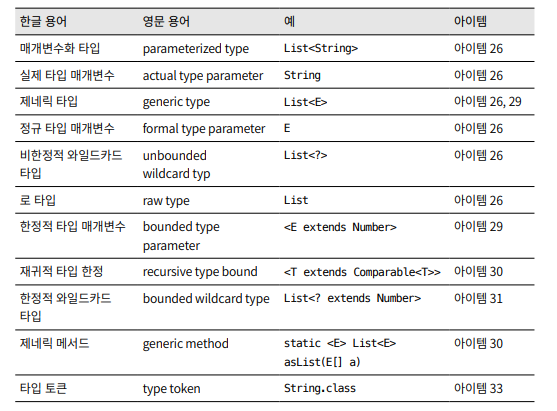

## 로 타입은 사용하지 말라.

---

클래스와 인터페이스 선언에 타입 매개변수가 쓰이면,이를 제네릭 클래스 혹은 제네릭 인터페이스라고 한다.

<br>

각각의 제네릭 타입은 일련의 매개변수화 타입을 정의한다. 먼저 클래스 혹은 인터페이스 이름이 나오고, 이어서 꺽쇠괄호 안에 실제 타입 매개변수들을 나열한다.

```java
class myArray<T>{...}

public <T> void method(T t){...}

List<E> List<String>
```

제네릭 타입을 하나 정의하면 그에 딸린 로 타입(raw type)도 함께 정의된다. 로 타입이란 제네릭 타입에서 타입 매개변수를 전혀 사용하지 않을 때를 말한다. `ex) List<E>의 로타입은 그냥 List`

로 타입은 타입 선언에서 제네릭 타입 정보가 전부 지워진 것처럼 동작하는데, 제네릭이 도래하기 전 코드와 호환되도록 하기 위한 궁여지책이라 할 수 있다. 로 타입을 쓰면 제네릭이 안겨주는 안전성과 표현력을 모두 잃게 된다.

---

```java
List<Object>는 모든 타입을 허용한다는 의사를 컴파일러에 명확히 전달한 것이다. 즉, List<String>은 로 타입인 List의 하위 타입이지만, List<Object>의 하위 타입은 아니다. 그 결과, List<Object> 같은 매개 변수 화 타입을 사용할 때와 달리 List 같은 로 타입을 사용하면 타입 안전성을 잃게 된다.

// 1.로타입 권장 안함
// List<Object>, List<String> 등 모든 List타입을 넘길 수 있다.
private static void unsafeAdd(List list, Object o){
	list.add(o);
}

// 2.로타입 x 권장함
// List<Object> 만 인자로 넘길 수 있고, List<String은 넘길 수 없다. * 제네릭의 하위타입 규칙
private static void unsafeAdd(List<Object> list, Object o){
	list.add(o);
}

public static void main(String[] args){
	List<String> strings =  new ArrayList<>();
  //1. 로타입 방식으로 하면 컴파일은 되지만 예외 던짐
  //2. 로타입 x 방식으로 하면 컴파일 오류가 발생함
  unsafeAdd(strings, Integer.valueof(42));
}
제네릭 타입을 쓰고 싶지만 실제 타입 매개변수가 무엇인지 신경 쓰고 싶지 않다면 물음표(?)를 사용하자 제네틱 타입의 Set<E>의 비 한정적 와일드 카드 타입은 Set<?> 이다. 이것이 어떤 타입이라도 담을 수 있는 가장 범용적인 매개변수화 Set타입이다.

```

로 타입을 쓰지 말라는 규칙에도 소소한 예외가 몇가지 있다.

-   class 리터럴에는 로 타입을 써야 한다. 자바 명세는 class 리터럴에 매개변수화 타입을 사용하지 못하게 했다. 예를들어 List.class, String[].class, int.class는 허용하고 `List<String>.class, List<?>.class`는 허용하지 않는다.

-   런타임에는 제네릭 타입정보가 지워지므로 instanceof 연산자는 비한정적 와일드카드 타입 이외의 매개변수화 타입에는 적용할 수 없다. 그리고 로 타입이든 비한정적 와일드카드 타입이든 instanceof는 완전히 똑같이 동작한다. 코드를 깔끔하게 하기 위해 instanceof를 사용할때는 로 타입을 쓰는 편이 깔끔하다.

---

로 타입을 사용하면 런타임에 예외가 일어날 수 있으니 사용하면 안된다. 로 타입은 제네릭이 도입되기전 이전 코드와의 호환성을 위해 제공될 뿐이다. `예로 Set<Object>는 어떤 타입의 객체도 저장할 수 있는 매개변수화 타입이고 Set<?>는 모종의 타입 객체만 저장할 수 있는 와일드카드 타입이다. 그리고 이들의 로 타입인 Set은 제네릭 타입 시스템에 속하지 않는다 Set<Object>와 Set<?>는 안전하지만 로타입인 Set은 안전하지 않다.`


