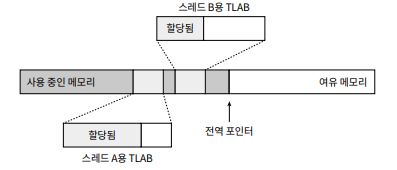

# 자바 메모리 영역과 메모리 오버플로

## 2.1 들어가며

메모리 관리 측면에서 C, C++ 개발자는 객체 각각의 `소유권`뿐 아니라 객체의 일생을 탄생부터 죽음까지 관리할 책임을 가진다.

자바개발자는 JVM이 제공하는 제동 메모리 관리 메커니즘이 메모리 관리르 해준다. 하지만 통제권을 위임했기에 문제가 한번 터지면 VM의 메모리 관리 방식을 이해하지 못하는 한 해결하기가 상당히 어렵다.

## 2.2 런타임 데이터 영역

JVM은 자바 프로그램을 실행하는 동안 필요한 메모리는 몇 개의 데이터 영역으로 나눠 관리한다.

-   모든스레드가 공유하는 영역
    -   메서드 영역 (런타임 상수 풀)
    -   힙
-   스레드 별 데이터 영역(스레드 프라이빗)
    -   가상 머신 스택
    -   프로그램 카운터 레지스터
    -   네이티브 메서드 스택

### 프로그램 카운터 (스레드 프라이빗)

PC 레지스터는 작은 메모리 영역으로 현재 실행 중인 스레드의 `바이트코드 줄 번호 표시기`라고 생각하면 쉽다.

JVM의 개념모형에서 바이트 코드 인터프리터는 PC의 값을 바꿔 다음에 실행할 바이트코드 명령어를 선택하는 식으로 동작한다.

JVM에서 멀티 스레딩은 CPU 코어를 여러 스레드가 교대로 사용하는 방식으로 구현되기 때문에
특정 시각에 각 코어는 한 스레드의 명령어만 실행하게 된다.

따라서 스레드 전환 후 이전에 실행하다 멈춘 지점을 정확하게 보유하려면 `스레드 각각에 고유한 PC가 필요하다.`

자바 메서들르 실행중이면 실행중인 바이트코드 명령어의 주소가 기록되고 네이티브 메서드를 사용중이면 값은 Undefined이다.

JVM명세에서 OutOfMemoryError 조건이 명시되지 않은 유일한 영역

### 가상 머신 스택 (스레드 프라이빗)

각 메서드가 호출될 때마다 JVM은 스택 프레임을 만들어 지역 변수 테이블, 피연산자 스택, 동적 링크, 메서드 반환값 등의 정보를 저장한다.

그런 다음 스택 프레임을 스택영역에 푸시하고 메서드가 끝나면 팝하는 일을 반복한다.

지역변수 테이블에는 JVM이 컴파일 타임에 알 수 있는 다양한 정보를 저장한다. 저장공간을 지역 변수 슬롯이라한다.

-   기본 데이터 타입
-   객체 참조
-   반환 주소 타입 (바이트 코드 명령어의 주소)

스택 메모리 영역에서는 두 가지 오류가 발생할 수 있다.

-   StackOverflowError
    -   스레드가 요청한 스택 깊이가 JVM 허용 깊이보다 클때
-   OutOfMemoryError
    -   스택용량 동적으로 확장시에 여유 메모리가 충분하지 않을때

### 네이티브 메서드 스택 (스레드 프라이빗)

가상 머신 스택과 매우 비슷한 역할을 한다. 차이점이랑면 자바 메서드를 실행할 떄와 네이티브 메서드를 실행할 때의 차이

네이티브 메서드 스택 역시 StackOverflowError, OutOfMemoryError를 던질 수 있다.

### 자바 힙

자바 애플리케이션이 사용할 수 있는 가장 큰 메모리. 자바 힙은 모든 스레드가 공유하며 가상 머신이 구동될 때 만들어진다.

이 메모리 영역의 유일한 목적은 객체 인스턴스를 저장하는 것이고 자바의 거의 모든 인스턴스가 이 영역에 할당된다.

GC가 관리하는 영역

모든 스레드가 공유하기 때문에 객체 할당 효율을 높이고자 스레드 로컬 할당 버퍼 여러 개로 나뉜다. 메모리 회수와 할당을 더 빠르게 하기 위함

자바 힙은 물리적으로 떨어진 메모리에 위치해도 상관없으나 논리적으로는 연속되어야 한다. 파일을 저장할 떄 디스크 공간을 할용하는 방식과 같다. (큰 객체 ex. 배열 같은 경우는 물리적으로 연속된 공간을 사용하게 구현 효율때문에)

새로운 인스턴스에 할당해 줄 힙 공간이 부족하고 확장할 수 없다면 OutOfMemoryError를 던진다.

### 메서드 영역

힙처럼 메서드 영역도 모든 스레드가 공유한다. 메서드 영역은 가상머신이 읽어드린

-   타입정보
-   상수
-   정적 변수
-   JIT 컴파일러가 컴파일한 코드 캐시
    등을 저장한다.

메서드 영역은 GC를 하지 않아도 괜찮다 이 영역에서는 쓰레기를 회수할 일이 거의 없다 회수할 대상은 대부분 상수풀과 타입이라서 회수 효과가 상대적으로 적다

그래도 메서드 영역이 꽉 차서 필요한 만큼 메모리를 할당할 수 없다면 OutOfMemoryError를 던진다.

### 런타임 상수 풀

`런타임 상수 풀은 메서드 영역의 일부다.` 상수 풀 테이블에는

-   클래스 버전
-   필드
-   메서드
-   인터페이스

    등 클래스 파일에 포함된 설명 정보에 더해 컴파일 타임에 생성된 다양한 리터럴과 심벌 참조가 저장된다.

가상머신이 클래스를 로드할때 이러한 정보를 메서드 영역의 런타임 상수풀에 저장한다.

클래스 파일 상수 풀과의 차이는 런타임 상수 풀은 동적이라는 점 런타임에도 메서드 영역의 런타임 상수풀에 새로운 상수가 추가될 수 있다. (자바에서 상수가 꼭 컴파일타임에 생성되어야 한다는 규칙이 없다.)

상수풀의 공간이 부족하면 OutOfMemoryError를 던진다.

### 다이렉트 메모리

다이렉트 메모리는 JVM에 포함되지 않지만 자주 쓰이는 메모리이다.

이는 네이티브 메서드를 통해 메모리에 저장되어 있는 DirectByteBuffer 객체를 통해 작업을 수행할 수 있다. (힙과 네이티브 힙 사이에서 데이터를 주고받지 않아도 돼서 일부 시나리오에서 빠르다.)

물리 메모리를 직접 할당하기에 힙크기의 제약과는 무관하지만, 이 역시도 메모리다.

서버 관리자들이 -Xmx등의 매개 변수를 설정할 때

가상머신의 메모리 크기만 고려할 뿐, 다이렉트 메모리는 간과하는 경우가 종종 있다.사용되는 모든 메모리 영역의 합이 물리 메모리 한계를 넘어서면 OOM이 발생한다.

## 2.3 핫스팟 가상 머신에서의 객체 들여다 보기

핫스팟이 관리하는 자바 힙에서의 객체 생성, 레이아웃, 접근 방법 등 전체과정의 내용=

### 객체 생성

언어 수준에서 객체 생성은 보통 new 키워드를 쓰면 된다.

JVM이 new 명령에 해당하는 바이트 코드를 만나면 매개 변수가 상수 풀 안의 클래스를 가리키는 심벌 참조인지 확인한다.

그런 다음 이 심벌 참조라 뜻하는 클래스가 로딩, 해석(resolve), 초기화(initialize)되었는지 확인한다.

힙이 완벽히 규칙적이라고 가정하면 사용중 메모리는 왼쪽에 여유 메로리는 반대편에 자리하며, 포인터가 두 영영의 경계 가운데 지점을 가리치게 된다.

이제 메모리 할당시 포인터를 여유 공간쪽으로, 객체 크기만큼 이동시키게 된다(포인터 밀치기)

`하지만 자바 힙은 규칙적이지 않다` 사용 메모리와 여유 메모리가 뒤섞여 있어서 JVM은 가용 메모리 블록들을 목록으로 따로 관리하며, 객체 인스턴스를 담기에 충분한 공간을 찾아 할당한 후 목록을 갱신한다. (여유 목록 방식)

자바힙의 규칙 비규칙 여부는 GC가 컴팩트(compact 모으기)를 할 수 있느냐에 다리렸다.

멀티 스레딩 환경에서는 스레드 안전하지 않기 때문에 문제가 생길 수 있다. 해법은 두가지

-   메모리 할당을 동기화 하는 방법

    -   실제로 비교 및 교환 (CAS)과 실패시 재시도 방식의 가상 머신은 갱신을 원자적으로 수행한다.

-   스레드마다 다른 메모리 공간을 할당하는 방법 - 스레드 별로 힙 내에 작은 크기의 전용 메모리 공간을 할당하는 방식 - 스레드 로컬 할당 버퍼(TLAB)라고 한다. - 사용하다 버퍼 부족시 동기화를 통해 추가 할당

    

메모리 할당시 각 기본값으로 초기화 (인스턴스 필드는 기본값인 이유)

다음으로 JVM은 객체에 필요한 설정을 해준다.

-   어느 클래스의 인스턴스인지
-   클래스의 메타 정보는 어떻게 찾는지,
-   객체의 해시코드 (hashCode메서드 호출시 계산)
-   GC 세대 나이
    등의 정보를 객체 헤더에 저장.

위 과정까지 JVM관점의 객체 생성

자바 프로그램 관점에서는 이제 new 명령어에 이어서 <init>() 메서드 까지 실행되어 객체를 개발자 의도대로 초기화 해야 진짜 사용 객체라 완성된다.

### 객체의 메모리 레이아웃

핫스팟 가상 머신은 객체를 세 부분으로 나눠 힙에 저장한다.

-   객체헤더
-   인스턴스 데이터
-   길이 맞추기용 정렬 패딩(alignment padding)이다
    

#### 객체 헤더

헤더에 두 유형의 정보를 담는다

-   마크워드 (런타임 데이터) : 동적으로 의미가 달라진다.
    -   해시코드
    -   GC 세대 나이
    -   락 상태 플래그
    -   스레드가 점유하고 있는 락들
    -   편향된 스레드의 아이디
    -   편향된 시각의 타임스탬프 등
-   클래스 워드 : 클래스 위드에는 객체의 클래스 관련 메타데이터를 가리키는 클래스 포인터가 저장
    -   포인터를 통해 객체가 어느 클래스의 인스턴스 인지 런타임에 알 수 있음
-   배열길이
    -   객체 헤더의 메타데이터로부터 객체 크기를 얻는다. (배열에 담긴 원소의 타입)

#### 인스턴스 데이터

객체가 실제로 담고 있는 정보들

-   다양한 타입의 필드 관련 내용
-   부모 클래스 유무
-   부모 클래스에서 정의한 모든 필드

#### 정렬 패딩

존재하지 않을 수도 있으며 자리를 확보하는 역할만 함 인스턴스 데이터가 8바이트의 정수배 조건을 충족하지 못하면 남은 구역을 패딩으로 채운다.

### 객체의 접근하기

스택에 있는 참조 데이터를 통해 힙에 들어있는 객체들에 접근한다.

객체에 접근하는 방식 역시 VM 구현하기 나름이며 주로 핸들이나 다니렉트 포인터를 사용해 구현한다.

핸들 방식에선느 자바 힙에 핸들 저장용 풀이 별도로 존재 참조에는 객체의 핸들 주소가 저장되고 핸들에는 다시 해당 객체의 인스턴스 데이터, 타입 데이터, 구조 등의 정확한 주소 정보가 담기 ㄹ것

핸들 방식의 큰 장점은 참조에 `안정적인 핸들의 주소가 저장된다는 것` GC과정에서 객체가 이동하는 일은 흔한데 핸들을 이용하면 객체의 위치가 바뀌는 상황에서도 참조 자체는 손댈 필요가 없다.

다이렉트 포인터 방식에서는 자바 힙에 위치한 객체에서 인스턴스 데이터 뿐 아니라 타입 데이터에 접근하는 길도 제공해야 한다. 스택의 참조에는 객체의 실제 주소가 바로 저장되어있다.

장점은 속도가 빠르다.

## 2.4 실전

OutOfMemory시

-   쓸데없는 객체 때문에 발생한다면 메모리 누수 GC가 왜 수거하지 못했는지 파악
-   오버플로라면 메모리 추가할당 가능 여부 파악, 코드에서 수명주기가 너무 길거나 오래 유지하는 객체 파악, 공간낭비가 심한 데이터 구조 사용하는지 파악
