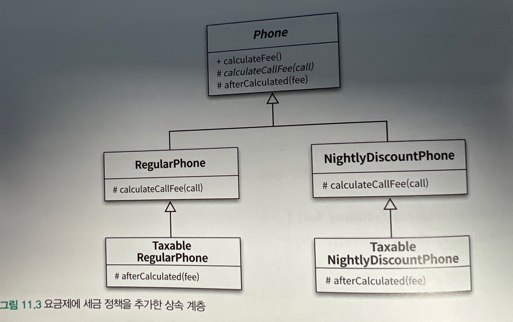
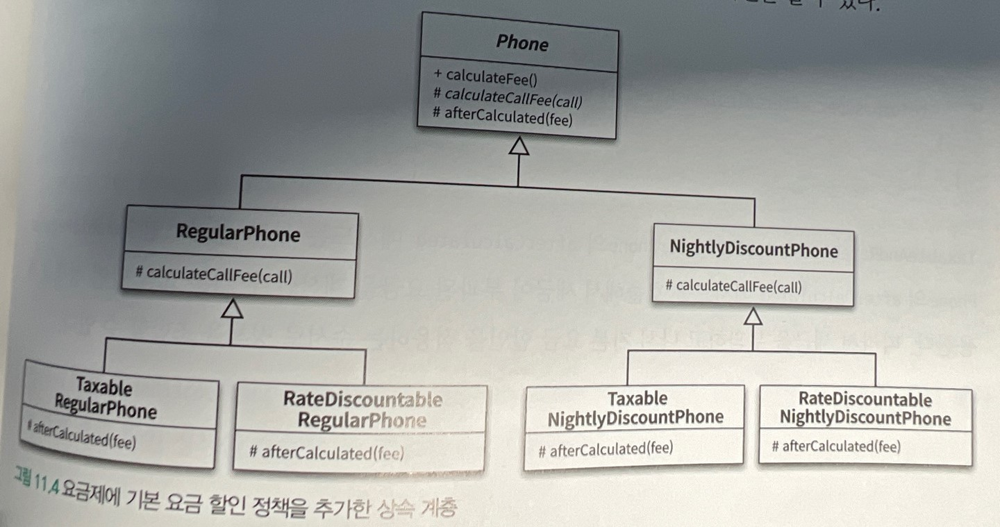
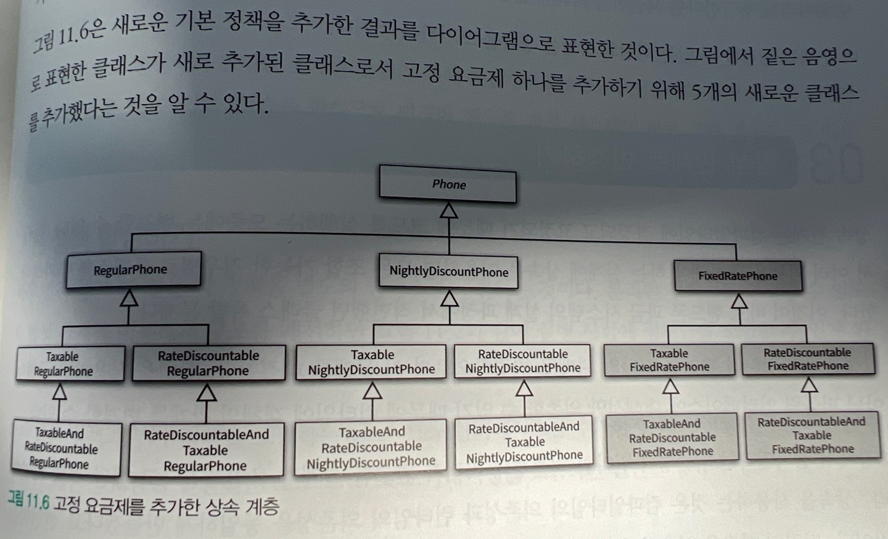
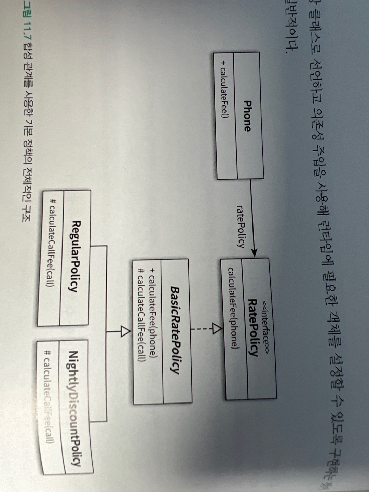
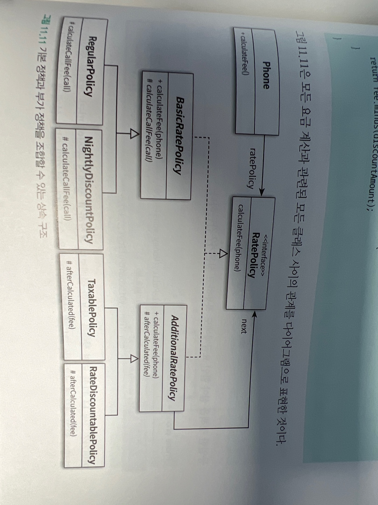
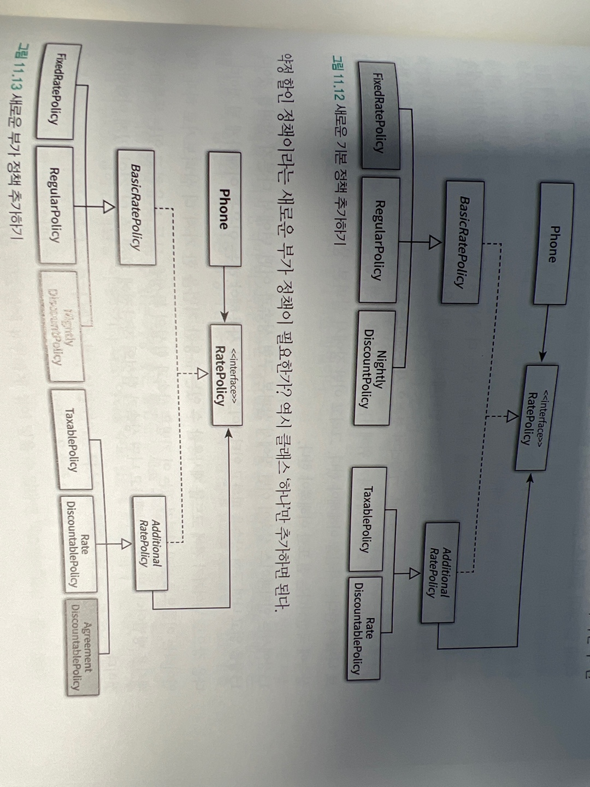

# 합성과 유연한 설계

-   상속 관계 : is-a관계
-   합성 관계 : has-a관계

합성은 구현에 의존하지 않는다는 점에서 상속과 다르다. 합성은 내부에 포함되는 객체의 구현이 아닌 퍼블릭 인터페이스에 의존한다.

코드 재사용을 위해서는 객체 합성이 클래스 상속보다 더 좋은 방법이다.

## 상속을 합성으로 변경하기

상속을 사용했을때의 문제점

-   불필요한 인터페이스 상속 문제
-   메서드 오버라이딩의 오작용 문제
-   부모 클래스와 자식 클래스의 동시 수정 문제

합성을 사용하면 상속이 초래하는 세 가지 문제점을 해결할 수 있다.

### 불필요한 인터페이스 상속문제 : java.util.Properties와 java.util.Stack

HashTable 클래스와 Properties 클래스 사이의 상속관계를 합성 관계로 바꾸려면 상속 관계를 제거하고 HashTable을 Properties의 인스턴스 변수로 포함시키면 된다.

Stack 역시 Vector를 Stack클래스의 인스턴스 변수로 선언함으로써 합성 관계로 변경할 수 있다.

이렇게 하면 자신이 원하는 인터페이스를 만들고 그안에서 인스턴스 변수로 사용하면 됨

### 메서드 오버라이딩의 오작용 문제.

위의 인스턴스 변수 방식 +
인터페이스의 오퍼레이션을 오버라이딩한 인스턴스 메서드 내에서 내부의 인스턴스에게 동일한 메서드 호출을 그대로 전달.

이를 포워딩이라 부르고 메서드를 호출하기 위해 추가된 메서드를 포워딩 메서드라고 부른다.

포워딩은 기존 클래스의 인터페이스르르 그대로 외부에 제공하면서 구현에 대한 결합없이 일부 작동 방식을 변경하고 싶은 경우에 사용할 수 있는 유용한 기능

### 부모 클래스와 자식 클래스의 동시 수정 문제: PersonalPlaylist

Playlist의 경우 합성으로 변경하더라도 가수별 노래 목록을 유지하기 위해 Playlist와 PersonalPlaylist를 함께 수정해야 하는 문제가 해결되지는 않음

그래도 상속을 사용하는 것이 향후에 playlist의 내부 구현을 변경하더라도 파급효과를 최대한 PersonalPlaylist 내부로 캡슐화할 수 있기 떄문이다.

몽키 패치 : 현재 실행 중인 환경에만 영향을 미치도록 지역적으로 코드를 수정하거나 확장하는 것을 가리킨다. (자바는 지원 x 바이트코드 사용하거나 AOP를 이용)

## 상속으로 인한 조합의 폭발적인 증가.

상속으로 인해 결합도가 높아지면 코드를 수정하는 데 필요한 작업의 양이 과도하게 늘어나느 경향이 있다.

가장 일반적인 상황은 작은 기능들을 조합해서 큰 기능을 수행하는 객체를 만들어야 하는 경우

-   하나의 기능을 추가하거나 수정하기 위해 불필요하게 많은 수의 클래스를 추가하거나 수정해야 한다.
-   단일 상속만 지원하는 언어에서는 상속으로 인해 오히려 중복 코드의 양이 늘어날 수 있다.

합성을 사용하면 상속으로 인해 발생하는 클래스의 증가와 중복 코드 문제를 간단하게 해결할 수 있다.

### 기본 정책과 부가 정책 조합하기.

기본정책(일반 요금제, 심야 할인 요금제) : 통화량을 기반으로 요금 계산

부가정책(세금정책, 기본 요금 할인 정책) : 통화량과 무관 기본 정책에 선택적으로 추가하는 요금 방식

부가 정책이 가지는 특성

-   기본 정책의 계산 결과에 적용된다.
-   선택적으로 적용할 수 있다.
-   조합 가능하다.
-   부가 정책은 임의의 순서로 적용 가능하다.

### 상속을 이용해서 기본 정책 구현하기

부모 클래스에 추상 메서드를 추가하면 모든 자식 클래스들이 추상 메서드를 오버라이딩해야 하는 문제가 발생한다.

추상 메서드의 구현이 동일하다면 유연성은 유지하면서도 중복코드를 제거하기 위해 부모클래스에서 기본 구현을 함께 제공하자.

훅 메서드 : 메서드에 기본 구현을 제공 이처럼 추상 메서드와 동일하게 자식 클래스에서 오버라이딩할 의도로
메서드를 추가했지만 편의를 위해 기본 구현을 제공하는 메서드



### 기본 정책에 기본 요금 할인 정책 조합하기.



### 중복 코드의 덫에 걸리다.



상속의 남용으로 하나의 기능을 추가하기 위해 필요 이상으로 많은 수의 클래스를 추가해야 하는 경우를 클래스 폭발 or 조합의 폭발 문제라고 한다.

## 합성 관계로 변경하기

### 기본 정책 합성하기

각 정책을 별도의 클래스로 구현. 분리된 정책들을 연결할 수 있도록 합성 관계를 이용해서 구조를 개선하면 실행 시점에 정책들을 조합할 수 있게 된다.


### 부가 정책 사용하기

-   부가정책은 기본 정책이나 다른 부가 정책의 인스턴스를 참조할 수 있어야 한다. 다시말해서 부가 정책의 인스턴스는 어떤 종류의 정책과도 합성될 수 있어야 한다.
-   Phone의입장에서 자신이 기본 정책의 인스턴스에게 메시지를 전송하고 있는지, 부가 정책의 인스턴스에게 메시지를 전송하고 있는지 몰라야 한다. (기본 정책, 부가정책은 동일한 역할을 수행해야 한다. )



```java
public abstract class AdditionalRatePolicy implements RatePolicy{
  private RatePolicy next;

  public AdditionalRatePolicy(RatePolicy next){
    this.next = next;
  }

  @Override
  public Money calculateFee(Phone phone){
    Money fee = next.calculateFee(phone);
    return afterCalculated(fee);
  }

  abstract protected Money afterCalculate(Money fee);
}
```

### 기본 정책과 부가 정책 합성하기

```java
Phone phone = new Phone(new TaxablePolicy(0.05, new RegularPolicy(...)))
```

### 새로운 정책 추가하기



오직 하나의 클래스만 추가하고 런타임에 필요한 정책들을 조합해서 원하는 기능을 얻을 수 있다.

요구사항을 변경할 때 오직 하나의 클래스만 수정하면 된다.

### 객체 합성이 클래스 상속보다 더 좋은 방법이다.

그럼 상속을 언제 사용해야 하는가

구현 상속 : 앞서말한 단점들이 해당하므로 사용 자제
인터페이스 상속 : 13장.

## 믹스인

합성이 상속과 같은 문제점을 초래하지 않는 이유는 구체적인 구현이 아니라 추상적인 인터페이스에 의존하기 떄문

믹스인 : 객체를 생성할 때 코드 일부를 클래스 안에 섞어 넣어 재사용하는 기법을 가리키는 요어

합성이 실행시점에 객체를 조합하는 재사용 방법이라면 믹스인은 컴파일 시점에 필요한 코드 조각을 조합하는 재사용 방법

미스인은 상속과 다르다. 상속의 진정한 목적은 자식 클래스를 부모 클래스와 묶어 동일한 개념적인 범주로 묶어 is-a 관계를 만들기 위함.

믹스인은 코드를 다른 코드안에 섞어 넣기 위한 방법

믹스인은 유연하게 관계를 재구성할 수 있다. 코드 재사용에 특화된 방법이면서 상속과 같은 결합도문제를 초래하지 않는다.

```java

public interface Singer {
  AudioClip sing(Song s);
}

public interface Songwriter {
  Song compose(int chartPosition);
}

public interface SingerSongwriter extends Singer, Songwriter {
  AudioClip strum();
  void actSensitive();
}
출처: https://jake-seo-dev.tistory.com/30 [제이크서 위키 블로그:티스토리]
```

전통적으로 믹스인은 특정한 클래스의 메서드를 재사용하고 기능을 확장하기 위해 사용돼 왔다.
