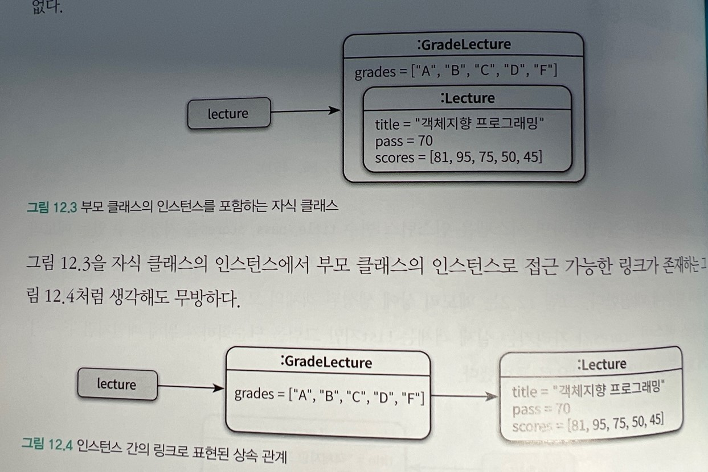
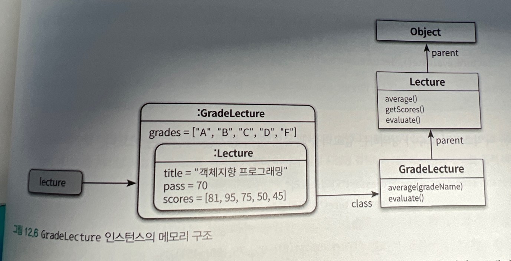
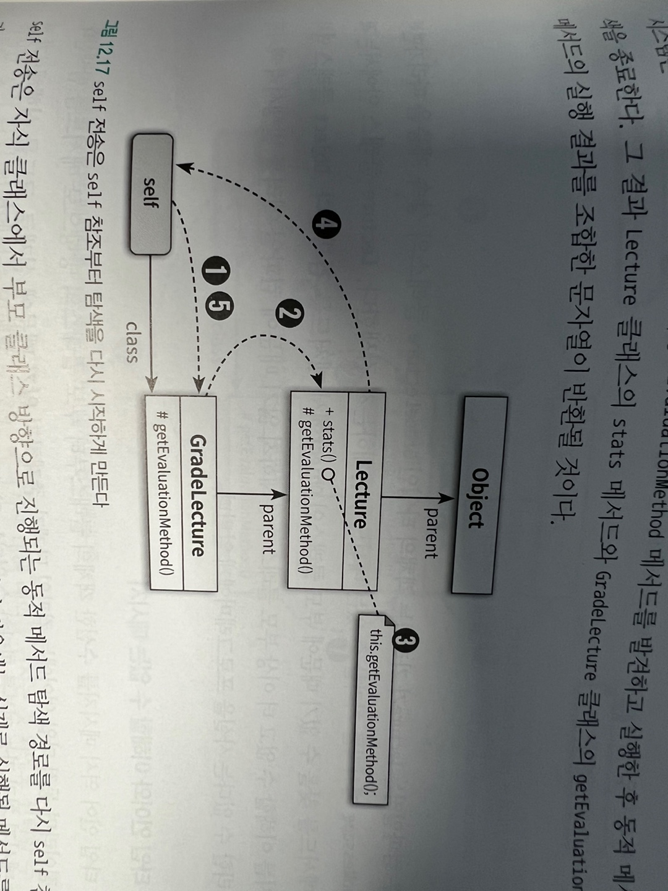
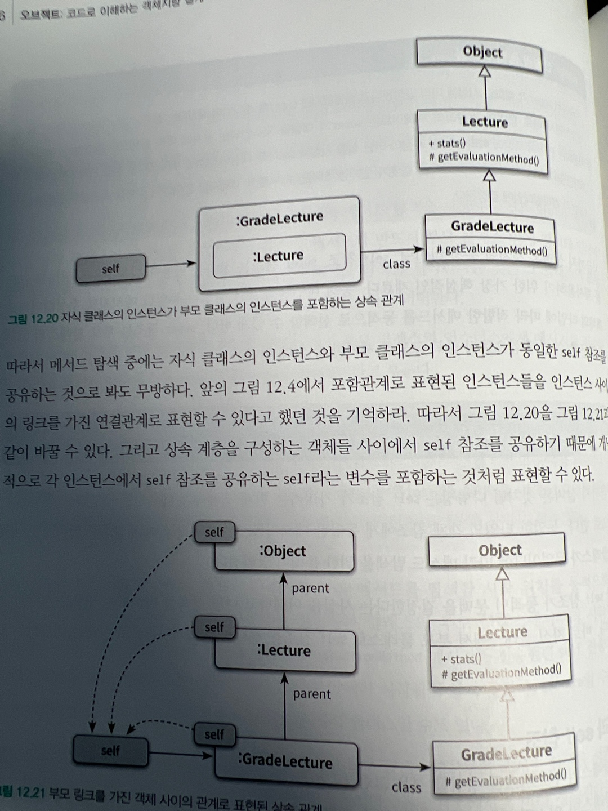
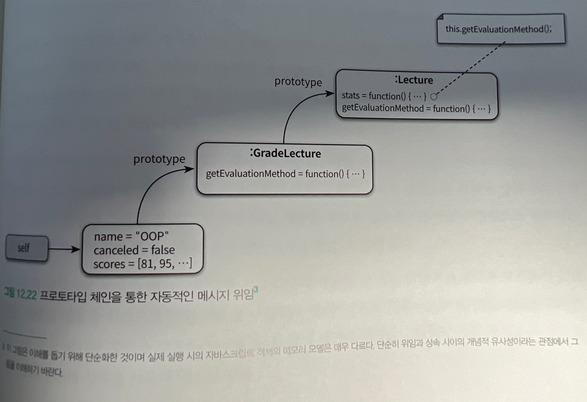

# 다형성

**상속을 단순히 코드를 재사용하기 위해서라면 상속을 사용하면 안된다.**

클라이언트 관점에서 인스턴스들을 동일하게 행동하는 그룹으로 묶기 위해 사용해야 한다.

## 다형성

다형성 : 많은 형태를 가질 수 있는 능력

객체지향 프로그래밍에서 다형성은

-   유니버설 다형성
    -   매개변수 다형성 : 제네릭 프로그래밍과 관련
    -   포함 다형성 : 서브타입 다형성이라고도 함 객체지향에서 보통 다형성을 의미.
-   임시 다형성
    -   오버로딩 다형성 : 동일한 이름의 여러개 메서드
    -   강제 다형성 : 묵시적 타입 변환 ex. 1 + "awd" = "1awd"

## 상속의 양면성

상속의 목적은 코드 재사용이 아니다.

상속의 메커니즘을 이해하는데 필요한 개념들

-   업 캐스팅
-   동적 메서드 탐색
-   동적 바인딩
-   self 참조
-   super 참조

### 상속을 사용한 강의 평가.

메서드 오버로딩

### 데이터 관점의 상속

### 행동 관점의 상속

데이터 관점이 자식 클래스의 인스턴스안에 부모 클래스의 인스턴스를 포함하는 개념이라면 행동 관점의 상속은 부모 클래스가 정의한 일부 메서드를 자식 클래스의 메서드로 포함시키는 것을 의미한다.

런타임시 자식클래스에 정의되지 않은 메서드가 있는 경우 부모 클래스 안에서 탐색한다.

## 업캐스팅과 동적 바인딩

### 같은 메시지, 다른 메서드

-   부모 클래스 타입으로 선언된 변수에 자식 클래스의 인스턴스를 할당하는것이 가능하다 이를 업캐스팅이라고 부른다.

-   선언된 변수의 타입이 아니라 메시지를 수신하는 객체의 타입에 따라 실행되는 메서드가 결정된다. 시스템이 메시지를 처리할 적절한 메서드를 컴파일 시점이 아니라 실행 시점에 결정하기 때문이다 이를 동적바인딩이라고 한다.

### 업캐스팅

컴파일러는 명시적인 타입 변환 없이도 자식 클래스가 부모 클래스를 대체할 수 있기 혀용된다.

반대로 부모 클래스의 인스턴스를 자식 클래스타입으로 변환하기 위해서는 명시적인 타입 캐스팅이 필요하다 (다운캐스팅)

업캐스팅으로 인해 미래의 자식 클래스도 협렵에 참여할 수 있게 된다.

### 동적 바인딩

함수를 호출하는 전통적인 언어들은 호출될 함수를 컴파일 타임에 정한다 이를 정적 바인딩, 초기 바인딩, 컴파일타임 바인딩이라고 부른다.

객체지향 언어에서는 메시지를 수신했을 때 실행될 메서드가 런타임에 결정된다. 이처럼 실행될 메서드가 런타임에 결정되는 방식을 동적바인딩, 지연바인딩 이라고 한다.

## 동적 메서드 탐색과 다형성

객체지향 시스템은 다음 규칙에 따라 실행될 메서드를 선택한다.

-   메시지를 수신한 객체는 먼저 자신을 생성한 클래스에 적합한 메서드가 존재하는지 검사한다. 존재하면 메서드를 실행하고 탐색을 종료한다.

-   메서드를 찾기 못했다면 부모 클래스에서 메서드 탐색을 계속한다. 이 과정은 적합한 메서드를 찾을 때까지 상속 계층을 따라 올라가며 계속된다.

-   상속 계층의 가장 최상위 클래스에 이르렀지만 메서드를 발견하지 못한경우 예외를 발생시키며 탐색을 중단한다.

동적 메서드 탐색은 두가지 원리로 구성된다.

-   자동적인 메시지 위임 : 자기가 모르면 상위 클래스로 처리를 위임
-   동적인 문맥 : 메시지를 수신했을때 어떤 메서드로 실행할지는 실행시점에 이뤄짐. 메서드를 탐색하는 경로는 self참조를 이용해서 결정

### 자동적인 메시지 위임

자식 클래스에서 부모 클래스의 방향으로 자동으로 메시지 처리가 위임되기 때문에 자식 클래스에서 어떤 메서드를 구현하고 있느냐에 따라 부모 클래스에 구현된 메서드의 운명이 결정된다.

메서드 오버라이딩 : 자식 클래스가 부모 클래스의 메서드를 오버라이딩하면 자식 클래스에서 부모 클래스로 향하는 탐색 순서 떄문에 자식클래스의 메서드가 부모 클래스의 메서드를 감추게 된다.

메서드 오버로딩 : 시그니처(파라미터 정의)가 다르다면 부모메서드 자식 메서드 공존 오버로딩된 모든 메서드를 클라이언트가 호출할 수 있음

### 동적인 문맥

### 이해할 수 없는 메시지

-   정적 타입 언어에서 이해할 수 없는 메시지 : 컴파일 할때 메시지를 이해할 수 있는지 여부를 판단. 상속 계층 전체를 탐색한 후 메시지를 처리할 수 있는 메서드를 발견 못하면 컴파일 에러 발생

-   동적 타입 언어에서 이해할 수 없는 메시지 : 예외를 던지거나 예외를 처리하거나

### self 대 super

super의 참조의 정확한 의도는 지금 이 클래스의 부모 클래스에서부터 메서드 탐색을 시작하세요 이다.

## 상속 대 위임

다형성은 self참조가 가리키는 현재 객체에게 메시지를 전달하는 특성을 기반으로 한다. 동일한 타입의 객체 참조에게 동일한 메시지를 전송하더라도 self 참조가 가리키는 객체의 클래스가 무엇이냐에 따라 메서드 탐색을 위한 문맥이 달라진다.

### 위임과 self 참조

위임 : 자신이 수신한 메시지를 다른 객체에게 동일하게 전달해서 처리를 요청하는 것

처리를 요청할 때 self참조를 전달하지 않는 경우는 포워딩 self참조를 전달하는 경우에는 위임. 위임의 정확한 용도는 클래스를 이용한 상속 관계를 객체 사이의 합성 관계로 대채해서 다형성을 구현하는 것이다.

### 프로토타입 기반의 객체지향 언어

클래스가 존재하지 않고 오직 객체만 존재하는 프로토타입 기반의 객체지향 언어에서 상속을 구현하는 유일한 방법은 객체 사이의 위임을 이용하는 것이다.

클래스 기반의 객체지향 언어들이 상속을 이용해 클래스사이에 self참조를자동으로 전달하는 것 처럼 프로토 타입기반은 위임을 애용해 객체 사이에 self참조를 잔동으로 전달한다.

