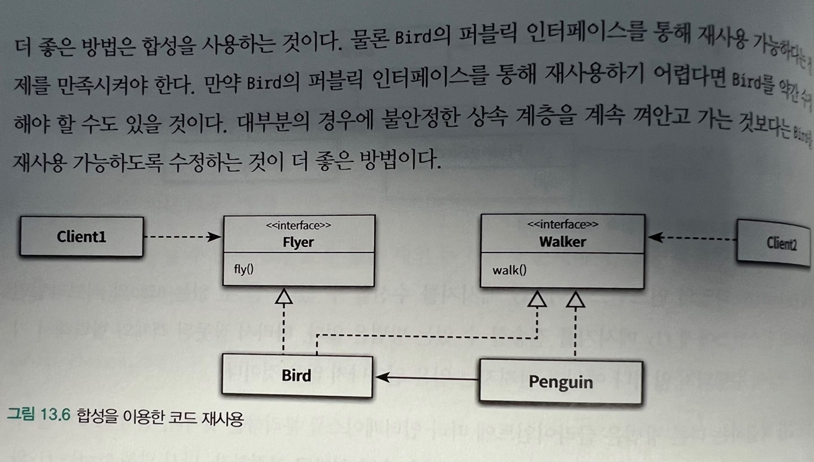

# 서브 클래싱과 서브타이핑

상속의 용도

-   타입 계층을 구현하는 것( 부모클래스(일반화) 자식클래스(특수화))
-   코드 재사용

상속의 사용하는 일차적인 목표는 코드의 재사용이 아니라 타입 계층을 구현하는 것이어야 한다.

상속은 코드를 재사용할 수 있게 하지만 강하게 결합시키기 때문에 타입계층을 목표로 사용하면 다형적으로 동작하는 객체들의 관게에 기반해 확장 가능하고 유연한 설계를 얻을 수 있게 된다.(재사용을위해 상속을 사용해서는 안된다.)

## 타입

### 개념 관점의 타입

개념 관점에서 타입이란 우리가인지하는 세상의 사물의 종류를 의미한다.

어떤 대상이 타입으로 분류될 때 그 대상을 타입의 인스턴스라고 부른다.
자바의 경우 일반적으로 타입의 인스턴스를 객체라고한다.

-   타입
    -   심볼 : 타입에 이름을 붙인것.
    -   내연 : 타입의 정의로서 타입에 속하는 객체들이 가지는 공통적인 속성이나 행동을 가리킨다.
    -   외연 : 타입에 속하는 객체들의집합.

### 프로그래밍 언어 관점의 타입

프로그래밍 언어에서의 타입은 두 가지 목적을 위해 사용된다.

-   타입에 수행될 수 있는 유효한 오퍼레이션 집합을 정의한다.

-   타입에 수행되는 오퍼레이션에 대해 미리 약속된 문맥을 제공한다.

타입은 적용 가능한 오퍼레이션 종류와 의미를 정의함으로써 코드의 의미를 명확하게 전달하고 개발자의 실수를 방지하기 위해 사용된다.

### 객체지향 패러다임 관점의 타입

-   객체의 타입이란 객체가 수신할 수 있는 메시지를 의미한다. -> 퍼블릭 인터페이스

**객체의 퍼블릭 인터페이스가 객체의 타입을 결정한다. 따라서 동일한 퍼블릭 인터페이스를 제공하는 객체들은 동일한 타입으로 결정한다.**

## 타입 계층

### 타입 사이의 포함 관계

타입 역시 객체들의 집합이기 때문에 다른 타입을 포함하는 것이 가능하다.

타입이 다른 타입에 포함될 수 있기 때문에 동일한 인스턴스가 하나 이상의 타입으로 분류되는 것도 가능하다.

다른 타입을 포함하는 타입은 일반적으로 좀 더 일반화된 의미를 표현할 수 있다.

-   슈퍼 타입 : 일반적인 타입
    -   집합이 다른 집합의 모든 멤버를 포함한다.
    -   타입 정의가 다른 타입보다 좀 더 일반적이다.
-   서브 타입 : 좀더 특수화된 타입
    -   집합에 포함되는 인스턴스들이 더 큰 집합에 포함된다.
    -   타입 정의가 다른 타입보다 좀 더 구체적이다.

### 객체 지향 프로그래밍과 타입 계층

퍼블릭 인터페이스의 관점

-   슈퍼타입이란 서브타입이 정의한 퍼블릭 인터페이스를 일반화 시켜 상대적으로 범용적이고 넓은 의미로 정의한 것이다.

-   서브 타입이란 슈퍼타입이 정의한 퍼블릭 인터페이스를 특수화 시켜 상대적으로 구체적으로 좁은 의미로 정의한 것이다.

## 서브 클래싱과 서브 타이핑

### 언제 상속을 사용해야 하는가.

두질문에 모두 예라고 대답할 수 있을때 상속을 사용

-   상속 관계가 is-a관계를 모델링 하는가.

    -   이것은 애플리케이션을 구성하는 어휘에 대한 우리의 관점에 기반한다. 일반적으로 자식 클래스는 부모 클래스다 라고 말해도 이상하지 않다면 상속을 사용할 후보로 간주할 수 있다

-   클라이언트 입장에서 부모 클래스의 타입으로 자식 클래스를 사용해도 무방한가?
    -   상속 계층을 사용하는 클라이언트의 입장에서 부모 클래스와 자식 클래스의 차이점을 몰라야 한다. 이를 자식 클래스와 부모 클래스 사이의 행동 호환성이라고 부른다.

### is-a관계

**기대되는 행동에 따라 타입 계층을 구성해야 한다.**
(잘못된 예: 펭귄은 새다, 새는 날 수 있다.) -> 펭귄은 새의 서브타입이 될 수 없음

### 행동 호환성

타입의 이름 사이에 개념적으로 어떤 연관성이 있다고 하더라도 행동에 연관성이 없다면 is-a관게를 사용하지 말아야 한다.

두 탐입 사이에 행동이 호환될 경우에만 타입 계층으로 묶어야 한다. 행동의 호환 여부를 판단하는 기준은 클라이언트 관점이다.

### 클라이언트의 기대에 따라 계층 분리하기

인터페이스를 클라이언트의 기대에 따라 분리함으로써 변경에 의한 영향을 제어하는 설계 원칙을 인터페이스 분리 원칙 이라고 부른다.

중요한 것은 설계가 반영할 도메인의 요구사항이고 그 안에서 클라이언트가 객체에게 요구하는 행동이다.

요점은 자연어에 현혹되지 말고 요구사항 속에서 클라이언트가 기대하는 행동에 집중하라는 것. 이름 사이의 어떤 연관성은 아무런 의미가 없다.

### 서브 클래싱과 서브 타이핑

-   서브 클래싱 :
    -   다른 클래스의 코드를 재사용할 목적으로 상속을 사용하는 경우를 가리킨다.
    -   자식 클래스와 부모 클래스의 행동이 호환되지 않기 때문에 자식 클래스의 인스턴스가 부모 클래스의 인스턴스를 대체할 수 없다.
    -   서브클래싱을 구현상속 또는 클래스상속 이라고 부르기도 한다.
-   서브 타이핑 :
    -   타입 계층을 구성하기 위해 상속을 사용하는 경우를 가리킨다.
    -   영화 예메 시스템에서 DiscountPolicy 상속 계층이 서브타핑이에 해당
    -   자식 클래스와 부모 클래스의 행동이 호환되기 때문에 자식 클래스의 인스턴스가 부모 클래스의 인스턴스를 대체할 수 있다.
    -   이때 부모 클래스는 자식 클래스의 슈퍼타입이 되고 자식 클래스는 부모클래스의 서브타입이 된다.
    -   서브 타이핑을 인터페이스 상속이라고 부르기도 한다.

**나쁜 설계의 예로 든 상속들은 서브 클래싱에 속한다.**

**행동 호환성과 대체 가능성을 생각하자.**

## 리스코프 치환 원칙

LSP 서브타입은 그것의 기반 탕비에 대해 대체 가능해야 한다. 클라이언트가 차이점을 인식하지 못한 채 기반 클래스의 인터페이스를 통해 서브클래스를 사용할 수 있어야 한다.

**중요한 것은 클라이언트 관점에서 행동이 호환되는지 여부다.**

### 클라이언트와 대체 가능성

리스 코프 치환 원칙은 상속 관계에 있는 두 클래스 사이의 관계를 클라이언트와 떨어트려 놓고 판단하지 말라고 속삭인다. 상속 관계는 클라이언트의 관점에서 자식 클래스가 부모 클래스를 대체할 수 있을 때만 올바르다.

대체 가능성을 결정하는 것은 클라이언트다.

### is-a관계 다시 살펴보기

is-a관계는 객체지향에서 중요한 것은 객체의 속성이 아니라 객체의 행동이라는 점을 강조.

일반적으로 클라이언틀르 고려하지 않은 채 개념과 속성의 측면에서 상속 관계를 정할 경우 리스코프 치환 원칙을 위반하는 서브클래싱에 이르게 될 확률이 높다.

결론적으로 상속이 서브타이핑을 위해 사용될 경우에만. is-a관계다. 서브 클래싱을 구현하기 위해 상속을 사용했다면 is-a관계라고 말할 수 없다.

### 리스코프 치환원칙은 유연한 설계의 기반이다.

리스코프 치환원칙은 클라이언트가 어떤 자식 클래스와도 안정적으로 협력할 수 있는 상속 구조를 구현할 수 있는 가이드라인을 제공한다.

새로운 자식 클래스를 추가하더라도 클라이언트 입장에서는 동일하게 행동하기만 한다면 클라이언트를 수정하지 않고도 상속 계층을 확장할 수 있다.

의존성 역전 원칙, 리스코프 치환 원칙, 개방-폐쇄원칙을 활용

### 타입 계층과 리스코프 치환원칙

클래스 상속은 타입 계층을 구현할 수 있는 다양한 방법 중 하나. 인터페이스로도 가능

물론 상속이던, 인터페이스던 리스코프 치환 원칙을 준수해야만 서브 타이핑 관계라고 말할 수 있음

## 계약에 의한 설계와 서브타이핑

클라이언트와 서버 사이의 협력을 의무와 이익으로 구성된 계약의 고나점에서 표현하는 것을 계약에 의한 설계 라고 부른다.

계약에 의한 설계는

-   클라이언트가 정상적으로 메서드를 실행하기 위해 만족시켜야 하는 사전조건(클라이언트가 만족시켜야함)
-   메서드가 실행된 후에 서버가 클라이언트에게 보장해야 하는 사후조건
-   메서드 실행 전과 실행 후에 인스턴스가 만족시켜야 하는 클래스불변식

세가지 요소로 구성된다.

리스코프 치환 원칙과 계약에 의한 설계 사이의 관게를 요약하면 :
서브타입이 리스코프 치환 원칙을 만족시키기 위해서는 클라이언트의 슈퍼타입 간에 체결된 계약을 준수해야한다.

### 서브 타입과 계약

계약의 관저에서 상속이 초래하는 문제점 : 자식 클래스가 무보 클래스의 메서드를 오버라이딩할 수 있다는 것.

서브타입에 더 강력한 사전 조건을 오버라이딩하면 클라이언트는 모르기때문에 문제가 발생 따라서 자식 클래스가 부모 클래스의 서브타입이 되려면 서브타입에 더 강력한 사전조건을 걸어어서는 안된다.
약하게는 가능하다 왜? 기존 협력에 영향을미치지 않으니까

사후조건을 강화한다면?
서브 타입에 슈퍼타입과 같거나 더 강한 사후조건을 정의할 수 있다.

사후 조건을 약하게 한다면?
클라이언트가 알고 있던 조건에 맞지 않아 협력에영향을 준다. ex (기존 0원이상 약하게 -100원이상)

정리

-   서브 타입에 더 강력한 사전조건을 정의할 수 없다.
-   서브 타입에 슈퍼타입과 같거나 더 약한 사전조건을 정의할 수 있다.
-   서브 타입에 슈퍼타입과 같거나 더 강한 사후조건을 정의할 수 있다.
-   서브 타입에 더 약한 사후 조건을 정의 할 수 없다.

즉 기존 협력에 영향을 주면 안됨(기존협력 = 슈퍼타입을 대체하는데 이상없어야)
