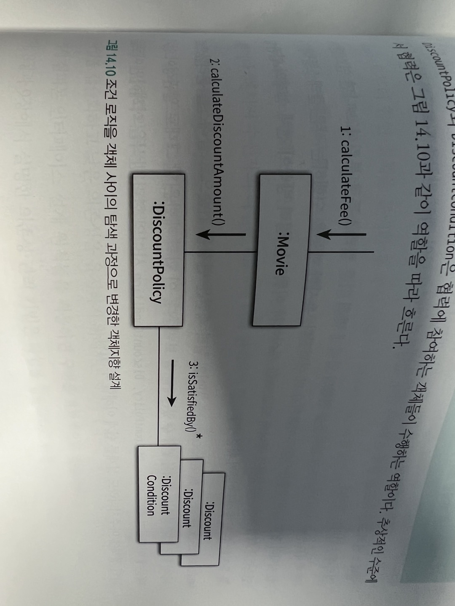
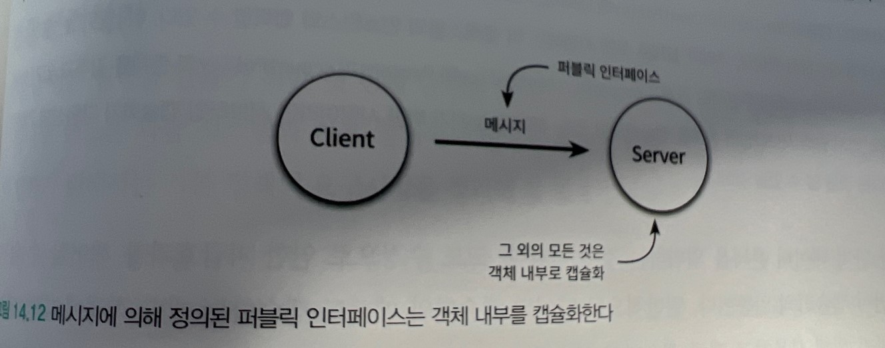
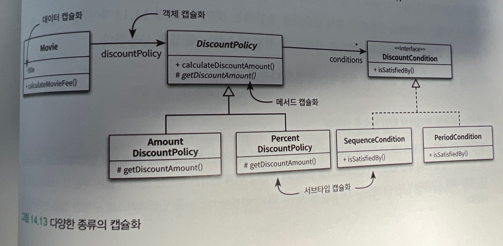
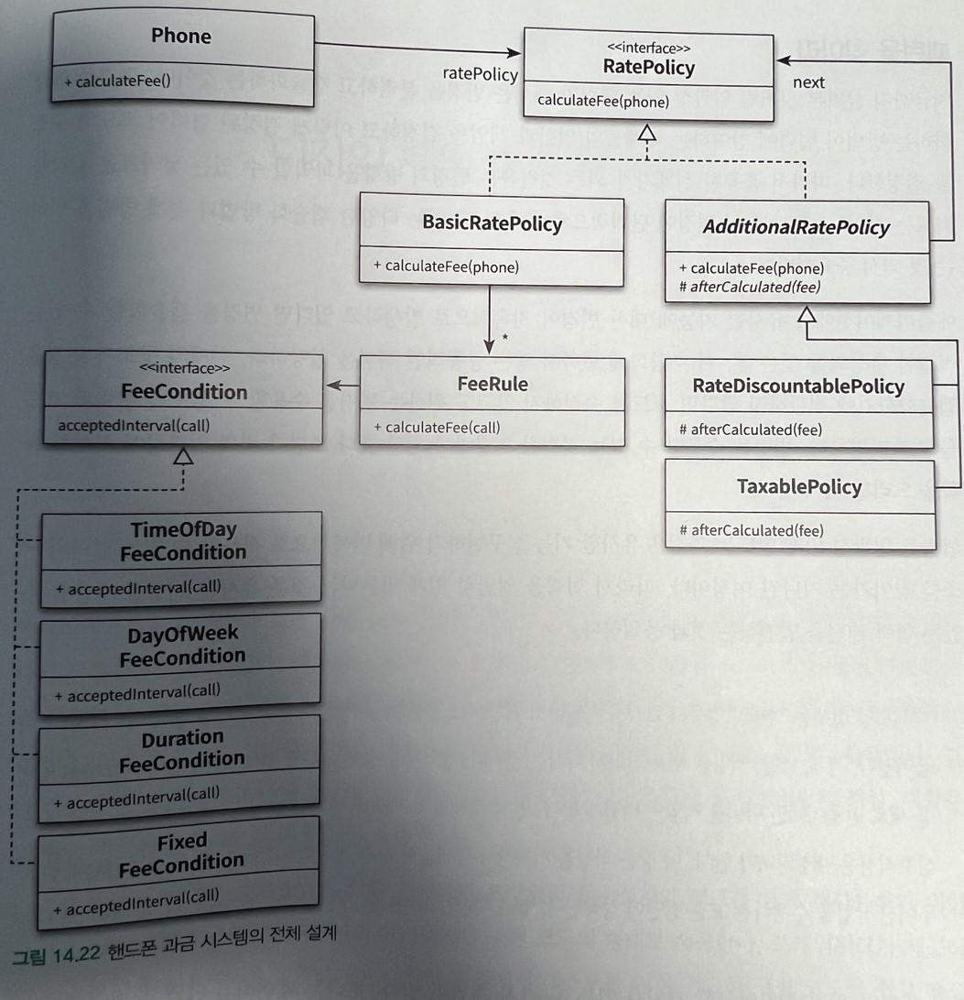

# 일관성 있는 협력

객체는 협력을 위해 존재한다. 협력은 객체가 존재하는 이유와 문맥을 제공한다.

가능하다면 유사한 기능을 구현하기 위해 유사한 협력패턴을 사용하라. 객체들의 협력이 전체적으로 일관성있는 유사한 패턴을 따른다면 시스템을 이해하고 확장하는데 필요한 정신적인 부담을 줄일 수 있다.

일관성 있는협력 패턴 사용 -> 이해하기 쉽고 직관적이며 유연해진다.

## 핸드폰 과금 시스템 변경하기

## 설계에 일관성 부여하기

-   변하는 개념을 변하지 않는 개념으로부터 분리하라.
-   변하는 개념을 캡슐화하라.

캡슐화란 변하는 어떤 것이든 감추는 것이다.

### 조건 로직을 객체 사이의 탐색 과정으로 변경

기존 if문 사용에서 다형성사용으로

할인 정책과 하인 조건의 타입을 체크하는 하나하나의 조건문이 개별적인 변경이이였다. 각 조건문을 개별적인 객체로 분리헀고 이 객체들과 일관성 있게 협력하기 위해 타입 계층을 구성

개념분리와 캡슐화 휼룡한 추상화를 찾아 추상화에 의존하도록 만들자.

### 캡슐화 다시 살펴보기

데이터 은닉 : 오직 외부에 공개된 메서드를 통해서간 객체의 내부에 접근할 수 있게 제한함으로 내구 구현을 숨기는 기법

캡슐화란 변하는 어떤 것이든 감추는 것

객체를 구현한 개발자는 필요할때 객체의 내부구현을 수정하기를 원한다.

객체와 협력하는 클라이언트 개발자는 객체의 인터페이스가 변하지 않기를 바란다.

-   데이터 캡슐화

    -   Movie 클래스의 인스턴스 변수 title의 가시성은 private이기 때문에 외부에서 직접 접근할 수 없다.

-   메서드 캡슐화

    -   DiscountPolicy 클래스에서 정의되 있는 getDiscountAmount메서드의 가시성은 protected다. 클래스의 외부에서는 이 메서드에 직접 접근할 수 없다.

-   객체 캡슐화

    -   Movie클래스는 DiscountPolicy 타입의 인스턴스 변수 discountPolicy를 포함한다. 이 인스턴스 변수는 private가시성을 가지기 떄문에 Movie와 DiscountPolicy 사이의 관계를 변경하더라도 외부에는 영향을 미치지 않는다.(객체와 객체 관계를 캡슐화 (합성))

-   서브 타입 캐슐화
    -   Movie는 DiscountPolicy에 대해서는 알고 있지만 AmountDiscountPolicy와 PresentDiscountPolicy에 대해서는 알지 못한다. 실행 시점에서는 이 클래스의 인스턴스와 협력할 수 있다. 즉 서브 타입의 종류를 캡슐화 다형성의 기반

**변하는 부분을 분리해서 타입 계층을 만든다, 변하지 않는 부분의 일부로 타입 계층을 합성한다.**

## 일관성 있는 기본 정책 구현하기

변하지 않는 규칙으로부터 변하는 적용조건을 분리해야한다.

### 변경 캡슐화 하기

협력을 일관성 있게 만들기 위해서는 변경을 캡슐화해서 파급 효과를 줄여야 한다.

