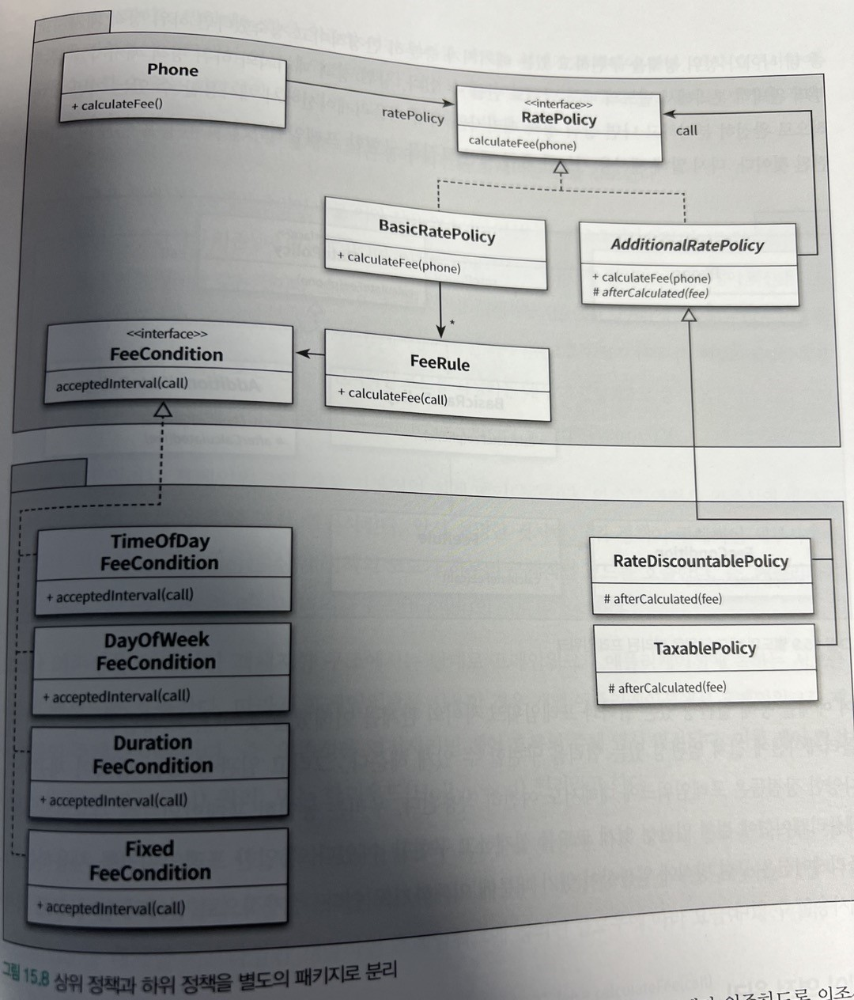
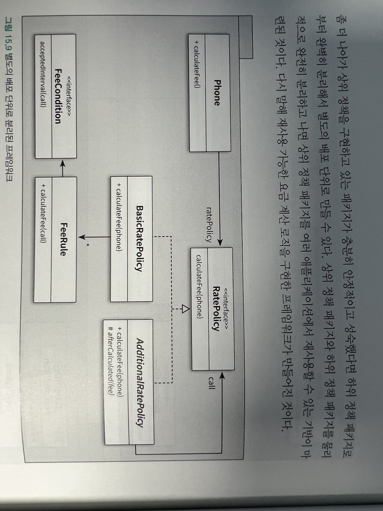

# 디자인 패턴과 프레임워크

소프트웨어 설계에서 반복적으로 발생하는 문제에 대해 반복적으로 적용할 수 있는 해결 방법을 디자인 패턴이라고한다.

디자인 패턴이 설계를 재사용하기 위한 것이라면 프레임 워크는 설계와 코드를 함께 재사용하기 위한 것.

프레임워크는 애플리케이션의 아키텍처를 구현 코드의 형태로 제공한다.

디자인 패턴이 협력을 일관성 있게 만들기 위해 재사용할 수 있는 설계의 묶음이라면 프레임워크는 일관성 있는 협력을 제공하는 확장 가능한 코드

## 디자인 패턴과 설계 재사용

### 소프트웨어 패턴

패턴의 특징들

-   패턴은 반복적으로 발생하는 문제와 해법의 쌍으로 정의된다.
-   패턴을 사용함으로써 이미 알려진 문제와 이에 대한 해법을 문서로 정의할 수 있으며, 이 지식을 다른 사람과 의사소통할 수 있다.
-   패턴은 추상적인 원칙과 실제 코드 작성 사이의 간극을 메워주며 실질적인 코드 작성을 돕는다
-   패턴의 요점은 패턴이 실무에서 탄생했다는점이다.

### 패턴 분류

패턴은 4가지로 분류

-   아키텍처 패턴
-   분석 패턴
-   디자인 패턴
-   이디엄

### 패턴과 책임-주도 설계

객체 지향 설계에서 가장 중요한 일은 올바른 책임을 올바른 객체에게 할당하고 객체 간의 유연한 협력 관계를 구축하는 일이다.

책임과 협력의 윤곽은 캡슐화, 크기, 의존성, 유연성, 성능, 확장 가능성, 재사용성 등의 다양한 요소들의 트레이드 오프를 통해 결정된다.

패턴은 공통으로 사용할 수 있는 역할, 책임, 협력의 템플릿이다. 패턴은 반복적으로 발생하는문제를 해결하기 위해 사용할 수 있는 공통적인 역할과 책임, 협력의 휼룡한 예제를 제공한다.

패턴들의 예시

-   STRATEGY 패턴 : 다양한 알고리즘을 동적으로 교체할 수 있는 역할과 책임의 집합을 제공

-   BRIDGE 패턴 : 추상화의 조합으로 인한 클래스의 폭발적인 증가 문제를 해결하기 위해 역할과 책임을 추상화와 구현의 두 개의 커다란 집합으로 분해함으로써 설계를 확장 가능하게 만든다.

-   OBSERVER 패턴 : 유연한 통지 메커니즘을 구축하기 위해 객체 간의 결합도를 낮출 수 있는 역할과 책임의 집합을 제공한다.

중요한 것은 패턴을 따르면 특정한 상황에 적용할 수 있는 설계를 쉽고 빠르게 떠올릴 수 있다는 사실이다. 적용 가능한 패턴을 잘 알고 있다면 책임 주도 설계의 절차를 하나하나 따르지 않고도 시스템 안에 구현할 객체들의 역할과 책임, 협력 관계를 빠르고 손쉽게 구성할 수 있다.

패턴의 구성 요소는 클래스가 아니라 역할이다.

### 캡슐화와 디자인 패턴

패턴을 사용하면서 부딪히게 되는 대부분의 문제는 패턴을 맹목적으로 사용하려고 할때 발생. 빠지기 쉬운 합정은 패턴을 적용하는 컨텍스트의 적절성은 무시한 채 패턴의 구조에만 초점을 맞추는 것이다. (망치를 들면 모든것이 못으로 보인다.)

부적절한 상황에서 부적절하게 사용된 패턴으로 인해 소프트웨어의 엔트로피가 증가하는 부작용을 낳기 쉽다. 패턴을 남용하지 않기 위해서는 다양한 트레이드오프 관계속에서 패턴을 적용하고 사용해본 경험이 필요하다.

정당한 이유 없이 사용된 모든 패턴은 설계를 복잡하게 만드는 장애물이다.

## 프레임워크와 코드 재사용

### 코드 재사용 대 설계 재사용

디자인 패턴은 프로그래밍 언어에 독립적으로 재사용 가능한 설계 아이디어를 제공하는 것을 목적으로 한다.

재사용 관점에서 설계 재사용보다 더 좋은 방법은 코드 재사용이다.
패턴은 재사용을 위해 매번 유사한 코드를 작성해야만 한다. 설계를 재사용하면서도 유사한 코드를 반복적으로 구현하는 문제를 피하기위한 방안으로 프레임워크를 사용

프레임워크란 추상 클래스나 인터페이스를 정의하고 인스턴스 사이의 상호작용을 통해 시스템 전체 혹은 일부를 구현해 놓은 재사용 가능한 설계 또는 애플리케이션 개발자가 현재의 요구사하아에 맞게 커스터마이징할 수 있는 애플리케이션의 골격을 의미한다.

### 상위 정책과 하위 정책으로 분리하기

상위정책은 세부 사항에 비해 재사용될 가능성이 높다. 요점은 상위 정책이 세부사항 보다 더 다양한 상황에서 재사용될 수 있어야 한다는 것.

상위 정책이 세부사항에 의존하게 되면 상위 정책이 필요한 모든 경우에 세부사항도 항상 함께 존재해야 하기 떄문에 상위 정책의 재사용성이 낮아진다. -> 의존성 역전 원칙 사용

의존성 역전 원칙의 관점에서 세부 사항은 변경을 의미한다.

프레임 워크는 여러 애플리케이션에 걸쳐 재사용 가능해야 하기 떄문에 변하는 것과 변하지 않는 것들을 서로 다른 주기로 배포할 수 있도록 별도의 배포 단위로 분리해야 한다.

이를 위한 첫걸음은 변하는 부분과 변하지 않는 부분을 별도의 패키지로 분리하는 것.

**패키지의 의존성 방향은 의존성 역전 원리에 따라 추상화에만 의존하도록 의존성의 방향을 조정하고 추상화를 경께로 패키지를 분리 했기 때문에 하위패키지(세부사항구현패키지) 는 상위 정책을 구현한 패키지에 의존해야한다.(항상 의존성은 안쪽으로 향한다.)**

### 제어 역전 원리

상위 정책을 재사용한다는 것은 결국 도메인에 존재하는 핵심 개념들 사이의 협력 관계를 재사용한다는 것을 의미

협력을 제어하는 것은 프레임워크다. 우리는 프레임워크가 적절한 시점에 실행할 것으로 예상되는 코드를 작성할 뿐이다.

옛날에는 우리가 직접 라이브러리의 코드를 호출했지만 객체지향의 시대에는 그저 프레임워크가 호출하는 코드를 작성해야만 한다. 제어가 사람이 아니라 프레임워크로 넘어가 버린것 그래서 제어의 역전

우리의 코드는 수동적인 존재다. 프레임워크가 우리의 코드를 호출해줄 때까지 그저 넋 놓고 기다리고 있을 수 밖에 없다.
