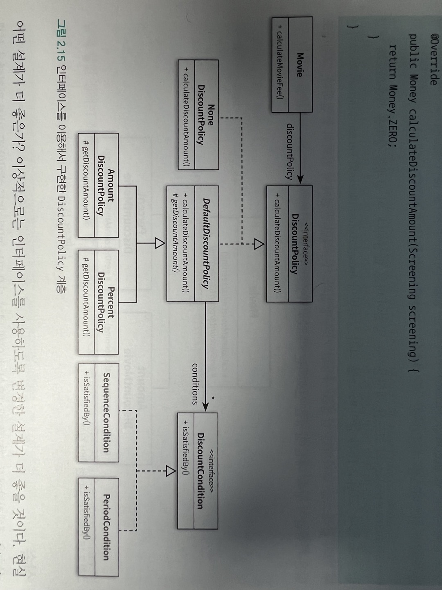

# 객체지향 프로그래밍

객체지향 패러다임으로의 전환은 클래스가 아니라 객체에 초점을 맞워야 한다.

-   어떤 클래스가 필요한지를 고민하기 전에 어떤 객체들이 필요한지를 고민하라. 클래스는 상태와 행동을 공유하는객체들을 추상화한것. 객체를 중심으로 두는 접근 방법은 설계를 단순하고 깔끔하게 만든다.

-   객체를 독립적인 존재가 아니라 협력하는 공동체의 일원으로 봐야 한다.

도메인 : 문제를 해결하기 위해 사용자가 프로그램을 사용하는 분야.

### 자율적인 객체

-   객체는 상태와 행동을 함께 가지는 복합적인 존재이다.
-   객체는 스스로 판단하고 행동하는 자율적인 존재이다.

캡슐화 : 데이터와 기능을 객체 내부로 함께 묶는 것

객체지향 프로그래밍 언어들은 접근제어 매커니즘으로 접근 수정자를 제공한다.

외부에서 접근 가능한 부분을 퍼블릭 인터페이스라고하고 내부에서만 접근 가능한 부분을 구현이라고 한다.
인터페이스와 구현의 분리 원칙은 휼룡한 객체지향 프로그램을 만들기 위해 따라야 하는 핵심 원칙이다.

### 프로그래머의 자유

외부에 대한 영향을 걱정하지 않고 내부 구현을 변경할 수 있는 것을 구현 은닉 이라고 한다. 접근 제어 매커니즘은 외부와 내부를 구분하는 동시에 구현은닉할 수 있게 해준다.

객체를 외부와 내부로 구분하면 알아야할 지식의 양이 줄어들고 변경에 대한 파급효과가 작아진다.

### 협력에 관한 짧은 이야기

객체는 다른 객체의 인터페이스에 공개된 행동을 수행하도록 요청할 수 있다. 요청을 받은 객체는 자율적인 방법에 따라 요청을 처리한 후 응답한다.

메시지를 전송 메시지를 수신하고 메시지를 메서드로 처리한다.

메시지와 메서드의 구분에서 다형성의 개념이 출발한다.

### 상속과 인터페이스

상속이 가치있는 이유는 부모클래스가 제공하는 모든 인터페이스를 자식 클래스가 물려받을 수 있기 때문이다.

### 다형성

동일한 메시지를 전송하지만 어떤 메서드가 실행될지는 수신받는 객체의 클래스가 무엇이냐에 따라 달라진다 이를 다형성이라고 한다.

다형성을 구현하는 방법은 매우 다양하지만 메시지에 응답하기 위해 실행될 메서드를 컴파일 시점이 아닌 실행 시점에 결정한다는 공통점이 있다. 이를 지연바인딩 or 동적바인딩 이라고 부른다.

전통적인 함수 호출처럼 컴파일 시점에 실행될 함수나 프로시저를 결정하는 것을 초기 바인딩 or 정적바인딩 이라고 부른다.

객체체지향이 컴파일 시점의 의존성과 실행 시점의 의존성을 분리하고, 하나의 메시지를 선택적으로 서로 다른 메서드에 연결할 수 있는 이유가 바로 지연바인딩 매커니즘 때문이다.

책임의 위치를 결정하기 위해 조건문을 사용하는 것은 협력의 설계 측면에서 대부분의 경우 좋지 않은 선택이다.

```java
//안좋음
public class Movie{
  public Money calculateMovieFee(Screening screening){
    if(discountPolicy == null){
      return fee;
    }

    return fee.minus(discountPolicy.calculateDiscountAmount(screening))
  }
}


//일관성을 지키기위해 0원이라는 할인요금을 계산할 책임을
//DiscountPolicy계층에 유지

public class NoneDiscountPolicy extends DiscountPolicy{
  @Override
  protected Money getDiscountAmount(Screening screening){
    return Money.ZERO;
  }
}

new Movie("스타워즈", Duration.ofMinutes(210), Money.wons(1000)
  , new NoneDiscountPolicy());
```

기존 코드의 수정 없이 새로운 클래스를 추가하여 기능을 확장함.

### 추상 클래스와 인터페이스 트레이드 오프

NoneDiscountPolicy 는 getDiscountAmount 메서드가 필요없다. 할인조건이 없을 경우 부모클래스에서 호출하지 않기 때문에. 이것은 부모 클래스인 DiscountPolicy와 NoneDiscountPolicy를 개념적으로 결합시킨다.

개선후


이상적으로는 개선후가 더 좋을 것이다. 현실적으로는 NoneDiscountPolicy만을 위해 인터페이스를 추가하는 것이 과하다는 생각이 들 수도 있을 것이다

구현과 관련된 모든 것들이 트레이드오프의 대상이 될 수 있다. 중요한 것은 모든 코드에는 합당한 이유가 있어야 한다.

### 코드 재사용

상속은 코드를 재사용하기 위해 널리 사용되는 방법이다.

객체지향 설계와 관련된 자료를 조금이라도 본 사람들은 코드 재사용을 위해서는 상속보다 합성(composition)이 더 좋은 방법이라는 이야기를 많이 들었을 것이다.

Movie가 DiscountPolicy의 코드를 재사용 하는 방법이 바로 합성이다.

합성을 이용하면 객체의 내부는 공개되지 않고 인터페이스를 통해 코드를 재사용하기 때문에 구현에 대한 의존성을 인터페이스에 대한 의존성으로 변경하여 결합도를 낮출 수 있기 때문이다.

### 상속

상속은 두가지 관점에서 안좋은 영향을 미친다.

-   캡슐화를 위반한다. : 부모 클래스의 내부 구조를 잘 알고 있어야 한다. 부모 클래스를 변경할때 자식 클래스도 변경될 확률이 매우 높다.
-   설계를 유연하지 못하게 만든다. : 상속은 부모와 자식사이의 관계를 컴파일 시점에 결정한다. 실행시점에 객체의 종류를 변경하는 것이 불가능 하다.

### 합성

인터페이스에 정의된 메시지를 통해서만 코드를 재사용하는 방법을 합성이라고 한다.

합성은 상속이 가지는 두가지 문제점을 모두 해결한다.

-   인터페이스에 정의된 메시지를 통해서만 재사용이 가능하기 때문에 구현을 효과적으로 캡슐화할 수 있다.

-   의존하는 인스턴스를 교체하는 것이 비교적 쉽기 때문에 설계를 유연하게 만든다.

상속보다는 합성을 선호하는 것이 좋지만. 대부분의 설계에서는 상속과 합성을 함께 사용해야 한다. ex. DiscountPolicy
