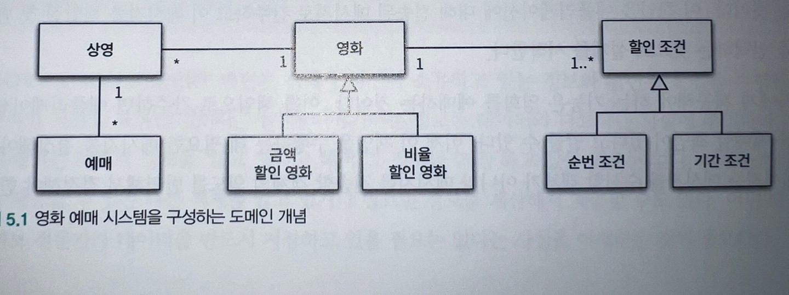
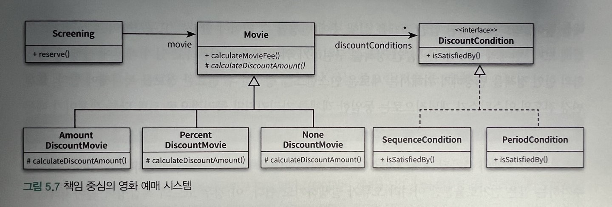
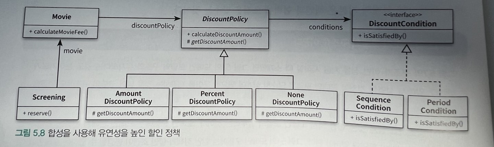
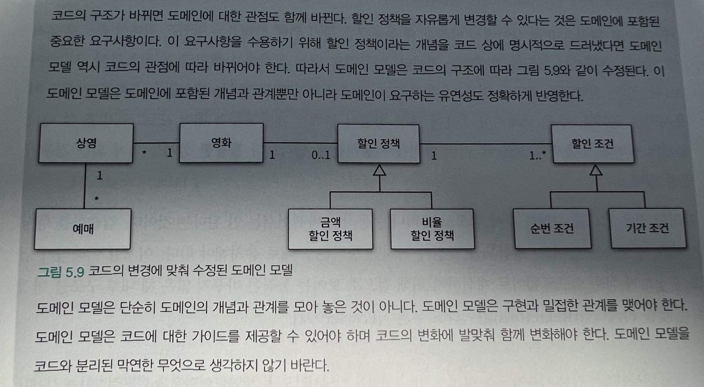

# 책임 할당하기

데이터 중심의 설계에서 책임 중심의 설계로 전환하기 위해서는

-   데이터보다 먼저 행동을 결정하라.
-   협력이라는 문맥 안에서 책임을 결정하라.

### 데이터보다 행동을 먼저 결정하라.

객체에게 중요한 것은 데이터가 아니라 외부에 제공하는 행동이다.
객체의 행동이란 곧 객체의 책임을 의미한다.

데이터는 객체가 책임을 수행하는데 필요한 재료를 제공할 뿐이다. 데이터에 초점을 맞추면 캡슐화가 약해지기 때문에 낮은 응집도와 결합도를 가진 객체들로 넘쳐나게 된다.

데이터 중심의 설계는 

-   이 객체가 포함해야 하는 데이터는 무엇인가 -> 데이터를 처리하는데 필요한 오퍼레이션은 무엇인가를 결정

책임 중심의 설계는  

-   이 객체가 수행해야 하는 책임은 무엇인가 -> 이 책임을 수행하는데 필요한 데이터는 무엇인가를 결정한다.

### 협력이라는 문맥 안에서 책임을 결정하라.

객체에게 할당된 책임의 품질은 협력에 적합한 정도로 결정된다. 객체에게 할당된 책임이 협력에 어울리지 않는다면 그 책임은 나쁜것이다.

책임은 객체의 입장이 아니라 객체가 참여하는 협력에 적합해야 한다.
협력을 시작하는 주체는 메시지 전송자이기 때문에 **협력에 적합한 책임이란 메시지 수신자가 아니라 메시지 전송자에게 적합한 책임을 의미한다.**

즉 메시지가 객체를 선택하게 해야한다.

### 책임 주도 설계

책임 주도 설계의 흐름

-   시스템이 사용자에게 제공해야 하는 기능인 시스템 책임을 파악한다.
-   시스템 책임을 더 작은 책임으로 분할한다.
-   분할된 책임을 수행할 수 있는 적절한 객체 또는 역할을 찾아 책임을 할당한다.
-   객체가 책임을 수행하는 도중 다른 객체의 도움이 필요한 경우 이를 책임질 적절한 객체 또는 역할을 찾는다.
-   해당 객체 또는 역할에게 책임을 할당함으로써 두 객체가 협력하게 한다.

GRASP 패턴 : (General Responsibility Assignment Software Pattern)일반적인 책임 할당을 위한 소프트웨어 패턴 객체에게 책임을 할당할때 지침으로 삼을 수 있는 원칙들의 집합을 패턴형식으로 정리한것

### 도메인 개념에서 출발하기

설계를 시작하기 전에 도메인에 대한 개략적인 모습을 그려 보는 것이 유용하다.

위 이미지는 2장의 도메인과 다름 도메인 모델의 구조가 코드의 구조에 영향을 미치기 때문. 유연성과 재사용성등과 같이 실제 코드를 구현하면서 얻게 되는 통찰이 도메인에 대한 구조를 바꾸게됨

### 정보 전문가에게 책임을 할당하라.

-   메세지를 전송할 객체는 무엇을 원하는가? : 책임을 수행할 정보를 알고있는 객체에게 책임을 할당한다. -> 정보 전문가 패턴
-   메시지를 수신할 적합한 객체는 누구인가?

정보 전문가 패턴(INFORMATION EXPERT)에 따르면 예매하는 데 필요한 정보를 가장 많이 알고 있는 객체에게 예매하라 메시지를 처리할 책임을 할당해야 한다. ex. 상영

자신이 처리할 수 없다면 외부에 도움을 요청한다 ex. 가격 계산 (영화)

### 높은 응집도와 낮은 결합도

높은 응집도와 낮은 결합도는 객체에 책임을 할당할 때 항상 고려해야 하는 기본 원리다.

DiscountCondition이 예매가 아닌 영화와 협력하는 이유는 도메인상으로 이미 결합돼 있기 때문에 새로운 결합도를 추가하지 않고 협력을 완성할 수 있기 때문이다.

상영 객체의 중요한 책임은 예매를 생성하는 것. 영화의 중요한 책임은 요금을 계산하는 것.

### 창조자에게 객체 생성 책임을 할당하라.

영화 에매 협력의 최종 결과물은 Reservation인스턴스를 생성하는 것이다. 이것은 협력에 참여하는 어떤 객체에게는 인스턴스를 생성할 책임을 할당해야 한다는 것이다.

CREATOR(창조자)패턴은 객체를 생성할 책임을 어떤 객체에게 할당할지에 대한 지침을 제공한다.
객체 A를 생성해야 할때. 아래조건을 최대한 많이 만족하는 B에게 객체 생성 책임을 할당.

-   B가 A객체를 포함하거나 참조한다.
-   B가 A객체를 기록한다.
-   B가 A객체를 긴말하게 사용한다.
-   B가 A객체를 초기화하는 데 필요한 데이터를 가지고 있다(B는 A에 대한 정보 전문가.)

Reservation 의경우 Screening가 해당

### DiscountCondition 개선하기

현재 도메인을 기준으로 작성된 코드는 변경에 취약한 클래스를 포함하고 있다 DiscountCondition이다.

DiscountCondition 의 변경이유

-   새로운 할인 조건이 추가
-   순번 조건을 판단하는 로직 변경
-   기간 조건을 판단하는 로직이 변경되는 경우

클래스를 분리하자.

현재 DiscountCondition 안에 구현된 두개의 메소드는 서로 다른 이유로 변경된다. 순번조건, 기간조건

코드를 통해 변경의 이유를 파악할 수 있는 첫 번째 방법은

-   인스턴스 변수가 초기화되는 시점을 살펴보는 것.

**응집도가 높은 클래스는 인스턴스를 생성할때 모든 속성을 함께 초기화 한다.**

클래스의 다른 속성이 서로 다른 시점에 초기화 되거나 일부만 초기화 된다는 것은 응집도가 낮다는 증거

**함꼐 초기화되는 속성을 기준으로 코드를 분리해야 한다.**

두번째 방법은

-   메서드들이 인스턴스 변수를 사용하는 방식을 살펴보는 것
    속성 그룹과 해당 그룹에 접근하는 메서드 그룹을 기준으로 코드를 분리해야 한다.

클래스 응집도 판단

-   클래스가 하나 이상의 이유로 변경된다면 응집도가 낮음
-   인스턴스 초기화 시점에 경우에 따라 속성들을 초기화 하는 경우 응집도가 낮음
-   메서드 그룹이 속성 그룹을 사용하는지 여부에 따라 나뉜다면 응집도 낮음

### 타입 분리하기

순번조건과 기간조건이라는 두 타입을 각각 분리 그냥 무작정 분리하면 영화객체의 결합도가 높아지므로 다형성(역할)을 이용해서 분리

Movie역시 DiscountCondition과 같이 동일한 문제 금액 할인 정책 영화와 비율 학인 정책 영화라는 두 가지 타입을 하나의 클래스 안에 구현하고 있기 떄문.

### 변경의 유연성

변경에 대비하는 두가지 방법

-   코드를 이해하고 수정하기 쉽도록 최대한 단순하게 설계
-   코드를 수정하지 않고도 변경을 수용할 수 있도록 코드를 유연하게 만들기

현재는 할인 정책 구현을 상속을 이용하여 구현하고 있기 때문에 실행 중에 영화의 할인 정책을 변경하기 위해서는 인스턴스를 새롭게 생성한 후 필요한 정보를 복사해야 함 또한 변경 전후 개념적으로는 같은 객체지만 물리적으로는 다른 객체이기 때문에 혼란스러울 수 있음

Movie를 상속 대신 합성을 사용하자. DiscountPolicy로 분리한후 Movie에 합성하자. 이러면 2장에 보여준 설계와 동일해짐

### 메서드 응집도

TDD처럼 책임과 협력에 관해 고민하기 보다는 일단 실행되는 코드를 얻고 난 후 코드 상에 명확하게 드러나는 책임들을 올바른 위치로 이동하자. (리팩터링) 생각보다 괜찮은 경우가 많음

---

긴 메서드들은 다양한 측면에서 코드의 유지보수에 부정적인 영향을 미친다.

-   어떤 일을 수행하는지 한눈에 알기 어렵다 (코드 이해하기 어렵다.)
-   하나의 메서드 안에서 너무 많은 작업을 하기 때문에 변경이 필요할때 수정해야할 부분을 찾기 어렵다.
-   메서드 내부의 일부 로직만 수정하더라도 나머지 부분에서 버그가 발생할 확률이 높다.
-   로직의 일부만 재사용 불가능하다.
-   재사용이 불가능 하므로 코드 중복을 초래하기 쉽다.

메서드를 잘 분리하고 나면 public 메서드는 상위 수준의 명세를 읽는 것 같은 느낌이 든다.

### 객체를 자율적으로 만들자.

어떤 메서드를 어떤 클래스로 이동시켜야 할까
자신이 소유하고 있는 데이터를 스스로 처리하도록 만드는 것이 자율적인 객체를 만드는 지름길이다.

메서드가 사용하는 데이터를 저장하고 있는 클래스로 메서드를 이동시키면 된다.

어떤 데이터를 사용하는지를 가장 쉽게 알 수 있는 방법은 메서드 안에서 어떤 클래스의 접근자 메서드를 사용하는지 파악하는 것이다.
