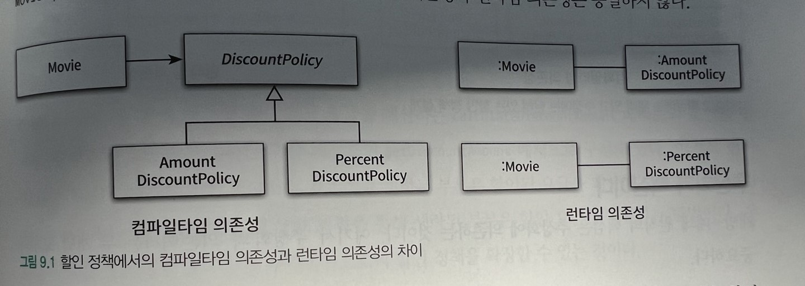
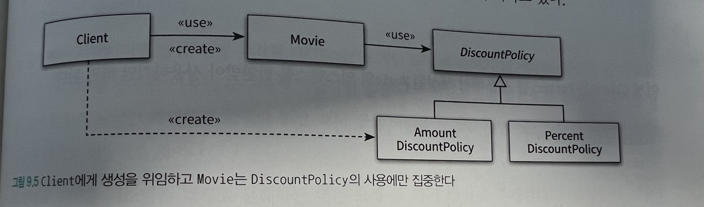
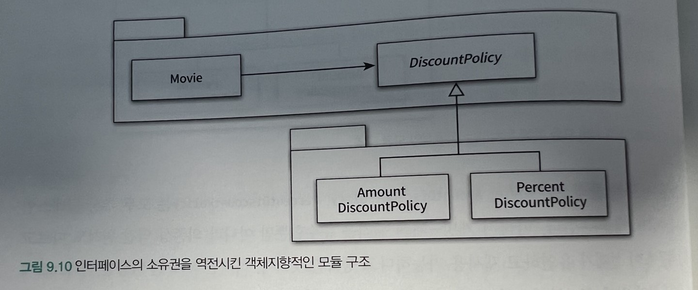

# 유연한 설계

## 개방-폐쇄 원칙

로버트 마틴은 확장 가능하고 변화에 유연하게 다응할 수 있는 설계를 만들 수 있는 원칙 중 하나로 OCP을 고안했다.

**소프트웨어 개체(클래스,모듈,함수)는 확장에 열려있어야 하고 수정에 대해서는 닫혀 있어야 한다.**

확장과 수정은 동작과 코드의 관점을 반영한다.

-   확장에 대해 열려있다 : 요구사항이 변경될때 새로운 동작을 추가해서 기능을 확장할 수 있다.
-   수정에 대해 닫혀있다 : 기존의 코드를 수정하지 않고 동작을 추가하거나 변경할 수 있다.

### 컴파일 타임 의존성을 고정시키고 런타임 의존성을 변경하라.



개방-폐쇄 원칙을 수용하는 코드는 컴파일타임 의존성을 수정하지 않고도 런타임 의존성을 쉽게 변경할 수 있다.

### 추상화가 핵심이다.

**개방-폐쇄 원칙의 핵심은 추상화에 의존하는 것이다.**

변하지 않는 부분을 고정하고 변하는 부분을 생략하는 추상화 메커니즘이 개방-폐쇄원칙의 기반이 된다. 언제라도 추상화의 생략된 부분을 채워 넣음으로써 새로운 문맥에 맞게 기능을 확장할 수 있다. 따라서 추상화는 설계의 확장을 가능하게 한다.

단순히 어떤 개념을 추상화했다고 해서 수정에 대해 닫혀있는 설계를 만들 수 있는 것은 아니다. 개방-폐쇄 원칙에서 폐쇄를 가능하게 하는 것은 의존성의 방향이다.

## 생성 사용 분리

객체 생성을 피할 수는 없다. 객체를 생성하기만 하던가 메시지를 보내기만 하던가. 동일한 클래스에서 하나만

유연하고 재사용가능한 설계를 원한다면 객체와 관련된 두 가지 책임을 서로 다른 객체로 분리해야한다.

하나는 객체를 생성하는 것이고, 다른 하나는 객체를 사용하는 것이다.

사용으로부터 생성을 분리하는 데 가장 보편적인 방법은 객체를 생성할 책임을 클라이언트로 옮기는 것.

의존성을 추상화로 제한하기 때문에 확장에 대해서는 열려있으면서도 수정에 대해서는 닫혀있는 코드를 만들 수 있다.

### FACTORY 추가하기

객체 생성과 관련된 책임만 전담하는 별도의 객체를 추가하고 client는 이 객체를 사용하도록 만들 수 있다. -> factory

```java
public class Factory{
  public Movie createAvatarMovie(){
    return new Movie("아바타",Duration.ofMinutes(120),
    Money.wons(10000),
    new AmountDiscountPolicy(...))
  }
}
```

### 순수한 가공물에게 책임 할당하기

책임 할당의 가장 기본이 되는 원칙은 책임을 수행하는 데 필요한 정보를 가장 많이 알고 있는 INFORMATION EXPERT에게 책임을 할당하는 것이다.

도메인 모델은 정보 전문가를 찾기 위해 참조할 수 있는 일차적인 재료다. 어떤 책임을 할당하고 싶다면 제일 먼저 도메인 모델 안의 개념 중에서 적절한 후보가 존재하는지 찾아봐야한다.

FACTORY는 도메인에 속하지 않는다 순수하게 기술적인 결정이다. 전체적으로 결합도를 낮추고 재사용성을 높이기 위해 도메인 개념에게 할당돼 있던 객체 생성 책임을 가공의 객체로 이동시킨것

크레이그 라만은 시스템을 객체로 분해하는 데는 두 가지 방식이 존재한다고 설명한다.

-   표현적 분해(도메인)

    -   도메인에 존재하는 사물 또는 개념을 표현하는 객체들을 이용해 시스템을 분해하는 것을 말한다.

    -   도메인 모델에 담겨 있는 개념과 관계를 따르며 도메인과 소프트웨어 사이의 표현적 차이를 최소화하는 것이 목적

    -   객체지향 설계를 위한 가장 기본적인 접근법이다.

-   행위적 분해(service, repository?)

    -   도메인 개념을 표현한 객체가 아닌 설계자가 편의를 위해 임의로 만든 객체를 이용해 시스템을 분해하는 것을 말한다.

    -   도메인 개념을 표현하는 객체에게 책임을 할당하는 것만으로는 부족한 경우가 발생한다.

    -   데이터베이스 접근을 위한 객체와 같이 도메인 개념들을
        초월하는 기계적인 개념도 필요한 경우가 있다.

    -   책임을 할당하기 위해 창조되는 도메인과 무관한 인공적인 객체를 PURE FABRICATION(순수한 가공물)이라 한다.

    -   어떤 행동을 추가하려고 하는데 이 행동을 책임질 마땅한
        도메인 개념이 존재하지 않는 경우 PURE FABRICATION을 생성하고 이 객체에게 책임을 할당하면 된다.

    -   객체지향 애플리케이션에서는 도메인 개념을 반영하는 객체들 보다 인공적으로 창조한 객체들이 더 많은 비중을 차지한다.

도메인 개념이 만족스럽지 못하다면 인공적인 객체를 창조하라.

## 의존성 주입

외부의 독립적인 객체가 인스턴스를 생성한후 이를 전달해서 의존성을 해결하는 기법

-   생성자 주입
-   setter 주입
-   메서드 주입

### 숨겨진 의존성은 나쁘다.

의존성 주입 외에도 의존성을 해결할수 있는 다양한 방법이 있다

그중 하나로 SERVICE LOCATOR 패턴이다. SERVICE LOCATOR는 의존성을 해결할 객체들을 보관하는 일종의 저장소다.

```java
public class ServiceLocator{
  private static ServiceLocator soleInstance = new ServiceLocator();

  public static DiscountPolicy discountPolicy(){
    return soleInstance.discountPolicy;
  }

  public static void provide(DiscountPolicy discountPolicy){
    soleInstance.discountPolicy = discountPolicy;
  }

}
```

## 의존성 역전 원칙

### 추상화와 의존성 역전

Movie와 AmountDiscountPolicy사이의 협력이 가지는 본질은 영화의 가격을 계산하는 것이다. 어떻게 할인 금액을 계산할 것인지는 협력의 본질이 아니다.

협력에서 중요한 정책이나 의사결정, 비즈니스의 본질을 담고 있는 것은 상위 수준의 클래스다.

상위수준의(Movie)클랫가 하위수준(AmountDiscountPolicy)의 클래스에 의존한다면 하위 수준의 변경에 의해 상위 수준 클래스가 영향을 받게 될 것이다.

하위수준을 변경(AmountDiscountPolicy -> PercentDiscountPolicy)로 변경한다고 해서 상위수준(Movie)가 영향을 받아서는 안된다.

그렇기에 추상화의 의존해야 함(이래서 추상화인터페이스는 같은 도메인에 엮이는 건가? 하위로 취급이 아니라?)

-   상위 수준 모듈은 하위 수준의 모듈에 의존해서는 안된다. 둘 모두 추상화에 의존해야 한다.

-   추상화는 구체적인 사항에 의존해서는 안 된다. 구체적인 사항은 추상화에 의존해야 한다.

### 의존성 역전 원칙과 패키지


추상화를 별도의 독립적인 패키지가 아니라 클라이언트가 속한 패키지에 포함시켜야 한다. 함께 재사용될 필요가 없는 클래스들은 별도의 독립적인 패키지에 모셔야 한다. (SEPARATED INTERFACE 패턴)

의존성 역전 원칙에 따라 상위 수준의 협력 흐름을 재사용하기 위해서는 추상화가 제공하는 인터페이스의 소유권 역시 역전시켜야 한다.

## 유연성에 대한 조언

### 유연한 설계는 유연성이 필요할 때만 옳다.

유연하고 재사용 가능한 설계가 항상 좋은 것은 아니다. 설계의 미덕은 단순함과 명확함으로부터 나온다.

단순하고 명확한 코드는 읽기 쉽고 이해하기도 편하다. 유연한 설계는 이와는 다른 길을 걷는다. 변경하기 쉽고 확장하기 쉬운 구조를 만들기 위해서는 단순함과 명확함의 미덕을 버리게 될 가능성이 높다.

유연한 설계라는 말의 이면에는 복잡한 설계라는 의미가 숨어있다.

불빌요한 유연성은 불필요한 복잡성을 낳는다.

### 협력과 책임이 중요하다.

설계를 유연하게 만들기 위해서는 역할, 책임, 협력에 초점을 맞춰야한다. 다양한 컨텍스트에서 협력을 재사용할 필요가 없다면 설계를 유연하게 만들 당위성도 함께 사라진다.

객체들이 동일한 메시지에서 동일한 역할을 수행하는지 판단할 수 없다면 추상화를 도출할 수 없다.

비즈니스 로직을 처리하기 위해 책임을 할당하고 협력의균형을 맞추는 것이 객체 생성에 관한 책임을 할당하는 것보다 우선이다.

객체를 생성하는 방법을 자신이 신경쓰기 전에 시스템에 필요한 책임들을 먼저 생각하자.
