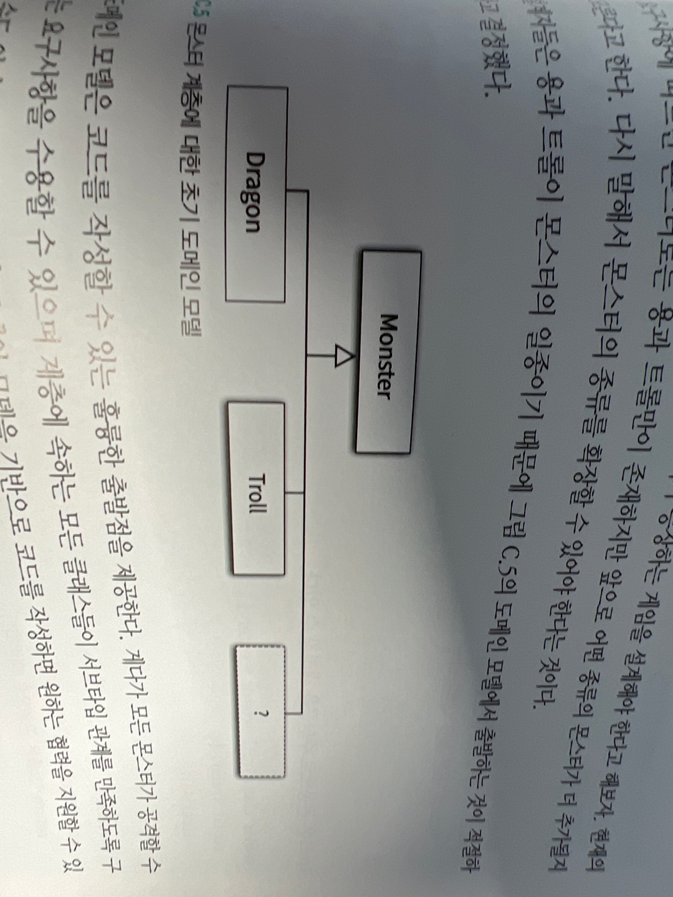

# 동적인 협력, 정적인 코드

객체는 동적이다. 프로그램은 정적이다. 객체는시간에 따라 다른 객체와 협력하며 계속 변화한다. 프로그램은 고정된 텍스트라는 형식에 갇혀 있으면서도 객체의 모든 변화 가능성을 담아야 한다.

프로그래머는 두가지 모델을 동시에 마음속에그려야 한다.

-   프로그램 실행 구조를 표현하는 움직인는 동적 모델
-   코드의 구조를 담는 고정된 정적 모델

정적 모델은 동적 모델에 의해 주도돼야 하고 동적 모델이라는 토대위에 세워져야 한다. 프로그램 코드 안에 담아지는 정적 모델은 객체 사이의 협력에 기반해야 한다.

설계가 필요한 이유는 변경을 수용할 수 있는 코드를 만들기 위함 응집도 높고 결합도 낮고 중복코드없는

## 동적 모델과 정적 모델

### 행동이 코드를 결정한다.

협력에 참여하는 객체의 행동이 객체의 정적 모델을 결정해야 한다.
ex. 새, 펭귄, 날다.

객체의 정적 모델은 동적 모델이라는 토대 없이는 완전해질 수 없다. 가장 중요한 것은 객체가 외부에 제공하는 해동이다. 정적 모델을 설계하는 이유는 단지 행동과 변경을 적절하게 수용할 수 있는 코드구조를 찾는 것이어야 한다.

### 변경을 고려하라

객체가 제공하는 행동의 측면에서 적절하게 정적 모델을 고려하더라도 변경을 고려하지 않는다면 보수하기 어려운 코드가 만들어 진다.

상속계층을 합성으로

## 도메인 모델과 구현

### 도메인 모델에 관하여

도메인이란 : 사용자가 프로그램을 사용하는 대상 영역을 가리킨다.

모델이란 : 지식을 선택적으로 단순화 하고 의식적으로 구조화한 형태다

모메인 모델이란 : 사용자가 프로그램을 사용하는 대상 영역에 대한 지식을 선택적으로 단순화 하고 의식적으로 구조화한 형태다.

객체지향 분석 설계에서 제안하는 지침중 하나는 소프트웨어의 도메인에 대해 고민하고 도메인 모델을 기반으로 소프트웨어를 구축하라는 것.

도메인 모델을 작성하는 것은 목표가 아니라 출발점이다.

### 몬스터 설계하기


이 도메인 모델은 코드를 작성할 수 있는 휼룡한 출발점을 제공한다.

```java
public abstract class Monster{
  private int health;

  public Monster(int health){
    this.health = health;
  }

  abstract public String getAttack();
}

public class Dragon extends Monster{
  public Dragon(){
    super(230);
  }

  @Override
  public String getAttack(){
    return "용은 불을 내뿜는다";
  }
}

public class Troll extends Monster{
  public Troll(){
    super(48);
  }

  @Override
  public String getAttack(){
    return "트롤은 곤봉으로 때린다";
  }
}
```

지금까지는 깔끔하지만 계속 새로운 몬스터가 늘어난다면 getAttack 메서드를 오러바이딩하는 일은 매우 지루하다.

이제 어떤 변경이 필요한지 명확해졌다. 새로운 몬스터를 쉽게 추가하고 설계는 이런 변경을 쉽게 지원할 수 있게 개선되어야 한다.

현재의 설계를 변경하기 어려운 이유는 새로운 몬스터가 필요할 때 마다 새로운 클래스를 추가해야 하기 때문.(물론 새로운 코드를 추가하는데 기존 코드를 수정하지 않고 확장 가능하므로 개방-폐쇄원칙을 준수중)

더 좋은 방법은 새로운 서브 클래스를 추가하는 대신 몬스터가 품종을 가지도록 설계를 개선

Monster 클래스가 하나의 Breed클래스를 합성관계로 포함하는 설계로 개선

```java
public class Breed{
  private String name;
  private int health;
  private String attack;

  public Breed(string name, int health, String attack){
    this.name = name;
    this.health = health;
    this.attack = attack;
  }
  //getter..
}

public class Monster{
  private Breed breed;

  public Moster(Breed breed){
    this.breed = breed;
  }

  public String getAttack(){
    return breed.getAttack();
  }
}

Monster dragon = new Monster(new Breed("용", 230,"용은 불을 뿜는다"));
```

이제 새로운 몬스터의 종류를 추가하는 것은 새로운 클래스를 추가하는 것이 아니라 새로운 인스턴스를 생성하고 monster인스턴스에 연결하는 작업으로 바뀐다.

유연성을 향상 시키기 위해 합성을 사용했던 핸드폰 요금 시스템의 경우와는 달리 여기서 합성을 사용한 이유는 새로운 Monster타입이 추가될 때 마다 새로운 클래스를 추가하고 싶지 않기 때문.

### 행동과 변경을 고려한 도메인 모델

우리는 도메인 모델을 먼저 만들고 만들어진 도메인 모델에 표현된 개념과 관계를 기반으로 협력에 필요한 객체의 후보를 도출하고 구현 클래스의 이름과 관계를 설명한다.

하지만. 도메인 모델은 그대로 카피해서는 안된다. 초기의 도메인 모델은 그저 작업을 시작하기 위한 거친 아이디어 덩어리일 뿐이다.

더 많은 지식이 쌓이고 요구사항이 분명해지면 초기의 아이디어에 대한 미련을 버리고 현명한 판단을 내려야 한다.

초기의 도메인 모델은 좋은 출발점이 될 수는 있지만. 객체의 행동과 변경이라는 요소를 고려하면 빠르게 그 가치가 떨어진다.

더 좋은 모델(변경,확장 쉬운)이 떠올랐다면 과감하게 초기 아이디어를 버려라

객체지향의 핵심은 객체사이의 협력이며 셜계는 변경을 위한것이다.

변경후(bread사용)가 변경전(시작)보다 더 유용한 도메인모델이다.

### 분석 모델, 설계 모델, 그리고 구현 모델

코드의 도메인은 개념적인 분류 체계가 아니라 객체의 행동과 변경에 영향을 받는다.

분석 모델, 설계모델, 구현 모델 사이의 어떤 차이점도 존재하지 않는다.

객체지향 패러다임이 강력한 이유는 전체 개발 주기에 걸쳐 동일한 기법과 표현력을 유지할 수 있다는 점이다.

분석,설계,구현 단계 사이에 세부적인 내용은 다를 수 있겠지만. 설계의 초점은 동일하다 행동과 변경에 초점을 맞추는것
