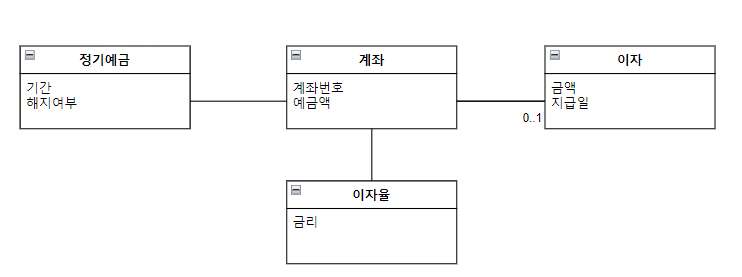

# 객체 지도

지도와 같이 자주 변경되는 기능이 아니라 안정적인 구조를 따라 역할, 책임, 협력을 구성하라.

## 기능 설계 대 구조 설계

소프트웨어 제품 설계에는 두 가지 측면이 존재한다. 하나는 기능(function) 하나는 구조(structure)설계다.

기능 측면의 설계는 제품이 사용자를 위해 무엇을 할 수 있는지에 초점을 맞춘다.

구조 측면의 설계는 제품의 형태가 어떠해야 하는지에 초점을 맞춘다.

설계의 가장 큰 도전은 기능과 구조라는 두 가지 측면을 함께 녹여 조화를 이루도록 만드는 것이다.

휼룡한 기능히 휼룡한 소프트웨어를 만드는 충분조건이라고 한다면 휼룡한 구조는 휼룡한 소프트웨어를 만드는데 필요조건이다.

요구사항은 변경되기 때문에 변경을 수용할 수 있는 선택의 여지를 설게에 마련해 놓는 것이다.

**객체지향 접근 방법은 자주 변경되지 않는 안정적인 객체 구조를 바탕으로 시스템 기능을 객체 간의 책임으로 분배한다.**

## 두 가지 재료 : 기능과 구조

-   구조는 사용자나 이해관계자들이 도메인(domain)에 관해 생각하는 개념과 개념들 간의 관계로 표현한다.

-   기능은 사용자의 목표를 만족시키기 위해 책임을 수행하는 시스템의 행위로 표현한다.

**일반적으로 기능을 수집하고 표현하기 위한 기법을 유스케이스 모델링이라 하고, 구조를 표현하기 위한 기법을 도메인 모델링 이라고 한다.**

## 안정적인 재료 : 구조

### 도메인 모델

도메인과 모델의 정의를 연결하면 도메인 모델을 쉽게 정의할 수 있다.

**도메인 모델이란 사용자가 프로그램을 사용하는 대상 영역에 관한 지식을 선택적으로 단순화하고 의식적으로 구조화한 형태다**

도메인 모델은 소프트웨어가 목적하는 영역 내의 개념과 개념 간의 관계, 다양한 규칙이나 제약등을 주의 깊게 추상화 한것이다.

도메인 모델은 이해관계자들이 바라보는 멘탈모델(Mental Model)이다. 멘탈 모델이란 사람들이 자기 자신, 다른 사람, 환경, 자신이 상호작용하는 사물들에 대해 갖는 모형이다.

도메인 모델은 도메인에 대한 사용자 모델, 디자인 모델, 시스템 이미지를 포괄하도록 추상화한 소프트웨어 모델이다. 따라서 도메인 모델은 소프트웨어에 대한 멘탈 모델이다.

### 도메인의 모습을 담을 수 있는 객체지향

최종 코드는 사용자가 도메인을 바라보는 관점을 반영해야 한다. 이것은 곧 도메인 모델을 기반으로 설계돼야 한다는 것을 의미한다.

도메인 모델이란 사용자들이 도메인을 바라보는 관점이며, 설계자가 시스템의 구조를 바라보는 관점인 동시에 소프트웨어 안에 구현된 코드의 모습 그 자체이기 때문이다.

객체지향을 이용하면 도메인에 대한 사용자모델, 디자인모델, 시스템 이미지 모두가 유사한 모습을 유지하도록 만드는 것이 가능하다. 이러한 특성을 연결완전성, 또는 표현적 차이라고한다.

### 표현적 차이

소프트웨어 객체는 현실 객체에 대한 추상화가 아니다. 소프트웨어 객체와 현실객체 사이의 관계를 가장 효과적으로 표현할 수 있는 단어는 바로 은유다.

소프트웨어 객체와 현실 객체 사이의 의미적 거리를 가리켜 표현적 차이 또는 의미적 차이라고한다.

핵심은 은유를통해 현실객체와 소프트웨어 객체 사이의 차이를 최대한 줄이는 것이다.

소프트웨어 객체는 그 대상이 현실적인지, 현실적이지 않은지에 상관없이 도메인 모델을 통해 표현되는 도메인 객체들을 은유해야 한다.

도메인 모델을 기반으로 설계하고 구현하는 것은 사용자가 도메인을 바라보는 관점을 그대로 코드에 반영할 수 있게 한다.

-   도메인 모델 : 도메인의 개념들을 코드에서 사용할 개념과 관계를 제공

-   구현 : 도메인의 개념과 관계를 은유해서 코드를 작성한다.

### 불안정한 기능을 담는 안정적인 도메인 모델

도메인 모델의 핵심은 사용자가 도메인을 바라보는 관점을 반영해 소프트웨어를 설계하고 구현하는 것이다.

도메인에 대한 사용자의 괁머을 반영해야 하는 이유는 사용자들이 누구보다도 도메인의 본질적인 측면을 가장 잘 이해하고 있기 때문이다.

본질적이라는 것은 변경이 적고 그 특성이 오랜 시간 유지된다는 것을 의미한다.

### 예제

정기 예금 도메인 모델

-   정기 예금은 예금주가 일정 기간 환급을 요구하지 않을 것을 약정하고 일정 금액을 은행에 예치하는 에금방식이다. 은행은 약정 기간이 지나면 예금주에게 일정 비율의 이자를 지급한다. 적금과 달리 정기 예금은 계좌를 개설할 때 목돈을 예금한 후 일정 기간이 지난 후에 목돈에 대한 이자를 받는 것이 목적이므로 적금보다 이자율이 일반적으로 높다.

-   은행도메인의 관점에서 정기예금은 약정 기간이 지난 후 이자를 지급하고 해지하는 금융 상품의 일종이다.
    -   예금주가 정기 예금을 신청하면 은행은 예금주가 일정 금액을 예치할 수 있게 신규 계좌를 개설한다. 모든 정기 예금은 만기 시 특정한 이자율에 따라 이자를 지급한다.

-   정기예금 : 예금 기간과 이미 해지된 예금인지 여부를 나타내는 속성을 포함한다.
-   계좌 : 예금주가 예치한 예금액을 보관, 특정한 정기예금에 속하므로 정기예금과 관계를 맺는다.
-   이자율 :
    -   만기시 예금주에게 지급할 이자를 계산하기 위해 필요한 금리정보를 포함한다.
    -   특정한 계좌에 대한 금리정보를 나타내므로 계좌와 관계를 맺어야 한다.
-   이자 :
    -   예금액을 알고있는 계좌와 관계를 맺는 것이 적절하다.
    -   만기 시점에 지급되며 예금기간 동안에는 존재하지 않는다.
    -   계좌와 이자 사이에는 0또는 1의 다중성이 존재한다.
    -   만기가 되지 않더라도 중도에 해지가 가능하므로 정기예금의 기간이 반드시 이자의 지급일자와 동일하지 않다. 따라서 이자는 지급일을 별도로 둔다.

이 모델은 멘탈 모델을 구성하는 세가지 모델중 사용자 모델의 관점을 반영한다

## 불안정한 재료 : 기능

소프트웨어의 기능을 기술하기 위해 사용되는 기법

### 유스케이스

유스케이스는 시스템의 이해관계자들 간의 계약을 행위 중심으로 파악한다. 유스케이스는 이해 관계자들 중에서 일차 액터라 불리는 행위자의 요청에 대한 시스템의 응답으로서, 다양한 조건하에 있는 시스템의 행위를 서술한다. 일차 액터는 어떤 목표를 달성하기 위해 시스템과의 상호작용을 시작한다. 시스템은 모든 이해 관계자들의 요구에 응답하고 이해관계를 보호해야 한다. 특별한 요청과 관계되는 조건에 따라 서로 다른 일련의 행위 혹은 시나리오가 전개될 수 있다.

일차 액터란 : 시스템의 서비스 중 하나를 요청하는 이해관계자로 일반적으로 시스템과 연동하는 외부 시스템 역시 일차 액터의 범주에 포함시킨다.

-   예제

    -   유스케이스 명 : 중도 해지 이자액을 계산한다.
    -   일차 액터 : 예금주
    -   주요 성공 시나리오:

        -   예금주가 정기 예금 계좌를 선택한다.
        -   시스템은 정기 예금 계좌 정보를 보여준다.
        -   예금주가 금일 기준으로 예금을 해지할 경우 지급받을 수 있는 이자 계산을 요청한다.
        -   시스템은 중도 해지 시 지급받을 수 있는 이자를 계산한 후 결과를 사용자에게 제공한다.

    -   확장 :
        -   사용자는 해지 일자를 다른 일자로 입력할 수 있다.

-   유스케이스는 사용자와 시스템 간의 상호작을 보여주는 텍스트다. (다이어 그램 x) 중요한 것은 유스케이스 안에 포함돼 있는 상호작용의 흐름이다.

-   유스케이스는 하나의 시나리오가 아니라 여러 시나리오의 집합이다.

-   유스케이스는 단순한 피쳐(feature) 목록과는 다르다. 피처는 시스템이 수행해야하는 기능의 목록을 단순하게 나열한 것이다.

    -   예제에서의 피쳐는 시스템은 정기예금 정보를 보여준다, 시스템은 당일이나 현재일자의 이자를 계산한다이다.

-   유스케이스는 사용자 인터페이스 관련된 세부 정보를 포함하지 말아야 한다. 자주 변경되는 사용자 인터페이스 요소는 배제하고 사용자 관점에서 시스템의 행위에 초점을 맞춘다.

-   유스케이스는 내부 설계와 관련된 정보를 포함하지 않는다. 유스케이스의 목적은 연관된 시스템의 기능을 이야기 형식으로 모으는 것이지 내부 설계를 설명하는 것이 아니다.

### 유스케이스는 설계 기법도 객체지향 기법도 아니다.

유스케이스는 단지 사용자가 바라보는 시스템의 외부 관점만을 표현한다 시스템의 내부 구조나 실행 메커니즘에 관한 어떤 정보도 제공하지 않는다.

## 재료 합치기: 기능과 구조의 통합

### 도메인 모델, 유스케이스, 그리고 책임-주도 설계

불안정한 기능을 안정적인 구조 안에 담음으로써 변경에 대한 파그효과를 최소화 하는 것은 휼룡한 객체지향 설계자가 갖춰야 할 기본적인 설계 능력이다.

도메인 모델은 안정적인 구조를 개념하기 위해 , 유스케이스는 불안정한 기능을 서술하기 위해 가장 일반적으로 사용되는 도구다.

변경에 유연한 소프트웨어를 만들기 위해서는 유스케이스에 정리된 시스템의 기능을 도메인 모델을 기반으로 한 객체들의 책임으로 분배해야 한다.

협력을 완성하는데 필요한 메시지들을 식별하면서 객체들에게 책임을 할당해 나간다.

마지막으로 협력에 참여하는 객체를 구현하기 위해 클래스를 추가하고 속성과 함께 메서드를 구현하면 시스템의 기능이 완성된 것이다.

요구사항을 식별하고 도메인 모델을 생성한 후, 소프트웨어 클래스에 메서드를 추가하고, 요구사항을 충족시키기 위해 객체들 간의 메세지 전송을 정의하라.

유스케이스에 명시된 시스템의 행위를 객체의 책임으로 분배해야한다.

도메인 모델을 기반으로 이자 계산이라는 시스템 책임을 아래와 같이 책임으로 분할하고 객체들에게 할당함으로써 협력하는 객체들의 공동체를 형성할 수 있다.

-   정기 예금은 해지 일자를 전달받아 이자 계산을 시작하는 책임을 맡는다. 정기예금은 해당 일자가 약정 기간에 포함되는지 확인한 후 포함될 경우 계좌에게 이자 계산을 요청한다.
-   계좌는 예금액과 해지 일자를 이자율에게 전달해서 이자를 계산하게 한다.
-   이자율은 전달받은 예금액과 해지 일자를 이용해 이자액을 계산한 후 이자액을 포함하는 이자를 생성해서 반환한다.

이제 객체와 책임이 식별 됐으므로 객체를 클래스로, 책임을 메서드로 변환함으로 써 이자 계산 기능을 구현할 수 있다.

책임은 도메인 모델에 정의한 개념의 정의에 부합하도록 할당한다. 이자를 계산하는 책임을 가진 객체 -> 이자율, 이자는 이자율에 의해 생성

### 기능 변경을 흡수하는 안정적인 구조

도메인 모델이 안정적인 이유는 도메인 모델을 구성하는 요소가 다음과 같은 특징을 가지기 때문이다.

-   도메인 모델을 구성하는 개념은 비즈니스가 없어지거나 완전히 개편되지 않는 한 안정적으로 유지된다. 정기 예금 도메인에서 정기예금과 계좌, 이자율, 이자란 개념은 정기예금이란 금융상품이 없어지거나 완전히 개편되지 않는 한 안정적으로 유지되는 개념이다.

-   도메인 모델을 구성하는 개념 간의 관계는 비즈니스 규칙을 기반으로 하기 때문에 비즈니스 정책이 크게 변경되지 않는 한 안정적으로 유지된다. 정기예금 도메인에서 이자는 정기예금이 만기가 되거나 중도 해지를 하는 경우에 한해서 단 한 번 지급된다. 따라서 게좌와 이자간의 0..1관계는 이와 같은 핵심적인 비즈니스 규칙이 변경되지 않는 한 동일하게 유지될 것이다.

만약 요구사항으로 단기이자와 복리이자를 계산하는 방식이 추가된다면 이자율을 슈퍼크래스로 두고 복리이자, 단기이자를 하위클래스로 두면 됨

핵심 클래스 간의 관계는 그대로 유지된다.

연결완전성 : 객체지향은 도메인 모델링에서 사용한 객체와 개념을 프로그래밍 설계에서 객체와 클래스로 매끄럽게 변환할 수 있다

가역성 : 코드를 보고 도메인 모델링으로 변환
