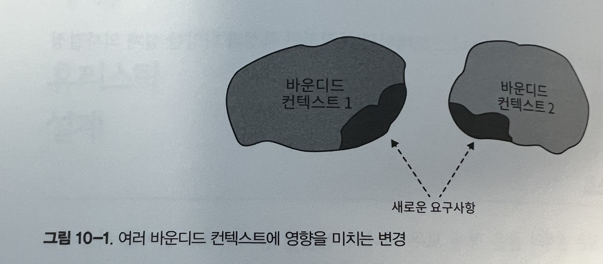
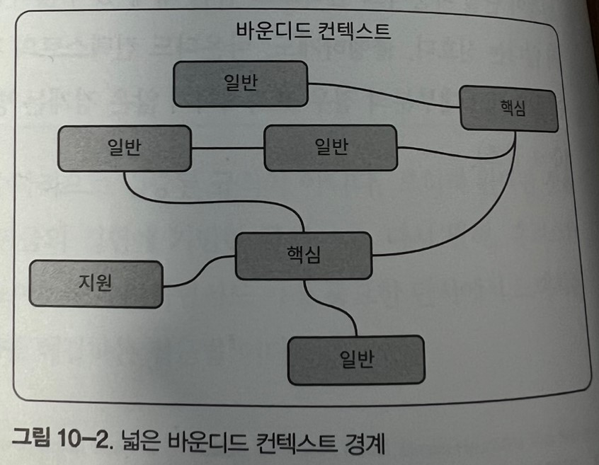
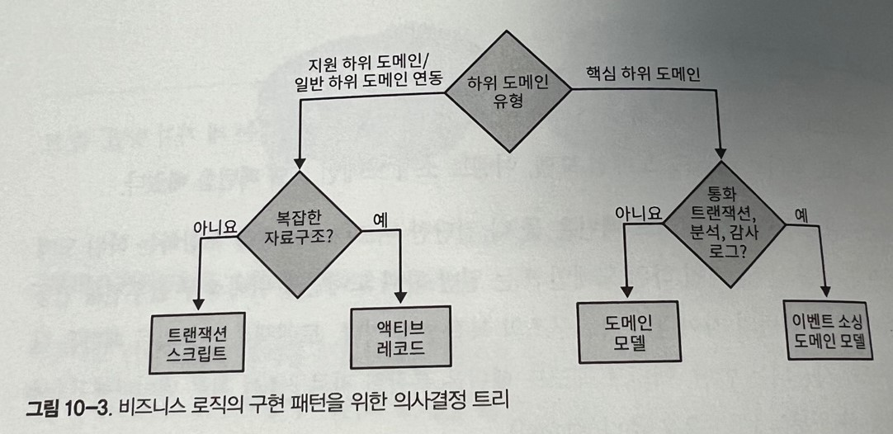
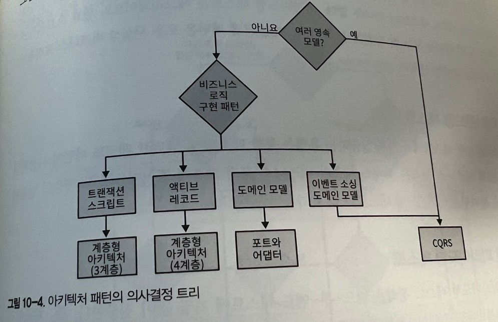
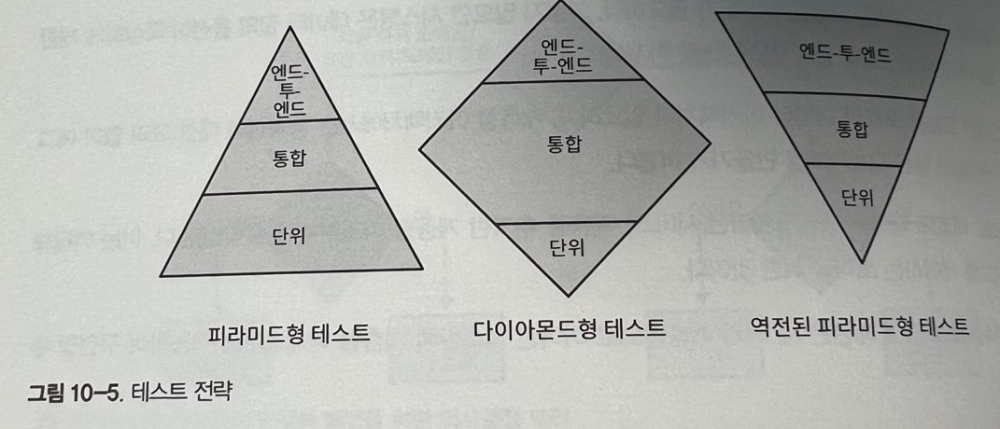
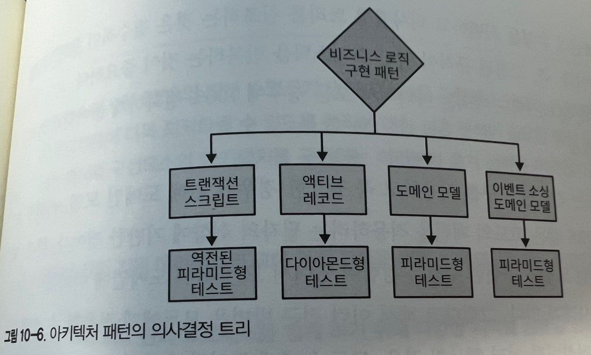
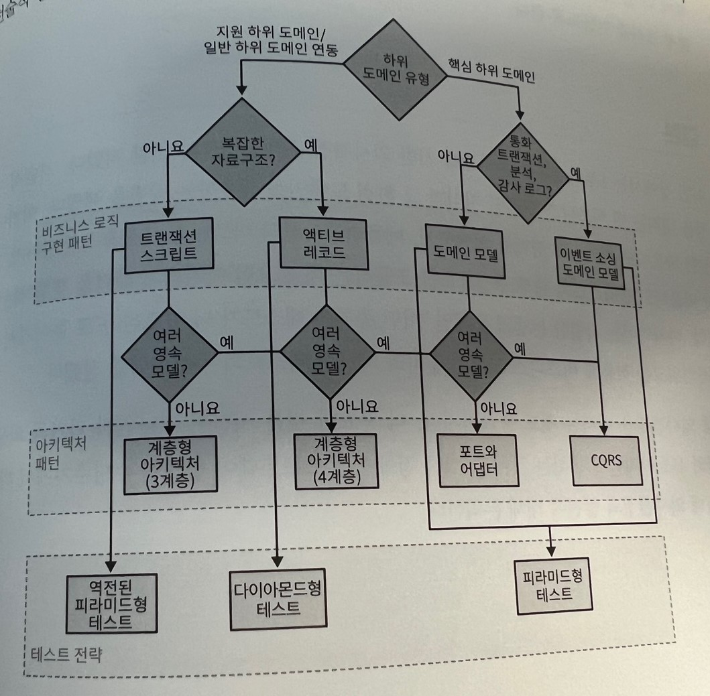

# 휴리스틱 설계

## 휴리스틱

휴리스틱은 모든 상황에 맞게 보장되고 수학적으로 검증된 규칙이 아니다. 오히려 완벽한 것을 보장하지는 않지만 당면한 목적에 충분할 만큼의 경험에 기반한 규칙이다.

다시말해, 휴리스틱을 사용하는 것은 수많은 단서에 내재된 노이즈를 무시하면서도 가장 중요한 단서에서 느껴지는 '압도하는 힘'에 집중하여 효과적으로 문제를 해결하는 접근법이다.

이번 장에 제시된 휴리스틱은 다양한 비즈니스 도메인의 본질적인 특성과 다양한 설계 의사결정으로 해결하는 문제의 본질에 집중한다.

## 바운디드 컨텍스트

넓은 경계와 좁은 경계 모두 하나의 일관된 유비쿼터스 언어를 사용하는 유효한 바운디드 컨텍스트의 정의에 부합한다.

**한 서비스의 경계를 정의하는 데 있어 식별을 용이하게 해주는 유용한 휴리스틱은 매우 많다. 그러나 그중 크기로 경계를 구분하는 것은 가장 도움이 되지 않는다.**

작은 바운디드 컨텍스트로 만들려고 기능을 원하는 크기에 최적화해서 모델링하는 것 보다는 그 반대로 하는 것이 훨씬 더 효과적이다. 모델의 어떤 기능이 포함하는 크기 그대로 바운디드 컨텍스트를 다루는 것이다.

여러 바운디드 컨텍스트에 영향을 미치는 소프트웨어의 변경을 비싸고 수많은 조율이 필요하다. 특히, 영향을 받은 바운디드 컨텍스트를 다양한 팀에서 구현한 경우에는 더욱 그렇다. 또한 이러한 변경이 단일 바운디드 컨텍스트 범위 내에 있지 않다면 이는 컨텍스트 경계의 설계가 효과적이지 않다는 신호다.

바운디드 컨텍스트 경게를 리팩터링하는 것은 비용이 많이 드는 작업이고 대부분의 경우 효과적이지 않은 경계는 방치되고 결국 기술 부채로 남게 된다.

바운디드 컨텍스트의 경계를 무효화하는 변경은 일반적으로 비즈니스 도메인이 잘 알려져 있지 않거나 비즈니스 요구사항이 빈번하게 바뀔 때 발생한다. 변동성과 불확실성이 핵심 하위 도메인의 특성이고, 특히 구현의 초기 단계에 그렇다는 것을 1장에서 배웠다. 따라서 바운디드 컨텍스트의 경계를 설계할 때 이런 특성을 휴리스틱으로 사용할 수 있다.

넓은 바운디드 컨텍스트의 경계 또는 여러 하위 도메인에 걸친 경계는 그 경계 또는 하위 도메인을 포함하는 모델이 잘못돼도 안전하게 해준다. 논리적 경계를 리팩토링하는 것은 물리적 경계를 리팩터링 하는 것보다 적은 비용이 든다.

그러므로 바운디드 컨텍스트를 설계할 때는 경계를 넓게 해서 시작하자. 나중에 도메인 지식이 쌓이게 되면 필요에 따라 넓은 경계를 좀더 작은 여러 경계로 쪼갠다.

일반 하위 도메인과 지원 하위 도메인은 모두 정형화되어 있고 변동성이 훨씬 적으므로 이 같은 휴리스틱은 주로 핵심 하위 도메인을 포함하는 바운디드 컨텍스트에 적용된다.

핵심 하위 도메인을 포함하는 바운디드 컨텍스트를 설계할 때 그 핵심 도메인이 가장 빈번하게 상호작용하는 다른 하위 도메인을 포함하면 예측하지 못한 변경으로부터 스스로를 보호할 수 있다.

## 비즈니스 로직 구현 패턴

5~7장을 통해 트랜잭션 스크립트, 액티브 레코드, 도메인 모델, 이벤트 소싱 도메인 모델 패턴을 배웠다.

트랜잭션 스크립트와 액티브 레코드 패턴은 둘 다 간단한 비즈니스 로직을 포함하는 하위 도메인에 적합하다. 예를 들어, 지원 하위 도메인 또는 일반 하위 도메인을 위해 외부 솔루션을 연동하는 것 등이다. 두 패턴의 차이점은 자료구조의 복잡성에 있다.

트랜잭션 스크립트 패턴은 단순히 자료구조에 사용되는 반면, 액티브 레코드 패턴은 복잡한 자료구조를 하부 데이터베이스에 매핑하는 것을 한데 묶는데 도움을 준다. (캡슐화)

도메인 모델과 그 변형인 이벤트 소싱 도메인 모델은 복잡한 비즈니스 로직을 가진 핵심 하위 도메인에 적합하다. 예를 들어, 통화 트랜잭션을 다루거나 법에 따라 감사 로그를 제공하거나 시스템의 동작을 심층적으로 분석할 필요가 있는 핵심 하위 도메인의 경우 이벤트 소싱 도메인 모델이 적합하다.

이 모든 것을 고려한다면, 비즈니스 로직의 적적한 구현 패턴을 선택하기 위한 효과적인 휴리스틱은 다음과 같은 질문을 해보는 것이다.

-   하위 도메인이 금전 또는 통화의 트랜잭션을 추적하거나, 일관된 감사 로그를 제공하거나, 또는 비즈니스에서 하위 도메인의 동작에 대한 심층적인 분석을 요청하는가? -> 이벤트 소싱 도메인 모델을 적용한다.
-   하위 도메인의 비즈니스 로직이 복잡한가? -> 도메인 모델을 구현한다.
-   하위 도메인이 복잡한 자료구조를 포함하는가? -> 액티브 레코드 패턴을 사용한다.
-   아무것도 해당 되지 않으면 트랜잭션 스크립트를 구현한다.

하위 도메인의 복잡성과 그 유형은 강한 관계가 있으므로 이를 그림과 같이 도메인 주도 의사결정 트리로 나타낼 수 있다.

복잡한 비즈니스 로직과 간단한 비즈니스 로직의 차이점을 정의하는 데도 또 다른 휴리스틱을 사용할 수 있다.

두 유형의 비즈니스 로직 사이의 경계가 아주 명확하지는 않지만, 그래도 유용하다. 일반적으로 복잡한 비즈니스 로직은 복잡한 비즈니스 규칙, 불변성, 알고리즘을 포함한다. 간단한 접근 방법은 주로 입력을 검증하는 것이다. 또한 유비쿼터스 언어 자체의 복잡성을 평가하는 다른 휴리스틱도 있다. 예로 언어에서 주로 CRUD동작을 표현하는가? 아니면 좀 더 복잡한 비즈니스 프로세스와 규칙을 설명하는가?

비즈니스 로직과 그 자료구조의 복잡성에 따라 비즈니스 로직의 구현 패턴을 결정하는 것은 하위 도메인의 유형에 대한 가정을 검증하는 방법이다. 예를 들어 처음에 핵심 하위 도메인이라 생각했지만 결국 액티브 레코드 또는 트랜잭션 스크립트가 잘 맞거나, 지원 하위 도메인이라 믿었지만 결국 도메인 모델 또는 이벤트 소싱 도메인 모델로 결정되는 경우가 있다.

이러한 상황은 일반적으로 하위 도메인과 비즈니스 도메인에 대한 추측을 다시 되돌아보는 좋은 기회가 된다. 핵심 하위 도메인의 경쟁력은 반드시 기술적인 것이 아닐 수 있다는 점을 기억하자.

## 아키텍처 패턴

8 장에서 배운 세 가지 아키텍처 패턴에는 계층형 아키텍처, 포트와 어댑터, CQRS가 있다.

이 아키텍처 패턴이 의도한 비즈니스 로직 구현 패턴을 알면 쉽게 아키텍처 패턴을 선정할 수 있다.

-   이벤트 소싱 도메인 모델은 CQRS가 필요하다. 그렇지 않으면 질의 옵션이 극심하게 제한되어 자신의 ID만으로 단일 인스턴스를 가져와야 한다.

-   도메인 모델은 포트와 어댑터 아키텍처가 필요하다. 계층형 아키텍처에서는 영속성에 대한 고려없이 애그리케이트와 밸류 오브젝트를 만들기가 어렵다.

-   액티브 레코드 패턴은 애플리케이션(서비스) 계층을 추가한 계층형 아키텍처와 잘 어울린다. 이는 액티브 레코드를 제어하는 로직을 위한 것이다.

-   트랜잭션 스크립트 패턴은 세 개의 계층만으로 이어진 최소한의 계층형 아키텍처를 적용하여 구현할 수 있다.

앞의 휴리스틱에서 유일한 예외는 CQRS패턴이다. CQRS는 이벤트 소싱 도메인 모델에 도움이 될 뿐만 아니라 하위 도메인이 여러 영속 모델에 있는 데이터를 표현할 필요가 있는 경우에도 도움이 된다.

## 테스트 전략

비즈니스 구현 패턴과 아키텍처 패턴의 모든 지식은 코드베이스의 테스트 전략을 선택할 때 휴리스틱으로써 활용할 수 있다.

엔드-투-엔드, 통합, 단위의 여러가지 테스트 유형, 강조하는 유형에 따라 테스트 전략을 나눴다. 이제 각 전략과 컨텍스트에 따라 사용해야할 패턴을 분석해보자.

### 피라미드형 테스트

고전적인 피라미드형 테스트 전략에서는 단위 테스트를 강조하고 통합 테스트는 별로 없으며, 엔드-투-엔드 테스트는 더더욱 없다. 피라미드형 테스트는 애그리게이트와 밸류 오브젝트 도메인 모델 패턴을 모두 잘 지원한다. 즉, 도메인 모델 패턴은 모두 사실상 비즈니스 로직을 테스트하는 완벽한 단위다.

### 다이아몬드형 테스트

다이아몬드형 테스트에서 가장 집중하는 유형은 통합 테스트다. 액티브 레코드 패턴이 사용되면 시스템의 비즈니스 로직은 서비스 계층과 비즈니스 로직 계층에 흩어지므로 두 계층의 연동에 중점을 둔다면 다이아몬드형 테스트가 더 효과적인 선택이다.

### 역전된피라미드형 테스트

역전된 피라미드형 테스트는 엔드-투-엔드 테스트에 가장 많이 집중한다. 즉, 처음부터 끝까지 애플리케이션의 워크플로를 검증하는 것이다. 이 같은 접근 방법은 트랜잭션 스크립트 패턴을 구현한 코드베이스에 가장 잘 어울린다. 이 경우, 비즈니스 로직이 간단하고 게층의 수가 적으므로 이 테스트 전략이 시스템의 엔드-투-엔드 흐름을 검증하는 데 더 효과적이다.

## 전술적 설게 의사결정 트리

비즈니스 로직 패턴, 아키텍처 패턴, 테스트 전략에 관한 휴리스틱은 그림에서 처럼 하나의 전술적 설계 의사결정 트리로 합쳐서 요약할 수 있다.

이처럼 하위 도메인의 유형을 식별하고 의사결정 트리를 참조하는 것은 필수적인 설게 의사결정을 위한 시작점이다. 즉, 고정된 규칙이 아닌 휴리스틱을 반복하는 것이 중요하다. 모든 규칙에는 예외가 있듯이, 휴리스틱도 예외는 아니어서 모든 경우에 100% 정확하게 들어맞게 하려는 것이 아님에 유의하자.

위의 의사결정 트리는 필자의 취향에 기반한 것

결국 특정 상황에 따라 효과적인 접근 방법은 달라진다. 그러므로 위의 트리에 표현한 의사결정 트리는 중요한 의사결정 방식을 대체하는 것이 아닌 가이드 규칙으로만 사용하자.

## 결론

설계 의사결정을 내리는 것도 중요하지만, 더 중요한 것은 시간이 지나면서 과거의 의사결정이 여전히 유효한지를 검증하는 것이다.
