# 이벤트스토밍

## 이벤트스토밍이란?

이벤트 스토밍은 사람들이 모여 비즈니스 프로세스에 관해 브레인스토밍하고 신속하게 모델링하기 위한 로우테크 활동이다. 어떤 의미에서 이벤트스토밍은 비즈니스 도메인 지식을 공유하기 위한 전술적 도구다

이벤트스토밍에는 범주(scope), 즉 참가자가 다룰 비즈니스 프로세스가 있다. 참가자는 포스트잇을 활용하여 일련의 도메인 이벤트를 시간의 흐름에 따라 표현한다. 모델의 모든 구성요소가 비즈니스 프로세스의 작동 방식을 설명할 때까지 단계별로 액터, 커맨드, 외부시스템 등의 개념을 모델에 추가하여 개선한다.

## 누가 이벤트스토밍에 참석하나

`워크숍의 목적은 짧은 시간에 가능한 한 많은 것을 배우는 것임을 명심하라. 워크숍에 초대된 핵심 참자가의 귀중한 시간을 낭비하지 않도록 해야 한다.`

워크숍에는 다양한 그룹의 사람이 참가하는 것이 좋다. 비즈니스 도메인에 관련된 엔지니어, 도메인 전문가, 제품 소유자, 테스터, UI/UX 디자이너, 지원 담당자 등 누구나 참석할 수 있다. 다양한 배경을 가진 사람이 많이 참여할수록 더 많은 지식이 발견된다.

하지만 10명이상이면 과정에 모든 참가자가 기여하는것이 어려워진다.

## 이벤트스토밍에 무엇이 필요한가.

-   모델링 공간

    -   우선 큰 모델링 공간이 필요하다. 종이로 덮인 벽 전체가 가장 좋다. 큰 화이트보드도 좋지만 가능한 커야 한다.

-   포스트잇

    -   색깔이 다양한 많은 양의 포스트잇이 필요하다 포스트잇은 비즈니스 도메인의 다양한 개념을 표현하는 데 사용하며, 모든 참가자가 자유롭게 메모를 추가하기 때문에 충분한 색과 양의 포스트잇을 준비하다.

    -   일반적으로 사용되는 색에 대한 설명이 있다.

-   마커

    -   포스트잇에 적을 때 쓸 마커

-   간식

-   회의실

## 이벤트스토밍 과정

이벤트 스토밍 과정은 일반적으로 10단계로 진행된다

### 1단계 자유로운 탐색

비즈니스 도메인에 관련된 도메인 이벤트를 브레인스토밍하는 것으로 시작한다. 도메인 이벤트는 이미 발생한 일을 설명하므로 과거형으로 작성하는 것이 중요하다.
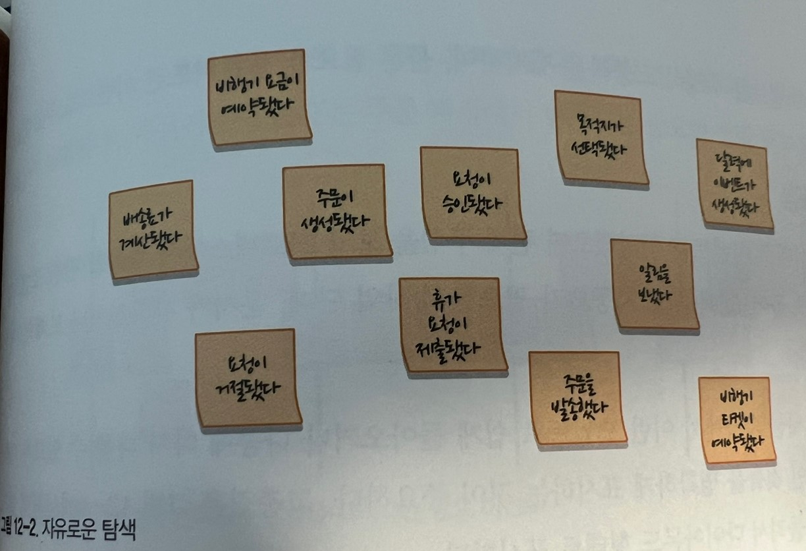
이 단계에서 모든 참가자는 오렌지 색 포스트잇에 무엇이든 떠오르는 도메인 이벤트를 적어서 모델링 공간에 붙인다.

초기 단계에는 이벤트의 순서나 중복에 대해 걱정할 필요가 없다. 이 단계는 비즈니스 도메인에서 발생할 수 있는 것들을 브레인스토밍한다.

새로운 이벤트를 추가하는 속도가 현저히 느려질 때 까지 계속해서 도메인 이벤트를 생성한다.

### 2단계 타임라인

다음으로, 참가자는 생성된 도메인 이벤트를 읽어보고 그것을 비즈니스 도메인에서 발생하는 순서대로 정리한다.

성공적인 비즈니스 시나리오를 설명하는 흐름인 정상 시나리오부터 시작한다.

일단 정상 시나리오가 끝나면 다른 시나리오를 추가한다. 예를 들어, 에러가 살뱅하는 경로나 다른 비즈니스 의사결정을 내린 경우가 그렇다. 분기 흐름은 앞의 이벤트에서 두 개의 흐름 또는 화살표로 표현한다.
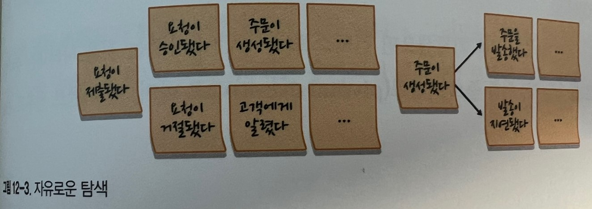

또한 잘못된 이벤트를 수정하고 중복을 제거하며, 물론 필요한 경우 빠뜨린 이벤트도 추가한다.

### 3단계 고충점

일단 시간 순서대로 이벤트를 구성했으면 전체 구성을 보고 프로세스에서 주목할 만한 포인트를 식별한다. 예를 들어, 병목구간, 자동화가 필요한 수작업 단계, 문서가 사라졌거나 도메인 지식이 없는 경우다.

이벤트스토밍 세션 과정에서 이런 포인트로 쉽게 돌아오거나 나중에 다시 다룰 수 있도록 이와 같은 비효과적인 것들을 명확하게 표시하는 것이 중요하다. 고충점은 핑크색 포스트잇을 돌려서 다이아 몬드 형태로 표시한다.
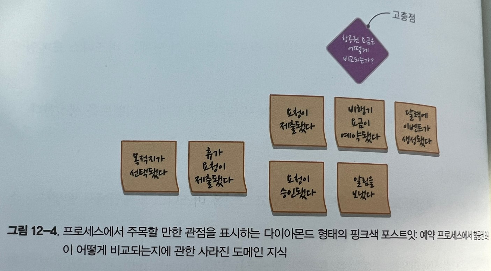

물론 이 단계에서만 고충점을 추적하는 것은 아니다. 진행자는 이벤트 스토밍의 전 과정에서 참가자의 코멘트에 주목하고 이슈나 관심사가 나오면 고충점으로 기록한다.

### 4단계 중요 이벤트

이벤트 타임라인에 고충점을 기록했으면 컨텍스트나 국면이 바뀌는 것을 나타내는 중대한 비즈니스 이벤트를 찾는다. 이를 중요 이벤트라고 하며, 이 이벤트 전후로 세로 선을 긋는다.

쇼핑 카트가 초기화 됐다, 주문이 생성됐다, 주문이 발송됐다, 주문이 배달됐다, 주문이 반품됐다는 주문 과정에서 발생하는 중요한 상황변화를 나타낸다.
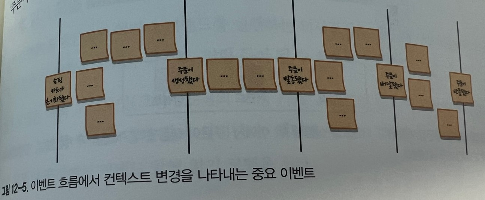

이와 같은 중요 이벤트는 향후 바운디드 컨텍스트의 후보가 된다.

### 5단계 커맨드

도메인 이벤트가 이미 발생한 것을 설명하는 반면, 커맨드는 무엇이 이벤트 또는 이벤트 흐름을 시작하게 하는지를 설명한다. 커맨드는 시스템의 오퍼레이션을 설명하고 도메인 이벤트와는 반대로 명령형으로 작성한다.

-   캠페인을 게시한다
-   트랜잭션을 롤백한다
-   주문을 제출한다

커맨드는 파란색 포스트잇에 작성해서 커맨드가 생성하는 이벤트 앞에 붙인다. 특정 역할을 담당하는 액터가 특정 커맨드를 실행하면 그 액터 정보를 작은 노란색 포스트잇에 적어서 붙인다. 액터는 고객, 관리자, 편집자처럼 비즈니스 도메인 내의 사용자 페르소나를 나타낸다.

당연히 모든 커맨드가 액터와 연관되는 것은 아니다. 그러므로 분명한 곳에만 액터 정보를 추가한다. 다음 장에서는 커맨드를 시작하는 추가적인 엔티티를 모델에 담을 것이다.
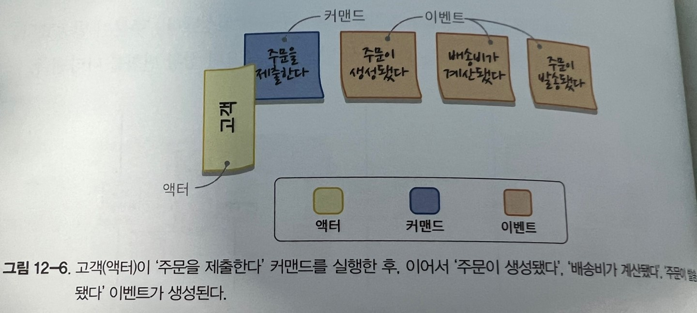

### 6단계 정책

대부분의 경우 커맨드에는 관련된 액터가 없다. 이 단계에서는 커맨드를 실행할 수도 있는 장돠 정책을 찾는다.

자동화 정책(automation policy)은 이벤트가 커맨드의 실행을 시작하는 시나리오다. 다시 말하면, 커맨드는 특정 도메인 이벤트가 발생할 때 자동을 실행된다.
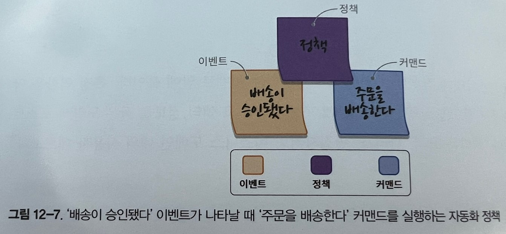

어떤 의사결정 조건이 만족할 때만 문제의 커맨드를 시작해야 한다면 그 의사결정 조건을 정책 포스트잇에 명시한다. 예를 들어, 불만이 접수됐다 이벤트 이후에 상부보고 커맨드를 시작해야 하지만 VIP 고객으로 부터 접수된 불만인 경우에 한정된다면 VIP 고객에 한함 이라는 조건을 포스트잇에 명시한다.

모델링 공간에서 이벤트와 커맨드가 멀리 떨어져 있다면 화살표를 그려서 연결할 수 있다.

### 7단계 읽기 모델

읽기 모델은 도메인에서 액터가 커맨드를 실행하는 의사결정을 내릴 때 사용하는 시각적 데이터다. 이것은 시스템의 스크린, 리포트, 알림 등이 될 수 있다.

읽기 모델은 녹색 포스트잇에 액터의 의사결정을 돕는데 필요한 정보의 원천에 대해 짧게 설명한다. 액터가 이 읽기 모델을 본 후에 커맨드를 실행하므로 모델링 공간에서 커맨드 앞에 읽기 모델을 둔다.
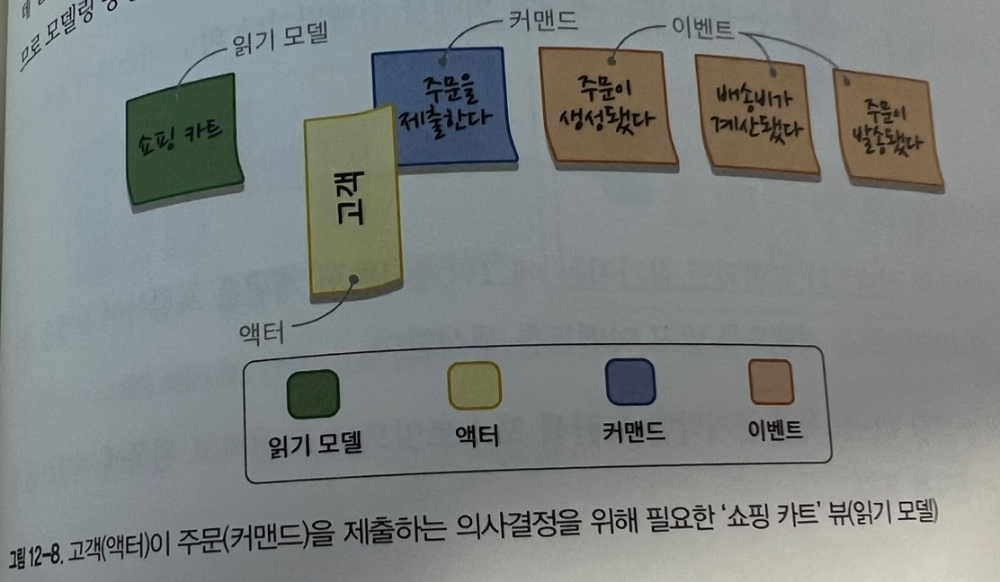

### 8단계 외부시스템

외부 시스템 연동 정보를 보강한다. 탐색 중인 도메인에 포함되지 않는 모든 시스템이 외부 시스템에 해당된다. 외부 시스템이 커맨드를 실행할 수 있고(입력) 반대로 알림을 이벤트로 만들어 외부 시스템으로 전달할 수도 있다(출력)

외부 시스템은 핑크색 포스트잇으로 표시한다. CRM(외부시스템)은 주문을 배송한다 커맨드의 실행을 시작한다.

배송이 승인되면(이벤트) 정책을 통해 CRM(외부시스템)과 통신한다.
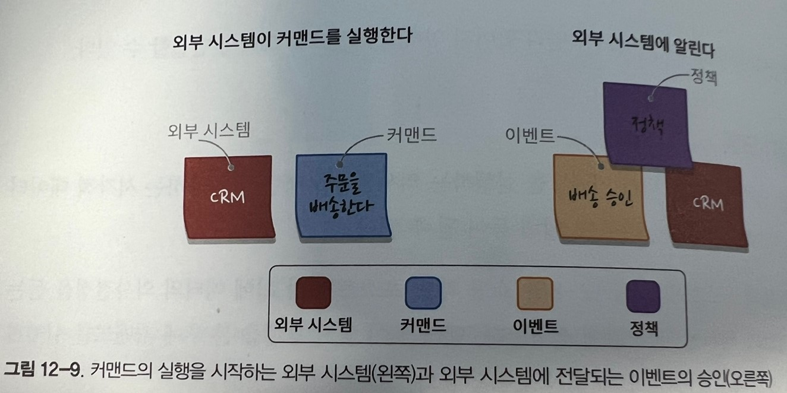
이 단계가 끝나면 모든 커맨드는 액터 또는 정책에 의해서 실행되거나 외부 시스템이 호출하여 실행된다.

### 9단계 애그리게이트

일단 모든 이벤트와 커맨드가 표현되면 참가자는 애그리게이트의 개념을 포함하여 모델을 구성할 수 있다. 애그리게이트는 커맨드를 받고 이벤트를 생성한다.

애그리게이트는 큼지막한 노란색 포스트잇으로 표현하고 왼쪽에 커맨드를 두고 오른쪽에 이벤트를 둔다.
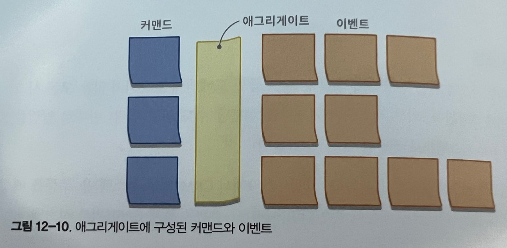

### 10단게 바운디드 컨텍스트

이벤트스토밍 세션의 마지막 단계에서는 서로 연관된 애그리게이트를 찾는다. 애그리게이트는 기능이 밀접하게 연관되거나 정책을 통해 연관될 수 있다. 애그리게이트의 그룹은 바운디드 컨텍스트 경계의 자연스러운 후보가 된다.
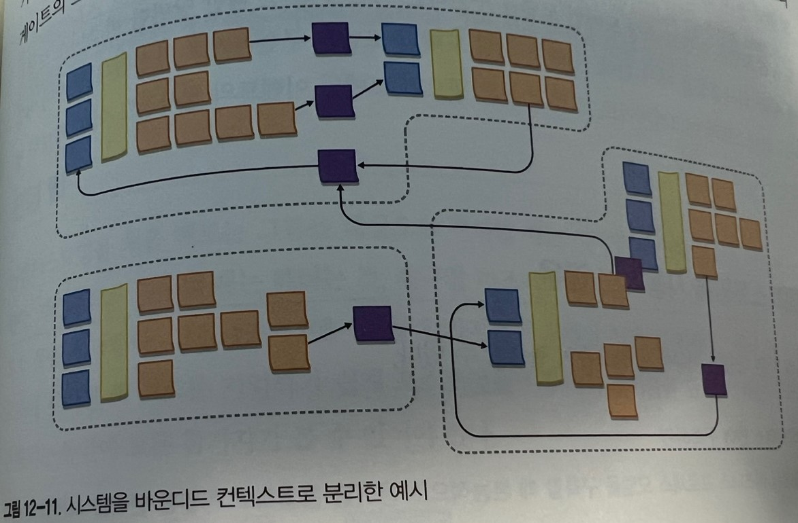

---

바운디드 컨텍스트 예시

-   회원 관리 컨텍스트: 회원 정보, 등록, 인증 등을 관리합니다.
-   예약 시스템 컨텍스트: 클래스 예약, 예약 변경, 취소 등을 관리합니다.
-   클래스 관리 컨텍스트: 다양한 피트니스 클래스의 스케줄, 강사 배정 등을 관리합니다.

애그리게이트 예시

-   회원 관리 컨텍스트 내의 애그리게이트: 회원(Member)이 루트 엔티티, 주소(Address), 회원권(Membership) 등이 하위 객체.
-   예약 시스템 컨텍스트 내의 애그리게이트: 예약(Reservation)이 루트 엔티티, 예약 상세(ReservationDetail), 결제 정보(PaymentInfo) 등이 하위 객체.

## 변형

이벤트스토밍의 창시자는 진행 과정을 반드시 따라야 하는 고정된 규칙이 아니라 가이드라고 했다. 상황에 잘 맞는 비법을 찾기 위해 진행 과정에 대해 자유롭게 실행해도 좋다.

이벤트스토밍의 진짜 가치는 다양한 이해관계자 간의 지식공유, 비즈니스와 멘탈 모델의 일치, 충돌하는 모델의 발견, 그리고 유비쿼터스 언어를 구축하는 과정 그 자체에 있다.

도출된 모델은 이벤트 소싱 도메인 모델을 구현하는 기반이 된다.

## 이벤트스토밍을 사용하는 경우

-   유비쿼터스 언어 구축하기
-   비즈니스 프로세스 모델링하기
-   새로운 비즈니스 요구사항 탐색하기
-   도메인 지식 복구하기
-   존재하는 비즈니스 프로세스의 개선 방법 탐색하기
-   새로운 팀원의 훈련

이벤트스토밍을 언제 사용할지 외에, 사용하지 말아야 할 경우를 언급하는 것도 중요하다. 검토중인 비즈니스 프로세스가 비즈니스 로직이나 복잡성이 없고, 일련의 순차적 단계만을 수행하는등 단순하거나 명백한 경우에는 이벤트스토밍이 그리 성공적이지 못할 것이다.

## 진행 팁

이벤트 스토밍을 처음 해보는 그룹을 대상으로 진행할 때는 시작할 때 진행 개요를 빠르게 소개한다. 개인적으로 진행할 때는 하려는 것, 탐구할 비즈니스 프로세스, 워크숍에서 사용할 모델링 요소 등을 설명한다.

참가자들이 도메인 이벤트, 커맨드, 액터 등 모델링 요소에 부여된 색 코드를 기억하기 쉽게 포스트잇을 사용해서 레이블을 단다. 범례는 워크숍이 진행되는 동안에 모든 참가자가 볼 수 있어야 한다.
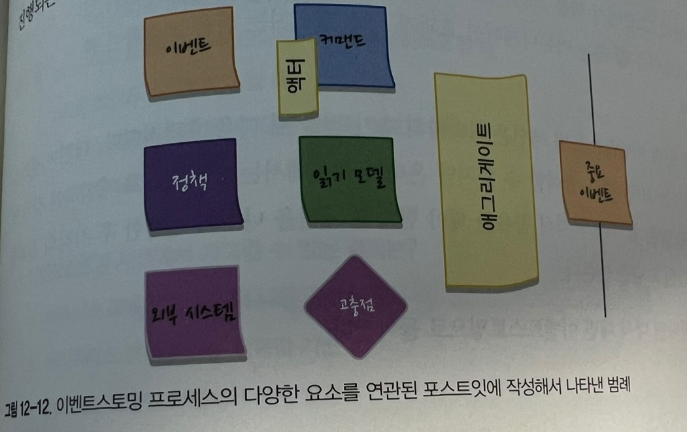

### 활력도 살피기

참가자들의 활력을 살펴보는 것이 중요하다. 그룹 활동의 활발함이 떨어지면 질문을 던져서 과정을 복둗거나 워크숍의 다음 단계로 넘어갈지를 결정한다.

이벤트스토밍은 그룹활동이다. 모든 참가자가 모델링 활동과 논의에 참여할 기회를 갖게 해야 한다.

### 원격 이벤트스토밍

온라인 세션으로 진행해야 한다면 5명정도가 적당하다. 사람이 많다면 세션을 나누어 진행한 후 각각의 결과를 취합 비교해서 모델을 만든다.

## 결론

이벤트스토밍은 협업을 통해 비즈니스 프로세스를 모델링하는 워크숍이다. 도출된 모델 외에도 지식 공유라는 중요한 이점을 얻을 수 있다. 세션이 끝나면 모든 참가자는 비즈니스 프로세스의 멘탈 모델을 일치시키고 유비쿼터스 언어를 사용하기 위한 첫발을 떼게 된다.

이벤트스토밍은 실습해보면서 배우는게 좋다.
