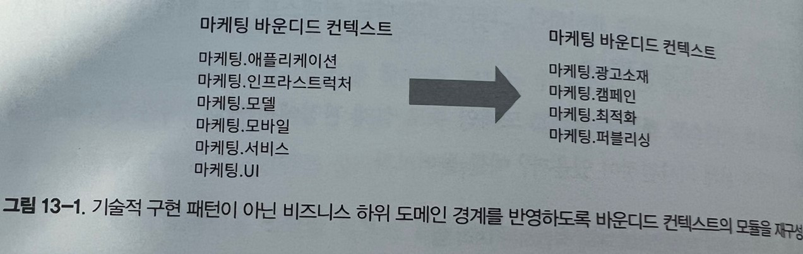

# 실무에서의 도메인 주도 설계

브라운필드(이전에 개발된 적이 있는)프로젝트와 이상적이지 않은 환경에서 실제로 도메인 주도 설계 도구와 패턴을 적용하기 위한 전략을 배운다.

## 전략적 분석

실무에 도메인 주도 설계 패턴을 적용하는 순서에 따라 DDD를 도입하는 가장 좋은 출발점은 조직의 비즈니스 전략과 시스템 아키텍처의 현 상황을 이해하는 데 시간을 투자하는 것이다.

### 비즈니스 도메인 이해하기

먼저 회사의 비자니스 도메인을 파악한다.

-   조직의 비즈니스 도메인은 무엇인가?
-   고객은 누구인가?
-   조직이 고객에게 제공하는 서비스 또는 가치는 무엇인가?
-   경쟁 회사 또는 그들의 제품은 무엇인가?

이 질문에 답하면 회사의 전반적인 목표에 대한 조감도를 얻을 수 있다. 다음으로 도메인을 확대해서 조직이 상위 목표인 하위 도메인을 달성하기 위해 사용하는 비즈니스 구성요소를 찾는다.

가장 먼저 활용할 만한 휴리스틱은 회사의 조직도, 즉 부서와 기타 조직 단위다. 회사가 비즈니스 도메인에서 경쟁하기 위해 조직 단위들이 어떻게 협력하는지 조사하라.

또한 특정한 유형의 하위 도메인의 신호를 찾아라

#### 핵심 하위 도메인

-   경쟁업체에 없는 회사의 비법 소스는 무엇인가? 예를 들면 특허과 같은 지적재산과 자체 설계한 알고리즘이 있는가?
-   경쟁 우위인 핵심 하위 도메인이 반드시 기술적인 것은 아니라는 점을 명심하라 회사가 비기술적 경쟁 우위를 가지고 있는가? 예를 들어, 최고 수준의 직원을 고용하거나 독특한 예술적 디자인을 할 수 있는 능력이 있는가?

핵심 하위 도메인을 식별하는 또 하나의 강력하지만 유감스러운 휴리스틱은 최악으로 설계된 소프트웨어 컴포넌트, 즉 커다란 진흙 덩어리를 찾아 내는 것이다. 이 커다란 진흙 덩어리는 모든 엔지니어가 싫어하지만 회사 측에서도 비즈니스 위험이 수반되기 때문에 처음부터 소스코드를 다시 작성하는 것을 꺼린다. 여기서 핵심은 레거시 시스템을 사용 시스템으로 대체할 수 없다는 것이며(일반 하위 도메인이 됨), 이를 수정하면 비즈니스 위험이 수반된다.

#### 일반 하위 도메인

일반 하위 도메인을 식별하려면 상용 솔루션이나 구독 서비스, 또는 연동할 수 있는 오픈소스 소프트웨어를 찾아라. 1장에서 배운 것처럼 이미 만들어진 동일한 솔루션을 경쟁 회사에서도 사용할 수 있어야 하며, 같은 솔루션을 사용하더라도 회사의 비즈니스에 영향을 미치지 않아야 한다.

#### 지원 하위 도메인

지원 하위 도메인을 식별하려면 사용 솔루션으로 대체할 수 없지만 직접 경쟁 우위를 제공하지 않는 나머지 소프트웨어 컴포넌트를 찾아라. 코드는 뒤죽박죽되어 있어도 자주 변경되지 않기 때문에 소프트웨어 엔지니어의 감정을 덜 자극한다. 따라서 최적이 아닌 소프트웨어 설계로 인한 영향은 핵심 하위 도메인만큼 심각하지 않다.

모든 핵심 하위 도메인을 식별할 필요는 없다. 이는 중견기업이라도 현실적으로 불가능하다. 대신 전체 구조를 식별하되, 개발 중인 소프트웨어 시스템과 가장 관련 있는 하위 도메인에 더 주의를 기울여라.

### 현재 설계 탐색

문제 도메인에 한 번 익숙해지면 그것의 솔루션 및 설계와 관련된 결정을 계속 살펴볼 수 있다. 먼저 상위 수준 컴포넌트부터 시작하라. 이는 DDD에서 말하는 바운디드 컨텍스트일 필요는 없으며 비즈니스 도메인을 하위 시스템으로 분해하는데 사용하는 경계를 의미한다.

먼저 컴포넌트의 특성 중 수명주기를 분리할 수 있는지 찾아라. 하위 시스템이 같은 소스 관리 저장소(하나의 리포지토리)에서 관리되거나 모든 컴포넌트가 하나의 모놀리식 코드베이스에 있는 경우에도 어는 것이 다른 컴포넌트와 독립적으로 개선되고 테스트되고 배포될 수 있는지 확인하라.

#### 전술적 설계 평가

각 상위 수준 컴포넌트에 대해 그것이 어느 비즈니스 하위 도메인을 포함하고 어떤 기술적 설계의사결정을 내렸는지 확인하라. 비즈니스 로직을 구현하고 컴포넌트의 아키텍처를 정의하는 데 어느 패턴을 사용했는가?

해당 솔루션이 문제가 가지고 있는 복잡성을 해결하기에 적합한가? 더 정교한 설계 패턴이 필요한 영역이 있는가? 반대로 비용을 절약할 수 있는 방법이나 기존 상용 솔루션을 사용할 수 있는 하위 도메인이 있는가? 이 정보를 사용하여 현명한 전략적, 전술적 의사결정을 내려보자

#### 전략적 설계 평가

상위 수준 컴포넌트에 대한 지식을 사용하여 이러한 컴포넌트가 바운디드 컨텍스트인 것처럼 현재 설계의 컨텍스트 맵을 차트로 표시하라. 그리고 바운디드 컨텍스트 연동 패턴 관점에서 컴포넌트 간의 관계를 식별하고 추적하라.

마지막으로 결과 컨텍스트 맵을 분석하고 도메인 주도 설계 관점에서 아키텍처를 평가하라. 최적이 아닌 전략적 설게 의사결정이 있을지 예를 들어보자

-   동일한 상위 수준의 컴포넌트에 대해 작업하는 여러 팀
-   핵심 하위 도메인의 중복 구현
-   하청 회사가 핵심 하위 도메인을 구현
-   자주 실패하는 연동으로 인한 마찰
-   외부 서비스와 레거시 시스템에서 확산되는 어색한 모델

이러한 통찰력은 설계 현대화 전략을 계획하기 위한 좋은 출발점이다. 그러나 문제(비즈니스 도메인)와 솔루션 영억 모두에 대한 더욱 심층적인 지식이 주어지면 손실된 도메인 지식을 먼저 찾아라.

비즈니스 로직이 복잡하고 비즈니스상 중요한 핵심 하위 도메인에서는 이러한 문제가 광범위하고 심각하다. 이럴때는 이벤트스토밍을 해보자

## 현대화 전략

엔지니어가 시스템을 처음부터 다시 작성하려는 하는 '대대적인 재작성' 노력은 거의 성공하지 못한다. 전체 시스템을 처음부터 다시 올바르게 설계하고 구현하기란 매우 어렵다. 또한 경영진이 이러한 아키텍처의 변신을 지원하는 경우도 정말 드물다.

기존 시스템의 설계를 개선하기 위한 좀 더 안전한 접근 방식은 크게 생각하되 작게 시작하는 것이다. 에릭 에반스가 말했듯이 모든 대규모 시스템이 잘 설계된 것은 아니다. 이는 우리가 받아 들어야 하는 사실이므로 현대화를 위한 노력의 관점에서 어디에 투자할지 전략적으로 결정해야 한다.

이 결정을 내리기 위한 전제조건은 시스템의 하위 도메인을 나누는 경계를 찾는 것이다. 물리적으로 경계를 나눌 필요는 없으며, 각 하위 도메인을 제대로 된 바운디드 컨텍스트로 나눈다. 대신 최소한 논리적 경계(기술 스택에 따라 네임스페에스, 모듈, 패키지)가 하위 도메인의 경계와 일치하는지 확인하는 것부터 시작하자.

시스템의 모듈을 조정하는 것은 비교적 안전한 형태의 리팩터링이다. 비즈니스 로직을 수정하는 것이 아니라, 단지 더 잘 구성된 구조로 유형을 재배치하는 것이다. 즉, 라이브러리의 동적 로딩, 리플렉션 등과 같은 전체 타입명에 의한 참조가 끊어지지 않게 해야 한다.

또한 데이터베이스의 저장 프로시저, 서버리스 함수 등 다른 코드베이스에서 구현된 하위 도메인의 비즈니스 로직을 관리한다. 이런 플랫폼에도 새 경계를 도입해야 한다. 예를 들어, 일부 로직이 데이터베이스의 저장 프로시저에서 처리되는 경우 해당 프로시저가 속한 모듈을 반영하도록 프로시저의 이름을 바꾸거나 전용 데이터베이스 스키마를 도입하고 저장 프로시저를 재배치하라.

### 전략적 현대화

10장에서 논의했듯이 시스템을 초기부터 가능한 한 작은 바운디드 컨텍스트로 분해하는 것은 위험할 수 있다. 지금은 논리적 경계를 물리적 경계로 전환하여 가장 많은 가치를 얻을 수 있는 곳을 찾아라. 논리적 경계를 물리적 경계로 바꿔 바운디드 컨텍스트를 추출하는 과정은 다음과 같다.

필요한 최소 바운디드 컨텍스트가 있으면 이들 간의 관계와 연동 패턴을 조사라. 서로 다른 바운디드 컨텍스트에서 작업하는 팀이 어떻게 의사소통하고 협업하는지 확인하라. 특히 임시 또는 공유 커널과 같은 통합을 통해 의사소통할 때 팀이 목표를 공유하고 적절한 협업을 하는가?

컨텍스트 통합 패턴이 해결할 수 있는 문제에 주목하라.

-   사용자-제공자 관계
-   11장에서 논의한 것처럼 조직의 성장은 이전의 커뮤니케이션과 협업 패턴을 무효화할 수 있다. 여러 엔지니어링 팀의 파트너쉽 관계를 위해 설계되었지만 파트너쉽이 더 이상 유지되지 않는 컴포넌트를 찾아라. 적절한 유형의 사용자-제공자 관계(순응주의자나 충돌방지 계층, 오픈 호스트 서비스)로 리팩터링하라.

-   충돌 방지 계층

    -   충돌 방지 계층은 특히 레거시 시스템이 다운스트림 컴포넌트로 확산되는 경향이 있는 비효율적인 모델을 사용하는 경우 레거시 시스템에서 바운디드 컨텍스트를 보호하는 데 유용하다.

    -   충돌 방지 계층을 구현하는 또 다른 일반적인 유스케이스는 사용하는 업스트림 서비스의 퍼블릭 인터페이스에 대한 잦은 변경으로부터 바운디드 컨텍스트를 보호하는 것이다.

-   오픈 호스트 서비스

    -   한 컴포넌트의 구현 상세에 대한 변경사항이 시스템을 통해 자주 파문을 일으켜 사용자에게 영향을 미치는 경우 이를 오픈 호스트 서비스로 만드는 것을 고려하라. 구현 모델을 퍼블릭 API에서 분리하라.

-   분리형 노선
    -   특히 대기업에서는 공유 기능을 공동으로 발전시키고 공동 개발해야 하므로 엔지니어링 팀 간에 마찰이 발생할 수 있다. '불화의 씨앗'이 되는 기능이 비즈니스에 중요하지 않은 경우(즉 핵심 하위 도메인이 아닌 경우)팀은 분리형 노선 패턴을 적용해 자체 솔루션을 구현하면 마찰의 원인을 제거할 수 있다.

### 전술적 현대화

무엇보다도 먼저 전술적 관점에서 비즈니스 가치와 구현 전략에서 가장 '고통스러운'부조화를 찾아내야 한다. 이를테면, 트랜잭션 스크립트 또는 액티브 레코드처럼 모델의 복잡성에 부합하지 않는 패턴을 구현하는 핵심 하위 도메인이 그 예다. 비즈니스의 성공에 직접적인 영향을 미치는 이러한 시스템 컴포넌트는 매우 자주 변경돼야 하는데, 좋지 않은 설게 때문에 유지보수와 개선이 어렵다.

### 유비쿼터스 언어 육성

성공적인 현대화 설계의 전제조건은 비즈니스 도메인 지식과 비즈니스 도메인의 효과적인 모델을 만드는 것이다. 도메인 주도 설계의 유비쿼터스 언어는 지식을 획득하고 효과적인 솔루션 모델을 만드는데 반드시 필요하다.

도메인 지식을 수집하기 위한 도메인 주도 설게의 지름길인 이벤트스토밍을 잊지 말라. 이벤트스토밍을 사용하여 도메인 전문가와 함께 유비쿼터스 언어를 구축하고 레거시 코드베이스를 탐색하라. 특히 코드베이스를 아무도 진정 이해하지 못하고 문서도 없을 정도로 엉망인 경우에는 더욱 그렇다. 기능과 관련된 모든 사람을 모아서 비즈니스 도메인을 탐색하라. 이벤트스토밍은 도메인 지식을 복구하기 위한 환상적인 도구다.

도메인 지식과 해당 모델을 갖췄다면 논의 중인 비즈니스 기능에 가장 적합한 비즈니스 로직 구현 패턴을 결정하라. 시작점으로 10장에서 설명한 설게 휴리스틱을 사용하라.

다음으로 내려야할 결정은 현대화 전략과 관련이 있다. 시스템의 전체 컴포넌트(스트랭글러 패턴)를 점진적으로 교체하거나 기존 솔루션을 점진적으로 리팩터링 하는 것이다.

#### 스트랭글러 패턴

스트랭글러 무화과는 독특한 성장 패턴을 가진다. 다른 나무 즉 숙주 나무 위에서 자란다. 스트랭글러는 숙주 나무를 덮는 잎사귀로 자라 결국 숙주를 죽인다.

스트랭글러 마이그레이션 패턴은 이 이름을 따온 나무와 같은 성장 동력을 기반으로 한다. 이 아이디어는 새로운 바운디드 컨텍스트인 스트랭글러를 생성하고, 이 스트랭글러를 사용하여 새로운 요구사항을 구현하고 점차적으로 레거시 컨텍스트의 기능을 해당 컨텍스트로 마이그레이션한다. 동시에 핫픽스와 기타 긴급 상황을 제외하고 레거시 바운디드 컨텍스트의 개선과 개발이 중지된다.

결국 모든 기능은 새로운 바운디드 컨텍스트인 스트랭글러로 마이그레이션되고, 레거시 코드베이스가 제거된다.

일반적으로 스트랭글러 패턴은 퍼사드 패턴과 함께 사용된다. 퍼사드 패턴의 얇은 추상화 계층은 퍼블릭 인터페이스 역할을 하며 레거시 또는 현대화된 바운디드 컨텍스트로 요청을 전달해 처리하는 역할을 한다.

마이그레이션이 완료되면 퍼사드는 더이상 필요하지 않으므로 제거한다.

스트랭글러 패턴을 구현할 떄, 각 바운디드 컨텍스트는 별도의 하위 시스템이므로 서로 다른 바운디드 컨텍스트와 데이터베이스를 공유할 수 없다는 원칙을 완화할 수 있다. 즉 현대화된 컨텍스트와 레거시 컨텍스트 간의 복잡한 연동을 피하기 위해 동일한 데이터베이스를 사용할 수 있으며, 두 컨텍스트는 동일한 데이터로 작동해야 한다.

바운디드 컨텍스트당 하나의 데이터베이스 규칙을 적용하기 위해서 빠르게 레거시 컨텍스트를 폐기하고 현대화된 시스템에서 독점적으로 데이터베이스를 사용한다.

스트랭글러 기반 마이그레이션의 대안은 레거시 코드베이스를 현대화하는 것이며, 이를 리팩터링이라고도 부른다.

### 전술적 설계 의사결정 리팩토링

11장에서는 전술적 설계 의사결정을 마이그레이션하는 다양한 측면을 배웠다. 그러나 레거시 코드베이스를 현대화할 때는 두 가지 미묘한 차이점을 알아둘 필요가 있다.

첫째, 작은 점진적인 조치가 대규모 재작성보다 안전하다. 따라서 트랜잭션 스크립트 또는 액티브 레코드를 이벤트 소싱 도메인 모델로 직접 리팩토링 하지 마라. 대신 상태 기반 애그리게이트를 설계하는 중간 단계를 진행하라. 효과적인 애그리게이트 경계를 찾는 데 노력을 투자하라. 모든 관련 비즈니스 로직이 해당 경계 내에 있는지 확인하라. 상태 기반 애그리게이트에서 이벤트 소싱 애그리게이트로 이동하는 것은 이벤트 소싱 애그리게이트에서 잘못된 트랜잭션 경계를 발견하는 것보다 훨씬 더 안전하다.

둘째, 작은 점진적인 조치를 수행하는 것과 동일한 이유로, 도메인 모델로의 리팩터링이 한 번에 이루어질 필요는 없다. 대신 도메인 모델 패턴의 요소들을 점진적으로 도입할 수 있다.

가능한 벨류 오브젝트를 찾는 것 부터 시작하라. 레거시 코드의 현대화에 완전하게 도메인 모델을 적용하지 않더라도 불변 객체를 사용함으로써 솔루션의 복잡성을 크게 줄일 수 있다.

11장에서 논의한 것처럼 액티브 레코드를 애그리게이트로 리팩터링 하는 것을 하룻밤 사이에 완료할 필요는 없다. 단계적으로 수행할 수 있다. 관련 비즈니스 로직을 수집하는 것부터 시작하라. 다음으로 트랜잭션 경계를 분석하라. 확실하게 일관성이 필요하지만 궁극적으로 일관성 있는 데이터에 대해 작동하는 결정이 있는가? 또는 반대로 궁극적으로 충분하게 일관성이 보장되는 경우 솔루션이 강한 일관성을 요구하는가? 코드베이스를 분석할 때 이러한 결정이 기술이 아니라 비즈니스에 따라 좌우된다는 것을 잊지마라. 트랜잭션 요구사항을 철저히 분석하고 나서 애그리게이트의 경계를 설계해야 한다.

마지막으로 레거시 시스템을 리팩터링하는 것처럼 필요시 충돌 방지 계층을 사용하여 이전 모델로부터 새 코드베이스를 보호할 수 있으며 , 오픈 호스트 서비스를 구현하고 공표된 언어를 노출하여 레거시 코드베이스의 변경으로부터 사용자를 보호한다.

## 실용적인 도메인 주도 설계

DDD가 제공하는 모든 도구를 적용할 필요는 없다. 비즈니스 도메인과 해당 전략을, 특정 문제를 해결하기 위한 효과적인 모델을 찾고, 무엇보다도 비즈니스 도메인의 요구사항에 따라 설계 의사결정을 내린다면 그것이 바로 도메인 주도 설계다.

도메인 주도 설계는 애그리게이트나 VO에 관한 것이 아니다. 도메인 주도 설계는 비즈니스 도메인이 소프트웨어 설계 의사결정을 주도하게 하는 것이다.

## 도메인 주도 설계 확산

### 실무에 활용하는 도메인 주도 설계

#### 유비쿼터스 언어

유비쿼터스 언어의 사용은 도메인 주도 설계의 초석이다. 도메인 지식 발견과 커뮤니케이션, 효과적인 솔루션 모델링에 반드시 필요하다.

이해 관계자가 비즈니스 도메인에 대해 말할 때 사용하는 언어에 주의 깊게 귀를 기울여라. 전문 용어에서 벗어나 비즈니스 의미를 반영한 용어로 부드럽게 만들어라.

일치하지 않는 용어를 찾고 설명을 요청하라. 의미가 같으면 상식에 따라 하나의 용어를 사용하도록 요청하라

도메인 전문가와 소통하라. 이러한 노력에 반드시 공식적인 회의가 필요한 것은 아닌다.

가장 중요한 것은 코드와 모든 프로젝트 관련 의사소통에 유비쿼터스 언어를 사용하는 것이다.

#### 바운디드 컨텍스트

가능한 분해 방법을 탐색할 때 바운디드 컨텍스트 패턴의 기반이 되는 원칙을 확인하라.

-   모든 유스케이스에 대해 단일 모델 대신 문제 지향 모델을 설계하는 것이 더 나은 이유는 무엇일까?
    -   올인원 솔루션은 거의 효과가 없기 때문이다.
-   바운디드 컨텍스트가 충돌하는 모델을 관리할 수 없는 이유는 무엇일까?
    -   인지 부하가 증가하고 솔루션이 복잡해지기 때문이다.
-   여러 팀이 동일한 코드베이스에서 작업하는 것이 왜 나쁜 생각일까?
    -   팀 간의 마찰이 발생하고 협업에 방해되기 때문이다.

#### 전술적 설계 의사결정

-   명시적 트랜잭션 경계가 중요한 이유는 무엇일까?
    -   데이터의 일관성을 보호하기 위해서다.
-   데이터베이스 트랜잭션이 애그리게이트의 둘 이상의 인스턴스를 수정할 수 없는 이유는 무엇일까?
    -   일관성 경계가 올바른지 확인하기 위해서다.
-   외부 컴포넌트에서 애그리게이트 상태를 직접 수정할 수 없는 이유는 무엇일까?
    -   모든 관련 비즈니스 로직을 함께 배치하고 중복되지 않게 하기 위해서다.
-   애그리게이트 기능 중 일부를 저장 프로시저로 넘길 수 없는 이유는 무엇일까?
    -   로직이 중복되지 않게 하기위해서다. 중복된 로직은 특히 논리적으로나 물리적으로 멀리 떨어진 시스템 컴포넌트에서 동기화되지 않고 데이터 손상을 초래하는 경향이 있다.
-   왜 우리는 작은 애그리게이트 경계를 위해 노력해야 할까?
    -   넓은 트랜잭션 범위는 애그리게이트의 복잡성을 증가시키고 성능에 부정적인 영향을 주기 떄문이다.
-   이벤트 소싱 대신에 이벤트를 로그 파일에 기록할 수 없는 이유는 무엇일까?
    -   장기적으로 데이터 일관성이 보장되지 않기 때문이다.

#### 이벤트 소싱 도메인 모델

많은 장점에도 불구하고 이벤트 소싱은 많은 사람에게 너무 급진적으로 들린다. 해결책은 비즈니스 도메인이 이러한 결정을 주도하게 하는 것이다.

## 결론

항상 비즈니스 도메인 분석부터 시작하라.

-   회사의 목표와 이를 달성하기 위한 전략
-   조직 구조와 기존 소프트웨어 설계 의사결정을 사용하여 조직의 하위 도메인과 해당 유형을 식별하라.

이지식을 바탕으로 현대화 전략을 계획하라. 고충점을 찾아라. 관련 컴포넌트를 리팩토링하거나 교체함으로 레거시 코드를 현대화하라. 어떤 방법이든 점진적으로 수행하라.
    