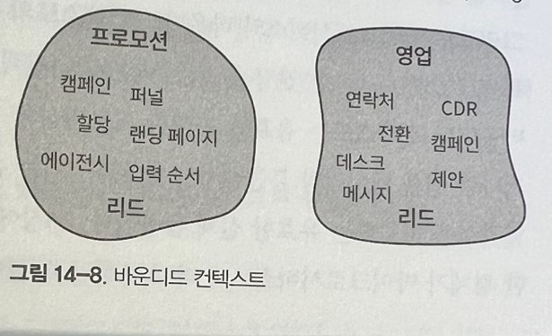

# 마이크로서비스

역사적으로 마이크로 서비스는 DDD, 특히 바운디드 컨텍스트 패턴과 관련이 있을 떄가 많다. `많은 사람은 심지어 바운디드 컨텍스트와 마이크로 서비스를 혼용하기도 한다. `

## 서비스란 무엇인가?

서비스는 미리 정의된 인터페이스를 사용해 하나 이상의 역량에 접근하기 위한 메커니즘이다.

여기서 미리 정의된 인터페이스란 서비스로부터 데이터를 넣고 빼는 모든 메커니즘을 말한다.

여기에는 요청/응답 모델과 같은 동기식 또는 이벤트를 제공하고 사용하는 모델과 같은 비동기식이 있다.

랜디 숍은 서비스의 인터페이스를 외부에 노출되는 시스템 영역에 두는 것을 좋아한다. 서비스를 통해 들어가고 나오는 데이터는 모두 이 외부에 노출되는 시스템 영역에 두는 것을 좋아한다.

서비스의 퍼블릭 인터페이스는 서비스 자체, 즉 서비스가 노출하는 기능을 정의한다. `잘 표현된 인터페이스는 서비스의 기능을 명확하게 설명한다.`

### 마이크로서비스란 무엇인가?

서비스가 자신의 퍼블릭 인터페이스에 의해 정의되므로 마이크로서비스는 자신의 마이크로 퍼블릭 인터페이스, 즉 마이크로 프런트 도어에 의해 정의되는 서비스다.

마이크로 퍼블릭 인터페이스가 있으면 단일 서비스의 기능과 그 서비스가 연동하는 다른 시스템 구성요소 모두를 쉽게 이해할 수 있다. 또한 서비스의 기능을 줄이면 변경될 이유가 줄어들고 개발, 관리, 확장을 자율적으로 할 수 있다.

또한 이는 마이크로서비스가 자신의 데이터베이스를 노출하지 않는 관행도 설명한다. 데이터베이스를 노출해서 서비스의 외부 노출 시스템 영역의 일부분으로 만들면 퍼블릭 인터페이스가 거대해질 것이다.

마이크로 서비스는 자신의 데이터베이스를 내부에 감싸고 있다. 그리고 데이터는 훨씬 간단하고 연동 지향적인 퍼블릭 인터페이스를 통해서만 접근할 수 있다.

### 서비스형 메서드: 완벽한 마이크로서비스?

마이크로서비스가 마이크로 퍼블릭 인터페이스라고 말하는 것은 믿을 수 없을 정도로 간단하다.
백로그 관리 서비스가 있다. 이 서비스의 퍼블릭 인터페이스는 여덟 개의 퍼블릭 메서드로 구성되고, '서비스 하나에 메서드 하나' 규칙을 적용할 것이다.

이 서비스는 잘 동작하는 마이크로서비스이므로 각 서비스가 자신의 데이터베이스를 감싸고 있다. 어떤 서비스도 다른 서비스의 데이터베이스에 직접 접근할 수 없고 퍼블릭 인터페이스를 통해서만 가능하다.

하지만 현재 이를 위한 퍼블릭 인터페이스가 없다. 서비스는 서로 협업해야 하고 각 서비스가 반영하는 변경을 동기화해야 한다.

결과적으로 이와 같은 연동 관련 관심사를 처리하기 위해 서비스의 인터페이스를 확장해야 한다. 게다가 도식화해보면 관련된 서비스 간의 연동과 데이터 흐름이 마치 전형적인 분산된 커다란 진흙덩어리처럼 보인다.

랜디 숍의 비유를 들자면 시스템을 이처럼 작은 단위의 서비스로 분해하면 확실히 서비스의 외부 노출 시스템 영역은 최소화되지만 전체적인 시스템의 기능을 구현하기 위해 각 서비스에 스테프만 출입 가능한 수많은 출입구를 추가해야 한다.

### 설계 목표

각 서비스가 단일 메서드만 갖도록 분해하는 간단한 휴리스틱을 적용하는 것은 여러 이유로 차선책임이 증명되었다.

우선, 그것은 그냥 불가능하다. 서비스는 서로 협력해야 하므로 연동에 관련된 퍼블릭 메서드를 가진 퍼블릭 인터페이스를 만들어야 했다. 둘째, 우리는 전투(서비스)에서는 승리했지만, 전쟁(전체 시스템)에서는 졌다. 각 서비스는 원래 설계보다 훨씬 간단해졌다. 그러나 결과적으로 전체 시스템은 더 복잡해졌다. 마이크로서비스 아키텍처의 목표는 유연한 시스템을 만드는 것이다.

단일 컴포넌트에만 설계 노력을 집중하고 시스템의 나머지 연동을 무시하는 것은 다음과 같은 시스템의 정의에 전혀 부합하지 않는다.

-   함께 작동하는 연동된 것 또는 디바이스
-   특정 목적을 위해 함께 사용되는 컴퓨터 장비 및 프로그램

### 시스템의 복잡성

로컬 복잡성은 서비스의 구현에 따라 달라진다 글로벌 복잡성은 서비스 간의 상호작용과 의존성으로 정의된다.

글로벌 복잡성을 줄이는 것은 쉽다. 단지 시스템 구성요소 간의 상호작용을 없애기만 하면 된다. 즉 모든 기능을 단일 모놀리식 서비스로 구현하는 것이다. 이 전략은 특정 상황에서만 효과적일지도 모른다. 때에 따라 무시무시한 앞에처럼 커다란 진흙 덩어리가 될수도 있다. 아마 로컬 복잡성은 최고수준일 것

로컬 복잡성만 최적화 하고 시스템의 글로벌 복잡성을 무시하면 더 무시무시한 분산된 커다란 진흙 덩어리가 된다.

적절한 마이크로서비스 기반 시스템을 설계하려면 글로벌 복잡성과 로컬 복잡성 모두를 최적화해야 한다. 어느 쪽이든 하나를 개별적으로 최적화하는 설계 목표를 가진 것은 로컬 최적화다. 반면에 글로벌 최적화는 두 복잡성의 균형을 최적화 한다.

### 깊은 서비스로서의 마이크로서비스

소프트웨어 시스템에서 또는 모든 시스템에서 모듈은 자신의 함수와 로직에 의해 정의된다. 함수는 모듈이 해야하는 일, 즉 비즈니스 기능을 말한다. 로직은 모듈의 비즈니스 로직, 즉 모듈이 자신의 비즈니스 기능을 구현하는 방법이다.

우스터하우트는 모듈을 사각형으로 시각화하는 것을 제안했다. 사각형의 상단 끝은 모듈의 기능을 표현하거나 퍼블릭 인터페이스의 복잡성을 나타낸다. 넓은 사각형은 폭넓은 기능을 나타내는 반면, 좁은 것은 더욱 제한된 기능을 가져서 간단한 퍼블릭 인터페이스를 갖는다. 사각형의 면적은 모듈의 로직 또는 기능의 구현을 나타낸다.

### 깊은 모듈로서의 마이크로 서비스

얖은 서비스는 수많은 마이크로서비스 지향 프로젝트가 실패하는 원인이다. 시스템을 마이크로서비스로 분해할 때 임게치는 마이크로서비스를 시스템의 일부로 사용하려고 하는 유스케이스에 의해 정의된다. 모놀리식 시스템을 서비스로 분리하면 변경에 드는 비용은 감소한다. 그러나 마이크로서비스 임계치를 지나서 계속 분해하면 깊은 서비스가 점점 얕은 서비스로 변한다. -> 진흙덩어리가 된다.

## 도메인 주도 설계와 마이크로서비스의 경계

마이크로서비스와 마찬가지로, 앞 장에서 논의한 도메인 주도 설계 패턴의 대부분의 경계에 관한 것이다.

바운디드 컨텍스트는 모델의 경계다. 하위 도메인은 비즈니스 역량의 경계, 애그리게이트와 밸류 오브젝트는 트랜잭션의 경계다.

### 바운디드 컨텍스트

마이크로서비스와 바운디드 컨텍스트는 공통점이 많다. 그래서 이 패턴들은 종종 서로 혼용된다.

마이크로서비스와 바운디드 컨텍스트 모두 물리적 경계다. 바운디드 컨텍스트와 마찬가지로 마이크로서비스도 단일 팀이 소유한다. 또한 바운디드 컨테스트와 동일하게, 충돌하는 모델은 인터페이스가 복잡해지므로 마이크로서비스로 구현할 수 없다.

마이크로서비스가 사실상 바운디드컨텍스트다.

바운디드 컨텍스트는 유비쿼터스 언어와 모델의 일관성을 보호한다. 충도하는 모델은 동일한 바운디드 컨텍스트에 구현할 수 없다. 광고 관리 시스템을 구축하고 있다고 생각했을때. 시스템의 비즈니스 도메인에서 비즈니스 엔티티인 리드(Lead)는 프로모션과 영업 컨텍스트에서 다양한 모델로 표현된다.

프로모션과 영업은 각각의 바운디드 컨텍스트에서만 유효한 리드 엔티티 하나만 있는 바운디드 컨텍스트다.

간단하게 하기 위해 시스템에 리드 외에는 충돌하는 모델이 없다고 가정했을 때 이렇게 하면 각 바운디드 컨텍스트는 여러 하위 도메인을 포함하게 되어 자연스럽게 폭넓은 바운디드 컨텍스트가 생긴다. 하위 도메인은 하나의 바운디드 컨텍스트에서 다른 것으로 옮길 수 있다. 하위 도메인에 모델 충돌이 없기만 하다면

나타낸 모든분해는 모두 완전하게 유효한 바운디드 컨텍스트다.

다양한 요구사항은 바운디드 컨텍스트를 여러 형태로 분해하게 만든다. 예로 팀의 크기, 구조, 수명주기 의존성 등이 그런 요구사항이다. 하지만 이 예제의 유효한 모든 바운디드 컨텍스트가 반드시 마이크로서비스라고 말할 수 있을까? 아니다.

마이크로서비스와 바운디드 컨텍스트의 관계는 비대칭이다. 마이크로서비스는 바운디드 컨텍스트로 볼 수 있지만, 모든 바운디드 컨텍스트가 마이크로서비스인 것은 아니다.

바운디드 컨텍스트는 유효한 거대한 모놀리식의 경계를 표한한다. 하지만 이 같은 모놀리식을 커다란 진흙 덩어리와 혼동해서는 안된다. 이는 유비쿼터스 언어 또는 비즈니스 도메인 모델의 일관성을 보호하는 유효한 설계 옵션이다.

바운디드 컨텍스트와 마이크로서비스 사이의 공간이 안전하다. 하지만 시스템이 적절치 않게 바운디드 컨텍스트를 분해하거나 마이크로서비스의 임계치를 넘어서 분해된다면 각각 커다란 진흙 덩어리가 되거나 분산된 거다란 진흙덩어리가 된다.

### 애그리게이트

바운디드 컨텍스트는 가장 넓은 유효한 경계를 설정하지만, 애그리게이트 패턴은 그 반대다. 애그리게이트의 경계는 가능한 한 좁게 설정한다. 애그리게이트를 여러 물리적 서비스 또는 바운디드 컨텍스트로 분해하는 것은 최적이 아닌 원치 않은 결과를 초래한다.

바운디드 컨텍스트와 마찬가지로 애그리게이트의 경계 도한 마이크로서비스의 경계를 결정한다고 여겨질 때가 많다. 애그리게이트는 내부 비즈니스 규칙과 불변성, 로직의 복잡성을 감싸는 개별적인 비즈니스 기능 단위다.

마이크로서비스는 개별 서비스가 아니다. 개별 서비스는 시스템의 다른 구성요소와 상호작용하는 컨텍스트에서 고려돼야 한다.

문제의 애그리게이트가 자신의 하위 도메인에 있는 다른 애그리게이트와 통신하는가?

-   다른 애그리게이트에 자신의 밸류 오브젝트를 공유하는가?
-   애그리게이트의 비즈니스 로직이 변경되면 하위 도메인의 다른 구성요소에 영향을 줄 가능성이 얼마나 되는가? 그 반대의 경우는 어떤가?

애그리게이트와 자신의 하위 도메인에 있는 다른 비즈니스 엔티티와의 관계가 강할수록 얕은 개별 서비스가 된다.

애그리게이트를 서비스화해 모듈형 설계를 만들어내는 경우도 있다. 하지만 대부분은 이 같은 작은 크기의 서비스는 전체 시스템의 글로벌 복잡성을 증가시킨다.

### 하위 도메인

마리크로서비스를 설계하는 데 좀 더 균형 잡힌 휴리스틱은 비즈니스 하위 도메인의 경계와 서비스를 일치시키는 것이다.

하위 모데인은 세분화된 비즈니스 역량과 관련이 있다. 기업이 자신의 비즈니스 도메인에서 경쟁하는 데 필요한 비즈니스 구성요소다. 비즈니스 도메인 관점에서 보면 하위 도메인은 역량이 어떻게 구현되는지 설명하지 않고 비즈니스 역량을 설명한다. 기술적 관점에서 보면 하위 도메인은 응집된 유스케이스의 집합을 대표한다.

즉, 같은 비즈니스 도메인 모델을 사용하고, 같거나 밀접하게 관련된 데이터를 다루며, 강한 기능 연관성을 갖는다.

유스케이즈 중 하나에서 비즈니스 요구사항을 변경하면 다른 유스케이스도 영향을 받을 가능성이 높다.

하위 도메인의 크기가 어떻게 보다는 무엇을에 중점을 둔 기능이 하위 도메인을 자연스럽게 깊은 모듈로 만든다. 하위 모데인을 설명하는 기능은 더 복잡한 구현 상세인 로직을 캡슐화 한다. 하위 도메인에 포함된 유스케이스의 응집력이 결과 모델의 깊이를 보장한다. 유스케이스를 작은 케이스로 쪼개면 더 복잡한 퍼블릭 인터페이스를 만들고 모듈은 더욱 얕아진다. 이 모든 것이 하위 도메인을 마이크로서비스 설계를 위한 안전한 경계로 만든다.

하위도메인을 마이크로서비스로 만드는 것은 대부분의 마이크로서비스를 위한 최적의 솔루션을 만드는 안전한 휴리스틱이다. 다른 경계가 더 효율적인 경우도 있다. 예를 들어 더 넓은 바운디드 컨텍스트의 언어적 경계에 머물거나, 또는 비기능적 요구사항 때문에 애그리게이트를 마이크로서비스로 만들 수도 있다.

솔루션은 비즈니스 도메인에 의존할 뿐 아니라 조직의 주고와 비즈니스 전략, 비기능 요구사항에도 의존한다. 환경의 변화에 따라 소프트웨어 아키텍쳐와 설계를 끊임없이 적응시키는 것이 중요하다.

## 마이크로서비스의 퍼블릭 인터페이스 압축하기

도메인 주도 설계는 서비스의 경계를 찾는 데 쓰일 뿐만 아니라, 서비스를 깊게 만드는 데도 도움을 준다.

### 오픈 호스트 서비스

오픈 호스트 서비스는 비즈니스 도메인의 바운디드 컨텍스트 모델을 시스템의 다른 구성요소와 연동하는 데 사용되는 모델과 분리해준다.

연동 지향 모델인 공표된 언어를 도입하면 시스템의 글로벌 복잡성이 줄어든다. 우선, 서비스 사용자에게 영향을 미치지 않고 서비스의구현을 발전시킬 수 있다. 새로운 구현 모델은 기존의 공표된 언어로 변환될 수 있다. 둘째, 공표된 언어는 좀 더 제한적인 모델을 노출한다. 이는 연동에 필요한 요구사항에 맞게 설계된다. 서비스 사용자와 상관없는 구현의 복잡성을 감춰준다. 예를 들어 더 적은 데이터를 사용자에게 좀 더 편리한 모델로 노출한다.

동일한 구현에 대한 더 간단한 퍼블릭 인터페이스를 갖게 되면 서비스가 더 깊이 있어지고, 더 효과적인 마이크로서비스 설계에 기여하게 된다.

### 충돌 방지 계층

충돌 방지 계층(ACL) 패턴은 다른 방식으로도 작동한다. 이것은 서비스를 다른 바운디드 컨텍스트와 연동할 때 복잡성을 줄여준다. 이 개념은 한 걸음 더 나아가 독립적인 서비스로도 구현할 수 있다.

ACL 서비스는 바운디드 컨텍스트를 사용하는 로컬 복잡성과 시스템의 글로벌 복잡성을 모두 줄여준다. ACL서비스 덕분에 바운디드 컨텍스트를 사용할 때의 비즈니스 복잡성과 연동할 떄의 복잡성이 분리된다. 연동의 복잡성은 ACL서비스가 담당한다. 즉 ACL 서비스는 바운디드 컨텍스트가 제공하는 서비스의 복잡성을 노출하지 않는 연동 지향적인 모델로서, 바운디드 컨테스트의 사용자는 압축된 퍼블릭 인터페이스와 좀 더 편리하게 동작한다.

## 결론

역사적으로 마이크로서비스 기반 아키텍처 스타일은 도메인 주도 설계와 깊이 연결되어 있다. 그래서 마이크로서비스와 바운디드 컨텍스트라는 용어도 종종 혼용된다. (서로 같지 않다.)

모든 마이크로서비스는 바운디드 컨텍스트다 하지만 반대는 아니다.
기본적으로 마이크로서비스는 서비스의 가장 작은 유효한 경계를 정의하는 반면, 바운디드 컨텍스트는 모델 전반의 일관성을 보호하고 가장 넓은 유효한 경계를 나타낸다. 바운디드 컨텍스트보다 넓은 경계를 정의하면 커다란 진흙 덩어리를 만들고, 마이크로서비스보다 작은 경계는 분산된 커다란 진흙 덩어리를 만든다.

그럼에도 불구하고, 마이크로서비스와 도메인 주도 설계는 밀접한 관련이 있다.
