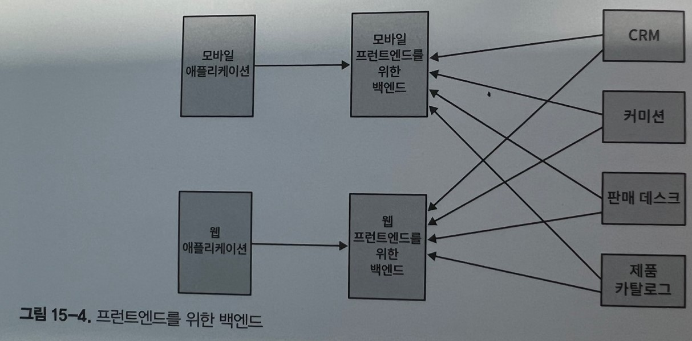
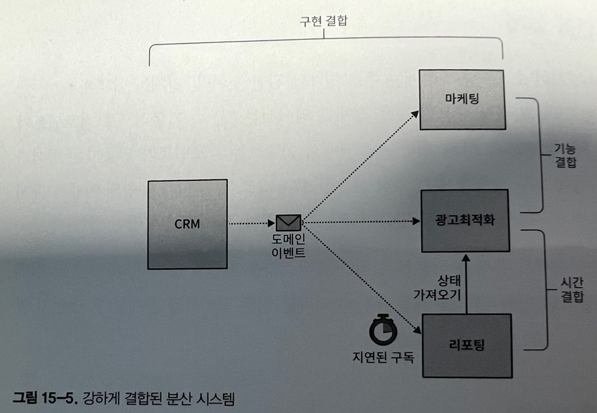
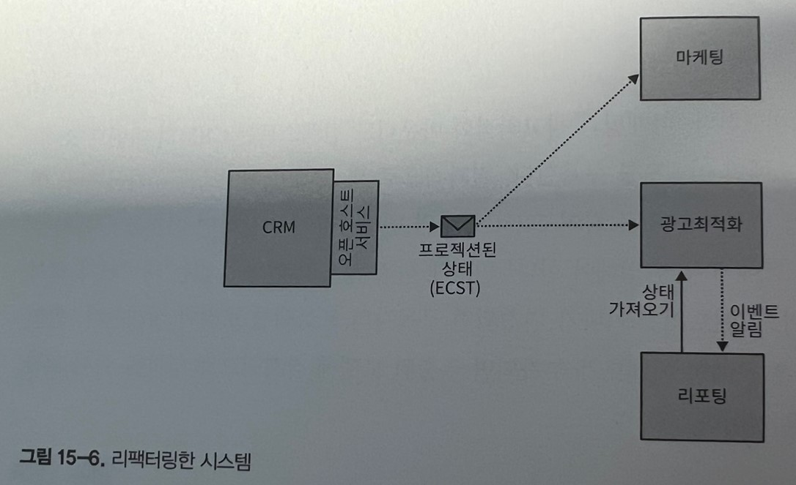

# 이벤트 주도 아키텍처

EDA는 현대 분산 시스템 어디에서나 찾아볼 수 있다. 많은 사람이 느슨하게 결합되고, 확장 가능하며, 내결함성을 가진 분산 시스템을 설계할 때 이벤트 주도 커뮤니케이션을 기본 통합 메커니즘으로 사용할 것을 권고한다.

EDA는 DDD와 연결된다. EDA는 이벤트를 기반으로 하고 이벤트는 DDD에서 두드러진다. EDA를 부주의하게 적용하면 모듈식 모놀리스를 분산된 커다란 진흙덩어리로 만들 수 있다.

## 이벤트 주도 아키텍처

간단히 말해서 이벤트 주도 아키텍처는 시스템 컴포넌트가 이벤트 메시지를 교환하면서 비동기적으로 서로 커뮤니케이션하는 아키텍처 스타일이다.

서비스의 엔드포인트를 동기적으로 호출하는 대신 컴포넌트가 이벤트를 발행해서 시스템 도메인의 변경사항을 다른 시스템 요소에 알려준다. 해당 컴포넌트는 시스템에서 발행한 이벤트를 구독하고 그에 따라 반응할 수 있다.

이벤트 소싱과의 차이점은 이벤트 소싱은 상태의 변화를 일련의 이벤트로 캡처하는 방법.

이벤드 주도 아키텍처와 이벤트 소싱 모두 이벤트를 기반으로 하지만, 두 패턴은 개념적으로 다르다. DEA는 서비스 간의 통신을 의미, 이벤트 소싱은 서비스 내부에서 발생

## 이벤트

### 이벤트, 커맨드, 메시지

지금까지 이벤트 정의는 메시지 패턴의 정의와 유사하다. 그러나 둘은 다르다. 이벤트는 메시지이지만 메시지가 반드시 이벤트는 아니다.

메시지에는 두 가지 유형이 있다.

-   이벤트

    -   이미 발생한 변화를 설명하는 메시지

-   커맨드
    -   수행돼야 할 작업을 설명하는 메시지

이벤트는 이미 일어난 일이고 커맨드는 어떠 일을 하라는 지시다. 이벤트와 커맨드 모두 메시지로 비동기 통신할 수 있다.

그러나 커맨드는 거부될 수 있다. 커맨드가 유효하지 않거나 시스템의 비즈니스 규칙과 모순되는 경우 커맨드의 대상이 명령실행을 거부할 수 있다. 반면에 이벤트의 경우 받는 쪽에서 이벤트를 취소할 수 없다. 이벤트는 이미 발생한 일을 설명한다. 이벤트를 되돌리기 위해 할 수 있는 유일한 일은 사가 패턴에서 수행하는 커맨드인 보상조치를 발행하는 것이다.
이벤트는 이미 발생한 일을 설명하므로 과거 시제로 표현해야 한다.

### 구조

이벤트는 선택한 메시징 플랫폼을 사용하여 직렬화하고 전송할 수 있는 데이터 레코드다. 일반적인 이벤트 스키마에는 이벤트의 메타데이터와 페이로드(이벤트가 전달하는 정보)를 포함한다.

```json
{
	"type": "delivery-confirmed",
	"event-id": "14101928-4d79-4da6-9486-dbc4837bc612",
	"correlation-id": "08011958-6066-4815-8dbe-dee6d9e5ebac",
	"delivery-id": "05011927-a328-4860-a106-737b2929db4e",
	"timestamp": 1615718833,
	"payload": {
		"confirmed-by": "17bc9223-bdd6-4382-954d-f1410fd286bd",
		"delivery-time": 1615701406
	}
}
```

이벤트의 페이로드는 이벤트가 전달하는 정보를 설명할 뿐만 아니라 이벤트의 유형도 정의한다.

### 이벤트의 유형

이벤트는 이벤트 알림, 이벤트를 통한 상태 전송, 도메인 이벤트의 세 가지 유형 중 하나로 분류할 수 있다.

#### 이벤트 알림

이벤트 알림은 다른 컴포넌트가 반응할 비즈니스 도메인의 변경에 관한 메시지다. 그 예로는 PaycheckGenerated, CampaignPublished 등이 있다. 이벤트 알림은 장황하지 않아야 한다. 이해 당사자이게 이벤트를 알리는 것이 목적이르모 구독자가 이벤트에 반응하는 데 필요한 모든 정보를 포함해서는 안 된다.

```json
{
	"type": "paycheck-generated",
	"event-id": "537ec7c2-d1a1-2005-8654-96aee1116b72",
	"delivery-id": "05011927-a328-4860-a106-737b2929db4e",
	"timestamp": 1615726445,
	"payload": {
		"employee-id": "456123",
		"link": "/paychecks/456123/2021/01"
	}
}
```

위 코드에서 이벤트는 외부 구성요소에게 생성된 급여를 알린다. 하지만 급여와 관련된 모든 정보를 담고 있지는 않다. 대신 수신자는 링크를 사용하여 더 자세한 정보를 가져올 수 있다.

비난재상문자와 비슷하다. 시스템은 기지국을 사용하여 짧은 메시지를 발송하여 시민들에게 상황을 알린다. 더 자세한 정보는 다른 정보소스를 사용하여 확인

간결한 이벤트 알림은 여러 시나리오에서 선호된다.

-   보안
    -   수신자가 세부 정보를 얻기 위한 질의를 명시적으로 하도록 강제하는 것은 민감한 정보가 메시징 인프라를 통해 공유되는 것을 막고 구독자가 데이터에 접근하기 위해 추가 권한이 필요하게 한다.
-   동시성

    -   이벤트 기반 연동의 비동기적인 특성으로 인해 정보가 구독자에게 도착했을 때 이미 만료된 상태로 렌더링될 수 있다. 정보의 특성이 경쟁조건에 민감한 경우 명시적으로 질의하면 최신 상태를 얻을 수 있다.

    -   또한 여러 명의 동시 구독자 중에서 한 명의 구독자만 이벤트를 처리해야 하는 경우 질의 절차에 비관적 잠금 방식을 적용할 수 있다.

#### 이벤트를 통한 상태 전송

상태 전송 메시지는 구독자에게 제공자의 내부 상태에 대한 변경사항을 알려준다.
이벤트 알림 메시지와는 달리 ECST 메시지는 상태 변경을 반영하는 모든 데이터를 포함한다.

ECST메시지는 두 가지 형태로 나타날 수 있다. 첫 번째는 수정된 엔티티의 상태에 대한 완전한 스냅숏이다.

```JSON
{
    "type": "customer-updated",
    "event-id": "6b7ce6c6-8587-4e4f-924a-cec028000ce6",
    "customer-id": "01b18d56-b79a-4873-ac99-3d9f767dbe61",
    "timestamp": 1615728520,
    "payload": {
        "first-name": "Carolyn",
        "last-name": "Hayes",
        "phone": "555-1022",
        "status": "follow-up-set",
        "follow-up-date": "2021/05/08",
        "birthday": "1982/04/05",
        "version": 7
    }
}
```

규모가 큰 자료구조를 사용하여 처리하는 경우에는 실제로 수정된 필드만 ECST메시지에 포함하는 것이 합리적이다.

```JSON
{
    "type": "customer-updated",
    "event-id": "6b7ce6c6-8587-4e4f-924a-cec028000ce6",
    "customer-id": "01b18d56-b79a-4873-ac99-3d9f767dbe61",
    "timestamp": 1615728520,
    "payload": {
        "status": "follow-up-set",
        "follow-up-date": "2021/05/10",
        "version": 8
    }
}
```

이벤트 스트림을 통해 사용자는 엔티티 상태의 로컬 캐시를 보유하고 이용할 수 있다. 개념적으로 이벤트를 통한 상태 전송 메시지는 비동기 데이터 복제 메커니즘이다. 이 접근 방식을 사용하면 시스템의 내결함성이 향상되므로 제공자 서비스가 가용되지 않는 경우라도 사용자는 계속해서 작업할 수 있다.


#### 도메인 이벤트

세번째 유형은 6장에서 설명한 도메인 이벤트다. 도메인 이벤트는 어떤 면에서 이벤트 알림과 ECST 메시지 사이 어딘가에 있다. 둘 다 비즈니스 도메인에서 중요한 이벤트를 설명하고, 관련된 모든 데이터를 포함한다. 이러한 유사성에도 불구하고 이 유형의 메시지는 개념적으로 다르다.

#### 도메인 이벤트와 이벤트 알림의 관계

도메인 이벤트와 이벤트 알림은 모두 제공자의 비즈니스 도메인에서 발생한 변경사항을 설명한다.

-   도메인 이벤트에는 이벤트를 설명하는 모든 정보를 포함한다. 사용자는 완전한 그림을 얻기 위해 추가 조치를 취할 필요가 없다.

-   모델링 의도가 다르다. 이벤트 알림은 다른 컴포넌트와의 연동을 돕기 위해 설계됐다. 반면 도메인 이벤트는 비즈니스 도메인을 모델링하고 설명하기 위한 것이다. 도메인 이벤트는 외부 사용자가 관심이 없더라도 유용할 수 있다. 가능한 모든 상태 전환을 모델링하는 데 도메인 이벤트가 사용되는 이벤트 소싱 시스템에서 특히 그렇다.

외부 사용자가 가용한 모든 도메인 이벤트에 관심이 있으면 최적이 아닌 설계로 이어진다.

#### 도메인 이벤트와 이벤트를 통한 상태 전송의 관계

도메인 이벤트에 포함된 데이터는 일반적인 ECST 메시지의 스키마와 개념적으로 다르다.

ECST 메시지는 제공자 데이터를 로컬 캐시로 보유하기에 충분한 정보를 제공한다. 하지만 모든 도메인 이벤트는 이러한 풍부한 모델을 노출해서는 안 된다. 게다가 사용자가 구독하지 않은 다른 도메인 이벤트가 동일한 필드에 영향을 줄 수 있으므로 특정 도메인 이벤트에 포함된 데이터 조차도 애그리게이트의 상태를 캐싱하기에 충분하지 않다.

또한 알림 이벤트의ㅏ 경우와 마찬가지로 두 가지 유형의 메시지에 대한 모델링 의도가 다르다. 도메인 이벤트에 포함된 데이터는 애그리게이트의 상태를 설명하기 위한 것이 아니다. 대신 수명주기 동안 발생한 비즈니스 이벤트를 설명한다.

#### 이벤트 유형: 예제

결온 이벤트를 나타내는 다음 세 가지 방법을 살펴보자.

```JS
// 이벤트 알림 메시지 지정된 사람이 결혼했다는 사실외에는 어떠한 정보도 없음 자세한 내용은 링크를 따라가야 함
eventNotification = {
    "type": "marriage-recorded",
    "person-id": "01b9a761",
    "payload": {
        "person-id": "126a7b61",
        "details": "/01b9a761/marriage-data"
    }
};
// 이벤트를 통한 상태 전송 메시지 그 사람의 개인정보 변경사항, 즉 성이 변경되었음을 보여준다. 변경된 이유를 설명하지 않는다.
ecst = {
    "type": "personal-details-changed",
    "person-id": "01b9a761",
    "payload": {
        "new-last-name": "Williams"
    }
};
// 이것은 비즈니스 도메인의 이벤트 특성에 최대한 가깝게 모델링 했다. 그사람의 ID와 그 사람이 배우자 이름을 따르는지를 나타내는 플래그를 포함한다.
domainEvent = {
    "type": "married",
    "person-id": "01b9a761",
    "payload": {
        "person-id": "126a7b61",
        "assumed-partner-last-name": true
    }
};
```

## 이벤트 주도 연동 설계

소프트웨어 설계는 주로 경계에 관한 것이다. 경계는 내부에 속한 것, 외부에 남아있는 것, 그리고 가장 중요한 것은 경계를 넘어서는 것, 즉 기본적으로 컴포넌트가 서로 연동되는 방식을 정의한다. EDA 기반 시스템에서 이벤트는 컴포넌트가 연동하는 방식과 컴포넌트의 경계 자체에 모두 영향을 주는 가장 중요한 설계 요소다. 올바른 유형의 이벤트 메시지를 선택하는 것은 분산 시스템을 제대로 만들거나(느슨한 결합) 망가뜨린다(강한 결합).

### 분산된 커다란 진흙덩어리


CRM 바운디드 컨텍스트는 이벤스 소싱 도메인 모델을 적용하여 구현된다.
팀은 CRM시스템에 마케팅 바운디드 컨텍스트와 연동할 경우, 이벤트 소싱 데이터 모델의 유연성을 활용해서 마케팅 바운디드 컨텍스트의 사용자가 CRM의 도메인 이벤트를 구독하게 한 후 요구사항에 맞는 모델을 프로젝션하기로 결정했다.

광고최적화 바운디드 컨텍스트를 도입했을 때 CRM 바운디드 컨텍스트에서 생성된 정보도 처리해야 했다. 광고 최적화가 CRM에서 생성된 모든 도메인 이벤트를 구독하고 요구사항에 맞는 모델을 프로젝션 하기로 했다.

마케팅 및 광고 최적화 바운디드 컨텍스트는 모두 동일한 형식으로 고객의 정보를 제시해야 했고, 따라서 CRM 도메인 이벤트에서 동일한 모델, 즉 각 고객 상태의 평면 스냅숏을 프로젝션 했다.

리포팅 바운디드 컨텍스트는 CRM에서 발행한 도메인 이벤트의 일부만 구독했고, 광고 최적화 컨텍스트에서 수행한 계산도 가져오기 위해 이벤트 알림 메시지를 사용했다.

그러나 광고 최적화 와 리포팅 바운디드 컨텍스트도 동일한 이벤트를 사용해서 계산을 시작하므로 리포팅 모델이 업데이트 되는 것을 보장하기 위해 리포팅 모델에서 구독을 지연시기키로 했다.

이 설계는 끔찍하다.

### 시간 결합

광고 최적화와 리포팅 바운디드 컨텍스트는 시간적으로 결합하여 엄격한 실행 순서에 따라 달라진다. 광고 최적화 컴포넌트는 리포팅 모듈이 트리거 되기 전에 처리를 완료해야 한다. 순서가 역전되면 리포팅 시스템에서 일관성 없는 데이터가 생성된다.

필요한 실행 순서대로 처리하기 위해 엔지니어는 리포팅 시스템에 처리 프로세스를 지연시켰다. 이 5분의 지연은 광고 최적화 컴포넌트가 필요한 계산을 완료할 수 있게 했다.
(하지만 이것이 명백하게 잘못된 순서로 실행되는 것을 막지는 못한다.)

-   광고최적화가 과부하로 5분 이내에 처리되지 못할 수 있다.
-   네트워크 문제로 수신 메시지가 광고 최적화 서비스로 전달되는 것이 지연될 수 있다.
-   광고 최적화 컴포넌트가 중단돼서 수신 메시지 처리가 충단될 수 있다.

### 기능 결합

마케팅과 광고최적화 바운디드 컨텍스트는 모두 CRM의 모데인 이벤트를 구독하고 결국 동일하게 고객 데이터를 프로젝션 하도록 구현했다. 즉, 들어오는 도메인 이벤트를 상태 기반 표현 방식으로 변환하는 비즈니스 로직을 양쪽 바운디드 컨텍스트에 모두 복제했고 변경 이유도 같았다. 고객 데이터를 동일한 형식으로 제시해야 했기 떄문이다.

같은 비즈니스 기능을 구현하는 여러 컴포넌트가 있을 때 변경이 생기면 양쪽 컴포넌트에 동시에 반영해야 한다.

### 구현 결합

이 유형의 결합은 더 미묘하다. 마케팅과 광고최적화 바운디드 컨텍스트는 CRM의 이벤트 소싱모델로 생성된 모든 도메인 이벤트를 구독한다. 결과적으로 새 도메인 이벤트를 추가하거나 기존 이벤트의 스키마를 변경하는 것과 같이 CRM 구현의 변경사항이 발생하면 이것을 구독하는 양쪽 바운디드 컨텍스트에 모두 반영해야 한다.

이렇게 하지 않으면 일관성 없는 데이터가 생성될 수 있다. 이벤트의 스키마가 변경되면 구독자의 프로젝션 로직이 실패한다. 반면 CRM 모델에 새로운 도메인 이벤트가 추가되면 추출한 모델에 잠재적으로 영향을 줘서 일관성 없는 상태를 가져올 것이다.

### 이벤트 주도 연동의 리팩토링

이벤트를 맹목적으로 적용하면 시스템 결합도가 낮아지지도 회복력이 향상되지도 않는다.

CRM 데이터 모델을 구성하는 모든 도메인 이벤트를 노출하면 구독자가 제공자의 구현 상세에 결합된다. 구현 결합은 훨씬 더 제한된 이벤트 집합이나 다른 유형의 이벤트를 노출하여 해결할 수 있다.

마케팅과 광고최적화 구독자는 같은 비즈니스 기능을 구현하여 기능적으로 서로 결합된다.

구현 결합과 기능 결합은 모두 제공자에서 프로젝션 로직을 캡슐화하여 결합도를 낮출 수 있다. CRM은 구현 세부 정보를 노출하는 대신 사용자 주도 컨트랙트 패턴을 따를 수 있다. 즉, 사용자가 필요로 하는 모델을 프로젝션하고 이를 바운디드 컨텍스트의 공표된 언어의 일부로 만든다. 이 방법은 연동에 특화된 모델로 내부 구현 모델과의 결합을 분리할 수 있다.
결과적으로 사용자는 필요한 모든 데이터를 얻을 뿐 CRM의 구현 모델을 알지 못한다.

광고 최적화와 리포팅 바운디드 컨텍스트 간의 시간 결합을 처리하기 위해 광고최적화 컴포너틑가 이벤트 알림 메시지를 발행하여 리포팅 컴포넌트가 필요한 데이터를 가져오도록 트리거할 수 있다.


### 이벤트 주도 설계 휴리스틱

당면한 작업에 적절한 이벤트 유형을 적용하여 설계하면 결합도가 매우 낮고 더욱 유연하며 내결함성이 향상된다.

#### 최악의 상황을 가정하라

시스템을 설계할 때의 길잡이가 되는 원칙으로 삼고 다음을 생각해보자.

-   네트워크가 느려질 것이다.
-   가장 어렵거나 중요한 순간에 서버 장애가 발생한다.
-   이벤트가 순서대로 도착하지 않는다.
-   이벤트가 중복된다.

무엇보다 중요한 것은 이러한 이벤트가 주말과 공휴일에 가장 자주 발생한다는 것.
이벤트 주도 아키텍처에서 주도라는 단어는 전체 시스템이 메시지의 성공적인 전달에 달려 있음을 의미한다. 그러므로 "다 잘 될 거야" 라는 사고방식은 전염병인 것 마냥 피해야 한다. 다음과 같은 방법으로 무조건 이벤트가 항상 일관되게 전달되도록 한다.

-   메시지를 안정적으로 발송하기 위해 아웃박스 패턴을 사용하자.
-   메시지를 발송할 때 구독자가 메시지 중복을 제거하고 순서가 잘못된 메시지를 식별하고 재정렬할 수 있게 하라.
-   보상 조치를 발행해야 하는 교차 바운디드 컨텍스트 프로세스를 조율할 때 사가 패턴과 프로세스 관리자 패턴을 활용하라.

#### 퍼블릭 이벤트와 프라이빗 이벤트를 사용하라

특히 이벤트 소싱 애그리게이트에서 도메인 이벤트를 발송할 때 세부 정보를 노출하지 않도록 주의하라. 이벤트를 바운디드 컨텍스트의 퍼블릭 인터페이스의 내재된 부분으로 취급하라. 따라서 오픈 호스트 서비스 패턴을 구현할 때 이벤트가 바운디드 컨텍스트의 공표된 언어에 반영되게 하라.

바운디드 컨텍스트의 퍼블릭 인터페이스를 설계할 때 다른 유형의 이벤트를 활용하라 이벤트를 통한 상태 전송 메시지는 구현 모델을 사용자가 필요로 하는 정보만 전달하는 더욱 간결한 모델로 압축한다.

이벤트 알림 메시지를 사용하여 퍼블릭 인터페이스를 더욱 최소화할 수 있다.
마지막으로 외부 바운디드 컨텍스트와 통신을 위한 도메인 이벤트는 최소화 하여 사용한다. 전용 퍼블릭 도메인 이벤트를 설계하는 것을 고려하라.

#### 일관성 요구사항을 평가하라.

이벤트 주도 커뮤니케이션을 설계할 때 이벤트 유형 선택을 위한 또 다른 휴리스틱을 활용하여 바운디드 컨텍스트의 일관성 요구사항을 평가한다.

-   컴포넌트가 궁극적으로 일관된 데이터를 처리할 수 있는 경우 이벤트를 통한 상태 전송 메시지를 사용한다.
-   사용자가 제공자의 마지막으로 변경된 상태를 읽어야 하는 경우 제공자의 최신 상태를 가져오는 후족 질의와 함께 이벤트 알림 메시지를 발행한다.

## 결론

-   이벤트 알림

    -   중요한 일이 발생했지만 사용자가 제공자에게 추가 정보를 명시적으로 질의해야 하는 상황 (재난 긴급 문자 같은)

-   이벤트를 통한 상태 전송

    -   메시지 기반 데이터 복제 매커니즘. 각 이벤트에는 제공자 데이터의 로컬 캐시를 유지 관리하는 데 사용할 수 있는 상태 스냅숏을 포함할 수 있다.

-   도메인 이벤트
    -   제공자의 비즈니스 도메인 내에서 발생하는 이벤트를 설명하는 메시지

부적절한 유형의 이벤트를 사용하면 EDA 기반 시스템이 잘못 설계되어 의도하지 않게 커다란 진흙 덩어리로 변한다. 통합을 위한 올바른 유형의 이벤트를 선택하려면 바운디드 컨텍스트의 일관성 요구사항을 평하가호 구현 상세 노출에 주의하라.

퍼블릭/프라이밋 이벤트를 명시적으로 구분해서 설계하라. 마지막으로 시스템이 기술적인 문제와 시스템 중단에 직면하더라도 메세지를 전달하는지 확인하라.
