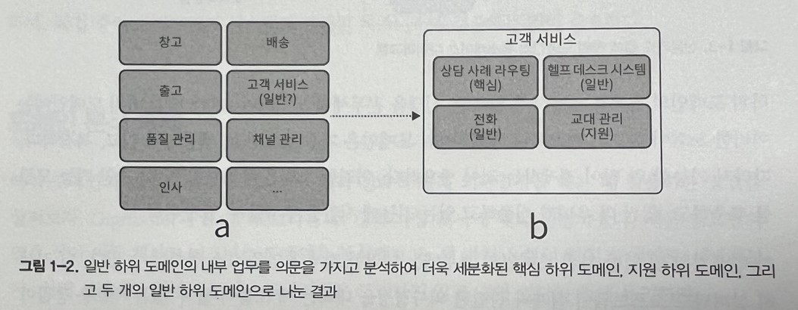
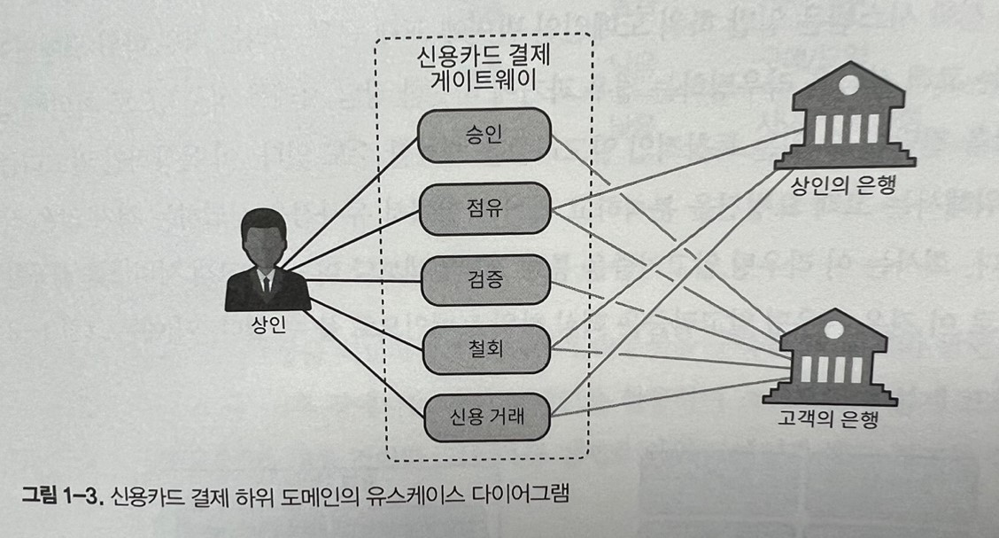
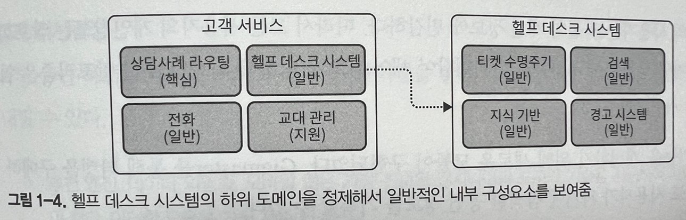

# 비즈니스 도메인 분석하기

이번 장에서는 기업의 비즈니스 도메인과 구조, 즉 핵심 하위 도메인과 지원 하위 도메인, 일반 하위 도메인을 분석하기 위한 도구로서 도메인 주도 설계를 배우게 될 것이다. 이러한 내용은 소프트웨어 설계의 기초가 된다.

## 비즈니스 도메인이란?

비즈니스 도메인은 기업의 주요 활동 영역을 정의한다. 일반적으로 회사가 고객에게 제공하는 서비스를 말한다.

-   페덱스는 배송 서비스를 제공한다.
-   스타벅스는 커피로 가장 잘 알려져 있다.
-   월마트는 가장 널리 알려진 소매업체 중 하나다.

## 하위 도메인이란?

비즈니스 도메인의 목표를 달성하기 위해 기업은 여러 가지 **하위 도메인**을 운영해야 한다. 하위 도메인은 비즈니스 활동의 세분화된 영역이다.

### 하위 도메인의 유형

소프트웨어 시스템에 다양한 아키텍처 구성요소로 이뤄진 것처럼, 하위 도메인은 서로 다른 전략적 비즈니스 가치를 가진다.

도메인 주도 설계에서 하위 도메인은 핵심, 일반, 지원의 세 가지 유형으로 구분한다.

#### 핵심 하위 도메인

**핵심 하위 도메인**은 회사가 경쟁 업체와 다르게 수행하고 있는 것을 말한다. 가령 새로운 제품이나 서비스를 발명하거나 기존 프로세스를 최적화 하여 비용을 줄이는 것이 그렇다.

핵심 하위 도메인에는 발명이나, 스마트 최적화, 비즈니스 노하우, 또는 다른 지적 재산이 포함된다.

**복잡성**  
구현하기 쉬운 핵심 하위 도메인은 일시적인 경쟁 우위만을 제공할 수 있다. 따라서 핵심 하위 도메인은 자연스럽게 복잡해진다.

회사의 핵심 비즈니스는 높은 진입장벽이 잇어야 한다. 경쟁사가 회사의 솔루션을 모방하거나 복제하기가 어려워야 한다.

**경쟁 우위의 원천**  
핵심 하위 도메인에 반드시 기술이 들어가야 하는 것은 아님을 알아야 한다. 모든 비즈니스 문제가 알고리즘이나 기술 솔루션으로 해결되지는 않는다. 회사의 경쟁 우위는 다양한 원천에서 나올 수 있다.

#### 일반 하위 도메인

**일반 하위 도메인**은 모든 회사가 같은 방식으로 수행하는 비즈니스 활동을 말한다.
핵심 하위 도메인과 마찬가지로 일반 하위 도메인은 일반적으로 복잡하고 구현하기 어렵다. 단지 회사에 경쟁력을 제공하지 않는다. 모든 회사에서 사용하고 있어서 더 이상 혁신이나 최적화가 필요 없다.

#### 지원 하위 도메인

**지원 하위 도메인**은 회사의 비즈니스를 지원하는 활동을 말한다. 일반 하위 도메인과 마찬가지로 어떠한 경쟁 우위도 제공하지 않는다.

지원 하위 도메인은 간단하다. 지원 하위 도메인의 비즈니스 로직은 대부분 데이터 입력화면과 ETL(extract, transform, load; 추출, 변환, 로드)작업과 유사하다. 이는 소위 말하는 CRUD 인터페이스를 말한다. 이러한 활동 영역은 회사에 어떠한 경쟁 우위도 제공하지 않으므로 높은 진입장벽이 필요하지 않다.

## 하위 도메인 비교

### 경쟁 우위

핵심 하위 도메인만이 회사에 경쟁 우위를 제공한다. 핵심 하위 도메인은 경쟁사와 차별화하기 위한 회사의 전략이다.

정의에 따르면 일반 하위 도메인은 경쟁 우위의 원천이 될 수 없다.

지원 하위 도메인은 진입장벽이 낮고 경쟁 우위도 제공할 수 없다. 일반적으로 경쟁사가 지원 하위 도메인을 복제해도 크게 신경 쓰지 않는다.

반대로 회사는 전략적으로 지원 하위 도메인인으로 이미 만들어져 있는 일반적인 솔루션을 사용하는것을 선호한다.

회사가 해결할 수 있는 문제가 더 복잡할 수록 더 많은 비즈니스 가치를 제공할 수 있다.

### 복잡성

좀 더 기술적인 관점에서 보면 하위 도메인의 유형에 따라 복잡성의 수준이 다르기 때문에 조직의 하위 도메인을 식별하는 것이 중요하다. 소프트웨어를 설계할 때 우리는 비즈니스 요구사항의 복잡성을 수용할 수 있는 도구와 기술을 선택해야 한다. 견고한 소프트웨어 솔루션을 설계하기 위해 하위 도메인을 식별하는 것은 반드시 필요하다.

지원 하위 도메인의 비즈니스 로직은 간단하다. 이것은 기본적인 ETL 직업과 CRUD인터페이스 이며, 비즈니스 로직이 명확하다. 입력의 유효성을 검증하거나 다른 구조의 데이터로 변환하는 것 이상의 로직에서 벗어나지 않는다.

일반 하위 도메인은 훨씬 더 복잡하다. 다른 사람들이 이미 이러한 문제를 해결하는 데 시간과 노력을 투자한 데는 그럴 만한 이유가 있다. 암호화 알고리즘이나 인증 메커니즘을 생각해보자.

핵심 하위 도메인은 복잡하다. 회사의 수익성이 좌우되기 때문에 경쟁업체가 최대한 모방하기 어려워야 한다.

핵심 하위 도메인과 지원 하위 도메인을 구별할때 복잡성은 도메인을 구별하는 유용한 지침이 된다. 지원 하위 도메인과 일반 하위 도메인을 구별하는 데도 유사한 추론을 적용할 수 있다. 외부 솔루션을 연동하는 것보다 자체 솔루션을 구현하는 것이 더 간단하고 저렴한가? 그렇다면 지원 하위 도메인이다.

비즈니스 로직이 데이터 입력을 위한 CRUD인터페이스와 유사한가? 아니면 복잡한 알고리즘 또는 비즈니스 프로세스 규칙과 변하지 않는 속성에 의해 조정되는 비즈니스 프로세스를 구현해야 하는가? 전자는 지원 하위 도메인이고, 후자는 일반적으로 핵심 하위 도메인이다.

### 변동성

핵심 하위 도메인은 자주 변경될 수 있다. 다양한 구현 방법을 시도하고 개선하고 최적화 해야 가능하다. 또한 핵심 하위 도메인에 대한 개선 작업은 끝이 없다. 경쟁사보다 앞서기 위해서 핵심 하위 도메인의 지속적인 진화는 필수적이다.

핵심 하위 도메인과 달리 지원 하위 도메인은 자주 변경되지 않는다. 지원 하위 도메인은 기업에 어떠한 경쟁 우위도 제공하지 않기 때문에 지원 하위 도메인의 개선은 핵심 하위 도메인에 투자한 동일한 노력에 비해 아주 작은 비즈니스 가치를 제공한다.

### 솔루션 전략

핵심 하위 도메인은 업게에서 기업이 다른 경쟁사와 경쟁할 수 있는 능력을 제공한다. 그렇다고 다른 하위 도메인이 중요하지 않다는 뜻은 아니며 기업에 해당 비즈니스 도메인에서 일하려면 하위 도메인 모두가 필요하다.

핵심 하위 도메인은 사내에서 구현되어야 한다. 핵심 하위 도메인은 솔루션을 구매하거나 외부에서 도입할 수 없다.

또한 핵심 하위 도메인을 하청하는 것도 현명하지 않다. 핵심 하위 도메인 구현은 전략적인 투자다. 유지보수는 어떻게? 조직의 가장 숙련된 인재는 핵심 하위 도메인에서 일하도록 업무가 할당되어야 한다.

일반 하위 도메인은 어렵지만 이미 문제가 해결되었기 때문에 일반 하위 도메인을 사내에서 구현하는데 시간과 노력을 투자하는 것보다 이미 만들어진 제품을 구입하거나 오픈소스 솔루션을 채택하는 것이 비용 면에서 더 효율적이다.

경쟁 우위가 없기 떄문에 사내에서 지원 하위 도메인을 구현하지 않는 것이 합리적이다. 하지만 일반 하위 도메인과 달리 지원하위 도메인은 기존에 만들어진 솔루션이 없는 경우가 있다. 이런 경우 자체 구현할 수 밖에 없다.

지원 하위 도메인에는 정교한 디자인 패턴이나 고급 엔지니어링 기술이 필요 없다. 인력 관점에서도 지원 하위 도메인은 고도로 숙련된 기술이 필요하지 않기 때문에 새로운 인재를 양성할 수 있는 좋은 연습기회를 제공한다.

| 하위 도메인 유형 | 경쟁우위 | 복잡성 | 변동성 | 구현 방식     | 문제     |
| ---------------- | -------- | ------ | ------ | ------------- | -------- |
| 핵심             | 예       | 높음   | 높음   | 사내개발      | 흥미로움 |
| 일반             | 아니오   | 높음   | 낮음   | 구매/도입     | 해결됨   |
| 지원             | 아니오   | 낮음   | 낮음   | 사내개발/하청 | 뻔함     |

### 하위 도메인 경계 식별

하위 도메인과 해당 유형을 식별하면 소프트웨어 솔루션을 구축할 때 설게와 관련된 의사결정에 상당한 도움이 된다.

하위 도메인과 그 유형은 기업의 비즈니스 전략에 따라 정의되며, 이는 동일한 분야에서 다른 회사와 경쟁하기 위해 자신을 차별화 하는 방법이다. 대다수의 소프트웨어 프로젝트에서 하위 도메인은 어떤 식으로든 이미 존재한다.

회사의 부서와 기타 조직 단위는 좋은 출발점이다. 예를 들어 온라인 쇼핑몰이라면 창고, 고객, 서비스, 출고, 배송, 품질 관리, 채널 관리 부서등이 포함될 수 있다. 그러나 이는 상대적으로 광범위한 활동 영역이다.

고객 서비스 부서를 예로 이 기능은 종종 다른 업체에 하청되므로 지원 하위 도메인 또는 일반 하위 도메인으로 생각하는 것이 합리적이다. 하지만 이 정보가 올바른 의사 결정을 하기에 충분할까?

### 하위 도메인 정제

크게 나눈 하위 도메인은 좋은 출발점이지만, 문제는 세부사항에 있다. 비즈니스 기능의 복잡한 내용에 숨겨진 중요한 정보를 놓치지 않아야 한다.

고객 서비스 부서의 예로 내부적인 업무를 조사하면 전형적인 고객 서비스 부서가 헬프 데스크 시스템, 교대 근무 관리 및 일정, 전화 시스템 등과 같이 좀 더 세분화 되어 있음을 알 수 있다.

헬프 데스크와 전화 시스템은 일반 하위 도메인인 반면에 교대 근무 관리는 지원 하위 도메인이다. 또한 회사는 고객 상담을 라우팅하는 경우 과거에 비슷한 상담 사례를 성공적으로 처리한 상담원에게 상담을 전달할 수 있는 독창적인 알고리즘을 개발할 수도 있다.(이경우 라우팅 알고리즘은 핵심 하위 도메인)

### 응집된 유스케이스를 하위 도메인으로

기술적인 관점에서 하위 도메인은 상호 연관되고 응집된 유스케이스의 집합과 유사하다. 이러한 유스케이스 집합에서는 보통 동일한 행위자(actor), 비즈니스 엔티티(business entity)를 포함하고 모두 밀접하게 관련된 데이터의 집합을 다룬다.

표시된 신용카드 결제 게이트웨어의 유스케이스 다이어그램을 보면 작업 중인 데이터 및 관련된 행위자와 밀접하게 연관되어 있다. 따라서 모든 유스케이스는 신용카드 결제 하위 도메인을 형성한다.

핵심 하위 도메인에는 경계를 식별하기 위한 노력이 반드시 필요하다. 핵심 하위 도메인은 가장 중요하고, 변동성이 있고, 복잡하다. 따라서 가능한 한 많이 정제하는 것이 중요하다.

지원 및 일반 하위 도메인의 경우에는 이러한 정제 작업을 다소 완화할 수 있다. 더 자세히 살펴봐도 소프트웨어 설게와 관련된 의사결정을 내리는 데 도움이 될 수 있는 새로운 통찰이 나오지 않으면 중단하는 것이 좋다.

보다시피 헬프 데스크 시스템의 하위 도메인을 추가로 정리한다고 전략적으로 유용한 정보가 나오지는 않는다.

### 핵심에 집중

하위 도메인은 소프트웨어 설계 의사 결정을 내리는 프로세스의 어려움을 쉽게 해결하도록 돕는 도구다. 모든 조직에는 경쟁 우위를 제공하지만 소프트웨어와는 아무런 관련이 없는 비즈니스 기능이 꽤나 많다.

하위 도메인을 찾을때 소프트웨어와 관련되지 않은 비즈니스 기능을 식별하고 그 자체로 인정하며, 작업 중인 소프트웨어 시스템과 관련된 비즈니스에 집중하는 것이 중요하다.

## 도메인 분석 예제

연습삼아 비즈니스 도메인을 분석해보고, 세 가지 유형의 하위 도메인도 식별해보자.

### Gigmaster

Gigmaster는 티켓 판매 및 유통회사다. 모바일 앱은 사용자의 음악 라이브러리, 스트리밍 서비스 계정, 소셜 미디어 프로필을 분석하여 사용자가 관심을 가질 만한 주변의 공연 정보를 찾아낸다.

사용자는 자신의 개인 정보에 민감하다. 따라서 모든 사용자의 개인정보는 암호화 된다. 또한 어떤 상황에서도 사용자의 죄책감이 새어 나오지 않도록 회사의 추천 알고리즘은 익명데이터만 사용한다.

앱의 추천 기능을 개선하기 위ㅏ해 새로운 모듈이 구현되었다. 이 앱을 통해 티켓을 구매하지 않았더라도 사용자가 과거에 참석한 공연 정보를 기록할 수 있다.

#### 비즈니스 도메인과 하위 도메인

비즈니스 도메인은 티켓 판매이며, 고객에게 제공하는 서비스이다.  
**핵심 하위 도메인** Gigmaster의 주요 경쟁 우위는 추천엔진이다. 또한 회사는 사용자의 개인정보를 중요하게 생각하며 익명 데이터에 대해서만 처리한다. 명시적으로 언급되지는 않았지만 모바일 앱의 사용자 경험도 중요하다고 추론할 수 있다 따라서 핵심 도메인은

-   추천 엔진
-   데이터 익명화
-   모바일 앱

**일반 하위 도메인** 다음과 같은 일반 하위 도메인을 식별하고 추론할 수 있다.

-   암호화 -> 모든 데이터 암호화
-   회계 -> 회사가 영업을 하고 있기 때문
-   정산 -> 고객에게 청구
-   인증 및 권한 부여 -> 사용자 식별

**지원 하위 도메인** 비즈니스 로직은 간단하며 ETL, CRUD

-   음악 스트리밍 서비스와의 연동
-   소셜 네트워크와 연동
-   참석 공연 모듈

#### 설계 의사 결정

작동 중인 하위 도메인과 해당 유형 간의 차이점을 알면 이미 몇가지 설계 의사결정을 내릴 수 있다.

-   추천 엔진, 데이터 익명화, 모바일 앱은 가장 진보된 엔지니어링 도구와 기술을 사용하여 사내에서 구현
-   데이터 암호화, 회계, 정산, 인증에는 상용 또는 오픈소스 솔루션을 사용
-   스트리밍 서비스, 소셜 네트워크와의 연동과 참석한 공연을 위한 모듈 개발은 하청할 수 있다.

### BusVNext

BusVNext는 대중교통 회사다. 고객에게 택시를 잡는 것 처럼 쉽게 버스를 타는 경험을 제공하는 것이 목표다. 이 회사는 주요 도시의 버스를 관리한다.

BusVNext의 고객은 모바일 앱을 통해 승차권을 예매할 수 있다 예정된 출발 시간에 가까운 버스의 경로를 즉석에서 조정해서 지정된 출발 시간에 고객을 픽업한다.

회사의 주요 과제는 라우팅 알고리즘을 구현하는 것이다. 요구사항은 외판원문제의 변형이다. 라우팅 로직은 계속 조정되고 최적화된다. 통계에 따르면 탑승이 취소된 주된 사유는 버스도착까지의 대기 시간때무닝다. 그래서 회사는 하자가 지연되더라도 빠른 픽업을 우선시하는 라우팅 알고리즘을 만들었다.

라우팅 알고리즘을 최적화 하기 위해 타 회사에서 제공하는 교통 상황과 실시간 경고 정보도 통합했다.

BusVNext는 새로운 고객을 유치하고 피크 시간과 그렇지 않은 시간에 승차 수요를 균등하게 하기 위해 때때로 특별 할인을 제공한다.

#### 비즈니스 도메인과 하위 도메인

고객에게 최적화된 버스 승차 서비스를 제공한다. 비즈니스 도메인은 대중교통이다.

**핵심 하위 도메인** 라우팅 알고리즘, 승차 데이터가 고객 행동에 대한 새로운 통찰력을 얻기 위해 지속적으로 분석되는 것을 봤다. 이러한 통찰력을 통해 회사는 라우팅 알고리즘을 최적화하여 수익을 높일 수 있다.

-   라우팅
-   분석
-   모바일 앱 사용자 경험
-   차량 관리

**일반 하위 도메인** 라우팅 알고리즘은 일반 하위 도메인인 타사에서 제공하는 교통량과 경고 데이터를 사용한다. 고객이 결제할 수 있도록 기능을 제공하므로, 회계와 정산 기능을 구현해야 한다.

-   교통 상황
-   회계
-   청구
-   권한 부여

**지원 하위 도메인** 프로모션과 할인 관리 모듈은 회사의 핵심 비즈니스를 지원한다. 즉, 그자체로 핵심 하위 도메인은 아니다.

#### 설계 의사 결정

-   라우팅 알고리즘, 데이터 분석, 차량 관리, 앱 사용성은 가장 정교한 기술 도구와 패턴을 사용해서 사내에서 개발해야 한다.
-   판촉 관리 모듈의 구현은 외부에 위탁할 수 있다.
-   교통 상황 식별, 사용자 권한 관리, 재무 및 거래 기록 관리는 외부 서비스 제공 업체에 맡길 수 있다.

## 도메인 전문가는 어떤 사람인가?

도메인 전문가는 우리가 모델링하고 코드로 구현할 비즈니스의 모든 복잡성을 알고 있는 주제 전문가다.

일반적으로 도메인 전문가는 요구사항을 제시하는 사람 또는 소프트웨어의 최종 사용자이다.

## 결론

비즈니스가 운영되는 영역과 고객에게 제공되는 서비스는 모두 비즈니스 도메인과 함께 시작된다.

**핵심 하위 도메인** : 흥미로운 문제들. 기업이 경쟁자로부터 차별화하고 경쟁 우위를 얻는 활동이다.

**일반 하위 도메인** : 해결된 문제들. 이것은 모든 회사가 같은 방식으로 하고 있는 일이다. 여기에는 혁신이 필요하지 않다. 기존 솔루션을 사용하는 것이 더 비용 효과적

**지원 하위 도메인** : 분명한 해결책이 있는 문제들. 사내에서 구현해야 할 활동이지만 경쟁 우위를 제공하지 않는다.
