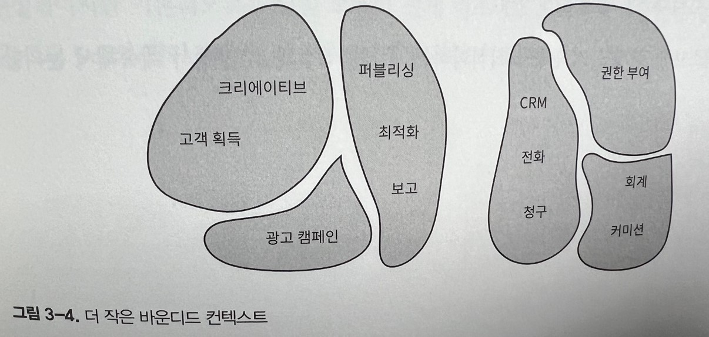

# 도메인 복잡성 관리

## 일관성 없는 모델

텔레마케팅 회사의 예로 회사의 마케팅 부서는 온라인 광고를 통해 리드(lead)를 생성한다. 영업 부서는 잠재 고객이 제품이나 서비스를 구매하도록 유도하는 역할을 한다.

도메인 전문가의 언어를 살펴보면 리드(lead)라는 용어가 마케팅과 영업 부서에서 서로 다른 의미로 사용된다.

-   마케팅 부서 : 마케팅 담당자에게 리드는 누군가가 제품 중 하나에 관심이 있다는 알림을 나타낸다. 잠재고객의 연락처 정보를 수신하는 이벤트는 리드로 간주된다.

-   영업 부서 : 영업 부서 컨텍스트에서 리드는 훨씬 더 복잡하다. 리드는 영업 프로세스의 전체 수명주기를 나타낸다. 리드는 단순한 이벤트가 아니라 장기적으로 진행되는 과정이다.

이 텔레마케팅 회사의 경우 유비쿼터스 언어를 어떻게 공식화 할까?

유비쿼터스 언어는 일관성이 있어야 하며 각 용어는 하나의 의미를 가져야 한다. 유비쿼터스 언어가 도메인 전문가의 멘탈 모델을 반영해야 하는데 영업과 마케팅의 리드의 멘탈 모델은 차이가 있다.

이 문제에 대한 전통적인 솔루션은 모든 종류의 문제에 사용할 수 있는 단일 모델을 설계하는 것이다. (이것 저것 다 잘하는 사람은 단 한 분야에서도 달인이 될 수 없다.) 이러한 모델은 모든 것에 적합해야 하지만 결국에는 아무 소영이 없다. 무엇을 하던지 항상 복잡성에 직면하게 된다.

또 다른 솔루션은 마케팅 리드, 영업 리드 와 같이 문맥상 정의에 문제가 있는 용어 앞에 접두사를 추가하는 것 그러면 두 모델을 코드로 만들 수 있다 하지만 단점으로 인지 부하를 유발하고 모델의 구현이 유비쿼터스 언어와 일치하지 않는다. 아무도 대화에서 접두사를 사용하지 않을 것이다. 사람은 추가 정보 없이도 대화의 맥락에 의존해 소통할 수 있기 때문에

이러한 시나리오를 다루기 위한 도메인 주도 설계 패턴 중 하나인 바운디드 컨텍스트라는 주제를 알아보자

## 바운디드 컨텍스트란 무엇인가.

도메인 주도 설계에서의 솔루션은 간단하다. 유비쿼터스 언어를 여러 개의 작은 언어로 나눈 다음 각 언어를 적용할 수 있는 명시적인 바운디드 컨텍스트에 할당하면 된다.

### 모델 경계

모델은 실제 세계의 복사본이 아니라 복잡한 시스템을 이해하는 데 도움을 주기 위해 구조화한 것이다. 우리가 해결하려는 문제는 모델 본연의 목적이다. 모델은 경계없이 존재할 수 없다. 경계가 없다면 현실 세계의 복제본처럼 확장될 것이다. 따라서 모델의 경계(바운디드 컨텍스트)를 정의하는 것은 모델링 프로세스의 본질적인 부분이다.

하나의 바운디드 컨텍스트의 유비쿼터스 언어는 다른 바운디드 컨텍스트의 범위에는 완전히 관련이 없다. 바운디드 컨텍스트는 유비쿼터스 언어와 해당 언어가 나타내는 모델의 적용가능성을 규정한다.

서로 다른 문제 도메인에 따라 고유한 모델을 정의할 수 있다.

### 정제된 유비쿼터스 언어

바운디드 컨텍스트를 통해 유비쿼터스 언어의 정의를 완성할 수 있다. 유비쿼터스 언어는 바운디드 컨텍스트 경게 안에서만 보편적으로 사용된다. 유비쿼터스 언어는 바운디드 컨텍스트에 포함된 모델을 설명하는 데만 집중한다.

### 바운디드 컨텍스트의 범위

서로 다른 도메인 전문가들은 동일한 비즈니스 엔티티에 대해 상충되는 멘탈 모델을 가지고 있었다. 비즈니스 도메인을 모델링하기 위해 우리는 모델을 분할하고, 각 세분화된 모델을 적용 가능한 컨텍스트를 엄격하게 정의해야 했다.

유비쿼터스 언어의 일관성은 해당 언어의 가장 넓은 경계를 식별하는데 도움이 될 뿐이다.

하나의 모델은 더 작은 바운디드 컨텍스트로 분해할 수 있다.

유비쿼터스 언어의 범위(바운디드 컨텍스트)를 정의하는 것은 전략적인 설계 의사결정이다. 경계는 비즈니스 도메인의 고유한 컨텍스에 따라 넓힐 수 있고, 비즈니스 도메인을 더 작은 문제 도메인으로 세분화하여 좁힐 수도 있다.

바운디드 컨텍스트의 크기가 대한 결정은 문제 도메인이 무엇이냐에 따라 달라진다. 때로는 넓은 경계를 사용하는 것이 더 명확하고, 어떤 경우에는 분해하는 것이 더 합리적이다.

큰 바운디드 컨텍스트에서 세분화된 바운디드 컨텍스트를 추출하는 이유에는 새로운 소프트웨어 엔지니어링 팀을 구성하거나 시스템의 일부 비기능 요구사항을 해결하는 것이 포함된다.

모델을 유용하게 유지하고 바운디드 컨텍스트의 크기를 비즈니스 요구사항과 조직의 제약사항에 맞춰라. 주의할 점은 응집된 기능을 여러 바운디드 컨텍스트로 분할하는 것이다.

이러한 분할 방법은 각 컨텍스트가 독립적으로 발전하는 능력을 저해한다. 대신 같은 비즈니스 요구사항과 변경사항은 바운디드 컨텍스트에 동시에 영향을 끼치고, 변경에 대한 동시 배포가 요구된다. (생명주기가 같은걸 하나로 묶어라고 다른책에서는 그랬던거 같은데)

이러한 비효율적인 분해를 피하기 위해 1장에서 논의한 경험을 바탕으로 하위 도메인을 찾는다. 같은 데이터에서 작동하는 응집된 유스케이스의 직합을 식별하되, 그것을 여러개의 바운디드 컨텍스트로 분해하지 마라.

## 바운디드 컨텍스트 대 하위 도메인

바운디드 컨텍스트와 하위 도메인의 두 경계가 필요한 이유

### 하위 도메인

기업의 비즈니스 전략을 이해하려면 비즈니스 도메인을 분석해야 한다. 도메인 주도 설게 방법론에 따르면 분석 단게에서 다양한 하위 도메인을 식별하는 작업이 포함된다.

하위 도메인은 상호 관련된 유스케이스 집합과 유사하다. 유스케이스는 비즈니스 도메인과 시스템 요구사항에 따라 정의된다.

소프트웨어 엔지니어는 하위 도메인을 식별하기 위해 비즈니스 도메인을 분석한다.

### 바운디드 컨텍스트

반면에 바운디드 컨텍스트는 소프트웨어 엔지니어에 의해 설계된다. 모델의 경계를 선택하는 것은 전략적 설계의 의사결정이다. 비즈니스 도메인을 더 작고 관리 가능한 문제 도메인으로 어떻게 나눌지 정한다.

### 하위 도메인과 바운디드 컨텍스트 사이의 상호 작용

비현실적이지만 이론적으로는 단일 모델이 전체 비즈니스 도메인에 적용될 수 있다. 이런 전략은 소규모 시스템에서 효과적일 수 있다.(모놀리식 바운디드 컨텍스트)

모델이 충돌하면 도메인 전문가의 멘탈 모델을 따라 시스템을 바운디드 컨텍스트로 분해할 수 있다(마케킹, 영업 컨텍스트)

모델이 여전히 크고 유지보수하기 어려운 경우 더 작은 바운디드 컨텍스트로 분해할 수 있다.
(크리에이트, 퍼블리싱, CRM, 권한 부여, 고객 획득, 최적화, 전화, 회계, 광고 캠페인, 보고, 청구, 커미션) -> 하위 도메인 경계에 맞춰 나눈 바운디드 컨텍스트

어느쪽이든 이것은 설계에 대한 의사결정이다.

어떤 시나리오에서는 바운디드 컨텍스트와 하위 도메인 간에 일대일 관계를 맺는 것이 완벽하게 합리적일 때도 있고 어떤 경우에는 다른 분해 전략이 더 적합할 수 있다.

중요한 것은 하위 도메인은 발견하고 바운디드 컨텍스트는 설계한다는 점이다. 하위 도메인은 비즈니스 전략에 의해 정의된다. 소프트웨어 엔지니어는 특정 프로젝트의 컨텍스트와 제약 조건을 해결하기 위해 소프트웨어 솔루션과 바운디드 컨텍스트를 설계할 수 있다.

## 경계

바운디드 컨텍스트 패턴은 물리적 경계와 소유권 경계를 규정하기 위한 도메인 주도 설계 도구다.

### 물리적 경계

바운디드 컨텍스트는 모델 경계뿐 아니라 이를 구현하는 시스템의 물리적 경계 역할도 한다.
각 바운디드 컨텍스트는 개별 서비스/ 프로젝트로 구현돼야 한다. 즉, 구현, 진화, 버전관리를 각각 다른 바운디드 컨텍스트와 독립적으로 해야한다.

바운디드 컨텍스트 간의 명확한 물리적 경계를 통해 각 바운디드 컨텍스트를 요구사항에 가장 적합한 기술 스택으로 구현할 수 있다.

**바운디드 컨텍스트는 여러 하위 도메인을 포함할 수 있다. 이러한 경우 바운디드 컨텍스트는 물리적 경게고 하위 도메인은 논리적 경계다. 논리적 경계는 프로그래밍 언어의 종류에 따라 네임스페이스나 모듈, 패키지 같은 다른 이름을 갖는다.**

### 소유권 경계

바운디드 컨텍스트는 한 팀에서만 구현, 발전, 유지 관리해야 한다. 두 팀이 같은 바운디드 컨텍스트에서 작업할 수 없다.

대신 팀은 서로 다른 바운디드 컨텍스트로 분리된 모델과 시스템을 명시적으로 연동하기 위한 통신 프로토콜을 정의해야 한다.

## 실생활의 바운디드 컨텍스트

실제로 바운디드 컨텍스트는 비즈니스 도메인과 하위 도메인만큼 분명하지 않지만. 도메인 전문가의 멘탈 모델이 있는 것처럼 존재한다. 소프트웨어 엔지니어는 도메인 전문가가 다양한 비즈니스 엔티티와 프로세스에 대해 어떻게 생각하는지 의식해야 한다.

### 시멘틱 도메인

도메인 주도 설계의 바운디드 컨텍스트는 시맨틱 도메인의 사전적 개념에 기반한다고 볼 수 있다. 시맨틱 도메인(semantic domain)은 의미 영역과 해당 의미를 전달하기 위해 사용하는 단어 영역으로 구분한다.

예로 모니터, 포트, 프로세서 라는 단어는 소프트웨어와 하드웨어 엔지니어링 시맨틱 도메인에서 서로 다른 의미를 가진다.

다른 예로 토마토는 식물학적 정의에 따르면 과일이지만 요리의 맥락에서는 채소이다.

### 과학

뉴턴의 운동 법칙에 따르면 공간과 시간은 절대적이지만 아인슈타인의 상대성 이론에서 공간과 시간은 더 이상 절대적이지 않고 관찰자에 따라 다른다.

모델은 당면한 작업과 관련 없는 정보는 생략해야 한다.

## 결론

도메인 전문가의 멘탈 모델에 내제된 충돌을 발견할 때마다 유비쿼터스 언어를 여러 개 바운디드 컨텍스트로 분해해야 한다. 유비쿼터스 언어는 바운디드 컨텍스트의 범위 내에서 일관성이 있어야 한다. 서로 다른 바운디드 컨텍스트안에서는 동일한 용어라도 다른 의미를 가질 수 있다.

하위 도메인이 발견되면 바운디드 컨텍스트도 설계한다. 모데인을 바운디드 컨텍스트로 나누는 것은 전략적 설게의 의사결정이다.

두 팀이 동일한 바운디드 컨텍스트에서 작업을 공유할 순 없다.

바운디드 컨텍스트는 시스템을 서비스, 하위 시스템 등의 물리적 구성요소로 분해한다. 각 바운디드 컨텍스트의 수명주기는 서로 독립적이다.

바운디드 컨텍스트는 독립적으로 발전할 수 있다.
