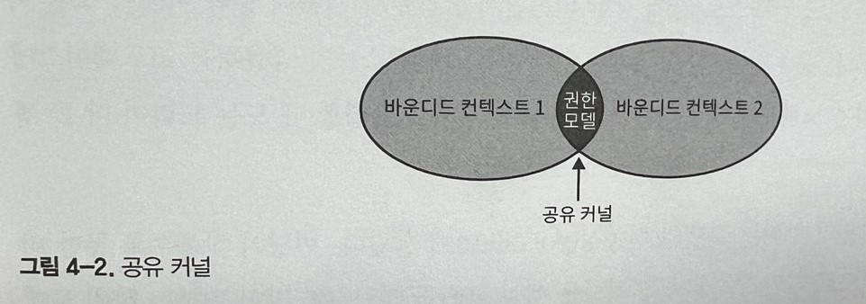
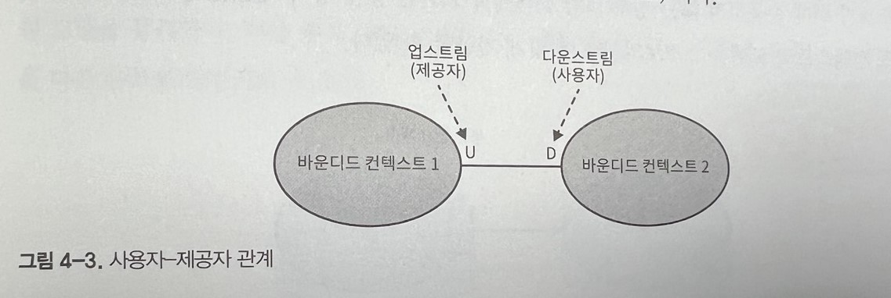
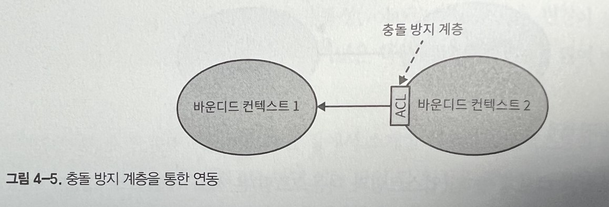
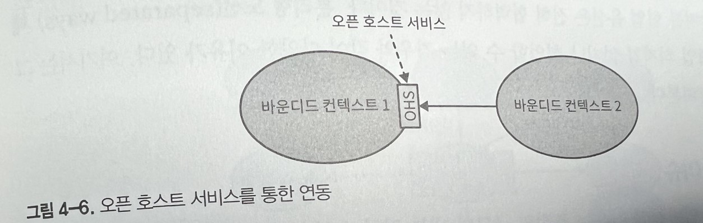
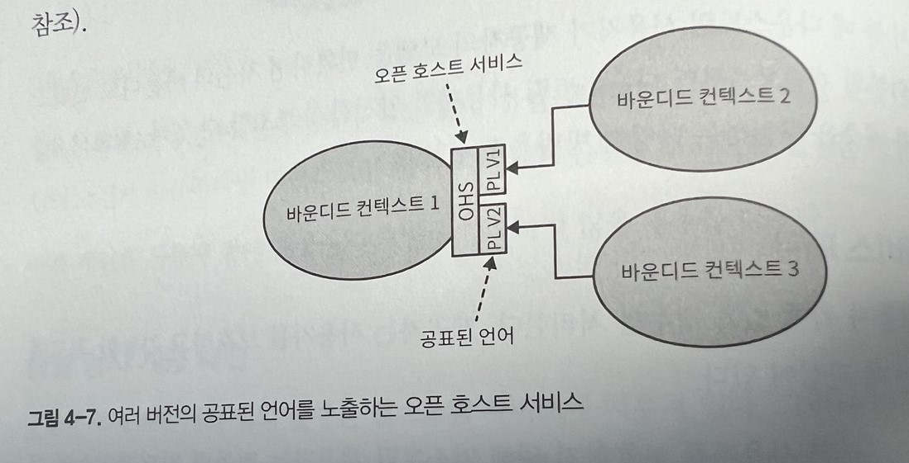
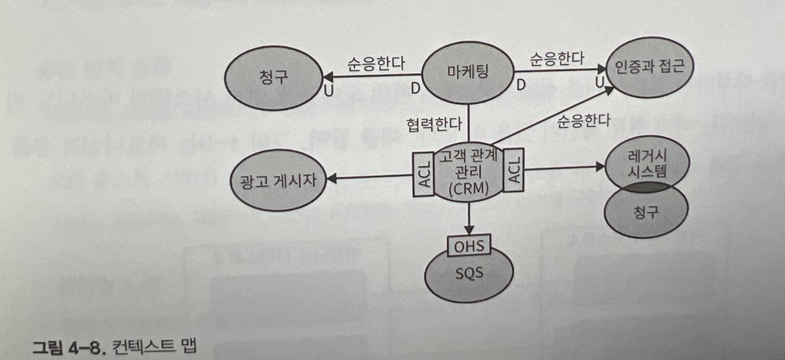

# 바운디드 컨텍스트 연동

바운디드 컨텍스트 패턴은 유비쿼터스 언어의 일관성을 유지할 뿐만 아니라 모델링도 가능하게 한다. 모델의 목적, 즉 경계를 명시하지 않고는 모델을 구축할 수 없다. 경계가 언어의 책임을 구분 짓는다.

하나의 바운디드 컨텍스트 내의 언어는 특정 문제를 해결하는 비즈니스 도메인을 모델링한다.

각각의 바운디드 컨텍스트의 모델은 서로 독립적으로 발전하고 구현될 수 있다. 그러나 바운디드 컨텍스트 자체는 독립적이지 않다. 서로 독립적으로 발전할 수 있지만, 상호작용해야 한다. 결국 바운디드 컨텍스트 사이에는 항상 접점이 있는데 이것을 컨트랙트 라고 부른다.

## 협력형 패턴 그룹

협력형 그룹의 패턴은 소통이 잘 되는 팀에서 구현된 바운디드 컨텍스트와 관련이 있다.

간단한 예는 단일 팀에 의해 구현된 바운디드 컨텍스트나 한팀의 성공이 다른 팀의 성공에 달려있고 반대도 마찬가지인 의존적 목표가 있는 팀에 해당된다.

이 패턴이 적합한 요건은 팀의 커뮤니케이션과 협업의 수준에 있다.

### 파트너쉽 패턴

파트너쉽 모델에서 바운디드 컨텍스트 간의 연동은 애드혹(ad-hoc)방식으로 조정한다.
한 팀은 다른 팀에게 API의 변경을 알리고 다른 팀은 충돌 없이 이를 받아들인다.

여기서 연동의 조정은 양방향에서 한다. 어떤 팀도 컨트랙트를 정의하는 데 쓰는 언어를 강요하지 않는다. 양 팀은 차이점을 함께 해결하고 가장 적절한 솔루션을 선정한다. 또한 발생할 수 있는 연동의 문제를 해결하는 데 양 팀 모두 협력한다.

성공적인 연동을 위해서는 잘 구축된 협업 실무, 높은 수준의 헌신, 그리고 팀 간의 잦은 동기화가 필수다.

이런 패턴은 커뮤니케이션이 중요하기 때문에 지리적으로 떨어져 있는 팀에게는 적합하지 않다.

### 공유 커널 패턴

바운디드 컨텍스트가 모델의 경계임에도 불구하고, 여전히 하위 도메인의 동일 모델 혹은 그 일부가 여러 다른 바운디드 컨텍스트에서 구현되는 경우가 있다.

공유 커널과 같은 공유 모델은 모든 바운디드 컨텍스트의 필요에 따라 설계된다. 공유 모델은 이를 사용하는 모든 바운디드 컨텍스트에 걸쳐서 일관성을 유지해야 한다.

사용자의 권한을 관리하는 모델을 내부에서 개발해 사용하는 기업 시스템을 예로 각각의 사용자는 권한을 직접 부여받거나 소속된 단위 조직에서 상속받는다. 각 바운디드 컨텍스트는 권한 모델을 수정할 수 있고 이 변경을 이 모델을 사용하는 모든 바운디드 컨텍스트에 영향을 준다.

### 공유 범위

겹치는 형태의 모델은 해당되는 바운디드 컨텍스트의 수명주기도 서로 엮이게 한다. 공유 모델의 변경은 다른 모든 바운디드 컨텍스트에 즉시 영향을 준다. 변경의 영향을 최소화 하려면 겹치는 모델을 제한해서 컨텍스트에서 공통으로 구현돼야 하는 모델의 일부분만 노출하도록 해야 한다.

공유 커널은 바운디드 컨텍스트 간에 제공될 의도가 있는 연동 관련 컨트랙트와 자료구조만으로 구성하는 것이 이상적이다.

### 구현

공유 커널은 소스코드의 모든 변경이 이를 사용하는 모든 바운디드 컨텍스트에 즉시 반영되도록 구현된다.

만약 단일 저장소를 사용한다면, 여러 바운디드 컨텍스트는 동일한 소스 파일을 참조 할 수 있다. 이것이 불가능하다면 공유 커널을 각 바운디드 컨텍스트의 전용 프로젝트로 떼어내면 연결 라이브러리처럼 바운디드 컨텍스트에서 참조할 수 있다.

어떤 방식이든 공유 커널에 대한 변경이 생길 때마다 영향을 받는 모든 바운디드 컨텍스트와 연동 테스트를 수행해야 한다.

### 공유 커널을 사용해야 하는 경우

공유 커널 패턴의 적용 여부를 결정하는 가장 중요한 기준은 중복 비용과 조율 비용의 비율이다.

이패턴을 적용할 경우 컨텍스트간의 강한 의존관계를 만들기 때문에 중복 비용이 죠율 비용보다 클 경우에만 적용해야 한다.

통합 비용과 중복 비용의 차이는 모델의 변동성에 달렸다. 변경이 잦을수록 통합 비용은 높아진다. 그러므로 자연스럽게 공유 커널은 핵심 하위 도메인처럼 많이 변하는 하위 도메인에 적용된다.

고유 커널 패턴은 단일팀원칙(바운디드 컨텍스트 소유자는 하나의팀)을 위배된다. 이러한 이유로 공유 커널을 사용하는 데는 명분이 필요하다.

일반적으로 공유 커널을 구현하는 적용 사레는 지리적인 제약이나 조직의 정치적 문제로 커뮤니케이션 또는 협업이 어려워서 파트너십 패턴을 구현하기 어려울 때다. 적절한 조율 없이 밀접하게 연결된 기능을 구현하면 통합문제, 모델의 동기화 문제, 설계 의사결정에 대한 논쟁 등의 문제를 발생시킨다.

통합의 문제를 일찍 발견하는 방법은 공유 커널의 범위를 최소화해 연쇄적인 변경의 범위를 줄이고 매번 변경할 때마다 통합 테스트를 돌리는 것이다.

공유 커널 패턴을 적용하는 또 다른 일반적인 사례는 일시적이지만 레거시 시스템을 점진적으로 현대화할 경우다.

공유 커널은 팀에서 소유하고 구현한 바운디드 컨텍스트를 연동하는 경우에 잘 맞는다. 이경우 파트너십 패턴처럼 즉흥적으로 바운디드 컨텍스트를 연동하면 시간이 흐르면서 컨텍스트의 경계가 희미해질 수 있다. 이경우 바운디드 컨텍스트의 연동 컨트랙트를 명시적으로 정의하는 데 공유 커널을 사용할 수 있다.

## 사용자-제공자 패턴 그룹

제공자는 사용자에게 서비스를 제공한다. 서비스 제공자는 업스트림이고 고객 또는 사용자는 다운스트림이다.

협력 그룹의 경우와는 다르게 양 팀은 서로 독립적으로 성공할 수 있다. 그러나 대부분의 경우 업스트림 또는 다운스트림의 팀이 연동 컨트랙트를 주도하는 권력의 불균형이 존재한다.

### 순응주의자 패턴

힘의 균형이 업스트림 팀에 있는 경우 제공자의 모델에 따라 정의된 연동 컨트랙트를 제공할 뿐이므로 사용자의 선택지는 이를 받아들이거나 떠나거나 둘 중 하나다.

업스트림 팀이 노출한 컨트랙트가 산업 표준이거나 잘 구축된 모델 또는 다운스트림팀의 요건에 충분하다면 다운 스트림 팀이 자율성의 일부를 포기하는 결정은 정당화 될 수 있다.

### 충돌 방지 계층 패턴

순응 주의자 패턴에서 다운스트림 바운디드 컨텍스트가 이에 순응하지 않는 경우 충돌 방지 계층을 통해 업스트림의 모델을 스스로 필요에 맞게 가공할 수 있다.

-   다운 스트림 바운디드 컨텍스트가 핵심 하위 도메인을 포함할 경우

    -   핵심 하위 도메인은 각별한 주의가 필요하다. 제공자의 모델이 자칫 문제 도메인에 대한 모델링을 방해할 수 있다.

-   업스트림 모델이 사용자의 요건에 비효율적이거나 불편한 경우

    -   바운디드 컨텍스트가 혼란에 순응하면 그 자체로 위험에 빠진다. 이런 경우는 레거시 시스템과 연동할 때 종종 발생한다.

-   제공자가 컨트랙트를 자주 변경하는 경우
    -   사용자는 잦은 변경으로부터 모델을 보호하기를 원한다. 충돌 방지 게층이 있으면 제공 모델의 변경은 변환 장치에만 영향을 미친다.

### 오픈 호스트 서비스 패턴

이 패턴은 힘이 사용자 다운 스트림에 있을 경우 제공자는 사용자를 보호하고 가능한 최고의 서비스를 제공하는데 관심이 있다.

구현 모델의 변경으로부터 사용자를 보호하기 위해 업스트림 제공자는 퍼블릭 인터페이스와 구현 모델을 분리한다.

위 그림에서 제공자의 퍼블릭 인터페이스는 자신의 유비쿼터스 언어를 따르는 대신, 연동 지향 언어를 통해 사용자에게 더 편리한 프로토콜을 노출하려한다. 이를 공표된 언어라고 한다.

오픈 호스트 서비스 패턴은 충돌 방지 계층 패턴의 반대다. 사용자 대신 제공자가 내부 모델 번역을 구현한다.

바운디드 컨텍스트의 구현모델과 연동모델을 분리하면 업스트림 바운디드 컨텍스트는 다운스트림 컨텍스트에 영향을 주지 않으면서 자신의 구현을 자유롭게 발전시킬 수 있다.( 수정된 구현 모델을 사용자가 이미 사용하는 공표된 언어로 번역할 수 있을때)

또한 연동 모델을 분리하면 업스트림 바운디드 컨텍스트는 이미 공표된 언어의 여러 버전을 동시에 노출할 수 있어서 사용자가 점진적으로 새로운 버전으로 이관할 수 있게 한다.

## 분리형 노선

분리형 노선 패턴에는 팀에 협업의지가 없거나 협업할 수 없는 경우와 같이 다양한 이유가 있다.

### 커뮤니케이션 이슈

팀이 협업과 합의에 어려움을 겪고 있다면 여러 바운디드 컨텍스트 내에서 기능을 중복해서 가져가고 각자의 길을 가는 것이 더 비용 효과적이다.

### 일반 하위 도메인

중복된 하위 도메인의 특성도 협업 없이 분리된 길을 가야 하는 이유가 될 수 있다. 일반 하위 도메인이 일반 솔루션과 연동하는 것이 쉽다면 각자 연동하는 것이 비용 효과적일 수 있다. 예로 로깅 프레임워크가있다.

### 모델의 차이

바운디드 컨텍스트의 모델간의 차이도 협업 없이 분리된 길을 가야하는 이유가 될 수 있다. 모델이 너무 달라서 순응주의자 관계도 불가능하고 충돌 방지 계층을 구현하는 것도 기능 중복보다 비용이 더 클 수 있다.

## 컨텍스트 맵

시스템의 바운디드 컨텍스트 간의 연동 패턴을 분석하면 컨텍스트 맵으로 그릴 수 있다.

컨텍스트 맵은 시스템의 바운디드 컨텍스트와의 연동을 시각적으로 표현한다. 시각적 표기법은 다양한 수준에서 중요한 전략적 통찰력을 제공한다.

-   거시적 설계 관점
    -   컨텍스트 맵은 시스템의 구성요소와 구현하는 모델의 개요를 제공한다.
-   커뮤니케이션 패턴
-   컨텍스트 맵은 시스템의 구성요소 간의 커뮤니케이션 패턴을 묘사한다. 예를 들어 어떤 팀이 협력하고, 충동 방지 계층과 분리형 노선 패턴과 같이 덜 친밀한 연동 패턴을 선호하는지 보여준다.
-   조직적 문제
    -   컨텍스트 맵은 조직적 문제에 대한 통찰력을 제공한다. 가령 특정 업스트림 팀의 다운스트림 사용자가 모두 충돌 방지 게층을 구현하는 데 의존하거나 분리형 노선 패턴의 모든 구현이 한 팀에 집중된다면 이는 무엇을 의미할까?

### 유지보수

컨텍스트 맵은 프로젝트 초기부터 도입해서 새로운 바운디드 컨텍스트와 기존 요소에 대한 수정을 반영하는 것이 이상적이다. 각 팀은 자신이 담당하는 외부 바운디드 컨텍스트 연동에 대해 갱싱한다. 컨텍스트 매퍼같은 도구를 사용해서 코드를 관리할 수 있다.

### 한계

컨텍스트 맵을 작성하는 것은 어려운 작업이다.

## 결론

바운디드 컨텍스트는 서로 독립적이지 않다. 서로 상호작용해야 한다.

-   파트너십
    -   바운디드 컨텍스트는 애드혹 방식으로 연동된다.
-   공유 커널
    -   두 개 이상의 바운디드 컨텍스트가 참여하는 모든 바운디드 컨텍스트가 공유하는 제한적으로 겹치는 모델을 공유해서 연동한다.
-   순응 주의자
    -   사용자는 서비스 제공자의 모델에 순응한다.
-   충돌 방지 계층
    -   사용자는 서비스 제공자의 모델을 사용자의 요건에 맞게 번역한다.
-   오픈 호스트 서비스
    -   서비스 제공자는 사용자의 요건에 최적화된 모델의 공표된 언어를 구현한다.
-   분리형 노선
    -   협력과 연동보다 특정 기능을 중복으로 두는 것이 더 저렴한 경우

바운디드 컨텍스트간의 연동은 컨텍스트 맵으로 표현된다. 이를 통해 거시적 설계관점, 커뮤니케이터 패턴, 조직 문제에 대한 통찰력을 얻을 수 있다.
