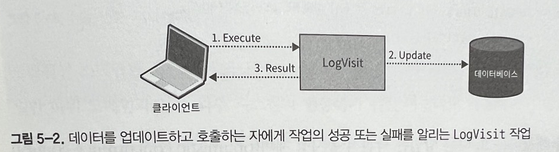
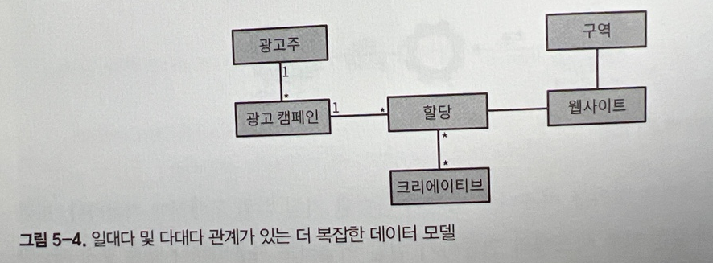

# 간단한 비즈니스 로직 구현

비즈니스 로직은 소프트웨어에서 가장 중요한 부분이며 애초에 소프트웨어를 구현하는 이유이기도 하다.

## 트랜잭션 스크립트 (인프런 강의 에서 봤던 거임)

트랜잭션 스크립트 패턴은 프로시저를 기반으로 시스템의 비즈니스 로직을 구성하며, 각 프로시저는 퍼블릭 인터페이스를 통해 시스템 사용자가 실행하는 작업을 구현한다. 실제로 시스템의 퍼블릭 오퍼레이션은 캡슐화의 경계로 사용된다.

### 구현

각 프로시저는 간단하고 쉬운 절차지향 스크립트로 구현된다. 저장 장치와 연동하기 위해 얇은 추상화 계층을 사용할 수 있지만 데이터베이스에 직접 접근도 가능하다.

이 프로시저가 구현해야 하는 유일한 요구사항은 트랜잭션 동작이다. 각 작업은 성공하거나 실패할 수 있지만, 유효하지 않은 상태를 만들면 안 된다.

가장 곤란한 순간에 트랙잭션 스크립트 실행이 실패하더라도 시스템은 오류가 발생할 때까지 변경사항을 롤백하거나 보상 조치를 실행하여 일관성을 유지해야 한다.

패턴의 이름처럼 트랜잭션 스크립트에 트랜잭션 동작이 반영된다.

```
//Json  파일들을 xml 파일로 변환하는 트랜잭션 스크립의 예
DB.startTransaction();

var jab = DB.LoadNextJob();
var json = LoadFile(job.Source);
var xml = ConvertJsonToXml(json);

WriteFile(job.Destination, xml.ToString());
DB.MarkJobAsCompleted(job);

DB.Commit();
```

### 그렇게 쉽진 않다.

트랜잭션 스크립트 패턴이 뒤에서 배우는 고급 비즈니스 로직 구현 패턴의 기반이다. 겉보기에는 단순하지만 가장 틀리기 쉬운 패턴이기도 하다.

트랜잭션 스크립트를 올바르게 구현하지 못해 발생하는 데이터 손상의 실-제 사례 세가지

#### 트랜잭션 동작 구현 실패

Users테이블의 레코드를 업데이트하고 VisitsLog 테이블에 레코드를 삽입하는 다음 메서드를 보자

```
public class LogVisit{
...
  public void Execute(Guid userId, DataTime visitedOn){
    _db.Execute("update users set last_visit=@p1 where user_id=@p2",
        visitedOn, userId);

    _db.Execute(@"insert into visitsLog(user_id, visit_date)
        values(@p1, @p2)", userId, visitedOn);
  }
}
```

만약 Users테이블에 레코드가 업데이트되고 나서 로그 레코드를 추가하기 전에 문제가 발생한다면 시스템이 일관되지 않을 상태가 된다.

Users 테이블은 업데이트 되지만 VisitsLog테이블에는 해당 레코드가 기록되지 않는다.

이 문제는 두 데이터 변경을 하나의 트랜잭션에서 사용해서 해결할 수 있다.

#### 분산 트랜잭션

최신 분산 시스템에서는 데이터베이스의 데이터를 변경한 다음 메시지 버스에 메시지를 발행해여 시스템의 다른 컴포넌트에 변경사항을 알리는 것이 일반적이다.

이번에는 테이블에 방문 로그를 기록하는 대신 메시지 버스에 메시지를 발행해야 한다고 해보자.

```
public class LogVisit
{
  ...

  public void Execute(Guid userId, DataTime visitedOn){
    _db.Execute("update users set last_visit=@p1 where user_id=@p2", visitedOn, userId);

    _messageBus.Publish("visits_topic", new {UserId = userId, VisitDate = visitedOn});
  }
}
```

앞에서와 같이 users테이블의 갱신 성공후 바로 에러가 터진다면 메시지 버스에 메시지를 실패했다는 알림을 받지 못한다.

이문제는 직전 문제처럼 해결하기 쉽지 않다. 8장에서 CQRS 아키텍처 패턴을 사용하여 여러 저장장치를 다루고 9장에서 다른 데이터베이스에 변경사항을 커밋한 후 안정적인 메시지 발행을 가능하게 아는 아웃박스 패턴을 소개한다.

#### 암시적 분산 트랜잭션

```
public class LogVisit{
  ...
  public void Execute(Guid userId){
    _db.Execute("update users set visits = visits + 1 where user_id = @p1", userId);
  }
}
```

이전 예제 처럼 방문 날짜를 추적하는 대신 카운터를 유지한다. 그러나 이것은 여전히 잠재적으로 일관성 없는 상태로 이어질 수 있는 분산 트랜잭션이다.


execute 메서드가 void 타입이라서 데이터를 반환하지 않지만 작업이 성공 또는 실패했는지 여부는 여전히 호출자에게 전달한다. 실패한 경우 호출자는 예외를 전달 받는다.

메서드가 성공했지만 호출자에게 결과를 전달하는 데 실패하면 어떻게 될까?

-   LogVisit이 Rest 서비스의 일부이고 네트워크 중단이 될 경우
-   LogVisit이 호출자가 동일한 프로세스에서 실행되고 있지만 호출자가 LogVisit 작업의 성공적인 실행을 추적하기 전에ㅐ 프로세스가 실패하는 경우

두 경우 모두 사용자는 실패를 가정하고 LogVisit호출을 다시 시도한다. 그러면 카운트 값이 잘못 증가한다.

이 문제를 간단하게 수정하는 방법은 없다. 비즈니스 도메인과 해당 요구사항에 따라 달라진다. 이 예제에서 트랜잭션 동작을 보장하는 한 가지 방법은 작업을 멱등성으로 만드는 것이다. 즉 같은 요청을 여러반 반복하더라도 그 결과는 매번 동일하게 만드는 것이다.

사용자에게 카운터 값을 전달하도록 요청할 수 있다. 카운터 값을 제공하기 위해 호출자는 먼저 현재 값을 읽고 로컬에서 증가시킨 다음 업데이트된 값을 매개변수로 제공해야 한다. 작업을 여러번 실행하더라도 최종 결과는 번경되지 않는다.

```
public class LogVisit{
  ...
  public void Execute(Guid userId, long visits){
    _db.Execute("update users set visits = @p1 where user_id = @p2",
      visits, userId);
  }
}
```

이러한 문제를 해결하는 또 다른 방법은 낙관적 동시성 제어를 사용하는 것이다.
(버전을 사용한다던지 뭐 이런거) LogVisit은 호출자가 처음 읽은 값과 동일한 경우에만 카운터 값을 업데이트 한다.

```
public class LogVisits{
  ...
  public void Execute(Guid userId, Long expectedVisits){
    db_Execute(@"update users set visits = visits + 1 where user_id = @p1 and visits = @p2",userId, visits);
  }
}
```

### 트랜잭션 스크립트를 사용하는 경우

트랜잭션 스크립트 패턴은 비즈니스 로직이 단순한 절차적 작업처럼 매우 간단한 문제 도메인에 효과적이다.

ETL(추출 변환 적재)작업에서 각 작업은 원천 시스템에서 데이터를 추출하고 변환 로직을 적용하여 데이터를 다른 형식으로 변환하고 결과를 목적 시스템에 저잭한다.

트랜잭션 스크립트 패턴은 정의상 비즈니스 로직이 단순한 지원 하위 도메인에 적합하다. 또한 일반 하위 도메인과 같은 외부시스템과 연동하기 위한 어댑터로 사용하거나 충돌 방지 계층의 일부로 사용할 수 있다.

트랜잭션 스크립트 패턴의 주요 장점은 단순함이다. 최소한의 추상화를 도입하여 런타임 성능을 최적화 하고, 비즈니스 로직을 이해하기 위한 시간을 최소화 한다.

비즈니스 로직이 복잡할수록 트랜잭션 간에 비즈니스 로직이 중복되기 쉽고 결과적으로 중복된 코드가 동기화 되지 않을 때 일관성 없는 동작이 발생한다. 결과적으로 핵심 하위 도메인에는 트랜잭션 스크립트를 사용하면 안 된다.

트랜잭션 스크립트로 복잡한 비즈니스 로직을 구현하면 머지 않아 유지보수가 불가능한 커다란 진흙덩어리가 될 것이다.

## 엑티브 레코드

트랜잭션 스크립트 패턴과 마찬가지로 엑티브 레코드는 비즈니스 로직이 단순한 경우 사용한다. 그러나 액티브 레코드는 좀 저 복잡한 자료구조에서도 비즈니스 로직이 작동할 수 있다.

간단한 트랜잭션 스크립트를 통해 이러한 자료구조를 조작하면 중복 코드가 많이 생성된다. 메모리 표현 방식으로 매핑하면 데이터가 사방에 중복되어 나타날 것이다.

### 구현

결과적으로 이 패턴은 액티브 레코드라고 하는 전용 객체를 사용하여 복잡한 자료구조를 표현한다. 자료구조 외에도 이러한 객체는 CURD도 구현한다. 그 결과 액티브 레코드 객체는 ORM 또는 다른 데이터 접근 프레임워크와도 관련이 있다.

각 자료구조가 액티브 하다는 점에어 패턴의 이름이 만들어 졌고 액티브 레코드는 데이터 적근 로직을 구현한다.

트랜잭션 스크립트와의 차이점은 액티브 레코드의 경우 db에 직접 접근하는 대신 트랜잭션 스크립트가 액티브 레도크 객체를 조작한다는 것이다.

```
public class CreateUser{
  ...
  public void Execute(userDetails){
    try{
      _db.StartTransaction();

      var user = new User();
      user.Name = userDetails.Name;
      user.Email = userDetails.Email;
      user.Save();
      _db.Commit();
    }catch{
      _db.Rollback();
      throw ;
    }
  }
}
```

이 패턴의 목적은 메모리 상의 객체를 데이터베이스 스키마에 매핑하는 복잡성을 숨기는 것이다. 영속성을 담당하는 것 외에도 액티브 레코드 객체에는 비즈니스 로직이 포함될 수 있다.

필드에 할당된 새 값의 유효성을 검사하거나 객체의 데이터를 조작하는 비즈니스 관련 절차를 구현할 수 있다. 즉, 액티브 레코드 객체의 고유한 기능은 자료구조와 동작(비즈니스 로직)의 분리다.

### 액티브 레코드를 사용하는 경우

액티브 레코드는 본질적으로 데이터베이스에 대한 접근을 최적화 하는 트랜잭션 스크립트이기 때문에 이 패턴은 간단한 입력의 유효성을 검증하는 CRUD 작업과 같은 비즈니스 로직만 지원할 수 있다.

따라서 트랜잭션 스크립트 패턴과 마찬가지로 액티브 레코드 패턴은 지원 하위 도메인, 일반 하위 도메인과 외부 솔루션의 연동, 모델 변환 작업에 적합하다.

두 패턴의 차이점은 액티브 레코드의 경우 복잡한 자료구조를 db 스키마에 매핑하는 복잡성을 해소한다는 것이다.

액티브 레코드 패턴은 빈약한 도메인 모델 안티패턴(anemic domain model anti pattern)이라고도 하며, 다시 말하면 부 적절하게 설계된 도메인 모델이다.

비즈니스 로직이 단순할 때 액티브 레코드를 사용하는 데는 아무런 문제가 없다. 또한 단순한 비즈니스 로직을 구현할 때보다 정교한 패턴을 사용하는 것도 우발적인 복잡성을 일으켜 해를 끼칠 수 있다.

## 실용적인 접근 방식

항상 그렇듯이 보편적 법칙은 없다. 그것은 작업 중인 비즈니스 도메인에 달려 있다. 앞의 에처럼 매일 수십억 개의 이벤트를 수집하는 시스템에서 이벤트의 0.001%가 중복되거나 손실되는 일은 가능하면 '무시' 해도 좋다. 다만 위험과 비즈니스 영향을 평가했는지 확인하라.

## 결론

-   트랜잭션 스크립트

    -   시스템 작업을 간단하고 쉬운 절차지향 스크립트로 구성한다. 이 절차는 작업에 트랜잭션을 적용해서 작업이 성공하거나 실패하도록 보장한다. 트랜잭션 스크립트 패턴은 ETL처럼 단순한 비즈니스 로직을 가진 지원 하위 도메인에 적합하다.

-   액티브 레코드
    -   비즈니스 로직이 단순하지만 복잡한 자료구조에서 작동하는 경우 해당 자료구조를 액티브 레코드로 구현할 수 있다. 액티브 레코드 객체의 간단한 CRUD 데이터 접근 방법을 제공하는 자료구조다.

이번 장에서는 단순한 비즈니스 로직의 경우이다.
