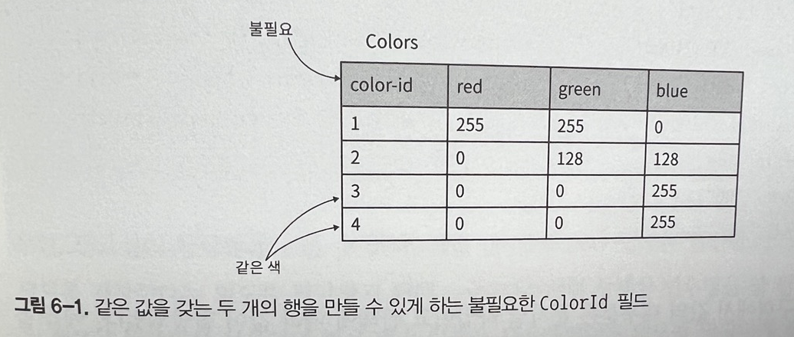
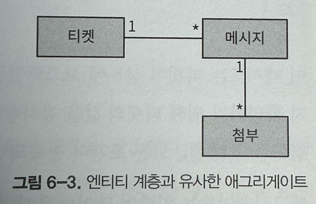
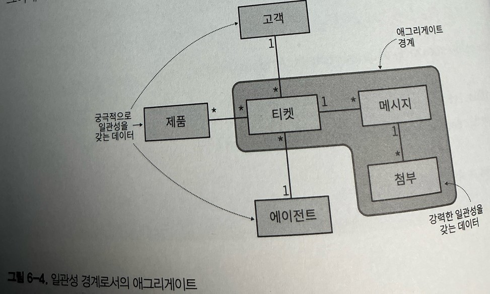
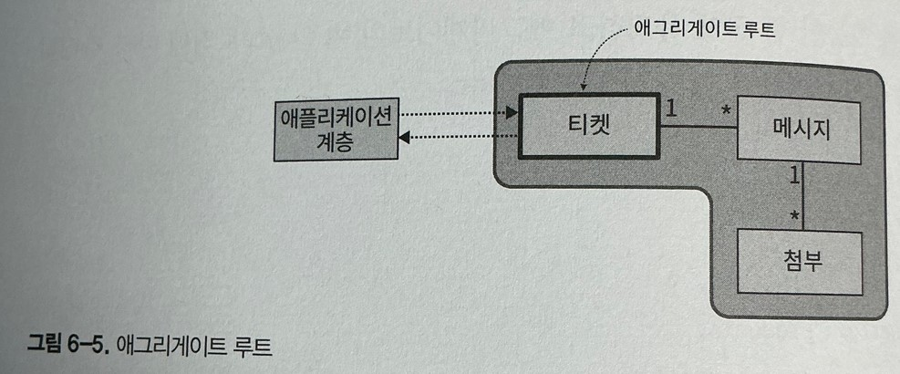
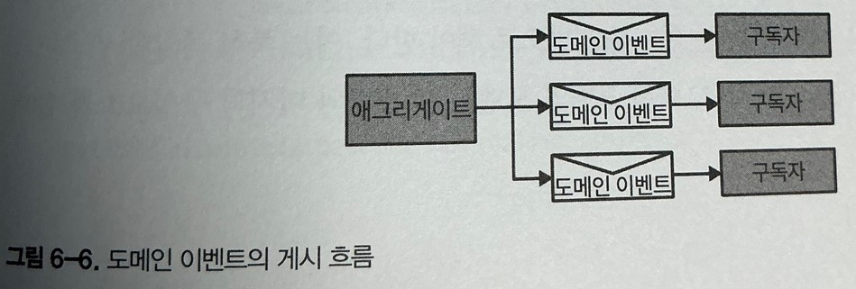

# 복잡한 비즈니스 로직 다루기

## 배경

에반스는 자신의 책에서 비즈니스 도메인의 하위 모델과 코드를 긴밀하게 연결 짓는 데 쓰이는 에그리케이트, 밸류 오프젝트, 레포지토리등과 같은 패턴을 제시했다.

에반스가 소개한 패턴은 종종 전술적 도메인 주도 설계로 불린다. 도메인 주도 설계를 구현할 때 반드시 비즈니스 로직을 구현하는 데 쓰이는 이런 패턴을 필수로 사용해야 한다는 혼란스러운 생각이 들지 않도록 이 책에서는 파울러의 원래 용어를 사용한다.

이 패턴이 도메인 모델이고 애그리게이트와 VO는 그 구성요소다.

## 도메인 모델

도메인 모델 패턴은 복잡한 비즈니스 로직을 다루기 위한 것이다. CRUD 인터페이스 대신 복잡한 상태 전환, 항상 보호해야 하는 규칙인 비즈니스 규칙과 불변성을 다룬다.

헬프데스크 시스템을 구현한다고 가정할때 다음 지원 티켓의 수명주기를 다루는 로직을 설명한 요구사항에 발췌한 내용이다.

-   고객은 직면한 문제를 설명하는 지원 티켓을 연다.
-   고객과 지원 할당된 에이전트 모두 메시지를 추가하고 모든 내용은 지원 티켓에서 관리된다.
-   각 티켓은 낮음, 중간, 높음, 긴급의 우선순위를 갖는다.
-   에이전트는 티켓의 우선순위 따른 SLA(응답제한시간) 내에 해법을 제시해야 한다.
-   할당된 에이전트가 응답 제한 시간 내에 응답하지 못하면 고객은 티켓을 상위 관리자에게 보고 되게 할 수 있다.
-   티켓이 상위 관리자에게 보고되면 에이전트의 응답제한시간이 33%줄어든다.
-   에이전트가 상부 보고된 티켓의 응답 제한 시간의 절반이 지나기 전에 티켓을 열람하지 않으면 자동으로 다른 에이전트가 할당된다.
-   할당된 에이전트의 질문에 고객이 7일 이내에 응답하지 않으면 티켓은 자동으로 닫힌다.
-   상부 보고된 티켓은 자동으로 또는 할당된 에이전트에 의해 닫힐 수 없고 고객 또는 에이전트의 매니저만 닫을 수 있다.
-   고객은 티켓이 닫힌 지 7일 이내에 닫힌 티켓을 다시 열 수 있다.

이 같은 요구사항은 다양한 규칙 간에 그물 같은 의존성을 형성하고 모든 규칙은 지원 티켓의 수명주기 관리 로직에 영향을 준다.

이 예제는 앞장에서 논의한 CRUD데이터 입력 화면 같이 간단하지 않다 만약 액티브 레코드 객체를 사용하여 로직을 구현하면 로직이 중복되거나 일부 비즈니스 규칙이 잘못 구현되어 시스템의 상태를 손상시키기 쉽다.

### 구현

도메인 모델은 행동과 데이터 모두를 포함하는 도메인의 객체 모델이다. DDD의 전술 패턴인 애그리게이트, 밸류 오브젝트, 도메인 이벤트, 도메인 서비스는 모두 객체 모델의 구성요소이다.

이 같은 모든 패턴은 비즈니스 로직을 최우선으로 둔다는 공통 관심사가 있다.

### 복잡성

도메인 비즈니스 로직은 이미 본질적으로 복잡하므로 모델링에 사용되는 객체가 모델에 조금이라도 우발적 복잡성을 추가하면 안된다.

모델에는 데이터베이스 또는 외부 시스템 구성요소의 호출 구현 같은 인프라 또는 기술적인 관심사를 피해야 한다.

이같은 제약을 따르면 모델의 객체는 plain old object가 된다. POJO는 인프라 구성요소 또는 프레임워크에 의지하지 않고 직접 협엽하지 않으면서 비즈니스 로직을 구현하는 객체다

### 유비쿼터스 언어

도메인 모델의 객체가 기술적 관심사가 아닌 비즈니스 로직에 집중하게 하면 바운디드 컨텍스트에서 사용하는 유비쿼터스 언어의 용어를 따르기 쉬워진다. 다시 말해, 이 패턴은 코드에서 유비쿼터스 언어를 사용하게 하고 도메인 전문가의 멘탈 모델을 따르게 한다.

### 구성요소

#### 밸류 오브젝트

복합적인값에 의해 식별되는 객체다.

```
class Color{
  int _red;
  int _green;
  int _blue;
}
```

3색의 값이 복합적으로 색을 정의한다. 필드 중 하나의 값이 바뀌면 새로운 색이 탄생한다.
같은 값을 갖는 두 개 이상의 색은 존재하지 않는다. 또한 같은 색의 두 인스턴스는 반드시 같은 값을 갖는다. 그러므로 **명시적인 식별 필드가 필요 없다.**


#### 유비쿼터스 언어

언어의 표준 라이브러리에 포함된 문자열, 정수, 딕셔너리 같은 원시데이터 타임에 전적으로 의존해서 비즈니스 도메인 개념을 표현하는것은 원시 집착 코드 징후로 알려져 있다.

```
Class Person{
  private int _id;
  private string _firstName;
  private string _lastName;
  private string _landlinePhone;
  private string _mobilePhone;
  private string _email;
  private int _heightMetric;
  private string _countryCode;

  public Person(...){...}
}

static void Main(String[] args){
  var dave = new Person(
    id : 30217,
    firstName : "Dave",
    ...
  )
}
```

Person 클래스 구현에서 값 대부분은 문자열이고 관례에 따라 값이 할당되었다. 예를 들어 LandlinePhone 필드의 값은 유효한 유선 전화번호여야 하고, countryCode필드는 두 자리의 대문자로 된 국가 코드여야 한다. 물론 사용자가 항상 올바른 값을 입력하리라 기대할 수 없기 때문에 결국에는 클래스가 모든 입력 필드를 검사해야 한다.

이 같은 방식은 몇가지 설계 위험이 있다

-   유효성 검사 로직이 중복되기 쉽다
-   값이 사용되지 전에 유효성 검사 로직을 호출하게 하기 어렵다.
-   엔지니어가 코드베이스를 개선하는 것과 같은 미래를 대비한 유지보수가 더 어렵다.

```
class Person{
  private PersonId _id;
  private Name _name;
  private PhoneNumber _landLine;
  private PhoneNumber _mobile;
  private EmailAddress _email;
  private Height _height;
  private CountryCode _country;

  public Person(...) {...}
}

static void main(string[] args){
  var dave = new Person(
    id : new PersonId(30217),
    name : new Name("Dave", "Ancelovici")
    ...
  )
}
```

VO를 사용하면 명료성을 향상됐음을 볼 수 있다. 짧은 변수 이름을 사용하더라도 의도를 명확하게 전달한다.

유효성 검사 로직이 VO자체에 들어 있기 때문에 값을 할당하기 전에 유효성 검사를 할 필요가 없다.

VO의 장점은 유효성 검사에서 끝나는게 아니라. VO값을 조작하는 비즈니스 로직을 한곳에 모을 때 더욱 진가를 발휘한다. 이렇게 응집된 로직은 한곳에서 구현되고 쉽게 테스트할 수 있다.

이렇게 응집된 로직은 한곳에서 구현되고 쉽게 테스트할 수 있다. 가장 중요한점은 VO를 사용하면 코드에서 유비쿼터스 언어를 사용하게 하므로 코드에서 비즈니스 도메인의 개념을 표현하게 된다.

height 변수를 정수 타입으로 했을 때보다 Height VO로 구현하면 의도가 더 명확해지고 특정 도량형이 종속되지 않는다. 예를 들어 Height VO는 미터법 또는 영국식 단위를 모두 사용하여 초기화 할 수 있다 다른 단위로 변환하거나 문자열로 표현, 다른 단위의 값과 비교하는 것 등이 쉬워진다.

```
var heightMetric = Height.Metric(180);
var heightImperial = Height.Imperial(5, 3);

var string1 = heightMetric.ToString();
var string2 = heightImperial.ToString();
var string3 = heightMetric.ToImperial().ToString();
```

PhoneNumber 밸류 오브젝트는 문자열 값의 파싱, 유효성 검사, 그리고 소속된 국가 또는 유선/무선 전화번호 유형과 같은 다양한 전화번호 속성을 추출하는 로직을 담을 수 있다.

```
var phone = PhoneNumber.Parse("+359877123503");
var country = phone.Country;
var phoneType = phone.PhoneType;
var isValid = PhoneNumber.isValid("+972120266680");
```

다음 코드는 VO의 데이터를 조작하거나 새로운 VO 인스턴스를 생성할 수 있는 모든 비즈니스 로직을 모드는 등 VO의 강력함을 보여준다.

```
var red = Color.FromRGB(255, 0, 0);
var green = Color.Green;
var yellow = red.MixWith(green);
var yellowString = yellow.ToString();
```

#### 구현

VO는 불변 객체로 구현되므로 VO필드가 하나라도 바뀌면 다른 값이 생성된다. 다시 말해, VO필드 중 하나가 바뀌면 개념적으로 VO의 다른 인스턴스가 생성된다.

```
public Color MixWith(Color other){
  return new Color(...)
}
```

VO의 동일성은 ID느 참조 대신 값을 기반으로 하므로 동일성 검사 함수를 오버라이드 해서 적절히 구현하는 것이 중요하다.

#### VO를 사용하는 경우

VO는 가능한 모든 경우에 사용하는 게 좋다. VO는 코드의 표현력을 높여주고 분산되기 쉬운 비즈니스 로직을 한데 묶어줄 뿐만 아니라 코드를 더욱 안전하게 해준다.

VO는 불변이기 때문에 내포된 동작은 부작용과 동시성 문제가 없다.

경험상 비즈니스 도메인 관점에서 유용한 법칙은 다른 객체의 속성을 표현하는 도메인의 요소에 VO를 사용하는 것이다. 이것은 엔티티의 속성에 적용된다. 앞에서는 ID, 이름, 전화번호, 이메일 등을 포함하는 사람을 표현하는데 썻다면 다양한 상태, 비밀번호, 그리고 값 자체로 식별되어 명시적인 시겨별 필드가 필요 없는 다양한 특정 비즈니스 도메인 개념 등이 있다. 뭐 Money?

### 엔티티

엔티티는 VO와 정반대다 식별 필드를 가지고 있음

```
class Person{
  public readonly PersonId Id;
  public Name Name{get; set;}
  public Person(PersonId id,Name name){
    this.id = id
    this.Name = name;
  }
}
```

PersonId는 VO이고 비즈니스 도메인에서 필요한 모든 기본 데이터 타입을 사용할 수 있다. Id필드는 GUID, 숫자, 문자열, 사회보장번호와 같은 특정 도메인의 값일 수 있다.

식별 필드의 핵심 요구사항은 각 엔티티의 인스턴스 마다 고유해야 한다는 것이다.
VO와는 반대로 엔티티는 불변이 아니고 변할 것으로 예상된다. 엔티티와 VO의 또 다른 차이점은 VO는 엔티티의 속성을 설명한다는 것이다. Person엔티티는 두개의VO를 볼 수 있다.

엔티티는 모든 비즈니스 도메인의 필수 구성요소이다. 도메인 모델의 구성요소에서 엔티티가 없는 이유는 엔티티를 단독으로 구현하지 않고 애그리게이트 패턴의 컨텍스트에서만 엔티티를 구현하기 때문이다.

### 애그리게이트

애그리게이트는 엔티티다 즉 명시적인 식별 필드가 필요하고 인스턴스의 생애주기 동안 상태가 변할 것으로 예상된다.

애그리거트는 단순한 엔티티가 아닌 그 이상이다. 이 패턴의 목적은 데이터의 일관성을 보호하는 데 있다.

#### 일관성 강화

데이터의 일관성을 강화하려면 애그리게이트 패턴에서는 애그리게이트 주변에 명확한 경계를 설정해야 한다.

즉 애그리게이트는 일관성을 강화하는 경계다. 애그리게이트의 로직은 모든 글어오는 변경 요청을 검사해서 그 변경이 애그리게이트의 비즈니스 규칙에 위배되지 않게 해야 한다.

구현 관점에서 보면 데이터의 일관성은 애그리게이트의 비즈니스 로직을 통해서만 애그리게이트의 상태를 변경하게 해야 강화된다. 애그리게이트의 외부의 모든 프로세스와 객체는 애그리게이트의 상태를 읽을 수만 있고 상태의 변경은 퍼블릭 인터페이스에 포함된 관련 메서드를 실행해야만 상태를 변형할 수 있다.

애그리게이트의 퍼블릭 인터페이스로 노출된 상태 변경 메서드는 어떤 것을 지시하는 명령을 뜻하는 의미에서 **커맨드**라고 부른다.

커맨드는 두가지 방식으로 구현할 수 있다.

-   애그리게이트 객체에 평범한 퍼블릭 메서드로 구현하는 것

    -   값 변경 메소드를 객체 작성하기

-   커맨드의 실행에 필요한 모든 입력값을 포함하는 파라미터 객체로 표현하는 것
    -   아마 modifyDto객체 넘기는걸 .

애그리게이트의 퍼블릭 인터페이스는 입력값의 유효성을 검사하고 관련된 모든 비즈니스 규칙과 불변성을 강화하는 것을 담당한다. 또한 이와 같은 엄격한 경계는 애그리게이트와 관련된 모든 비즈니스 로직이 한곳, 즉 애그리게이트 자체에 구현되게 한다.

이렇게 하면 애그리게이트에서 어플리케이션 계층의 조율 동작을 좀 더 간단하게 만들 수 있다.

```
public ExecutionResult Escalate(TicketId id, EscalationReason reason)
{
    try
    {
        var ticket = _ticketRepository.load(id);
        var cmd = new Escalate();
        ticket.Execute(cmd);
        _ticketRepository.Save(ticket);
        return ExecutionResult.Success();
    }
    catch (ConcurrencyException ex)
    {
        return ExecutionResult.Error(ex);
    }
}
```

11번째 줄의 동시성 점검 부분에 주목하면 애그리게이트의 상태의 일관성을 유지하는 것이 중요하다.

여러 프로세스가 동시에 동일한 애그리게이트를 갱신하려고 할때, 첫번째 트랜잭션이 커밋한 변경을 나중의 트랜잭션이 은연중에 덮어쓰지 않게 해야한다. 그럴 경우 나중의 프로세스는 의사결정에 사용된 상태가 만료되었다는 것을 통지받고 오퍼레이션을 재시도 해야 한다.

그러므로 애그리게이트를 저장하는 DB에서 동시성 관리를 지원해야 한다. 가장 간단한 방법은 버전 필드를 애그리게이트에서 관리하는 것이다.

```
class Ticket
{
    TicketId _id;
    int      _version;

    // ...
}
UPDATE tickets
SET ticket_status = @new_status,
agg_version = agg_version + 1,
WHERE ticket_id=@id and agg_version=@expected_version;
```

#### 트랜잭션 경계

애그리게이트의 상태는 비즈니스 로직을 통해서만 수정될 수 있기 때문에 애그리게이트가 트랜잭션 경계의 역할을 한다. 상태 변경은 원자적인 단일 오퍼레이션으로 트랜잭션 처리돼야 한다.

또한 다중 애그리게이트 트랜잭션을 지원하는 시스템 오퍼레이션은 없다고 가정한다. 애그리게이트의 상태 변경은 데이터베이스 트랜잭션 하나당 한 개의 애그리게이트로, 개별적으로만 커밋 될 수 있다.

트랜잭션 별로 하나의 애그리게이트 인스턴스만 갖게 제한하면 애그리게이트의 경계가 비즈니스 도메인의 불변성과 규칙을 따르도록 신중히 설계된다.

여러 애그리 게이트에서 변경을 커밋해야 한다면 이는 잘못된 트랜잭션 경계의 신호이고 잘못된 애그리게이트 경계다.

동일한 트랜잭션에서 여러 객체를 수정해야 한다면??

#### 엔티티 계층

엔티티는 독립적 패턴이 아닌 애그리게이트의 일부로서만 사용된다.

여러 객체가 하나의 트랜잭션 경계를 공유하는 비즈니스 시나리오가 있다. 예를 들어, 둘다 동시에 변경되거나 객체ㅐ 하나가 다른 객체의 상태에 의존하는 비즈니스 규칙이 될 수 있다.

DDD에서는 비즈니스 도메인이 시스템의 설계를 주도해야 한다고 규정한다. 애그리게이트도 마찬가지다.



그림 처럼 여러 객체의 변경을 원자적인 단일 트랜잭션으로 지원하기 위해 애그리게이트 패턴은 엔티티 계층 구조와 유사하게 모든 트랜잭션을 공유해서 일관성을 유지한다.

이 계층은 엔티티와 VO를 모두 담고 있다. 이 요소들이 도메인 비즈니스 로직경계 내에 있으면 동일한 애그리게이트에 속한다.

동일한 트랜잭션 경계에 속한 비즈니스 엔티티와 밸류 오브젝트를 한데 묶기 때문에 애그리게이트로 명명되었다.

```
// 애그리게이트 경계에 속한 여러 엔티티에 걸친 비즈니스 규칙의 예제
// 에이전트가 상부 보고된 티켓의 응답 제한시간의 절반이 지나기 전에 티켓을 열ㄹ마하지 않으면 자동으로 다른 에이전트가 할당된다.

public class Ticket
{
  ...
  List<Message> _messages;
  ...

  public void Execute(EvaluateAutomaticActions cmd){
    if(this.IsEscalated &&  this.RemainingTimePercentage < 0.5
              && GetUnreadMessagesCount(for: AssignedAgent) > 0){
                _agent = AssignNewAgent();
              }
  }

  public int GetUnreadMessagesCount(UserId id){
    return _message.Where(x => x.To == id && !x.WasRead).Count();
  }
  ...
}
```

이 메서드는 티켓이 상부에 보고되었는지, 그리고 남은 처리 시간이 정의된 50% 임계치 아래인지 확인하기 위해 티켓의 값을 검사한다, 또한 현재 에이전트가 메시지를 아직 읽기전인지 검사한다. 모든 조건이 충족되면 티켓은 다른 에이전트에게 할당되도록 요청한다.

애그리게이트는 일관된 데이터에 대해 모든 조건을 엄격하게 검사하도록 확인한다. 그리고 애그리게이트 데이터의 모든 변경이 원자적인 단일 트랜잭션으로 수행되도록 보장하여 점검이 완료된 후 수정하지 못하게 한다.

#### 다른 애그리게이트 참조하기

애그리게이트 내에 모든 객체는 같은 트랜잭션 경계를 공유하기 때문에 애그리게이트가 너무 커지면 성능와 확장 문제가 생길 수 있다.

데이터의 일관성은 애그리게이트의 경계를 설계하는 데 편리한 가이드 원칙이다. 애그리게이트의 비즈니스 로직에 따라 강력한 일관성이 필요한 정보만 애그리게이트에 포함돼야 한다. 그 밖에 궁극적으로 일관돼도 좋은 모든 정보는 애그리게이트 경계 밖에 다른 애그리게이트의 일부로 둔다.


애그리게이트를 가능한 작게 유지하고 애그리게이트의 비즈니스 로직에 따라 강력하게 일관적으로 상태를 유지할 필요가 있는 객체만 포함한다.

```
public class Ticket
{
    private UserId          _customer;
    private List<ProductId> _product;
    private UserId          _assignedAgent;
    private List<Message>   _messages;

    // ...
}
```

**티켓 애그리게이트는 경계 내에 속한 메시지의 모음을 참조한다. 반면에 티켓과 관련된 고객과 제품의 모음, 그리고 할당된 에이전트는 애그리게이트에 속하지 않아 ID로 참조된다.**

외부 애그리게이트를 참조할 때 ID를 이용하는 이유는 이 같은 객체가 애그리게이트 경계에 속하지 않음을 명확히 하고 각 애그리게이트가 자신의 트랜잭션 경계를 갖게 보장하기 위함이다.

엔티티가 애그리게이트에 속하는 지 판단하는 방법은 우선 비즈니스 로직 내에 궁극적으로 일관된 데이터를 다루는 상황이 되면 시스템의 상태를 손상시킬 수 있는 지 여부를 판단한 후, 그 비즈니스 로직이 애그리게이트에 있는지 여부를 조사하는 것이다.

앞의 예로 에이전트가 상부 보고된 티켓의 응답 제한시간의 절반이 지나기 전에 티켓을 열람하지 않으면 자동으로 다른 에이전트가 할당된다에서 만약 메시지를 읽었는지 여부에 대한 정보가 궁극적 일관성을 가지면 다시말해 어느정도 지연된 후 읽었다는 알림을 받는다면 상당수의 티켓이 불필요하게 재할당될 거라는 합리적인 예상을 할 수 있다. 이렇게 되면 시스템은 손상되니 메시지의 데이터는 애그리게이트 경계 안에 속해야 한다.

#### 애그리게이트 루트

애그리게이트의 상태는 커맨드 중 하나를 실행해서만 수정할 수 있다.

애그리거트가 엔티티의 계층 구조를 대표하기 때문에 그중 하나만 애그리게이트의 퍼블릭 인터페이스, 즉 애그리게이트 루트로 지정돼야 한다.

```
public class Ticket
{
   // ...
   List<Message> _messages;
   // ...

   public void Execute(AcknowledgeMessage cmd)
   {
      var message = _messages.Where(x => x.Id == cmd.id).First();
      message.WasRead = true;
   }
   // ...
}
```

애그리게이트는 특정 메시지의 읽음 상태를 수정할 수 있는 커맨드는 노출한다. 이 오퍼레이션은 Message 엔티티의 인스턴스를 수정하지만 애그리게이트 루트인 Ticket을 통해서만 접근할 수 있다.

애그리게이트 루트와 퍼블릭 인터페이스 외에도 외부에서 애그리게이트와 커뮤니케이션할 수 있는 다른 메커니즘이 있는데, 바로 도메인 이벤트다.

#### 도메인 이벤트

도메인 이벤트는 비즈니스 도메인에서 일어나는 중요한 이벤트를 설명하는 메시다.

-   티켓이 할당됨
-   티켓이 상부에 보고됨
-   메시지가 수신됨

도메인 이벤튼느 이미 발생된 것이기 때문에 과거형으로 명명한다.

도메인 이벤트의 목적은 비즈니스 도메인에서 일어난 일을 설명하고 이벤트와 관련된 모든 필요한 데이터를 제공하는 것이다.

```
{
    "ticket-id": "c9d286ff-3bca-4f57-94d4-4d4e490867d1",
    "event-id": 146,
    "event-type": "ticket-escalated",
    "escalation-reason": "missed-sla",
    "escalation-time": 1628970815
}
```

도메인 이벤트의 이름이 비즈니스 도메인에서 일어난 일을 간결하고 정확하게 반영하게 해야 한다.

도메인 이벤트는 애그리게이트의 퍼블릭 인터페이스의 일부다. 애그리게이튼느 자신의 도메인 이벤트를 발행한다.


```
public class Ticket
{
    // ...
    private List<DomainEvent> _domainEvents;
    // ...

    public void Execute(RequestEscalation cmd)
    {
        if (!this.IsEscalated && this.RemainingTimePercentage <= 0)
        {
            this.IsEscalated = true;
            var escalatedEvent = new TicketEscalated(_id);
            _domainEvents.Append(escalatedEvent);
        }
    }

    // ...
}
```

#### 유비쿼터스 언어

애그리게이트는 유비쿼터스 언어를 사용해야 한다. 애그리게이트의 이름, 데이터 멤버, 동작 그리고 도메인 이벤트에 사용된 모든 용어는 모두 바운디드 컨텍스트의 유비쿼터스 언어로 명명돼야 한다.

### 도메인 서비스

애그리게이트에도 VO에도 속하지 않거나 복수의 애그리게이트에 관련된 비즈니스 로직을 다루게 될텐데 이경우 DDD에서는 도메인 서비스로 로직을 구현할 것을 제시한다.

도메인 서비스는 비즈니스 로직을 구현한 상태가 없는 객체다. 대부분의 이런 로직은 어떤 계산이나 분석을 수행하기 위한 다양한 시스템 구성요소의 호출을 조율한다.

티켓 애그리게이트 예제로 할당된 엔지니어는 제한된 시간 내에 고객에게 솔루션을 제시해야 한다. 이 시간은 티켓의 데이터(우선순위와 상부 보고 상태)뿐 아니라 에이전트 소속 부서의 우선선위별 SLA 관련 정책, 그리고 에이전트의 스케줄에 종속된다.

응답 시간을 계산하는 로직은 티켓, 할당된 에이전트의 부서, 그리고 업무 스케줄 등의 다양한 출처에서 정보를 필요로 한다. 이런 경우 도메인 서비스로 구현되면 이상적이다.

```
public class ResponseTimeFrameCalculationService
{
    // ...

    public ResponseTimeframe CalculateAgentResponseDeadline(UserId agentId,
        Priority priority, bool escalated, DateTime startTime)
    {
        var policy = _departmentRepository.GetDepartmentPolicy(agentId);
        var maxProcTime = policy.GetMaxResponseTimeFor(priority);

        if (escalated) {
            maxProcTime = maxProcTime * policy.EscalationFactor;
        }

        var shifts = _departmentRepository.GetUpcomingShifts(agentId,
            startTime, startTime.Add(policy.MaxAgentResponseTime));

        return CalculateTargetTime(maxProcTime, shifts);
    }

    // ...
}
```

도메인 서비스는 여러 애그리게이트의 작업을 쉽게 조율할 수 있다. 그러나 한 개의 데이터베이스 트랜잭션에서 한 개의 애그리게이트 인스턴스만 수정할 수 있다고 했던 애그리게이트 패턴 한계를 명심해야 한다. 도메인 서비스가 이런 한계를 극복하게 해주지는 않는다.

대신 도메인 서비스는 여러 애그리게이트의 데이터를 **읽는 것**이 필요한 계산 로직을 구현하는 것을 도와준다.

또한 도메인 서비스는 MSA, 서비스 지향 아키텍처 또는 소프트웨어 엔지니어링에서 시브시 용어를 사용하는 대부분의 것과 아무런 상관이 없다. 단지 비즈니스 로직에서 사용되는 상태가 없는 객체일 뿐이다.

### 복잡성 관리

애그리게이트와 VO패턴은 비즈니스 로직 구현의 복잡성을 다루는 수단으로서 도입됐다.

시스템의 복잡성을 논의할 때 우리는 제어와 동작 예측의 어려움을 평가하는데 관심이 있다. 이 두가지 관점은 시스템의 자유도를 반영한다.

시스템의 자유도는 시스템의 상태를 설명하는 데 필요한 데이터 요소의 개수로 측정된다.

```
public class ClassA
{
    public int A { get; set; }
    public int B { get; set; }
    public int C { get; set; }
    public int D { get; set; }
    public int E { get; set; }
}

public class ClassB
{
    private int _a, _d;

    public int A
    {
        get => _a;
        set
        {
            _a = value;
            B = value / 2;
            C = value / 3;
        }
    }

    public int B { get; private set; }

    public int C { get; private set; }

    public int D
    {
        get => _d;
        set
        {
            _d = value;
            E = value * 2
        }
    }

    public int E { get; private set; }
}
```

얼핏보면 B가 A보다 저 복잡해 보인다. 둘다 동일한 변수가 있지만 B는 추가적인 계산을 한다.

자유도 관점에서 두 클래스를 분석해보면 A의 상태를 설명하는 데 5개의 데이터가 있으니 자유도는 5다

B의 상태를 설명하는데는 속성A와 D의 할당 로직을 살펴보면 B와 C,E의 값이 함수 A,D에서 사용된 것을 알 수 있다. 즉 A와 D가 무엇을 하는지 알고나면 나머지 변수의 값을 추론할 수 있다. 결국 상태를 설명하기 위대 두 개의 변수만 필요하므로 자유도는 2를 갖는다.

제어와 행동 예측의 관점에서 자유도를 더 많이 가진 A가 예측이 어렵다. B에 도입된 불변성이 복잡성을 낮춘것이다.

이것에 애그리게이트와 VO가 하는 것이다. 복잡한 것을 불변성으로 감싸서 복잡성을 낮추는 것이다.

도메인 모델 패턴은 복잡한 비즈니스 로직을 갖는 하위 도메인에만 적용되므로 이를 소프트웨어의 중심인 핵심 하위 도메인으로 가정해도 좋다.

## 결론

도메인 모델 패턴은 복잡한 비즈니스 로직을 다루는 데 목적이 있다. 여기에는 세 개의 구성요소가 있다.

-   밸류 오브젝트

    -   이것은 값만으로 식별되는 비즈니스 도메인의 개념이기 때문에 명시적인 ID필드가 필요없다. 필드 중 하나가 변경되면 의미상 새로운 값을 생성하므로 불변이다.
    -   밸류 오프젝트는 데이터뿐만 아니라 행동도 모델링한다. 즉, 메서드는 값을 조작하고 새로운 밸류 오브젝트를 초기화한다.

-   애그리게이트

    -   트랜잭션 경계를 공유한는 엔티티 계층이다. 애그리게이트의 경계에 속하는 모든 데이터는 비즈니스 로직의 구현을 통해 강력한 일관성을 유지해야 한다.
    -   애그리게이트의 상태와 내부 객체는 애그리게이트의 커맨드를 실행하여 퍼블릭 인터페이스를 통해서만 수정될 수 있다. 애그리게이트와 관련된 모든 비즈니스 로직이 경계 내에 존재하도록 외부 컴포넌트는 애그리게이트 내의 데이터 필드를 읽을 수만 있게 한다.
    -   애그리게이트는 트랜잭션의 경계 역할을 한다. 내부 객체를 포함한 모든 데이터는 원자적인 단일 트랜잭션으로 데이터베이스에 커밋돼야 한다.
    -   애그리게이트는 도메인 이벤트를 게시하여 외부 엔티티와 커뮤니케이션할 수 있다. 도메인 이벤트는 애그리게이트의 수명 주기에서 중요한 비즈니스 이벤트를 설명하는 세미지다. 다른 컴포넌트는 이벤트를 구독하고 비즈니스 로직의 실행을 촉발하는 데 사용할 수 있다.

-   도메인 서비스
    -   도메인 서비스란 도메인 모델에서 애그리게이트 또는 VO에 속하지 않는 비즈니스 로직을 담는 상태가 없는 객체다.

이러한 도메인 모델 구성요소들은 경계 내의 밸류 오브젝트와 애그리게이트를 감싸서 비즈니스 로직의 복잡성을 다룬다. 외부에서 객체를 수정하지 못하게 하여 관련된 모든 비즈니스 로직이 애그리게이트와 밸류 오브젝트의 경계 내에서 구현되게 하고 애플리케이션 계층에서 중복되지 않게 한다.
